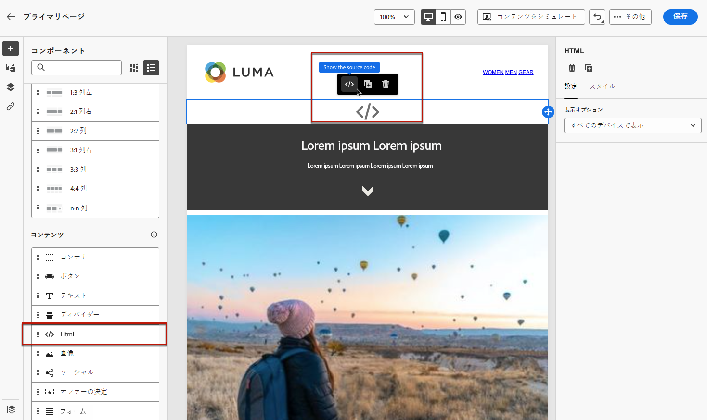

# ランディングページでのカスタム JavaScript の使用 {#lp-custom-js}

カスタム JavaScript を使用してランディングページのコンテンツを定義できます。例えば、高度なスタイル設定を実行する必要がある場合や、ランディングページにカスタム動作を追加する場合は、[!DNL Journey Optimizer] で独自のコントロールを作成し、実行することができます。

## ランディングページへの JavaScript コードの挿入

ランディングページコンテンツにカスタム JavaScript を挿入するには、次のいずれかを実行します。

* コンテンツの作成を開始する際に既存の HTML コンテンツを読み込み、カスタム JavaScript コードを含むファイルを選択します。コンテンツの読み込み方法については、[この節](../email/existing-content.md)を参照してください。

* ランディングページを最初から、または保存済みのテンプレートから設計します。**[!UICONTROL HTML]** コンテンツコンポーネントをキャンバスにドラッグ＆ドロップし、JavaSCript をコンポーネントに追加するためのソースコードを表示します。HTML コンポーネントの使用方法については、[この節](../email/content-components.md#HTML)を参照してください。<!--You can also simply switch the whole landing page content to code view and enter or paste your JavaScript code.-->

  

* JavaScript コードをコンテンツ designer に直接入力または貼り付けます。独自のコンテンツの作成方法については、[この節](../email/code-content.md)を参照してください。

>[!NOTE]
>
>現在、[ランディングページのプレビュー](create-lp.md#test-landing-page)時に実行中の JavaScript を表示することはできません。

ランディングページを正しく表示するには、以下の節で説明するように、次の構文を使用します。

## コードの初期化

JavaScript コードを初期化するには、`lpRuntimeReady` イベントを使用する必要があります。このイベントは、ライブラリの初期化が成功した後にトリガーされます。コールバックは、`lpRuntime` オブジェクトを使用して実行され、ライブラリのメソッドとフックを公開します。

`LpRuntime` は、「ランディングページランタイム」を意味します。このオブジェクトは、メインライブラリ識別子です。カスタム JavaScript で使用できるフック、フォーム送信メソッドおよびその他のユーティリティメソッドが公開されます。

**例：**

```
if(window.lpRuntime){
    init(window.lpRuntime);
}else{
    window.addEventListener('lpRuntimeReady',function(e){
        init(e.detail);
    });
}
 
function init(lpRuntime){
    // Enter custom JavaScript here using methods from lpRuntime.
}
```

## フック

フックを使用すると、フォーム送信のライフサイクル中にメソッドを添付できます。例えば、フックを使用して、フォームが実際に送信される前にフォームの検証を実行できます。

使用できるフックは次のとおりです。

| 名前 | 説明 |
|--- |--- |
| addBeforeSubmitHook | フォーム送信前に呼び出されるカスタムフック。送信を続行する場合は true を返し、送信をブロックする場合は false を返します。 |
| addOnFailureHook | 失敗したフォーム送信時に呼び出されるカスタムフック。 |
| addOnSuccessHook | フォーム送信が成功したときに呼び出されるカスタムフック。 |

**例：**

```
//LpRuntime hooks
lpRuntime.hooks.addBeforeSubmitHook(function(){
    // Add your validation logic here.
});
```

## カスタムフォームの送信

以下に示すメソッドは、カスタムフォーム送信の実行に使用されます。

>[!NOTE]
>
>フォームの送信はカスタム JavaScript で処理されるので、グローバル変数 `disableDefaultFormSubmission` を `true` に設定してデフォルトの送信を明示的に無効にする必要があります。

| 名前 | 説明 |
|--- |--- |
| submitForm | このメソッドは、フォームを送信し、送信後のフローを処理します。 |
| submitFormPartial | このメソッドもフォームを送信しますが、送信後のフローはスキップします。例えば、送信が成功した後に成功ページへのリダイレクトを設定した場合、部分的なフォーム送信の場合にはリダイレクトは発生しません。 |

**例：**

```
//LpRuntime methods
window.disableDefaultFormSubmission = true        // Flag to disable the default submission flow.
 
lpRuntime.submitForm(formSubmissionData);         // This will trigger the default form submission handling like redirecting to error or success page.
  
lpRuntime.submitFormPartial(formSubmissionData,{   // This will not trigger the default submission handling.
    beforeSubmit : callback,
    onFailure : failureCallback,                   // Custom onFailureCallback - will be used in partial submission of form.
    onSuccess : successCallback                    // Custom onSuccessCallback - will be used in partial submission of form.
})
```

## ユーティリティ関数

| 名前 | 説明 |
|--- |--- |
| getFormData | このメソッドを使用すると、`formData` を JSON オブジェクトの形式で取得できます。このオブジェクトはフォーム送信用に `submitForm` に渡すことができます。 |

**例：**

```
let formData = lpRuntime.getFormData();                           // Method to generate formdata
 
lpRuntime.submitForm(formData);
```

## ユースケース

### ユースケース 1：フォーム送信前の検証の追加

```
<html>
<body>
// Enter HTML body here.
  
<script>
        if(window.lpRuntime){
          console.log('got runtime',lpRuntime);
          init(window.lpRuntime);
        }else{
          window.addEventListener('lpRuntimeReady',function(e){
            init(window.lpRuntime);
          });
        }
        
  
      // Here validate the function is checking if the checkbox is selected. This method should return true if you want form submission.
      function validateForm(){
        return document.querySelector('.spectrum-Checkbox-input').checked;
      }    
  
      function init(lpRuntime){
          lpRuntime.hooks.addBeforeSubmitHook(function(){
              return validateForm(); // This method should return true if you want to proceed with submission.
          })
      }
  
</script>  
  
</body>
</html>
```

### ユースケース 2：部分的なフォーム送信

例えば、ページ上に複数のチェックボックスを備えたフォームがあるとします。任意のチェックボックスをオンにすると、ユーザーが送信ボタンをクリックするのを待たずに、このデータをバックエンドに保存する必要があります。

```
<html>
<body>
    <form>
        <input type='checkbox' value="1" name="name1"/>
        <input type='checkbox' value="2" name="name2"/>
        <input type='checkbox' value="3" name="name3"/>
        <input type='checkbox' value="4" name="name4"/>
    </form>
  
<script>
      window.disableDefaultFormSubmission=true;
 
      window.addEventListener('lpRuntimeReady',function(e){        
        init(e.detail)
      }
 
     function init(lpRuntime){
        window.getElementByTagName('input').addEventListener('change',function(e){
            let formData = lpRuntime.getFormData();
            lpRuntime.submitFormPartial(formData);
        })
      }
    </script>
  
</body>
</html>
```

### ユースケース 3：カスタム分析タグ

JavaScript を使用して、入力フィールドのリスナーを追加し、カスタム分析呼び出しトリガーを追加できます。

```
<html>
<body>
    <form>
        <input type='checkbox' value="1" name="name1"/>
        <input type='checkbox' value="2" name="name2"/>
        <input type='checkbox' value="3" name="name3"/>
        <input type='checkbox' value="4" name="name4"/>
    </form>
  
<script>
      window.disableDefaultFormSubmission=false;  
 
      window.addEventListener('lpRuntimeReady',function(e){        
        init(e.detail)
      }
 
     function init(lpRuntime){
         window.getElementByTagName('input').addEventListener('change',function(e){
            //trigger analytics events
        })
      }
        
    </script>
  
</body>
</html>
```

### ユースケース 4：ダイナミックフォーム

```
<html>
<body>
    <form>
        <input type='checkbox' value="1" name="name1"/>
        <div class="hiddenInput hidden">
            <input type='text' name="name2"/>
        </div>
    </form>
  
<script>
      window.disableDefaultFormSubmission=false;     
 
      window.addEventListener('lpRuntimeReady',function(e){        
        init(e.detail)
      }
 
      function init(lpRuntime){
        window.getElementByTagName('input').addEventListener('change',function(e){
            document.querySelector('.hiddenInput').toggleClass('hidden');
        })
      }
        
    </script>
  
</body>
</html>
```
