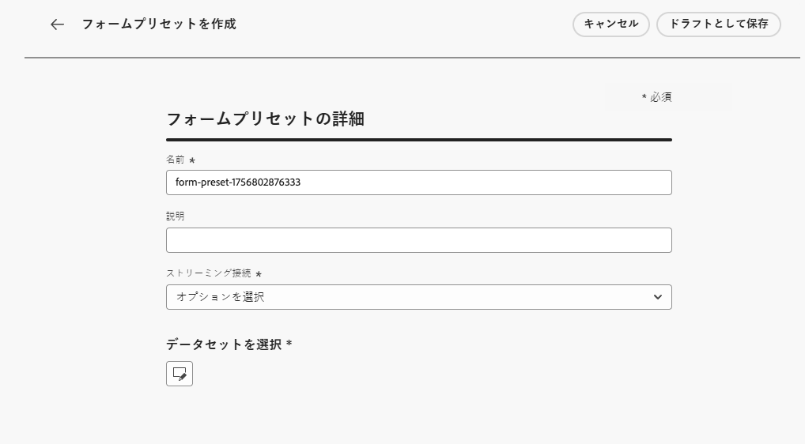
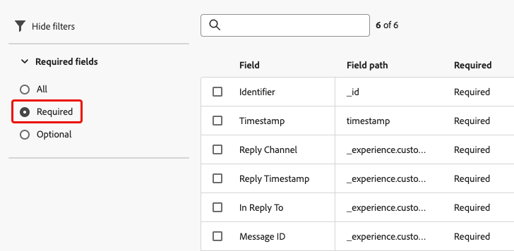
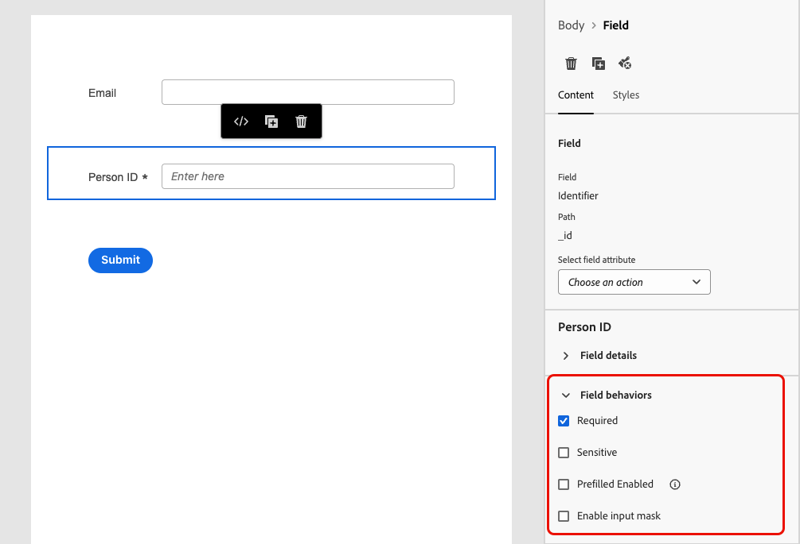
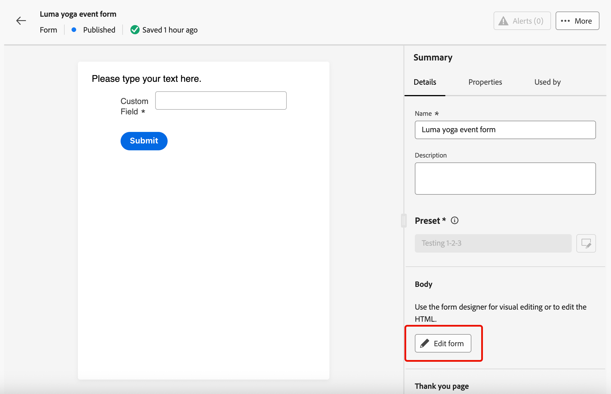
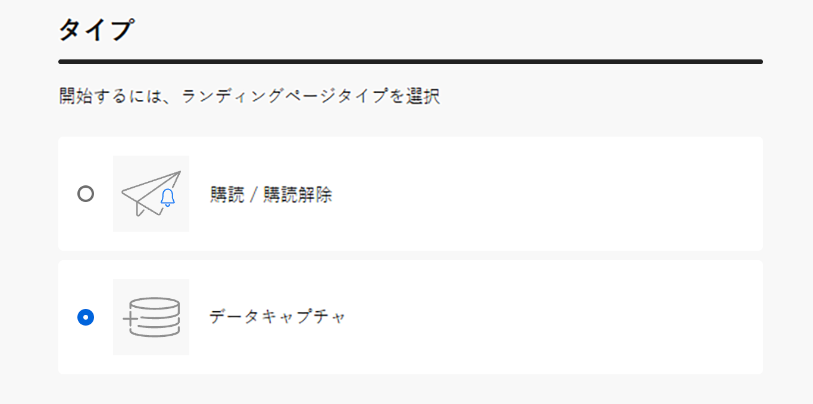

# ランディングページでのフォームの使用 {#lp-forms}

>[!AVAILABILITY]
>
>この機能は、現在、米国およびオーストラリアのお客様向けに限定提供されています。 アクセス権を取得するには、アドビ担当者にお問い合わせください。

[!DNL Journey Optimizer] ランディングページでプロファイルデータを取得し、[!DNL Experience Platform] データセットを強化するには、ランディングページでフォームを活用できます。

## フォームプリセットの作成 {#create-form-preset}

>[!CONTEXTUALHELP]
>id="ajo_lp_form_connection"
>title="使用するエンドポイントを選択します"
>abstract="フォームの送信時にデータが送信されるストリーミングエンドポイントを定義します。"
>additional-url="https://experienceleague.adobe.com/ja/docs/experience-platform/sources/ui-tutorials/create/streaming/http" text="HTTP API ストリーミング接続を作成します"

>[!CONTEXTUALHELP]
>id="ajo_lp_form_dataset"
>title="データセットの選択"
>abstract="フォームの応答が保存および反映されるデータセットを定義します。特定のデータセットを検索するには、入力するか、リストから選択できます。"

フォームを作成する前に、フォーム送信データが送信される接続エンドポイントと、フォームを通じて取得したデータが保存されるデータセットを選択する専用のプリセットを作成する必要があります。

ストリーミングエンドポイントにデータが到着すると、データセット情報とリンクされます。 生成されたソース／ターゲット接続とソースフローを使用すると、データがデータセットにプッシュされます。

プリセットの作成時：

* データセットとストリーミング接続の異なる組み合わせを使用して、複数のプリセットを設定できます。
* 同じデータセットまたはストリーミング接続を複数のプリセットで再利用できます。
* 各ストリーミング接続では、次のようなリソースを自動的に生成します。
   * **ソース接続** - データの発生元。
   * **ターゲット接続** - データが保存または使用される場所。
   * **ソースフロー** - ソース接続から [!DNL Experience Platform] にデータを移動し、マッピング、変換、検証を処理するパイプライン。

<!--
>[!NOTE]
>
> To access and edit form presets, you must have the **[!UICONTROL Manage form presets]** permission on the production sandbox. Learn more about permissions in [this section](../administration/high-low-permissions.md#administration-permissions).TBC
-->

フォームプリセットを作成するには、次の手順に従います。

1. **[!UICONTROL フォームプリセット]**&#x200B;インベントリにアクセスするには、左側のメニューから&#x200B;**[!UICONTROL 管理]**／**[!UICONTROL チャネル]**／**[!UICONTROL フォーム設定]**&#x200B;を選択します。

1. 「**[!UICONTROL フォームプリセットを作成]**」をクリックします。

1. 名前を更新して取得しやすくし、必要に応じて説明を追加します。

   {width=80%}

1. そのフォームに使用する&#x200B;**[!UICONTROL ストリーミング接続]**&#x200B;を選択します。これは、フォームの送信時にデータが送信されるストリーミングエンドポイントです。

   >[!NOTE]
   >
   >ストリーミングソース接続の作成について詳しくは、[Experience Platform ドキュメント](https://experienceleague.adobe.com/ja/docs/experience-platform/sources/ui-tutorials/create/streaming/http){target="_blank"}を参照してください。

1. フォームにリンクする&#x200B;**[!UICONTROL データセット]**&#x200B;を選択します。ここにフォームの応答が保存および反映されます。 特定のデータセットを検索するには、入力するか、リストから選択できます。

   >[!NOTE]
   >
   >現在、選択できるのは [!DNL Adobe Experience Platform] データセットのみです。一度に 1 つのデータセットを選択できます。 [データセットの詳細](../../data/get-started-datasets.md)

1. 「**[!UICONTROL 公開]**」をクリックします。これで、プリセットをフォームで使用する準備が整いました。

## フォームへのアクセスと管理 {#access-forms}

フォームリストにアクセスするには、左側のメニューから&#x200B;**[!UICONTROL コンテンツ管理]**／**[!UICONTROL フォーム]**&#x200B;を選択します。

既存のフォームがすべて表示されます。フォームは、ステータス、作成日または変更日に基づいてフィルタリングできます。

## フォームの作成とデザイン {#create-form}

>[!CONTEXTUALHELP]
>id="ajo_lp_form_preset"
>title="プリセットを選択します"
>abstract="使用する接続とフォームの事前定義済みデータセットを含む事前定義済みプリセットを選択します。"
>additional-url="https://experienceleague.adobe.com/ja/docs/journey-optimizer/using/content-management/landing-pages/lp-forms#create-form-preset" text="フォームプリセットの作成"

フォームを作成するには、次の手順に従います。

1. **[!UICONTROL フォーム]**&#x200B;リストから、「**[!UICONTROL フォームを作成]**」をクリックします。

1. 名前を追加します。必要に応じて、説明を追加できます。

   

1. 使用する接続とフォームの事前定義済みデータセットを含む&#x200B;**[!UICONTROL プリセット]**&#x200B;を選択します。[フォームプリセットの作成方法の詳細情報](#create-form-preset)

1. 「**[!UICONTROL 作成]**」をクリックします。フォームデザイナーが開きます。これにより、構造とコンテンツ[コンポーネント](../email/content-components.md#add-content-components)を追加して、コンテンツを作成できます。[テキスト](../email/content-components.md#text)コンポーネントと&#x200B;**[!UICONTROL フィールド]**&#x200B;コンポーネントを使用できます。

1. プロファイルデータと属性を取得するには、フォームに特定のフィールドを追加します。[詳細情報](#define-fields)

1. これらのフィールドを設定およびデザインします。[詳細情報](#configure-fields)

1. **[!UICONTROL スタイル]**&#x200B;パネルを使用して、必要に応じてフォームのレイアウト、スタイル、ディメンションを調整できます。[スタイルの詳細情報](../email/get-started-email-style.md)

1. すべてのフィールドを設定したら、「**[!UICONTROL 保存して閉じる]**」をクリックします。

1. 「ありがとうございました」ページを設定します。[詳細情報](#thank-you-page)

1. フォームを&#x200B;**[!UICONTROL 公開]**&#x200B;して、ランディングページで選択できるようにします。

### 特定のフィールドの定義 {#define-fields}

フォームに特定のフィールドを追加するには、構造をキャンバスにドラッグ＆ドロップして、内部に&#x200B;**[!UICONTROL フィールド]**&#x200B;コンポーネントをドラッグします。<!--**[!UICONTROL Select field attribute]** or **[!UICONTROL Add custom field]**.-->

次のいずれかのオプションを選択します。

>[!BEGINTABS]

>[!TAB フィールド属性を選択]

このオプションを使用して、フォームにリンクされたデータセットのスキーマに基づいて属性を選択します。

>[!NOTE]
>
>データセットは、フォーム用に選択したプリセットで定義されます。[詳細情報](#create-form-preset)

{width=100%}

例えば、メールとユーザー ID を設定できます。ユーザーがこれらのフィールドに入力すると、入力した情報は選択したデータセットに保存されます。

{width=55%}

収集したデータをプロファイルにマッピングするには、プロファイル ID フィールドを選択します。ID フィールドは、属性リストで&#x200B;**[!UICONTROL 必須]**&#x200B;としてマークされます。これにより、フィルタリングできます。

{width=65%}

>[!TAB カスタムフィールドを追加]

このオプションを使用すると、リンクされたデータセット内のフィールドにマッピングせずに、自由形式のフィールドを定義できます。

{width=85%}

>[!ENDTABS]

### フィールドの設定とデザイン {#configure-fields}

フィールド属性を選択するか、カスタムフィールドを追加したら、その詳細やフォームの送信時の動作をさらに調整できます。

1. 右側の「**[!UICONTROL コンテンツ]**」タブの「**[!UICONTROL フィールドの詳細]**」セクションで、必要に応じて次の要素を指定できます。

   * フォームの受信者に対してわかりやすいように&#x200B;**[!UICONTROL ラベル]**&#x200B;を調整します。
   * 必要に応じて、**[!UICONTROL フィールドタイプ]**&#x200B;を変更します。チェックボックス、通貨、日付、スライダー、URL などを指定できます。

     >[!NOTE]
     >
     >その他のフィールドの詳細は、選択したフィールドタイプによって異なる場合があります。

   * **[!UICONTROL プレースホルダー]**&#x200B;を追加します。<!--To explain-->
   * **[!UICONTROL 命令]**&#x200B;を指定します。<!--How will they be displayed in the form? To explain-->
   * フォームのユーザーがフィールドに入力する前に表示される&#x200B;**[!UICONTROL デフォルト値]**&#x200B;を入力します。
   * カスタム&#x200B;**[!UICONTROL 検証メッセージ]**&#x200B;を定義できます。
   * **[!UICONTROL 最大長]**&#x200B;を設定します。フィールドへの入力時にフォームの受信者が制限を超えると、エラーメッセージが表示されます。

   {width=85%}

1. 「**[!UICONTROL フィールドの動作]**」セクションでは、次を定義できます。

   * 「**[!UICONTROL 必須]**」を選択すると、このフィールドへの入力が必須になります。ユーザーがフィールドに入力しないと、フォームを送信できません。
   * 「**[!UICONTROL 区別]**」を選択すると、フィールドの大文字と小文字が区別されます。<!--To confirm - do you mean retain capitalization when added to the dataset?-->
   * 「**[!UICONTROL 事前入力を有効にする]**」を選択すると、プロファイル情報がある場合は、その情報からフィールドに入力されます。<!--Even for a custom field, or a field not mapped to a profile? What happens if no data is available?-->
   * 「**[!UICONTROL 入力マスクを有効にする]**」を選択すると、ユーザーの入力が汎用文字に置き換えられます。*9* は任意の数字、*a* は任意の文字、* は任意の数字または文字を表すことができます。<!--Not sure how you define that in the form-->

   {width=75%}

### お礼のページの設定 {#thank-you-page}

>[!CONTEXTUALHELP]
>id="ajo_lp_forms_thankyou_page"
>title="「ありがとうございました」ページ"
>abstract="ユーザーがフォームに入力または転送した際の動作を設定します。"

フォームの詳細に戻り、「ありがとうページ **[!UICONTROL セクションで、ユーザーがフォームに入力した場合の動作を設定します。]**

{width=70%}

次のいずれかのアクションを設定します。

* **[!UICONTROL ページを維持]** - このオプションを選択すると、フォームの送信時に訪問者が同じページに留まります。
* **[!UICONTROL ランディングページ]** - フォームの送信後にユーザーがリダイレクトされる、公開済みの[ランディングページ](create-lp.md)を選択します。
* **[!UICONTROL 外部 URL]** - フォローアップページとして使用する完全な URL を入力します。ユーザーがフォームを送信すると、指定した URL に移動されます。
* **[!UICONTROL 条件付きリダイレクト]** - フォームの応答に基づいて、異なるフォローアップアクションを動的に表示するルールを設定します。

  特定のオーディエンスごとにルールを定義できます。例えば、米国居住者向けに特定のランディングページを表示したり、カナダ居住者向けに別のページを表示したりできます。最後に、定義したルールに該当しないユーザーに対して、デフォルトのアクションを設定します。

  >[!NOTE]
  >
  >ルールに定義した条件は順番に読み取られます。

  {width=40%}

## 公開済みフォームの編集 {#edit-form}

フォームは公開した後でも編集できます。次の手順に従います。

1. [ フォームリスト ](#access-forms) にアクセスし、公開済みフォームを選択します。

1. 「**[!UICONTROL フォームを編集]**」ボタンをクリックします。

   {width=90%}

1. フォームの新しいバージョンがドラフトステータスで作成されます。「**[!UICONTROL ドラフトバージョンを作成]**」をクリックします。

1. 必要に応じてフォームを更新し、「**[!UICONTROL 保存]**」をクリックします。これで、フォームのステータスが&#x200B;**[!UICONTROL 公開済み（ドラフト）]**&#x200B;になります。

   * 更新されたバージョンを公開するまで、現在のバージョンのステータスは引き続き&#x200B;**[!UICONTROL 公開済み]**&#x200B;になります。

   * 更新されたバージョンのステータスは&#x200B;**[!UICONTROL ドラフト]**&#x200B;です。

1. フォームの概要に戻ると、フォームの 2 つのバージョン間を移動できます。

   {width=70%}

1. 「**[!UICONTROL ドラフト]**」セクションでは、ドラフトを公開または破棄したり、フォームの詳細やコンテンツを編集したりできます。

   {width=75%}

## ランディングページでのフォームの活用 {#leverage-form-in-lp}

これで、このフォームをランディングページに埋め込み、フォームで定義した属性に対応するデータを取得し、選択したデータセットに保存できるようになりました。 次の手順に従います。

1. ランディングページを作成します。[詳細情報](create-lp.md#create-landing-page)

1. ランディングページのタイプとして「**[!UICONTROL データキャプチャ]**」を選択し、「**[!UICONTROL 作成]**」をクリックします。

   {width=65%}

1. プライマリページを設定します。[詳細情報](create-lp.md#configure-primary-page)

1. [ランディングページデザイナー](design-lp.md)を開きます。

1. **[!UICONTROL 構造コンポーネント]**&#x200B;をコンテンツにドラッグ＆ドロップします。**[!UICONTROL フォーム]**&#x200B;コンポーネントをその構造にドラッグ＆ドロップします。

   >[!NOTE]
   >
   >ランディングページでは、公開済みのフォームのみ選択できます。

1. 「**[!UICONTROL 埋め込みフォーム]**」セクションで、作成したフォームを選択します。

   

   >[!NOTE]
   >
   >「**[!UICONTROL フォームを編集]**」ボタンを使用して、選択したフォームを更新できます。フォームが新しいタブで開きます。フォームコンテンツの編集手順については、[ この節 ](#create-form) を参照してください。

1. 「**[!UICONTROL フォローアップタイプ]**」セクションで、ユーザーがフォームに入力した際の動作を設定します。

   * 「**[!UICONTROL フォームの定義]**」を選択して、埋め込みフォームで定義されたアクションを選択します。[詳細情報](#thank-you-page)

   * また、フォーム送信後にユーザーがリダイレクトされる公開済みの[ランディングページ](create-lp.md)を選択することもできます。

   * または、ユーザーがフォームを送信した際に移動されるフォローアップページとして、**[!UICONTROL 外部 URL]** を定義します。

1. ランディングページを保存してテストします。[詳細情報](create-lp.md#test-landing-page)

ランディングページが[公開](create-lp.md#publish-landing-page)され、ジャーニーで使用されると、ユーザーがフォームに入力した際、入力した情報が選択したデータセットに取り込まれます。

>[!NOTE]
>
>ランディングページで使用されているフォームを非公開にし、このフォームを編集して再度公開すると、ランディングページでは、常にフォームの最新の公開済みバージョンが使用されます。
