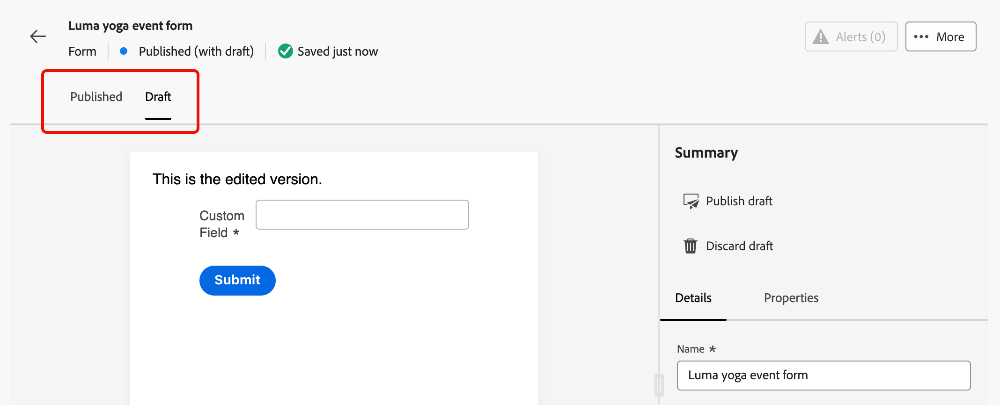

# ランディングページでのフォームの使用 {#lp-forms}

>[!AVAILABILITY]
>
>この機能は、限定提供です。アクセス権を取得するには、アドビ担当者にお問い合わせください。

[!DNL Journey Optimizer] ランディングページでプロファイルデータを取得し、[!DNL Experience Platform] データセットを強化するには、ランディングページでフォームを活用します。

## フォームプリセットの作成 {#create-form-preset}

>[!CONTEXTUALHELP]
>id="ajo_lp_form_connection"
>title="使用するエンドポイントを選択"
>abstract="フォーム送信時にデータが送信されるストリーミングエンドポイントを定義する。"
>additional-url="https://experienceleague.adobe.com/ja/docs/experience-platform/sources/ui-tutorials/create/streaming/http" text="HTTP API ストリーミング接続の作成"

>[!CONTEXTUALHELP]
>id="ajo_lp_form_dataset"
>title="データセットの選択"
>abstract="フォームの応答を保存および反映するデータセットを定義します。 入力して特定のデータセットを検索するか、リストから選択できます。"

フォームを作成する前に、フォーム送信データを送信する接続エンドポイントと、フォームを通じて取り込まれたデータを保存するデータセットを選択する専用のプリセットを作成する必要があります。

ストリーミングエンドポイントにデータが到着すると、データセット情報とリンクされます。 生成されたソース/ターゲット接続とソースフローを使用して、データがデータセットにプッシュされます。

プリセットの作成時：

* データセットとストリーミング接続の異なる組み合わせを使用して、複数のプリセットを設定できます。
* 同じデータセットまたはストリーミング接続は、複数のプリセットで再利用できます。
* 各ストリーミング接続は、次のようなリソースを自動的に生成します。
   * **Source接続** - データの発信元。
   * **ターゲット接続** - データが格納または使用される場所です。
   * **Source フロー** - ソース接続から [!DNL Experience Platform] にデータを移動し、マッピング、変換および検証を処理するパイプラインです。

>[!NOTE]
>
> フォームプリセットにアクセスして編集するには、実稼動サンドボックスにおける **[!UICONTROL フォームプリセットの管理]** 権限が必要です。 権限について詳しくは、[ この節 ](../administration/high-low-permissions.md#administration-permissions).<!--TBC--> を参照してください

1. **[!UICONTROL フォームプリセット]** インベントリにアクセスするには、左のメニューから **[!UICONTROL 管理]**/**[!UICONTROL チャネル]**/**[!UICONTROL フォーム設定]** を選択します。

1. **[!UICONTROL フォームプリセットを作成]** をクリックします。

1. 名前を更新して取得しやすくし、必要に応じて説明を追加します。

   {width=80%}

1. そのフォームに使用する **[!UICONTROL ストリーミング接続]** を選択します。 これは、フォームの送信時にデータが送信されるストリーミングエンドポイントです。

   >[!NOTE]
   >
   >ストリーミングソース接続の作成について詳しくは、[Experience Platform ドキュメント ](https://experienceleague.adobe.com/ja/docs/experience-platform/sources/ui-tutorials/create/streaming/http){target="_blank"} を参照してください。

1. フォームにリンクする **[!UICONTROL データセット]** を選択します。 ここで、フォームの応答が保存され、反映されます。 入力して特定のデータセットを検索するか、リストから選択できます。

   >[!NOTE]
   >
   >現在、[!DNL Adobe Experience Platform] 個のデータセットのみを選択できます。 一度に 1 つのデータセットのみを選択できます。

1. 「**[!UICONTROL 公開]**」をクリックします。これで、プリセットをフォームで使用できるようになります。

## フォームへのアクセスと管理 {#access-forms}

フォームリストにアクセスするには、左のメニューで **[!UICONTROL コンテンツ管理]**/**[!UICONTROL Forms]** を選択します。

既存のフォームがすべて表示されます。 ステータス、作成日、変更日に基づいてフォームをフィルタリングできます。

## フォームの作成とデザイン {#create-form}

>[!CONTEXTUALHELP]
>id="ajo_lp_form_preset"
>title="プリセットを選択"
>abstract="使用する接続を含む事前定義済みプリセットと、フォームの事前定義済みデータセットを選択します。"
>additional-url="https://experienceleague.adobe.com/ja/docs/journey-optimizer/using/content-management/landing-pages/lp-forms#create-form-preset" text="フォームプリセットの作成"

フォームを作成するには、次の手順に従います。

1. **[!UICONTROL Forms]** リストで、「**[!UICONTROL フォームを作成]**」をクリックします。

1. 名前を追加します。 必要に応じて、説明を追加できます。

   

1. 使用する接続と、フォーム用に事前定義されたデータセットを含む **[!UICONTROL プリセット]** を選択します。 [ フォームプリセットの作成方法を学ぶ ](#create-form-preset)

1. 「**[!UICONTROL 作成]**」をクリックします。フォームデザイナーが開き、構造とコンテンツ [ コンポーネント ](../email/content-components.md#add-content-components) を追加してコンテンツを作成できます。 [ テキスト ](../email/content-components.md#text) コンポーネントと **[!UICONTROL フィールド]** コンポーネントを使用できます。

1. フォームに特定のフィールドを追加するには、構造をキャンバスにドラッグ&amp;ドロップし、**[!UICONTROL フィールド]** コンポーネントを内部にドラッグします。<!--**[!UICONTROL Select field attribute]** or **[!UICONTROL Add custom field]**.-->

   

   次に、次のいずれかのオプションを選択します。

   >[!BEGINTABS]

   >[!TAB  フィールド属性を選択 ]

   このオプションを使用して、フォームにリンクされたデータセットスキーマに基づいて属性を選択します。

   >[!NOTE]
   >
   >データセットは、フォーム用に選択したプリセットで定義されます。 [詳細情報](#create-form-preset)

   {width=100%}

   例えば、メールとユーザー ID を設定できます。 ユーザーがこれらのフィールドに入力すると、入力した情報は選択したデータセットに保存されます。

   {width=55%}

   収集したデータをプロファイルにマッピングするには、プロファイル ID フィールドを選択します。 ID フィールドは、属性リストで **[!UICONTROL 必須]** とマークされます。これにより、フィルターを適用できます。

   {width=65%}

   >[!TAB  カスタムフィールドを追加 ]

   このオプションを使用すると、リンクされたデータセット内のフィールドにマッピングすることなく、フリーフィールドを定義するだけです。

   {width=85%}

   >[!ENDTABS]

1. 右側の **[!UICONTROL コンテンツ]** タブの **[!UICONTROL フィールドの詳細]** セクションでは、必要に応じて次の要素を指定できます。

   * **[!UICONTROL ラベル]** を調整して、フォームの受信者に明確にします。
   * 必要に応じて **[!UICONTROL フィールドタイプ]** を変更します。 チェックボックス、通貨、日付、スライダー、URL などを指定できます。

     >[!NOTE]
     >
     >その他のフィールドの詳細は、選択したフィールドタイプによって異なる場合があります。

   * **[!UICONTROL プレースホルダー]**.<!--To explain--> を追加
   * 指定 **[!UICONTROL 手順]**.<!--How will they be displayed in the form? To explain-->
   * フォームのユーザーがフィールドに入力する前に表示される **[!UICONTROL デフォルト値]** を入力します。
   * カスタムの **[!UICONTROL 検証メッセージ]** を定義できます。
   * **[!UICONTROL 最大長]** を設定します。 フォームの受信者がフィールドへの入力時に制限を超えると、エラーメッセージが表示されます。

   {width=85%}

1. **[!UICONTROL フィールドの動作]** セクションでは、次の項目を定義できます。

   * このフィールドを必須にするには、「**[!UICONTROL 必須]**」を選択します。 ユーザーがフィールドに入力しない場合、フォームを送信できません。
   * フィールドで大文字と小文字を区別する場合は、「**[!UICONTROL 大文字と小文字を区別]**」を選択します。<!--To confirm - do you mean retain capitalization when added to the dataset?-->
   * **[!UICONTROL 事前入力有効]** を選択して、プロファイル情報のフィールドに値を入力します（使用可能な場合） <!--Even for a custom field, or a field not mapped to a profile? What happens if no data is available?-->。
   * 「**[!UICONTROL 定型入力を有効にする]**」を選択すると、ユーザーの入力を汎用文字に置き換えることができます。 *9* は任意の数字を意味し、*a* は任意の文字を意味し、*は任意の数字または文字を意味します。<!--Not sure how you define that in the form-->

   {width=75%}

1. **[!UICONTROL スタイル]** パネルを使用して、必要に応じてフォームのレイアウト、スタイル設定および寸法を調整できます。 [ 詳しくは、スタイル設定を参照してください ](../email/get-started-email-style.md)

1. すべてのフィールドを設定したら、「保存して閉じる **[!UICONTROL をクリックし]** す。

1. 「ありがとうございます」ページを設定します。 [詳細情報](#thank-you-page)

1. **[!UICONTROL 公開]** ランディングページで選択できるフォームです。

### 「ありがとうございます」ページの設定 {#thank-you-page}

>[!CONTEXTUALHELP]
>id="ajo_lp_forms_thankyou_page"
>title="「ありがとうございました」ページ"
>abstract="ユーザーがフォームに入力または転送したときの動作を設定します。"

「**[!UICONTROL ありがとうページ]**」セクションでは、ユーザーがフォームに入力したときの動作を設定します。

{width=70%}

次のいずれかのアクションを設定します。

* **[!UICONTROL ページを維持]** – このオプションを選択すると、フォームの送信時に訪問者が同じページに留まります。
* **[!UICONTROL ランディングページ]** - フォームの送信後にユーザーがリダイレクトされる公開済みの [ ランディングページ ](create-lp.md) を選択します。
* **[!UICONTROL 外部 URL]** - フォローアップページとして使用する完全な URL を入力します。 ユーザーがフォームを送信すると、指定した URL に移動します。
* **[!UICONTROL 条件付きリダイレクト]** - フォームの応答に基づいて異なるフォローアップアクションを動的に表示するルールを設定します。

  特定のオーディエンスごとにルールを定義できます。 例えば、米国居住者向けの特定のランディングページや、カナダ居住者向けの別のページなどを表示できます。 最後に、定義したルールに該当しないユーザーに対してデフォルトのアクションを設定します。

  >[!NOTE]
  >
  >ルール内で定義された条件が順番に読み取られます。

  {width=40%}

## 公開済みフォームを編集する {#edit-form}

フォームが公開された後も、編集は可能です。 次の手順に従います。

1. [ フォームリスト ](#access-forms) にアクセスし、公開されたフォームを選択します。

1. 「**[!UICONTROL フォームを編集]**」ボタンをクリックします。

   {width=90%}

1. ドラフト ステータスで、新しいバージョンのフォームが作成されます。 **[!UICONTROL ドラフトバージョンを作成]** をクリックします。

1. 必要に応じてフォームを更新し、「**[!UICONTROL 保存]** をクリックします。 フォームのステータスが **[!UICONTROL 公開済み（ドラフト）]** になります。

   * 更新されたバージョンを公開するまで、現在のバージョンのステータスは引き続き **[!UICONTROL 公開済み]** になります。

   * 更新されたバージョンのステータスが **[!UICONTROL ドラフト]** になります。

1. フォームの概要に戻ると、フォームの 2 つのバージョン間を移動できます。

   {width=70%}

1. 「**[!UICONTROL ドラフト]**」セクションでは、ドラフトを公開または破棄すると共に、フォームの詳細またはコンテンツを編集できます。

   {width=75%}

## ランディングページでのフォームの活用 {#leverage-form-in-lp}

これで、このフォームをランディングページに埋め込み、フォームで定義した属性に対応するデータを取得し、選択したデータセットに保存できるようになりました。 次の手順に従います。

1. ランディングページを作成します。 [詳細情報](create-lp.md#create-landing-page)

1. ランディングページのタイプとして **[!UICONTROL データキャプチャ]** を選択し、**[!UICONTROL 作成]** をクリックします。

   {width=65%}

1. プライマリページを設定します。 [詳細情報](create-lp.md#configure-primary-page)

1. [ ランディングページデザイナー ](design-lp.md) を開きます。

1. **[!UICONTROL 構造コンポーネント]** をコンテンツにドラッグ&amp;ドロップします。 **[!UICONTROL フォーム]** コンポーネントをその構造にドラッグ&amp;ドロップします。

   >[!NOTE]
   >
   >ランディングページでは、公開済みのフォームのみを選択できます。

1. 「**[!UICONTROL 埋め込みフォーム]**」セクションで、作成したフォームを選択します。

   

   >[!NOTE]
   >
   >「**[!UICONTROL フォームを編集]** ボタンを使用して、選択したフォームを更新できます。 フォームが新しいタブで開きます。 フォームコンテンツの編集手順は、[ この節 ](#create-form) で説明する手順と同じです。

1. 「**[!UICONTROL フォローアップタイプ]**」セクションでは、ユーザーがフォームに入力したときの動作を設定します。

   * 「**[!UICONTROL フォーム定義]**」を選択して、埋め込みフォームで定義されたアクションを選択します。 [詳細情報](#thank-you-page)

   * フォームの送信後にユーザーがリダイレクトされる公開済みの [ ランディングページ ](create-lp.md) を選択することもできます。

   * または、ユーザーがフォームを送信したときに表示されるフォローアップページとして **[!UICONTROL 外部 URL]** を定義します。

1. ランディングページを保存してテストします。 [詳細情報](create-lp.md#test-landing-page)

ランディングページが [ 公開 ](create-lp.md#publish-landing-page) され、ジャーニーで使用されると、ユーザーがフォームに入力したときに、入力された情報は選択したデータセットに取り込まれます。

>[!NOTE]
>
>ランディングページで使用されているフォームを非公開にし、このフォームを編集して再度公開した場合、ランディングページでは常に、最新の公開済みバージョンのフォームが使用されます。
