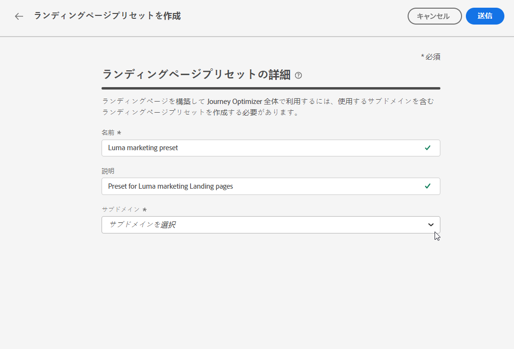

# ランディングページプリセットの定義 {#lp-presets}

>[!CONTEXTUALHELP]
>id="ajo_admin_config_lp_subdomain_header"
>title="ランディングページプリセットの作成"
>abstract="ランディングページを構築して Journey Optimizer 全体で利用するには、使用するサブドメインを含むランディングページプリセットを作成する必要があります。"

## ランディングページプリセットの基本を学ぶ {#gs-lp-presets}

[ランディングページの作成](../landing-pages/create-lp.md#create-a-lp)を行う場合は、ランディングページを作成し、**[!DNL Journey Optimizer]** を介して活用できるように、ランディングページプリセットを選択する必要があります。プリセットには、このプリセットに基づいてランディングページに使用するサブドメインが含まれています。

プリセットを作成する前に、1 つ以上のランディングページサブドメインが設定済みであることを確認します。[ランディングページサブドメインの作成方法の詳細情報](lp-subdomains.md)

## ランディングページプリセットへのアクセス {#access-lp-presets}

ランディングページプリセットにアクセスするには、次の手順に従います。

1. **[!UICONTROL 管理]**／**[!UICONTROL チャネル]**&#x200B;メニューにアクセスします。

1. **[!UICONTROL ランディングページ設定]**／**[!UICONTROL ランディングページプリセット]**&#x200B;を選択します。

   

1. 任意のプリセットラベルをクリックして、ランディングページプリセットの詳細にアクセスします。

   

## ランディングページプリセットの作成 {#lp-create-preset}

ランディングページプリセットを作成するには、次の手順に従います。

1. **[!UICONTROL 管理]**／**[!UICONTROL チャネル]**&#x200B;メニューを参照し、**[!UICONTROL ランディングページ設定]**／**[!UICONTROL ランディングページプリセット]**&#x200B;を選択します。

1. 「**[!UICONTROL ランディングページプリセットを作成]**」を選択します。

   

1. プリセットの名前と説明を入力します。

   名前は文字（A～Z）で始め、英数字、アンダースコア `_`、ドット `.`、ハイフン `-` しか使用できません。

1. ドロップダウンリストからランディングページのサブドメインを選択します。

   

   >[!NOTE]
   >
   >サブドメインを選択できるようにするには、1 つ以上のランディングページサブドメインが設定済みであることを確認します。[方法](lp-subdomains.md)

   選択したサブドメインに対応する設定が表示されます。

1. **[!UICONTROL トラッキング URL]** のランディングページサブドメインを選択するには、「**[!UICONTROL ランディングページサブドメインと同じ]**」オプションをオンにします。 [詳しくは、トラッキングを参照してください](../email/message-tracking.md)

   

   例えば、ランディングページの URL が「pages.mail.luma.com」で、トラッキング URL が「data.mail.luma.com」の場合、トラッキングサブドメインとして「pages.mail.luma.com」を使用するように選択できます。

   >[!CAUTION]
   >
   >選択したランディングページのサブドメインは、**[!UICONTROL トラッキング URL]** を指定するために使用されます <!--and **[!UICONTROL Image Delivery URL]** --> そのサブドメインが [ 既存のサブドメインを使用して作成された場合 ](lp-subdomains.md#lp-use-existing-subdomain)。
   >
   >「[ 独自のドメインを追加 ](lp-subdomains.md#lp-configure-new-subdomain)」オプションを使用してサブドメインが作成された場合、代わりにプライマリサブドメイン（最初にデリゲートされたサブドメイン）が使用されます。

1. 「**[!UICONTROL 送信]**」をクリックして、ランディングページプリセットの作成を確定します。<!--You can also save the preset as draft and resume its configuration later on.-->

   <!---->

1. ランディングページプリセットが作成されると、リストに「**[!UICONTROL アクティブ]**」のステータスで表示されます。これで、ランディングページで使用する準備が整いました。

これで、[!DNL Journey Optimizer] で[ランディングページの作成](../landing-pages/create-lp.md)を行う準備が整いました。
<!--
>[!NOTE]
>
>Learn how to create channel configurations for push notifications and emails in [this section](channel-surfaces.md).-->

**関連トピック**:

* [ランディングページの基本を学ぶ](../landing-pages/get-started-lp.md)
* [ランディングページの作成](../landing-pages/create-lp.md#create-a-lp)
