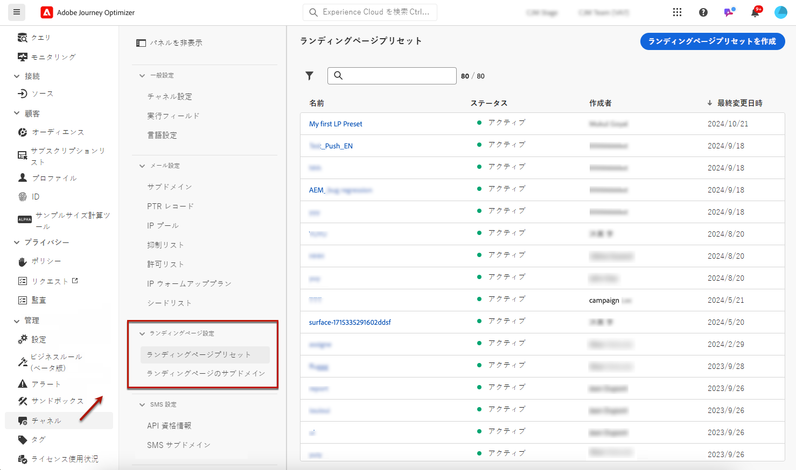

# ランディングページのプリセットの定義 {#lp-presets}

>[!CONTEXTUALHELP]
>id="ajo_admin_config_lp_subdomain_header"
>title="ランディングページのプリセットの作成"
>abstract="このような場合は、旅のオプティマイザーを通じてランディングページを作成して利用するには、使用するサブドメインを含むランディングページプリセットを作成する必要があります。"

ランディングページを作成 ](../landing-pages/create-lp.md#create-a-lp) するとき [ は、ランディングページを作成して、それ **[!DNL Journey Optimizer]** を活用できるようにするために、ランディングページのプリセットを選択する必要があります。

## ランディングページのプリセットへのアクセス {#access-lp-presets}

ランディングページのプリセットにアクセスするには、次の手順に従います。

1. > **[!UICONTROL Channels]** メニューに **[!UICONTROL Administration]** アクセスします。

1. 「> **[!UICONTROL Landing page presets]** 」を選択 **[!UICONTROL Branding]** します。

   

1. プリセットラベルをクリックすると、ランディングページのプリセットの詳細が表示されます。

   

## ランディングページのプリセットの作成 {#lp-create-preset}

ランディングページのプリセットを作成するには、次の手順に従います。

>[!NOTE]
>
>プリセットを作成できるようにするには、あらかじめ少なくとも1つのランディングページサブドメインを設定してあることを確認してください。 [方法について説明します。](lp-subdomains.md)

1. **[!UICONTROL Administration]**> **[!UICONTROL Channels]** メニューにアクセスし、「> **[!UICONTROL Landing page presets]** 」を選択 **[!UICONTROL Branding]** します。

1. を選択 **[!UICONTROL Create landing page preset]** します。

   

1. プリセットの名前と説明を入力します。

   >[!NOTE]
   >
   > 名前の先頭には「A-z」の文字を使用する必要があります。 英数字のみを使用できます。 アンダースコア `_` 、ドット `.` 、ハイフン `-` 文字を使用することもできます。

1. ドロップダウンリストからランディングページのサブドメインを選択します。

   

   >[!NOTE]
   >
   >サブドメインを選択できるようにするには、少なくとも1つのランディングページサブドメインを事前に設定してあることを確認してください。 [方法について説明します。](#lp-subdomains)

   選択されたサブドメインに対応する設定が表示されます。

1. トラッキング URL **[!UICONTROL Same as landing page subdomain]** のランディングページサブドメインを選択する場合は、このオプションをオンにします。 [トラッキングについて詳しくは、](../email/message-tracking.md)

   

   例えば、ランディングページの URL が「pages.mail.luma.com」で、追跡 URL が &#39; data.mail.luma.com &#39; の場合は、「pages.mail.luma.com」を選択して、追跡サブドメインとして使用することができます。

1. クリックし **[!UICONTROL Submit]** てランディングページのプリセットを作成します。 <!--You can also save the preset as draft and resume its configuration later on.-->

   <!---->

1. ランディングページの事前設定を作成すると、その設定が状態と共 **[!UICONTROL Active]** にリストに表示されます。 これは、ランディングページに使用することができます。

   

ランディングページ ](../landing-pages/create-lp.md) をで [!DNL Journey Optimizer] 作成する [ 準備ができました。
<!--
>[!NOTE]
>
>Learn how to create channel surfaces for push notifications and emails in [this section](channel-surfaces.md).-->

**関連トピック** :

* [ランディングページの使用を開始する](../landing-pages/get-started-lp.md)
* [ランディングページの作成](../landing-pages/create-lp.md#create-a-lp)
