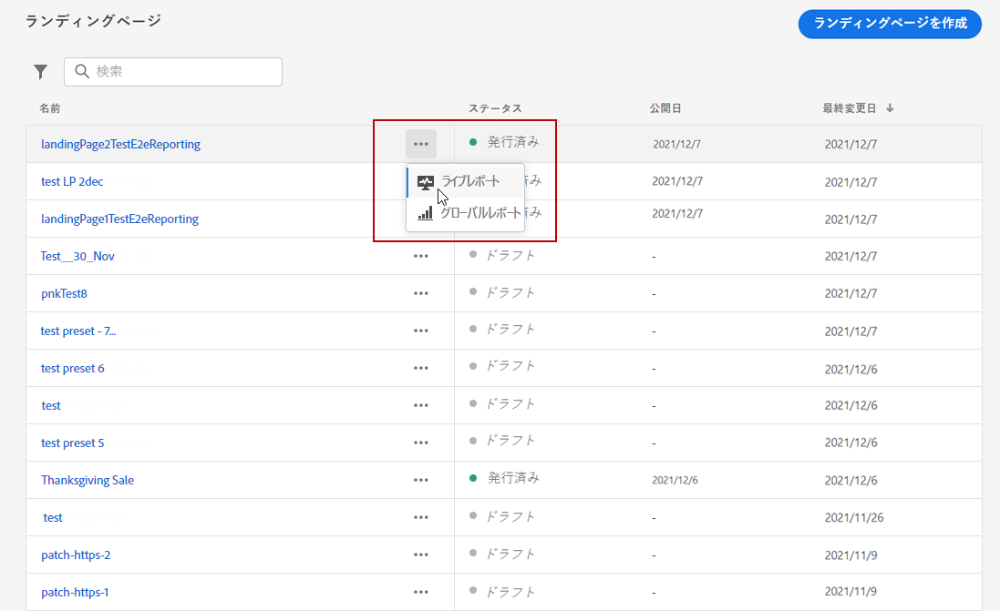
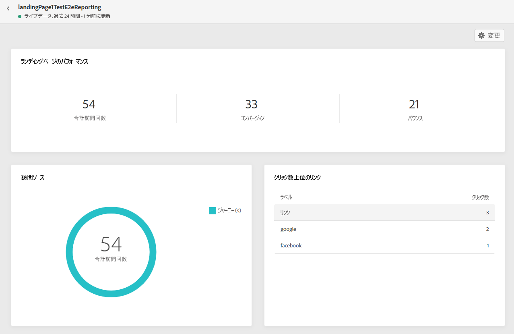
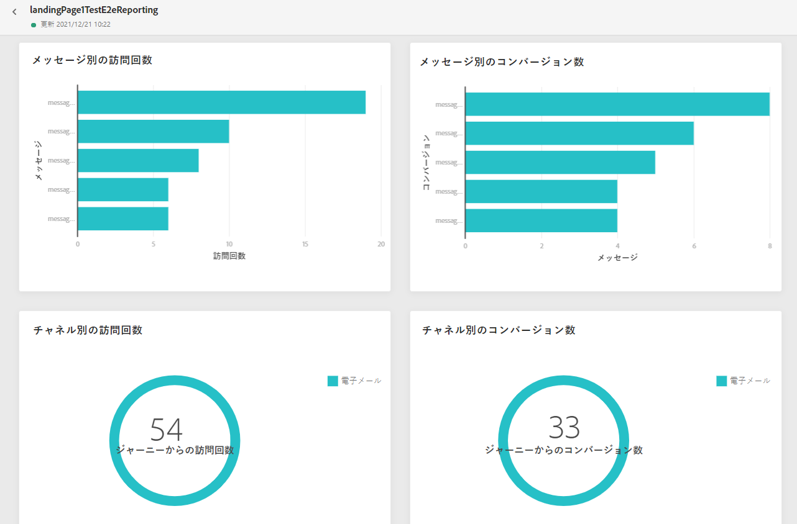
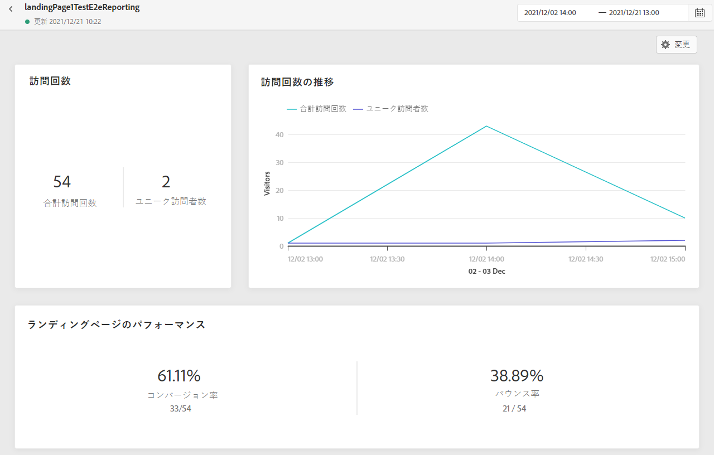
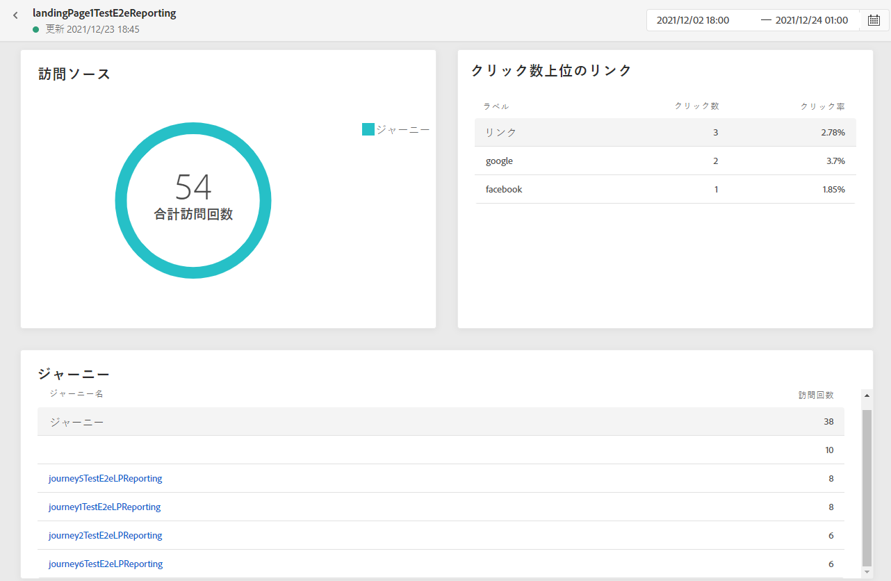
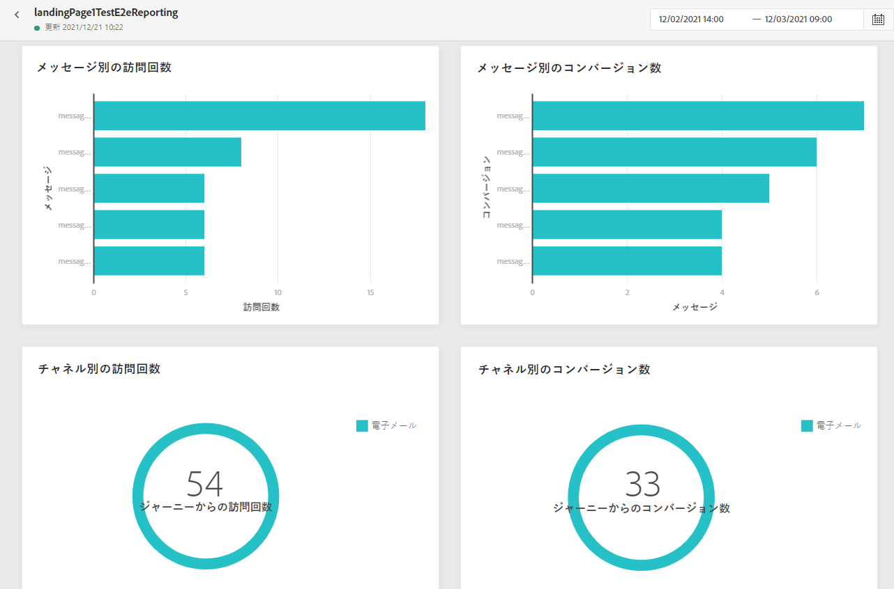

# ランディングページのレポート {#lp-report}

ランディングページのレポートには、ランディングページの影響に関する詳細が表示されます。次の 2 つのレポートタイプを使用できます。

* **[!UICONTROL ライブレポート]**&#x200B;は過去 24 時間におけるランディングページの成功を測定および視覚化します。

* **[!UICONTROL グローバルレポート]**&#x200B;は選択した期間におけるランディングページの成功を測定および視覚化します。

レポートにアクセスするには、**ライブ**&#x200B;または&#x200B;**[!UICONTROL グローバルレポート]**&#x200B;を、選択したランディングページの詳細メニューから選択します。

## ランディングページのライブレポート {#lp-live}

**[!UICONTROL ランディングページのパフォーマンス]**&#x200B;ウィジェットは、過去 24 時間のメッセージに関する主な情報の詳細を、KPI を通じて示します。

* **[!UICONTROL 合計訪問回数]**：ジャーニーまたは他のソースからランディングページを訪問した合計回数（1 人の受信者による複数回の訪問を含む）。

* **[!UICONTROL コンバージョン]**：ランディングページでインタラクションを行っていないユーザーの数（フォームの購読など）。

* **[!UICONTROL バウンス]**：ランディングページでインタラクションを起こさず、購読のアクションを完了していないユーザーの数。

**[!UICONTROL 訪問ソース]**&#x200B;ウィジェットは、訪問者がランディングページにアクセスした方法を表します。

* **[!UICONTROL ジャーニー]**：ジャーニーからのランディングページへの訪問回数。

* **[!UICONTROL その他のソース]**：ジャーニーではなく外部ソースからのランディングページへの訪問回数。

**[!UICONTROL クリック数上位のリンク]**&#x200B;は、訪問者のランディングページでのインタラクションを識別します。

* **[!UICONTROL クリック数]**：ランディングページでコンテンツがクリックされた回数。

**[!UICONTROL ジャーニー]**&#x200B;ウィジェットは、ジャーニーからランディングページへの訪問回数を表します。

**[!UICONTROL その他のソース]**&#x200B;ウィジェットは、ジャーニーではなく外部ソースからランディングページへの訪問回数を表します。

**[!UICONTROL メッセージ別の訪問回数]**／**[!UICONTROL メッセージ別のコンバージョン数]**&#x200B;のグラフは、過去 24 時間に、送信されたメッセージに応じてランディングページで正常にインタラクションを起こした訪問回数とユーザー数の合計を表します。

**[!UICONTROL チャネル別の訪問回数]**／**[!UICONTROL チャネル別のコンバージョン数]**&#x200B;のグラフは、チャネルに応じて過去 24 時間にランディングページで正常にインタラクションを起こした訪問回数とユーザー数の合計を表します。

## ランディングページのグローバルレポート {#lp-global}

**[!UICONTROL 訪問回数]**&#x200B;および&#x200B;**[!UICONTROL 訪問回数の推移]**&#x200B;ウィジェットを使用すると、次の指標を含むグラフおよび KPI を使用して、選択した期間におけるランディングページの影響を確認できます。

* **[!UICONTROL 合計訪問回数]**：ジャーニーまたは他のソースからランディングページを訪問した合計回数（1 人の受信者による複数回の訪問を含む）。

* **[!UICONTROL ユニーク訪問者]**：ランディングページを訪問した人数。1 人の受信者による複数回の訪問は考慮されません。

**[!UICONTROL ランディングページのパフォーマンス]**&#x200B;ウィジェットは、メッセージに関する主な情報の詳細を KPI を通じて示します。

* **[!UICONTROL コンバージョン率]**：訪問の合計回数に対する、ランディングページでインタラクション（フォームの購読など）を起こした人数のパーセンテージ。

* **[!UICONTROL バウンス率]**：訪問の合計回数に対する、ランディングページでインタラクションを起こさず、購読のアクションを完了していない人数のパーセンテージ。

**[!UICONTROL 訪問ソース]**&#x200B;ウィジェットは、訪問者がランディングページにアクセスした方法を表します。

* **[!UICONTROL ジャーニー]**：ジャーニーからのランディングページへの訪問回数。

* **[!UICONTROL その他のソース]**：ジャーニーではなく外部ソースからランディングページへの訪問回数。

**[!UICONTROL クリック数上位のリンク]**&#x200B;は、訪問者の配信とのインタラクションを識別します。

* **[!UICONTROL クリック数]**：ランディングページでコンテンツがクリックされた回数。

* **[!UICONTROL クリック率]**：ランディングページでのクリック率。

**[!UICONTROL ジャーニー]**&#x200B;ウィジェットは、ジャーニーからランディングページへの訪問回数を表します。

* **[!UICONTROL 訪問回数]**：ランディングページへの訪問回数（1 人の受信者による複数回の訪問を含む）。

**[!UICONTROL その他のソース]**&#x200B;ウィジェットは、ジャーニーではなく外部ソースからランディングページへの訪問回数を表します。

**[!UICONTROL メッセージ別の訪問回数]**／**[!UICONTROL メッセージ別のコンバージョン数]**&#x200B;のグラフは、送信されたメッセージに応じて、該当する期間中にランディングページで正常にインタラクションを起こした訪問回数とユーザーの合計数を表します。

**[!UICONTROL チャネル別の訪問回数]**／**[!UICONTROL チャネル別のコンバージョン数]**&#x200B;のグラフは、チャネルに応じて、該当する期間中にランディングページで正常にインタラクションを起こした訪問回数とユーザーの合計数を表します。
