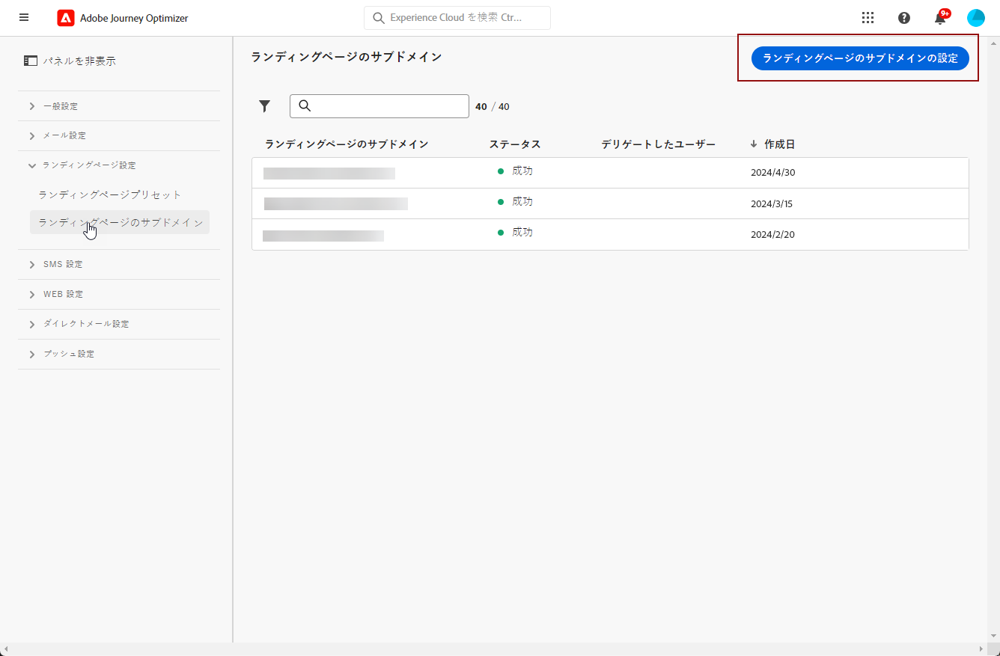
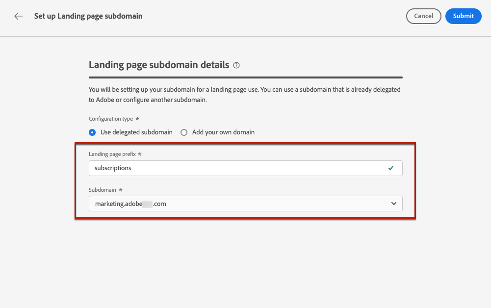
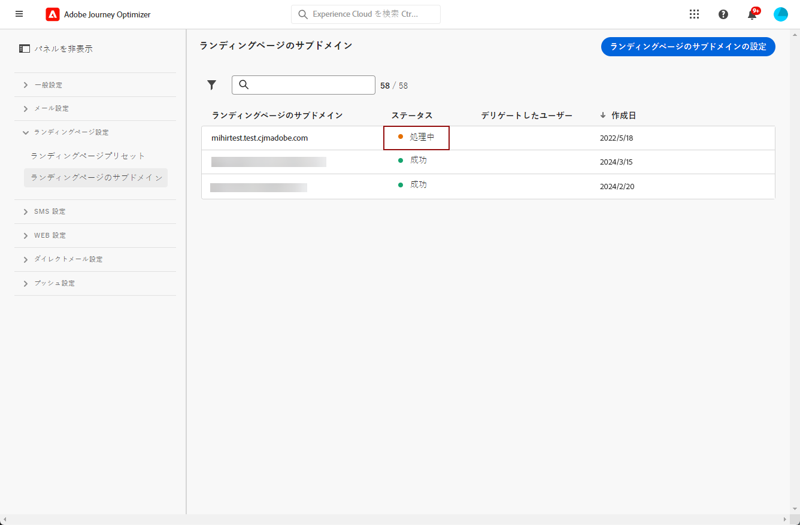

# ランディングページのサブドメインの設定 {#lp-subdomains}

>[!CONTEXTUALHELP]
>id="ajo_admin_subdomain_lp_header"
>title="ランディングページのサブドメインをデリゲート"
>abstract="ランディングページで使用するサブドメインを設定します。 既にアドビにデリゲートされているサブドメインを使用するか、別のサブドメインを設定できます。"

>[!CONTEXTUALHELP]
>id="ajo_admin_subdomain_lp"
>title="ランディングページのサブドメインをデリゲート"
>abstract="ランディングページプリセットを作成するにはこのサブドメインが必要なので、ランディングページで使用するサブドメインを設定する必要があります。既にアドビにデリゲートされているサブドメインを使用するか、新しいサブドメインを設定できます。"
>additional-url="https://experienceleague.adobe.com/docs/journey-optimizer/using/landing-pages/lp-configuration/lp-presets.html?lang=ja#lp-create-preset" text="ランディングページプリセットの作成"

>[!CONTEXTUALHELP]
>id="ajo_admin_config_lp_subdomain"
>title="ランディングページプリセットの作成"
>abstract="ランディングページプリセットを作成できるようにするには、少なくとも 1 つのランディングページサブドメインを、サブドメイン名リストから選択するように事前に設定しておく必要があります。"
>additional-url="https://experienceleague.adobe.com/docs/journey-optimizer/using/landing-pages/lp-configuration/lp-presets.html?lang=ja#lp-create-preset" text="ランディングページプリセットの作成"

## ランディングページのサブドメインの基本を学ぶ {#gs-lp-subdomains}

[ ランディングページプリセットの作成 ](lp-presets.md) を可能にするには、ランディングページに使用するサブドメインをセットアップする必要があります。

既にアドビにデリゲートされているサブドメインを使用するか、別のサブドメインを設定できます。サブドメインのアドビへのデリゲートについて詳しくは、[この節](../configuration/delegate-subdomain.md)を参照してください。

ランディングページのサブドメイン設定は **すべての環境に共通** です。 したがって、

* ランディングページのサブドメインにアクセスして編集するには、実稼動サンドボックスにおける&#x200B;**[!UICONTROL ランディングページサブドメインの管理]**&#x200B;権限が必要です。

* ランディングページのサブドメインを変更すると、実稼動サンドボックスにも影響します。

## 既存のサブドメインを使用 {#lp-use-existing-subdomain}

既にAdobeにデリゲートされているサブドメインを使用するには、次の手順に従います。

1. **[!UICONTROL 管理]**／**[!UICONTROL チャネル]**&#x200B;メニューにアクセスして、**[!UICONTROL ランディングページ設定]**／**[!UICONTROL ランディングページのサブドメイン]**&#x200B;を選択します。

1. 「**[!UICONTROL サブドメインを設定]**」をクリックします。

   

1. 「**[!UICONTROL 設定タイプ]** 」セクションから「**[!UICONTROL デリゲートドメインを使用]**」を選択します。

   

1. ランディングページの URL に表示するプレフィックスを入力します。

   英数字とハイフンのみが使用できます。

1. リストからデリゲートされたサブドメインを選択します。

   既にランディングページのサブドメインとして使用されているサブドメインは選択できません。

   <!--Capital letters are not allowed in subdomains. TBC by PM-->

   

   同じ親ドメインの複数のデリゲートされたサブドメインを使用することはできないことに注意してください。 例えば、「marketing1.yourcompany.com」が既にランディングページ用にアドビにデリゲートされている場合、「marketing2.yourcompany.com」を使用することはできません。ただし、ランディングページ用に複数レベルのサブドメインがサポートされている場合は、「marketing1.yourcompany.com」のサブドメイン（「email.marketing1.yourcompany.com」など）または別の親ドメインを使用して続行できます。

   >[!CAUTION]
   >
   >[CNAME メソッド](../configuration/delegate-subdomain.md#cname-subdomain-delegation)を使用してアドビにデリゲートされたドメインを選択する場合、ホスティングプラットフォーム上に DNS レコードを作成する必要があります。DNS レコードを生成する手順は、新しいランディングページサブドメインを設定する際の手順と同じです。[この節](#lp-configure-new-subdomain)でその方法を説明します。

1. 「**[!UICONTROL 送信]**」をクリックします。

1. 送信されると、サブドメインは&#x200B;**[!UICONTROL 処理中]**&#x200B;ステータスでリストに表示されます。サブドメインのステータスについて詳しくは、[この節](../configuration/about-subdomain-delegation.md#access-delegated-subdomains)を参照してください。<!--Same statuses?-->

   

   そのサブドメインを使用してメッセージを送信できるようになるには、必要なチェックがAdobeで実行されるまで待つ必要があります **最大 4 時間**。<!--Learn more in [this section](delegate-subdomain.md#subdomain-validation).-->

1. チェックが正常に完了すると、サブドメインのステータスが「**[!UICONTROL 成功]**」になります。ランディングページプリセットの作成に使用する準備が整いました。

## 新しいサブドメインを設定 {#lp-configure-new-subdomain}

>[!CONTEXTUALHELP]
>id="ajo_admin_lp_subdomain_dns"
>title="一致する DNS レコードを生成"
>abstract="新しいランディングページのサブドメインを設定するには、Journey Optimizer インターフェイスに表示されるアドビのネームサーバー情報をコピーし、ドメインホストソリューションに貼り付けて、一致する DNS レコードを生成する必要があります。チェックが正常に完了すると、ランディングページプリセットの作成にサブドメインを使用する準備が整います。"

新しいサブドメインを設定するには、次の手順に従います。

1. **[!UICONTROL 管理]**／**[!UICONTROL チャネル]**&#x200B;メニューにアクセスして、**[!UICONTROL ランディングページ設定]**／**[!UICONTROL ランディングページのサブドメイン]**&#x200B;を選択します。

1. **[!UICONTROL サブドメインを設定]**&#x200B;をクリックします。

1. 「 **[!UICONTROL 設定タイプ]** 」セクションから「**[!UICONTROL 独自のドメインを追加]**」を選択します。

   

1. デリゲートするサブドメインを指定します。

   >[!CAUTION]
   >
   >* 既存のランディングページのサブドメインは使用できません。
   >
   >* サブドメインでは大文字は使用できません。

   無効なサブドメインをアドビにデリゲートすることはできません。組織が所有する有効なサブドメイン（marketing.yourcompany.com など）を入力してください。

   ランディングページでは、複数レベルのサブドメインがサポートされています。 例えば、「email.marketing.yourcompany.com」を使用できます。

1. DNS サーバーに配置するレコードが表示されます。このレコードをコピーするか、CSV ファイルをダウンロードしてから、ドメインをホストするソリューションに移動し、一致する DNS レコードを生成します。

1. DNS レコードがドメインホスティングソリューションに生成されていることを確認します。すべてが正しく設定されている場合は、「確認しました」チェックボックスをオンにし、「**[!UICONTROL 送信]**」をクリックします。

   

   新しいランディングページのサブドメインを設定すると、常に CNAME レコードを指すようになります。

1. サブドメインのデリゲーションが送信されると、そのサブドメインは「**[!UICONTROL 処理中]**」ステータスでリストに表示されます。サブドメインのステータスについて詳しくは、[この節](../configuration/about-subdomain-delegation.md#access-delegated-subdomains)を参照してください。<!--Same statuses?-->

   そのサブドメインをランディングページに使用できるようになるには、必要なチェックがAdobeで実行されるまで待つ必要があります **最大 4 時間**。<!--Learn more in [this section](#subdomain-validation).-->

1. チェックが正常に完了すると、サブドメインのステータスが「**[!UICONTROL 成功]**」になります。ランディングページプリセットの作成に使用する準備が整いました。

   ホスティングソリューションで検証レコードを作成できなかった場合、サブドメインは「**[!UICONTROL 失敗]**」とマークされます。

## サブドメインのデリゲート解除 {#undelegate-subdomain}

ランディングページのサブドメインのデリゲートを解除する場合は、Adobe担当者にお問い合わせください。

ただし、Adobeにアクセスする前に、ユーザーインターフェイスでいくつかの手順を実行する必要があります。

>[!NOTE]
>
>**[!UICONTROL 成功]** ステータスのサブドメインのみをデリゲート解除できます。 **[!UICONTROL ドラフト]** および **[!UICONTROL 失敗]** ステータスのサブドメインは、ユーザーインターフェイスから削除できます。

まず、[!DNL Journey Optimizer] で次の手順を実行します。

1. サブドメインに関連付けられているすべてのランディングページを非公開にします。 [方法についてはこちらを参照](create-lp.md#access-landing-pages)

1. サブドメインに関連付けられているすべてのチャネル設定をディアクティベートします。 [方法についてはこちらを参照](../configuration/channel-surfaces.md#deactivate-a-surface)

<!--
1. If the landing page subdomain is using an email subdomain that was [already delegated](#lp-use-existing-subdomain) to Adobe, undelegate the email subdomain. [Learn how](../configuration/delegate-subdomain.md#undelegate-subdomain)

1. Stop the active campaigns associated with the subdomains. [Learn how](../campaigns/modify-stop-campaign.md#stop)

1. Stop the active journeys associated with the subdomains. [Learn how](../building-journeys/end-journey.md#stop-journey)
-->

完了したら、デリゲート解除するサブドメインをAdobe担当者に連絡します。

リクエストがAdobeによって処理されると、デリゲートされていないドメインはサブドメインインベントリページに表示されなくなります。

>[!CAUTION]
>
>サブドメインがデリゲート解除された後：
>
>   * そのサブドメインを使用していたチャネル設定を再アクティブ化することはできません。
>
>   * ユーザーインターフェイスを使用して正確なサブドメインを再度デリゲートすることはできません。 その場合は、Adobeの担当者にお問い合わせください。