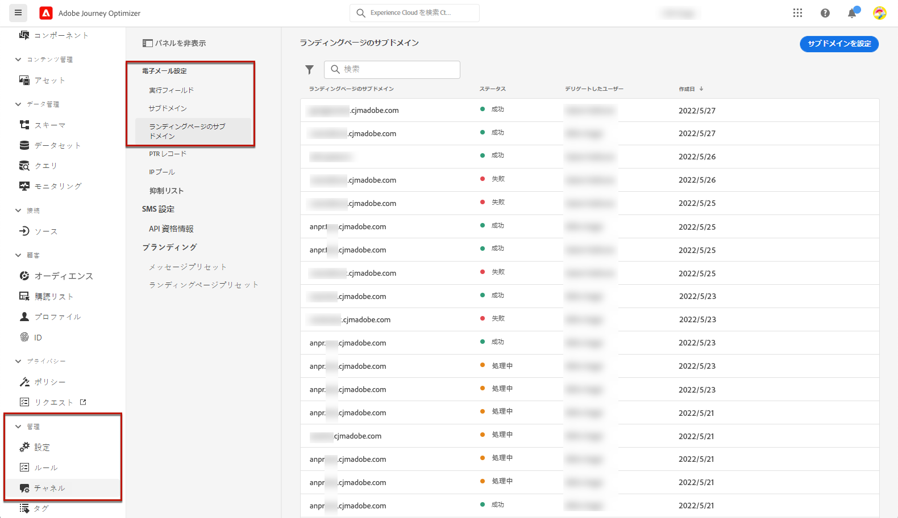

# ランディングページのサブドメインの設定 {#lp-subdomains}

>[!CONTEXTUALHELP]
>id="ajo_admin_subdomain_lp_header"
>title="ランディングページサブドメインの委任"
>abstract="あなたは、ジャンプページを使用するためにサブドメインを設定します。 既に Adobe に委任されているサブドメインや、他のサブドメインを設定したサブドメインを使用できます。"

>[!CONTEXTUALHELP]
>id="ajo_admin_subdomain_lp"
>title="ランディングページサブドメインの委任"
>abstract="ランディングページに使用するサブドメインを設定する必要があります。このサブドメインは、ランディングページのプリセットを作成するために必要になります。 既に委任されているサブドメインを使用することも、新しいサブドメインを設定することもできます。"
>additional-url="https://experienceleague.adobe.com/docs/journey-optimizer/using/configuration/lp-configuration/lp-presets.html" text="ランディングページのプリセットの作成"

>[!CONTEXTUALHELP]
>id="ajo_admin_config_lp_subdomain"
>title="ランディングページのプリセットの作成"
>abstract="ランディングページのプリセットを作成できるようにするには、サブドメイン名リストから1つ以上のランディングページサブドメインが事前に設定されていることを確認してください。"
>additional-url="https://experienceleague.adobe.com/docs/journey-optimizer/using/configuration/lp-configuration/lp-presets.html" text="ランディングページのプリセットの作成"

[ランディングページのプリセット ](lp-presets.md) を作成できるようにするには、ランディングページに使用するサブドメインを設定する必要があります。

既に Adobe に委任されているサブドメインを使用するか、または別のサブドメインを設定することができます。 ここでは、この節 ](../configuration/delegate-subdomain.md) で [ 説明するサブドメインの Adobe への委任について詳しく説明します。

>[!CAUTION]
>
>ランディングページサブドメインの設定は、すべての環境で共通です。 したがって、ランディングページのサブドメインに変更を加えると、運用サンドボックスにも影響します。

大文字はサブドメイン内では使用できません。

## 既存のサブドメインを使用する {#lp-use-existing-subdomain}

既に Adobe に委任されているサブドメインを使用するには、次の手順を実行します。

1. **[!UICONTROL Administration]**> **[!UICONTROL Channels]** メニューにアクセスし、「> **[!UICONTROL Landing page subdomains]** 」を選択 **[!UICONTROL Email configuration]** します。

   

1. をクリック **[!UICONTROL Set up subdomain]** します。

   

1. セクションから **[!UICONTROL Configuration type]** を選択 **[!UICONTROL Use delegated domain]** します。

   

1. ランディングページの URL に表示されるプレフィックスを入力します。

   >[!NOTE]
   >
   >使用できるのは、英数字とハイフンのみです。

1. リストから委任されたサブドメインを選択します。

   >[!NOTE]
   >
   >既にランディングページのサブドメインとして使用されているサブドメインを選択することはできません。

   <!--Capital letters are not allowed in subdomains. TBC by PM-->

   

   1つの親ドメインに委任された複数のサブドメインを使用できないことに注意してください。 例えば、「marketing1.yourcompany.com」がランディングページに対して既に Adobe に委任されている場合は、「marketing2.yourcompany.com」を使用することはできません。 ただし、ランディングページについては、「marketing1.yourcompany.com」というサブドメイン (&#39; email.marketing1.yourcompany.com &#39; など)、または別の親ドメインを使用して、そのサブドメインを使用することもできます。

   >[!CAUTION]
   >
   >CNAME メソッド ](../configuration/delegate-subdomain.md#cname-subdomain-delegation) を使用して [ Adobe に委任されたドメインを選択した場合は、ホストプラットフォーム上に DNS レコードを作成する必要があります。DNS レコードを作成するには、新しいランディングページのサブドメインを設定するときと同じ手順を実行します。 この節 ](#lp-configure-new-subdomain) の説明を [ 参照してください。

1. をクリック **[!UICONTROL Submit]** します。

1. サブドメインが送信されると、リスト **[!UICONTROL Processing]** に状態が表示されます。 サブドメインの状態について詳しくは、この節 ](../configuration/about-subdomain-delegation.md#access-delegated-subdomains) を [ 参照してください。<!--Same statuses?-->

   

   >[!NOTE]
   >
   >サブドメインを使用してメッセージを送信するには、事前に必要なチェックが実行されるまで待つ必要があります。この処理には最大4時間かかります。<!--Learn more in [this section](delegate-subdomain.md#subdomain-validation).-->

1. チェックが成功すると、サブドメインが状態を取得 **[!UICONTROL Success]** します。 この設定を使用して、ランディングページのプリセットを作成することができます。

## 新しいサブドメインの設定 {#lp-configure-new-subdomain}

>[!CONTEXTUALHELP]
>id="ajo_admin_lp_subdomain_dns"
>title="一致する DNS レコードの生成"
>abstract="新しいランディングページサブドメインを設定するには、旅のオプティマイザーインターフェイスに表示されている Adobe nameserver 情報をコピーし、それをドメインホストソリューションにペーストして、一致する DNS レコードを生成する必要があります。 チェックが成功すると、サブドメインを使用してランディングページのプリセットを作成できるようになります。"

新しいサブドメインを設定するには、次の手順を実行します。

1. **[!UICONTROL Administration]**> **[!UICONTROL Channels]** メニューにアクセスし、「> **[!UICONTROL Landing page subdomains]** 」を選択 **[!UICONTROL Email configuration]** します。

1. をクリック **[!UICONTROL Set up subdomain]** します。

1. セクションから **[!UICONTROL Configuration type]** を選択 **[!UICONTROL Add your own domain]** します。

   

1. 委任するサブドメインを指定します。

   >[!CAUTION]
   >
   >既存のランディングページサブドメインを使用することはできません。
   >
   >サブドメインで大文字を使用することはできません。

   無効なサブドメインをアドビシステムズ社に委任することはできません。 Marketing.yourcompany.com のように、組織が所有している有効なサブドメインを入力してください。

   >[!NOTE]
   >
   >ランディングページについては、マルチレベルのサブドメインがサポートされています。 例えば、「email.marketing.yourcompany.com」を使用することもできます。

1. DNS サーバーに配置されるレコードが表示されます。 このレコードをコピーするか、または CSV ファイルをダウンロードし、次に、ドメインホストソリューションに移動して一致する DNS レコードを生成します。

1. ドメインホストソリューションに DNS レコードが生成されていることを確認してください。 すべてが正しく設定されている場合は、「確認します」チェックボックスをオンにし、をクリック **[!UICONTROL Submit]** します。

   

   >[!NOTE]
   >
   >新しいランディングページサブドメインを設定すると、常に CNAME レコードが参照されます。

1. サブドメインの委任が送信されると、そのドメインの一覧 **[!UICONTROL Processing]** に状態が表示されます。 サブドメインの状態について詳しくは、この節 ](../configuration/about-subdomain-delegation.md#access-delegated-subdomains) を [ 参照してください。<!--Same statuses?-->

   >[!NOTE]
   >
   >サブドメインを使用してメッセージを送信するには、事前に必要なチェックが実行されるまで待つ必要があります。この処理には最大4時間かかります。<!--Learn more in [this section](#subdomain-validation).-->

1. チェックが成功すると、サブドメインが状態を取得 **[!UICONTROL Success]** します。 この設定を使用して、ランディングページのプリセットを作成することができます。

   ホストソリューションに検証レコードを作成しない場合は、サブドメインにマーク **[!UICONTROL Failed]** が付けられます。
