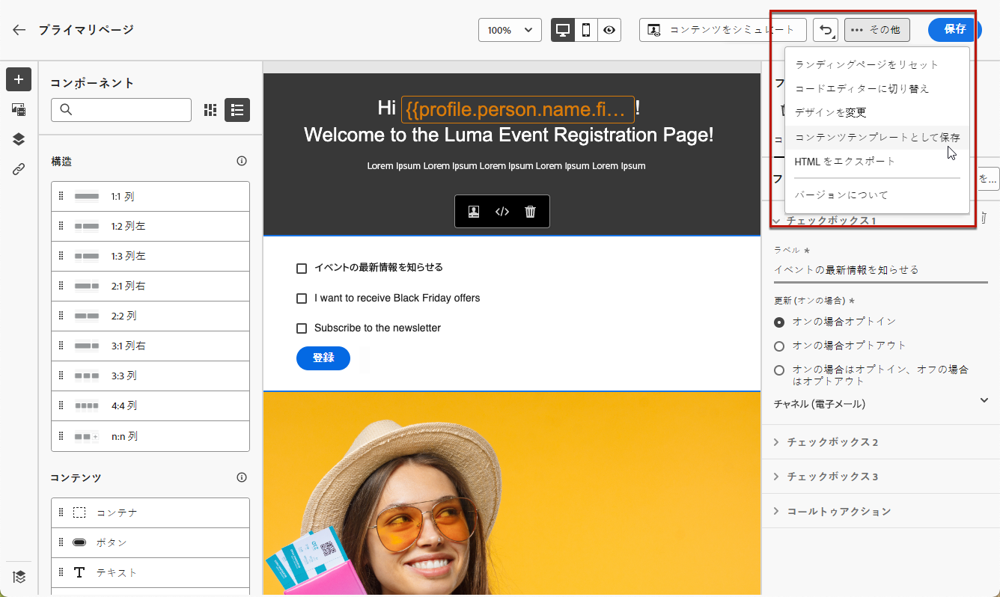
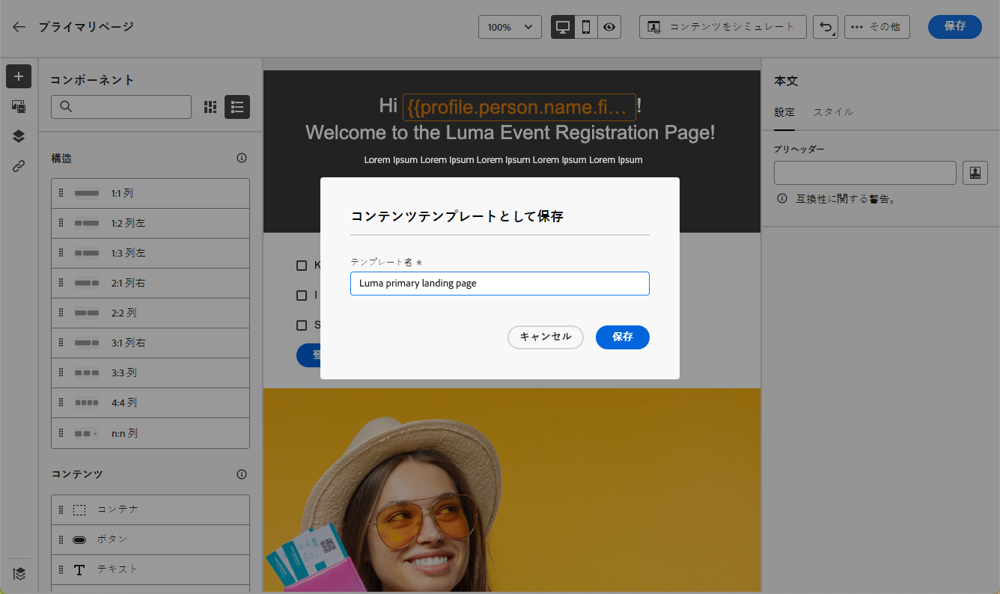
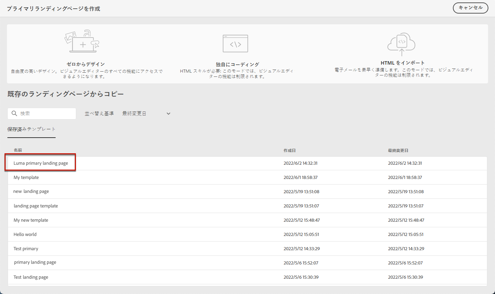
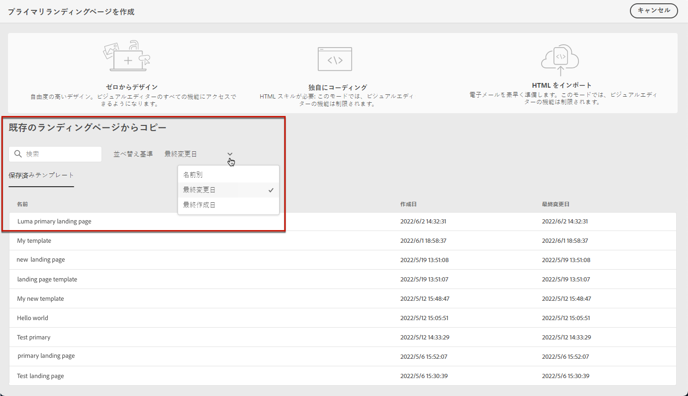
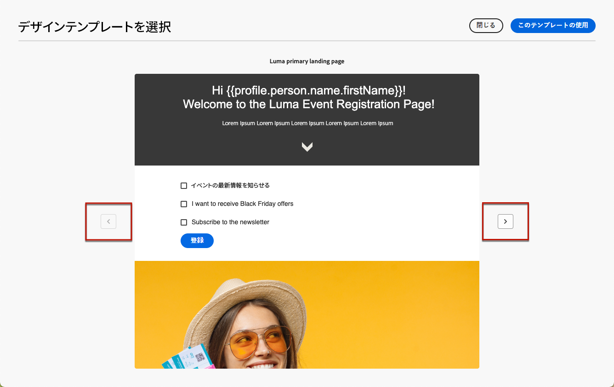

# ランディングページテンプレートの使用 {#work-with-templates}

## ページをテンプレートとして保存 {#save-as-template}

デザインした後は、 [ランディングページコンテンツ](lp-content.md)を使用する場合は、後で再利用するために保存できます。 それには、次の手順に従います。

1. 画面の右上にある省略記号をクリックします。

1. 選択 **[!UICONTROL デザインテンプレートを保存]** を選択します。

   

1. このテンプレートの名前を追加します。

   

1. 「**[!UICONTROL 保存]**」をクリックします。

次回ランディングページを作成する際には、このテンプレートを使用してコンテンツを作成できます。 詳しくは、 [セクション](#use-saved-template) 下

## 保存したテンプレートを使用 {#use-saved-template}

1. を開きます。 [ランディングページコンテンツデザイナ](design-lp.md). 以前に保存したすべてのテンプレートのリストが表示されます。

1. 並べ替え可能です **[!UICONTROL 名前別]**, **[!UICONTROL 最終変更日]** および **[!UICONTROL 最終作成日]**.

   

1. リストから目的のテンプレートを選択します。

1. 選択したら、左右の矢印を使用して、保存済みのすべてのテンプレート間を移動できます。

   

1. クリック **[!UICONTROL このランディングページを使用]**.

1. ランディングページデザイナーを使用して、必要に応じてコンテンツを編集します。

>[!NOTE]
>
>プライマリページテンプレートとサブページテンプレートは別々に管理されます。つまり、プライマリページテンプレートを使用してサブページを作成することはできません。また、その逆も可能です。
