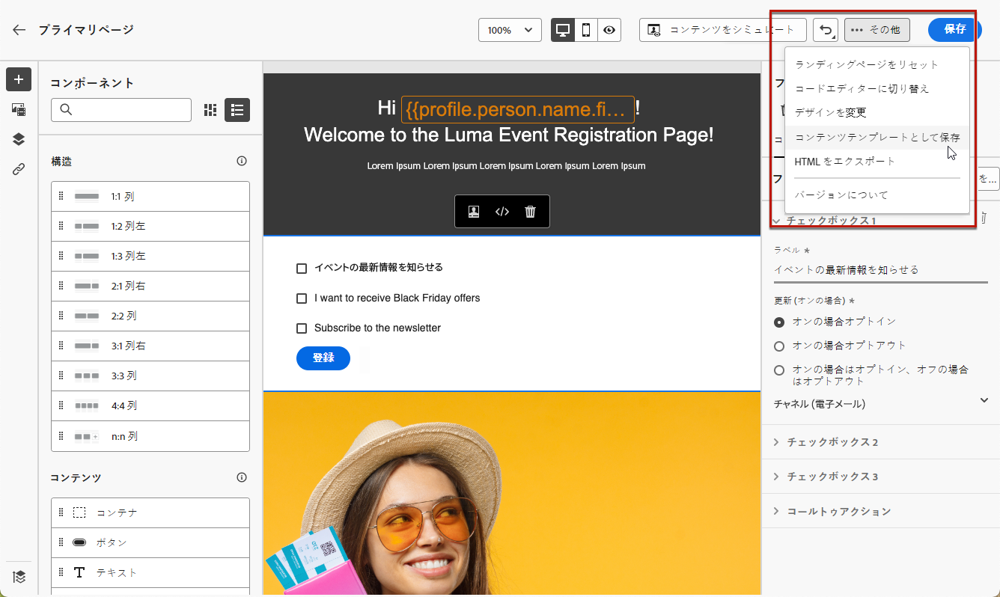
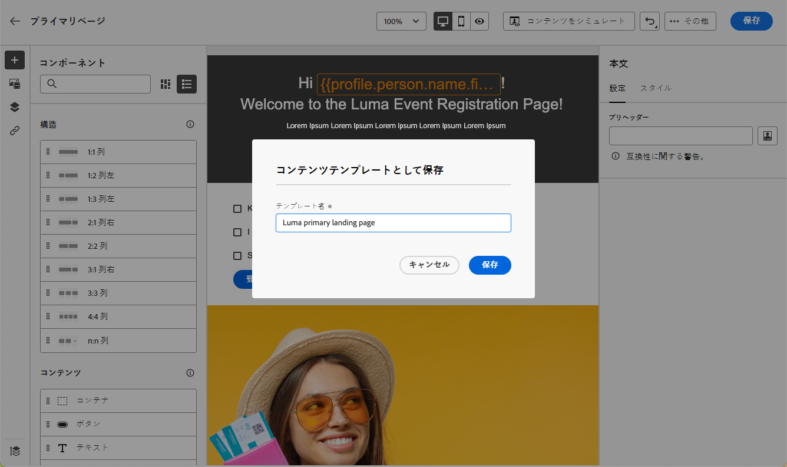
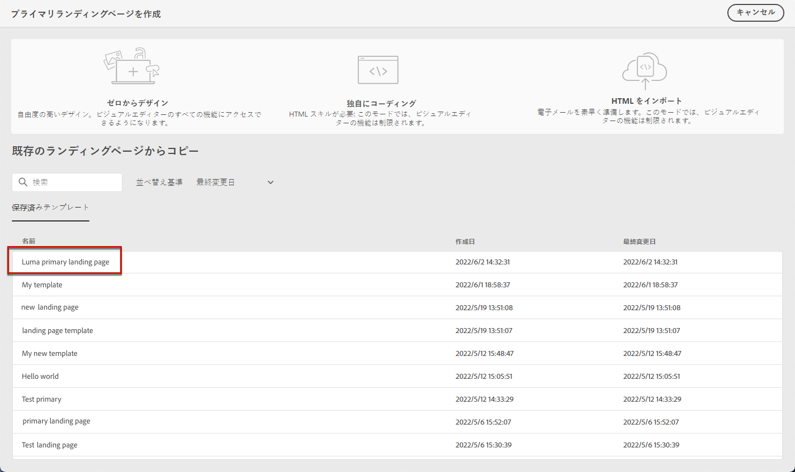
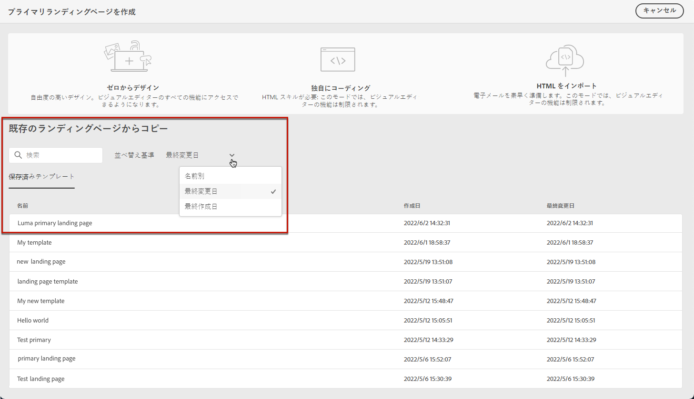
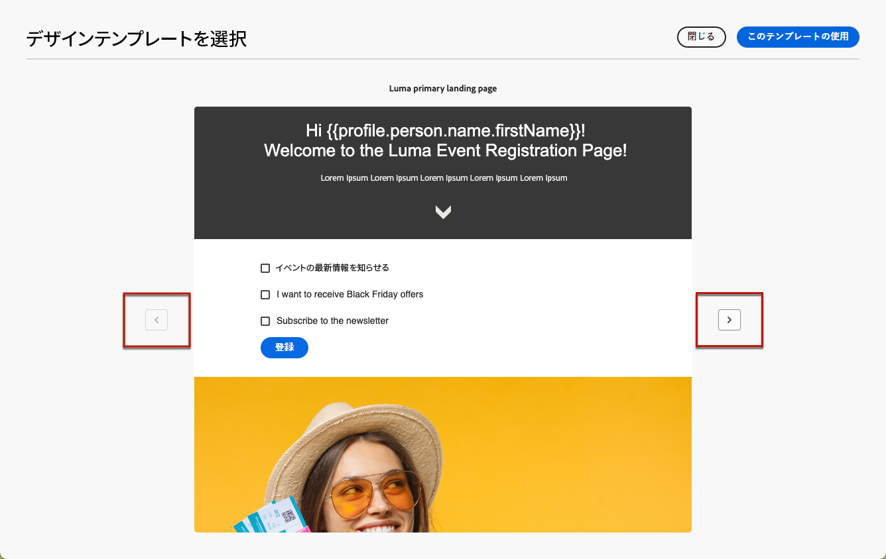

# ランディングページテンプレートの操作 {#work-with-templates}

>[!BEGINSHADEBOX]

**このページ：**&#x200B;完成したランディングページを再利用可能なコンテンツテンプレートとして保存し、それを適用して今後のページのデザインを高速化します。

>[!ENDSHADEBOX]

## テンプレートとしてのページの保存 {#save-as-template}

[ランディングページコンテンツ](lp-content.md)をデザインしたら、後日再利用するために保存できます。 これを行うには、次の手順に従います。

1. 画面の右上にある省略記号をクリックします。

1. ドロップダウンメニューから「**[!UICONTROL コンテンツテンプレートとして保存]**」を選択します。

   

1. このテンプレートの名前を追加します。

   

1. 「**[!UICONTROL 保存]**」をクリックします。

次回ランディングページを作成する際には、このテンプレートを使用してコンテンツを作成できます。 詳しくは、以下の[節](#use-saved-template)を参照してください。

## 保存済みコンテンツテンプレートの使用 {#use-saved-template}

1. [ランディングページコンテンツ designer](design-lp.md) を開きます。 以前に保存したすべてのテンプレートのリストが表示されます。

1. **[!UICONTROL 名前別]**、**[!UICONTROL 最終変更日]**&#x200B;および&#x200B;**[!UICONTROL 最終作成日]**&#x200B;で並べ替え可能です。

   

1. リストから目的のテンプレートを選択します。

1. 選択したら、左右の矢印を使用して、保存済みのすべてのテンプレート間を移動できます。

   

1. 「**[!UICONTROL このテンプレートを使用]**」をクリックします。

1. ランディングページ designer を使用して、必要に応じてコンテンツを編集します。

>[!NOTE]
>
>プライマリページテンプレートとサブページテンプレートは別々に管理されます。つまり、プライマリページテンプレートを使用してサブページを作成することはできません。また、その逆も同様です。
