# ランディングページのユースケース {#lp-use-cases}

以下に、 [!DNL Journey Optimizer] ランディングページを使用して、顧客が一部またはすべてのお知らせの受信をオプトイン／オプトアウトできるようにする例を示します。

<!--The main use cases are:
* Subscription to a service
* Opt-in
* Opt-out-->

## サービスの購読 {#subscription-to-a-service}

最も一般的な使用例の 1 つは、ランディングページを通じて（ニュースレターやイベントなどの）[サービスを購読する](subscription-list.md)ように顧客を招待することです。主な手順は次のグラフに示します。

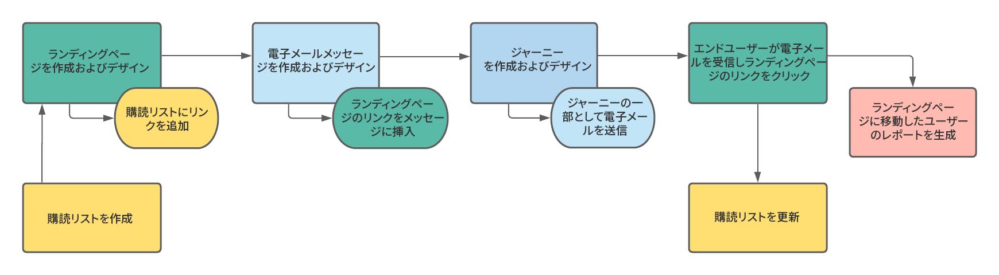

例えば、来月イベントを開催し、<!--to keep your customers that are interested updated on that event-->イベント登録キャンペーンを開始するとします。これを行うには、受信者がこのイベントに登録できるようにするランディングページへのリンクを含むメールを送信します。登録したユーザーは、この目的で作成した購読リストに追加されます。

### ランディングページの設定 {#set-up-lp}

1. イベント登録の購読リストを作成します。このリストには、登録済みユーザーが格納されます。購読リストの作成方法については、[こちら](subscription-list.md#define-subscription-list)を参照してください。

   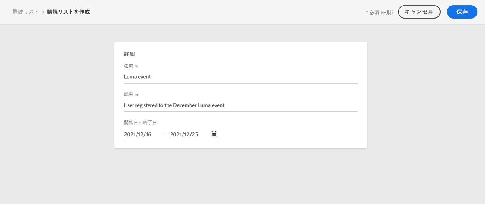

1. [ランディングページを作成](create-lp.md)し、受信者がイベントに登録できるようにします。

1. 登録の[プライマリランディングページ](create-lp.md#configure-primary-page)を設定します。

1. [ランディングページのコンテンツ](design-lp.md)をデザインする際に、作成した購読リストを選択し、登録チェックボックスをオンにしたプロファイルで更新します。

   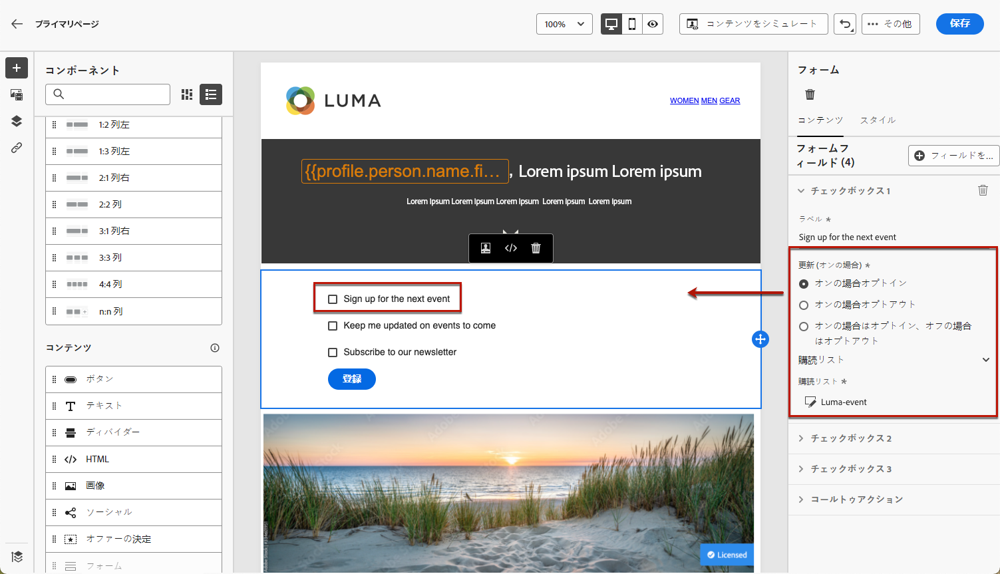

1. 受信者が登録フォームを送信したときに、受信者に表示される「ありがとうございました」ページを作成します。ランディングサブページの設定方法については、[こちら](create-lp.md#configure-subpages)を参照してください。

   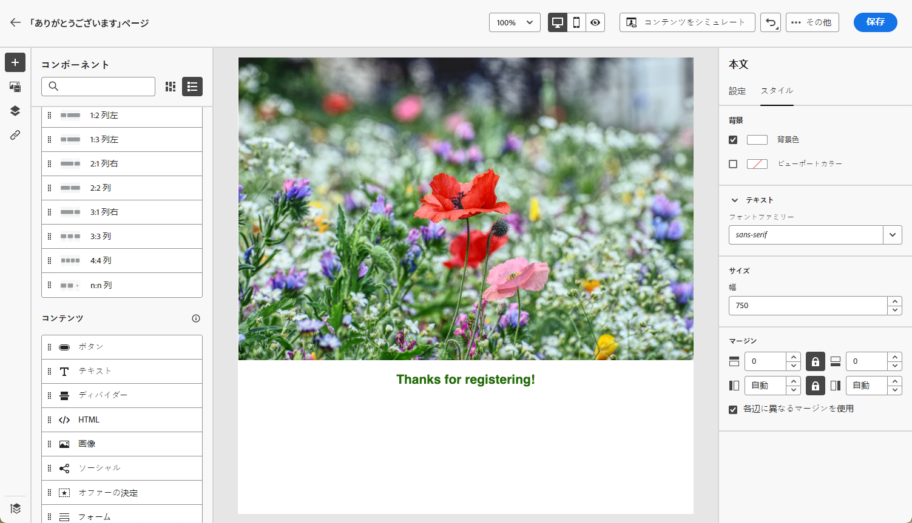

1. ランディングページを[公開](create-lp.md#publish)します。

1. イベントの登録が開始されたことを通知する[メールメッセージを作成](../messages/create-message.md)します。

1. メッセージコンテンツに[リンクを挿入](../messages/message-tracking.md#insert-links)します。「**[!UICONTROL ランディングページ]**」を&#x200B;**[!UICONTROL リンクタイプ]**&#x200B;として選択し、登録用に作成した[ランディングページ](create-lp.md#configure-primary-page)を選択します。

   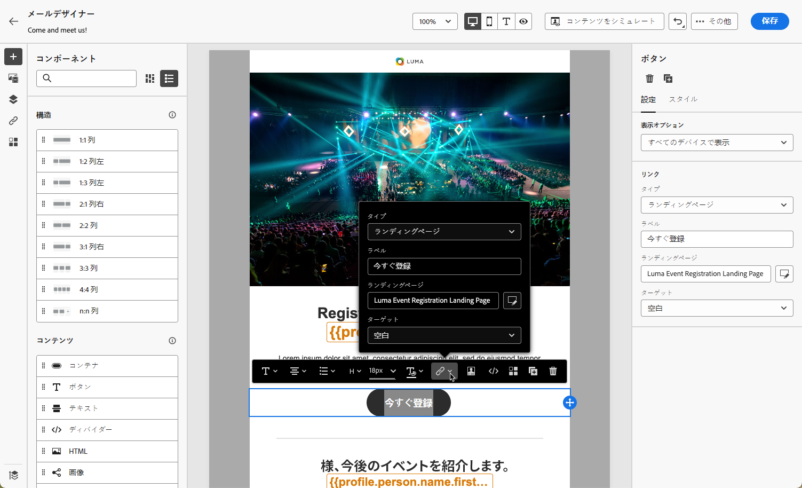

1. コンテンツを保存し、[メッセージを公開](../messages/publish-manage-message.md)します。

1. 登録ランディングページにトラフィックを誘導するための[ジャーニー](../building-journeys/journey.md)を通じてメッセージを送信します。

   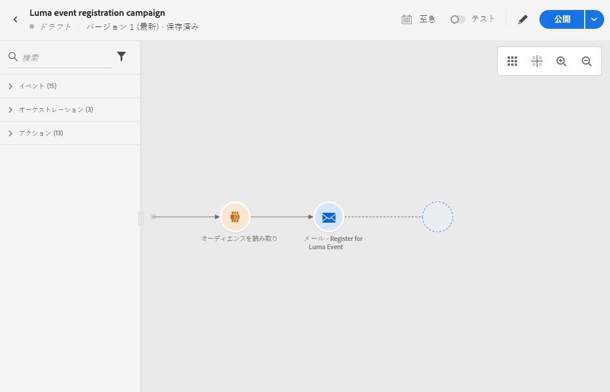

   メールを受信した受信者がランディングページへのリンクをクリックすると、「ありがとうございました」ページに移動し、購読リストに追加されます。

### 確認メールの送信 {#send-confirmation-email}

さらに、イベントに登録した受信者に確認メールを送信できます。これを行うには、以下の手順に従います。

1. 別の[ジャーニー](../building-journeys/journey.md)を作成します。「**[!UICONTROL ジャーニーの作成]**」ボタンをクリックすると、ランディングページから直接実行できます。詳しくは、[こちら](create-lp.md#configure-primary-page)を参照してください。

   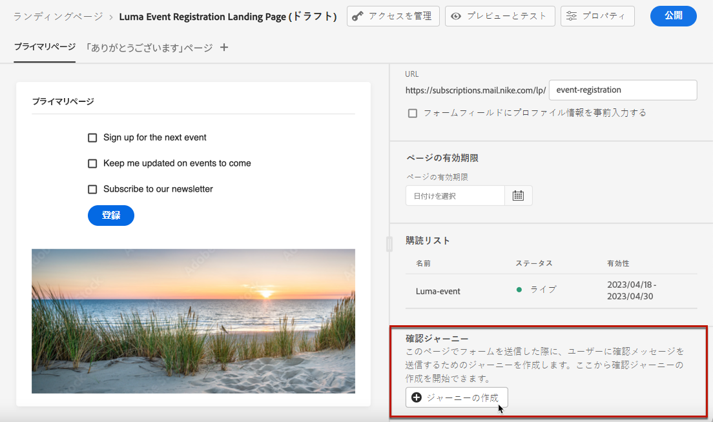

1. 「**[!UICONTROL イベント]**」カテゴリを展開し、「**[!UICONTROL セグメントの選定]**」アクティビティをキャンバスにドロップします。詳しくは、[こちら](../building-journeys/segment-qualification-events.md)を参照してください。

1. 「**[!UICONTROL セグメント]**」フィールドをクリックし、作成した購読リストを選択します。

   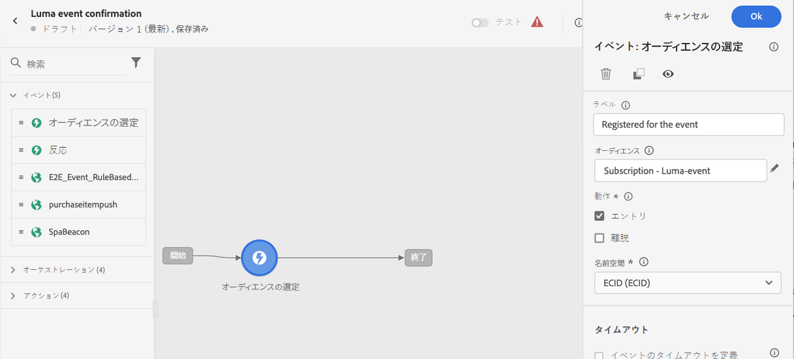

1. 選択した確認メールを選択し、ジャーニーを通じて送信します。

   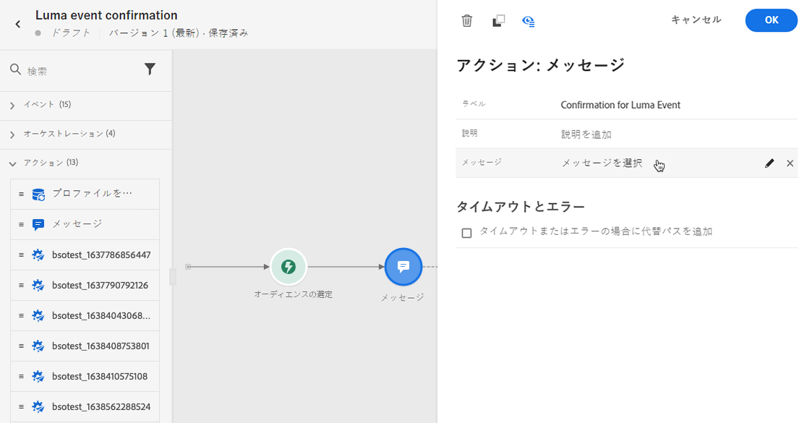

イベントに登録したすべてのユーザーに確認メールが送信されます。

<!--The event registration's subscription list tracks the profiles who registered and you can send them targeted event updates.-->

## オプトアウト {#opt-out}

受信者がお知らせの登録を解除止できるように、オプトアウトのランディングページへのリンクをメールに含めることができます。

[この節](../messages/consent.md)では、受信者の同意の管理と、これが重要である理由について説明します。

### オプトアウト管理 {#opt-out-management}

ブランドからの連絡を購読解除する機能を受信者に提供することは、法的要件です。適用される法律について詳しくは、[Experience Platform のドキュメント](https://experienceleague.adobe.com/docs/experience-platform/privacy/regulations/overview.html?lang=ja#regulations){target=&quot;_blank&quot;}を参照してください。

したがって、受信者に送信されるすべての メールに&#x200B;**購読解除リンク**&#x200B;を必ず含める必要があります。

* 受信者がこのリンクをクリックすると、オプトアウトを確認するボタンを含んだランディングページが表示されます。
* オプトアウトボタンをクリックすると、プロファイルデータがこの情報を使用して更新されます。

### オプトアウトの設定 {#configure-opt-out}

メールの受信者がランディングページを通じてお知らせなどのメッセージを登録解除できるようにするには、次の手順に従います。

1. ランディングページを作成します。 [詳細情報](create-lp.md)

1. プライマリページを定義します。 [詳細情報](create-lp.md#configure-primary-page)

1. プライマリページコンテンツの[デザイン](design-lp.md)：ランディングページ固有の&#x200B;**[!UICONTROL フォーム]**&#x200B;コンポーネントを使用して、「**[!UICONTROL オプトアウト]**」チェックボックスを定義し、**[!UICONTROL チャネル（E メール）]**&#x200B;の更新を選択します。ランディングページでオプトアウトボックスをオンにしたプロファイルは、すべてのお知らせからオプトアウトされます。

   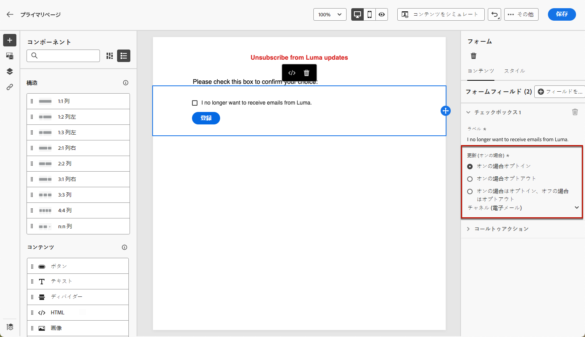

   <!--You can also build your own landing page and host it on the third-party system of your choice. To keep?-->

1. フォームを送信するユーザーに表示される確認用の[サブページ](create-lp.md#configure-subpages)を追加します。

   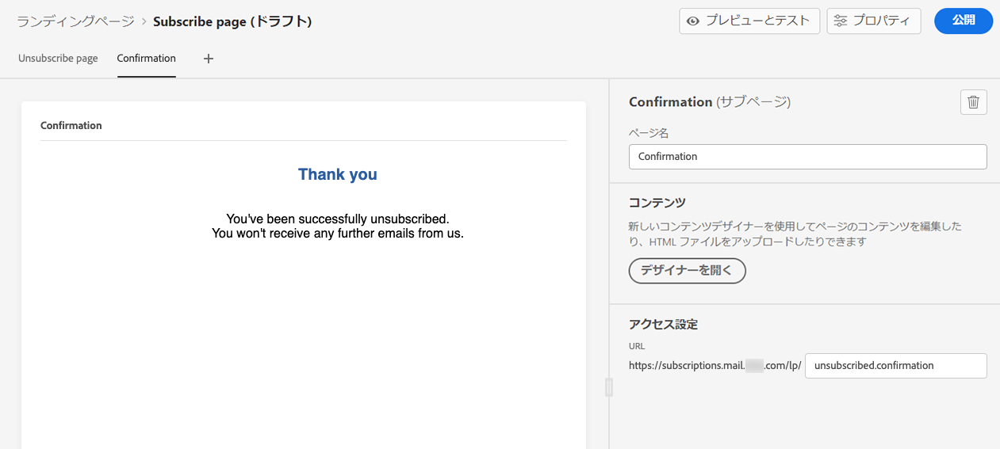

   >[!NOTE]
   >
   >必ずプライマリページの&#x200B;**[!UICONTROL フォーム]**&#x200B;コンポーネントの「**[!UICONTROL コールトゥアクション]**」セクションにあるサブページを参照してください。[詳細情報](design-lp.md)

1. ページのコンテンツを設定して定義したら、ランディングページを[公開](create-lp.md#publish)します。

   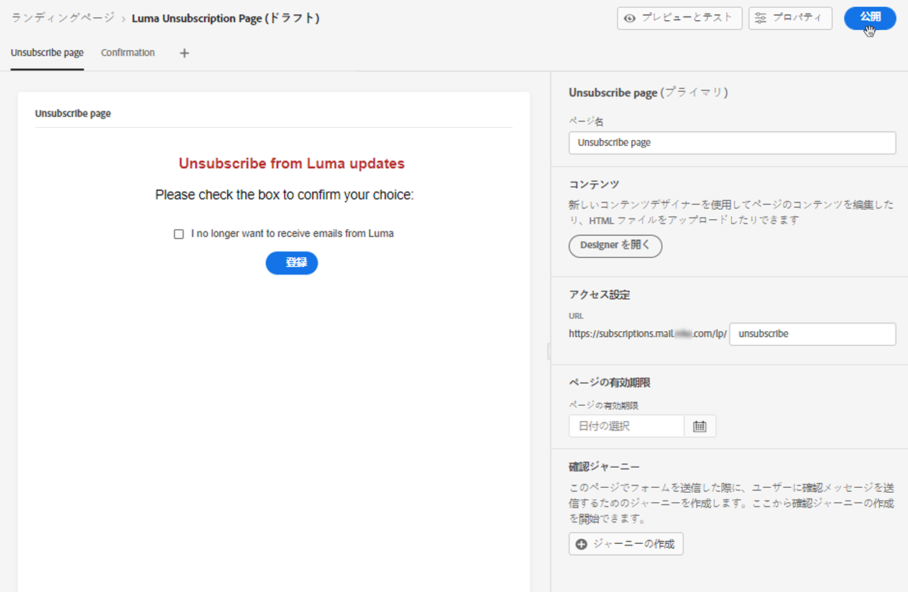

1. [!DNL Journey Optimizer] で [メールメッセージを作成します](../messages/create-message.md)。

1. コンテンツ内のテキストを選択し、コンテキストツールバーを使用して[リンクを挿入](../messages/message-tracking.md#insert-links)します。ボタンにリンクを使用することもできます。

   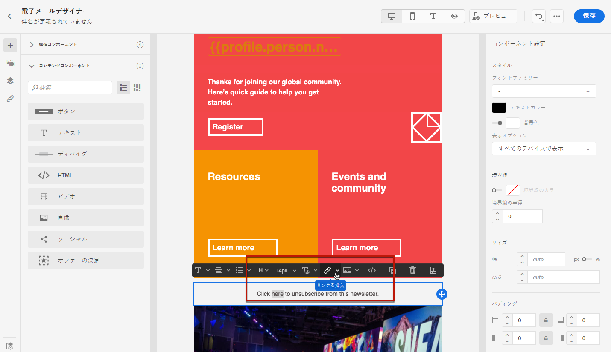

1. **[!UICONTROL リンクタイプ]**&#x200B;ドロップダウンリストから「**[!UICONTROL ランディングページ]**」を選択し、オプトアウト用に作成した[ランディングページ](create-lp.md#configure-primary-page)を選択します。

   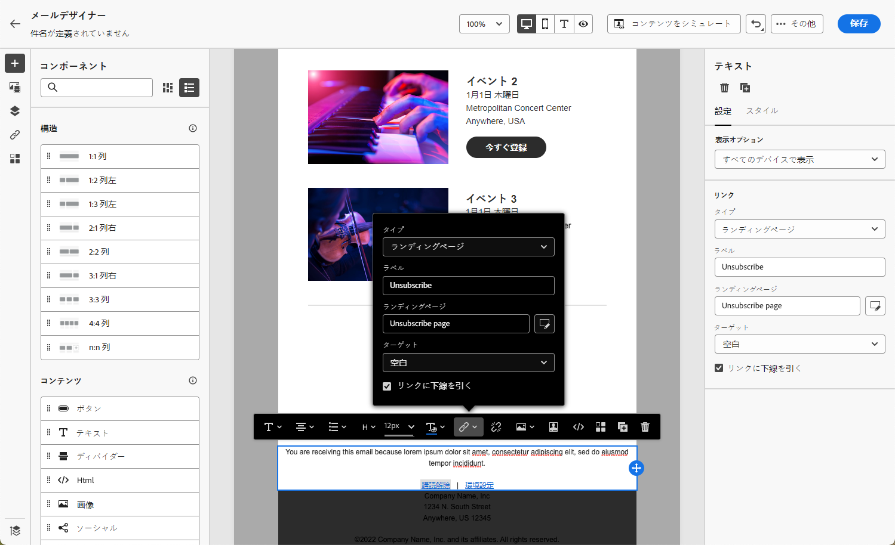

1. コンテンツを保存し、[メッセージを公開](../messages/publish-manage-message.md)します。

1. ジャーニーを通じてメッセージを送信します。[詳細情報](../building-journeys/journey.md)。

1. メッセージを受け取った受信者がメールの登録解除リンクをクリックすると、ランディングページが表示されます。

   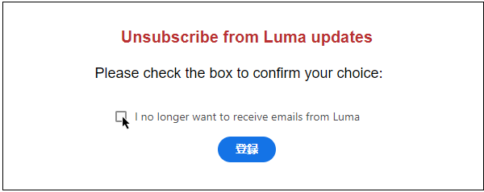

   受信者がボックスをオンにしてフォームを送信した場合：

   * オプトアウトした受信者は、確認メッセージ画面にリダイレクトされます。

   * プロファイルデータは更新され、再度登録しない限り、ブランドからのお知らせは届きません。

対応するプロファイルの選択が更新されたことを確認するには、Experience Platform に移動し、ID 名前空間と対応する ID 値を選択してプロファイルにアクセスします。詳しくは、[Experience Platform のドキュメント](https://experienceleague.adobe.com/docs/experience-platform/profile/ui/user-guide.html?lang=ja#getting-started){target=&quot;_blank&quot;}を参照してください。

「**[!UICONTROL 属性]**」タブで、**[!UICONTROL choice]** の値が **[!UICONTROL no]** に変更されたことを確認できます。

<!--

### Other ways to opt out

You can also enable your recipients to unsubscribe whithout using landing pages.

* **One-click opt-out**

    You can add a one-click opt-out link into your email content. This will enable your recipients to quickly unsubscribe from your communications, without being redirected to a landing page where they need to confirm opting out. [Learn more](../messages/consent.md#one-click-opt-out-link)

* **Unsubscribe link in header**

    If the recipients' email client supports displaying an unsubscribe link in the email header, emails sent with [!DNL Journey Optimizer] automatically include this link. [Learn more](../messages/consent.md#unsubscribe-email)
-->
