# ランディングページの使用例

以下に、 [!DNL Journey Optimizer] ランディングページを使用して、一部またはすべてのコミュニケーションの受信から顧客がオプトイン/オプトアウトできるようにすることを検討してください。

<!--The main use cases are:
* Subscription to a service
* Opt-in
* Opt-out-->

## サービスの購読 {#subscription-to-a-service}

最も一般的な使用例の 1 つは、顧客を [サービスを購読する](subscription-list.md) （ニュースレターやイベントなど）ランディングページを通じて。 主な手順は次のグラフに示します。

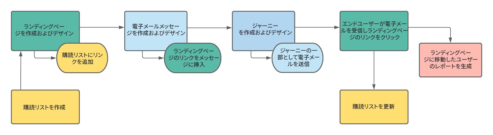

例えば、イベントを来月整理し、イベント登録キャンペーンを開始するとします<!--to keep your customers that are interested updated on that event-->. これをおこなうには、受信者がこのイベントに登録できるようにするランディングページへのリンクを含む E メールを送信します。 登録したユーザーは、この目的で作成した購読リストに追加されます。

### ランディングページの設定

1. イベント登録の購読リストを作成します。このリストには、登録済みユーザーが格納されます。 購読リストの作成方法を説明します [ここ](subscription-list.md#define-subscription-list).

   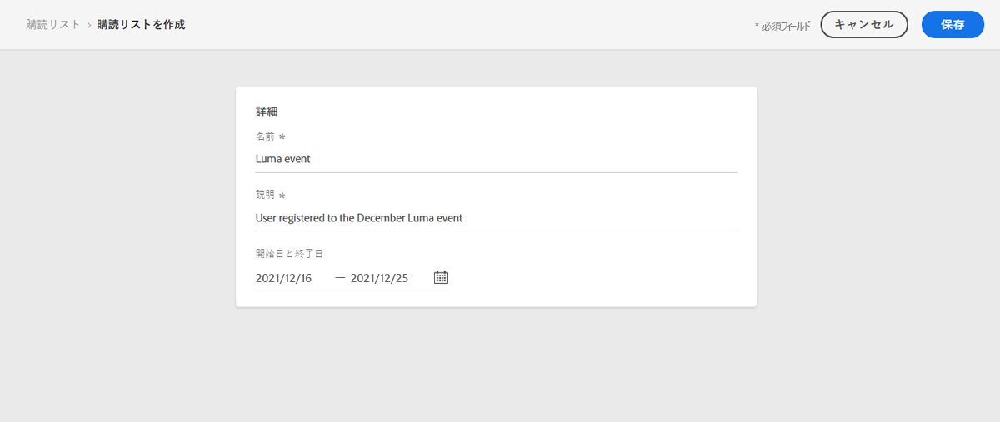

1. [ランディングページの作成](create-lp.md) をクリックして、受信者がイベントに登録できるようにします。

1. 登録の設定 [プライマリランディングページ](create-lp.md#configure-primary-page).

1. を設計する際に [ランディングページコンテンツ](design-lp.md)「 」で、作成した購読リストを選択し、「登録」チェックボックスをオンにしたプロファイルで更新します。

   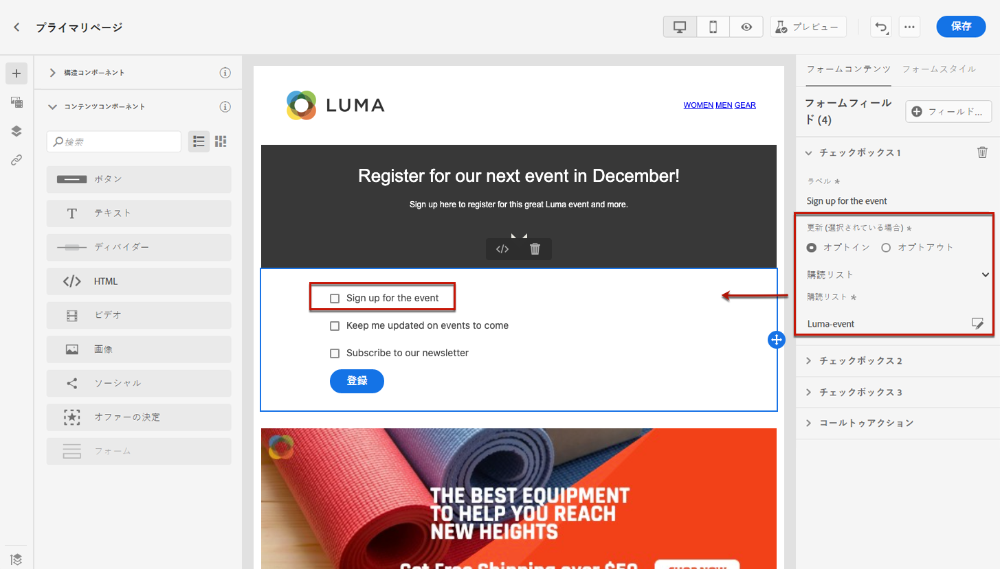

1. 受信者が登録フォームを送信すると、受信者に表示される「ありがとうございました」ページを作成します。 ランディングサブページの設定方法を説明します [ここ](create-lp.md#configure-subpages).

   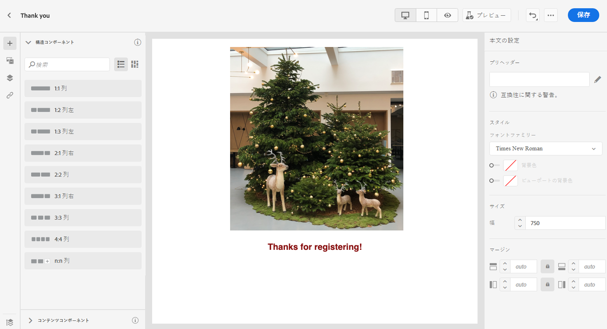

1. [公開](create-lp.md#publish) ランディングページ

1. [電子メールメッセージの作成](../create-message.md) イベントの登録が開始されました。

1. [リンクを挿入](../message-tracking.md#insert-links) をメッセージコンテンツに追加します。 選択 **[!UICONTROL ランディングページ]** を **[!UICONTROL リンクタイプ]** を選択し、 [ランディングページ](create-lp.md#configure-primary-page) 登録用に作成した

   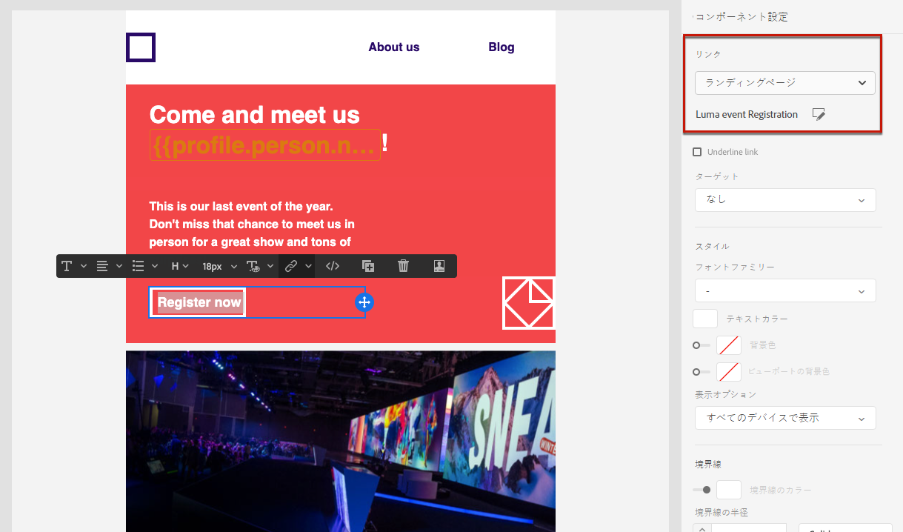

1. コンテンツを保存し、[メッセージを公開](../publish-manage-message.md)します。

1. 次を通じてメッセージを送信： [ジャーニー](../building-journeys/journey.md) をクリックして、登録ランディングページにトラフィックを誘導します。

   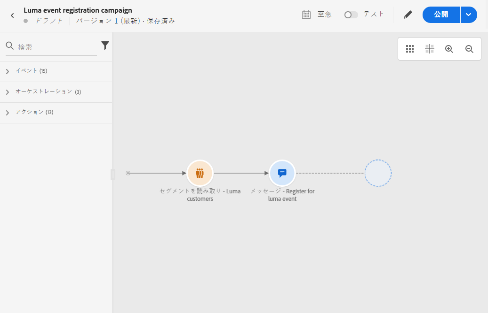

   受信者が E メールを受け取ると、ランディングページへのリンクをクリックすると、「ありがとうございました」ページに移動し、購読リストに追加されます。

### 確認 E メールを送信 {#send-confirmation-email}

また、イベントに登録した受信者に確認 E メールを送信することもできます。 それには、次の手順に従います。

1. 別の [ジャーニー](../building-journeys/journey.md). ランディングページで **[!UICONTROL ジャーニーを作成]** 」ボタンをクリックします。 詳細情報 [ここ](create-lp.md#configure-primary-page)

   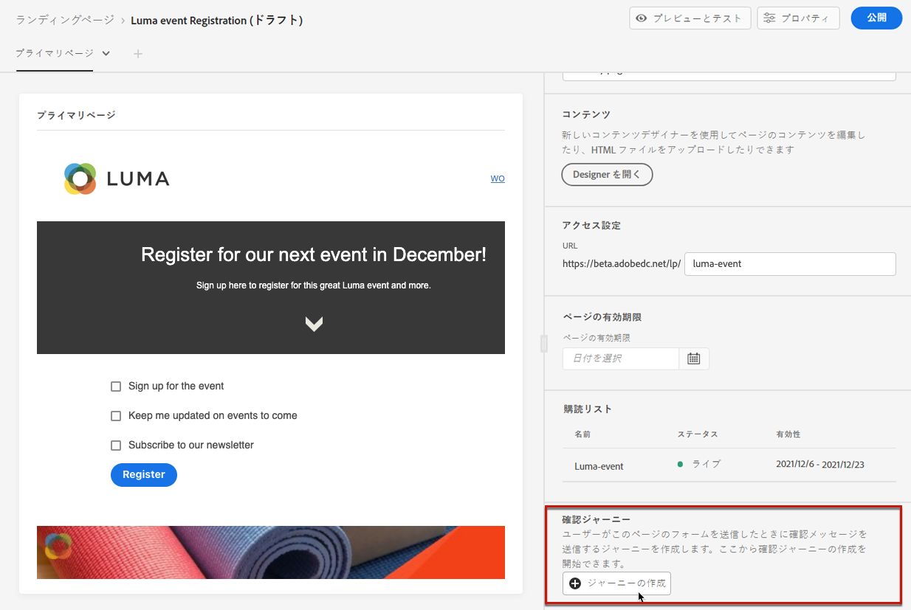

1. **[!UICONTROL イベント]**&#x200B;カテゴリを展開し、「**[!UICONTROL セグメントを選定]**」アクティビティをキャンバスにドロップします。詳細情報 [ここ](../building-journeys/segment-qualification-events.md)

1. をクリックします。 **[!UICONTROL セグメント]** 「 」フィールドで、作成した購読リストを選択します。

   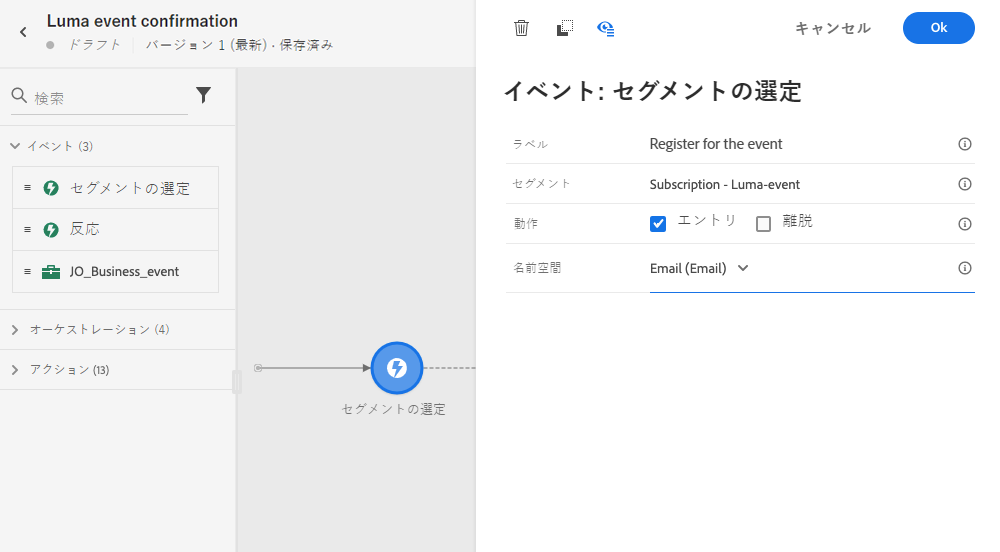

1. 選択した確認 E メールを選択し、ジャーニーを通じて送信します。

   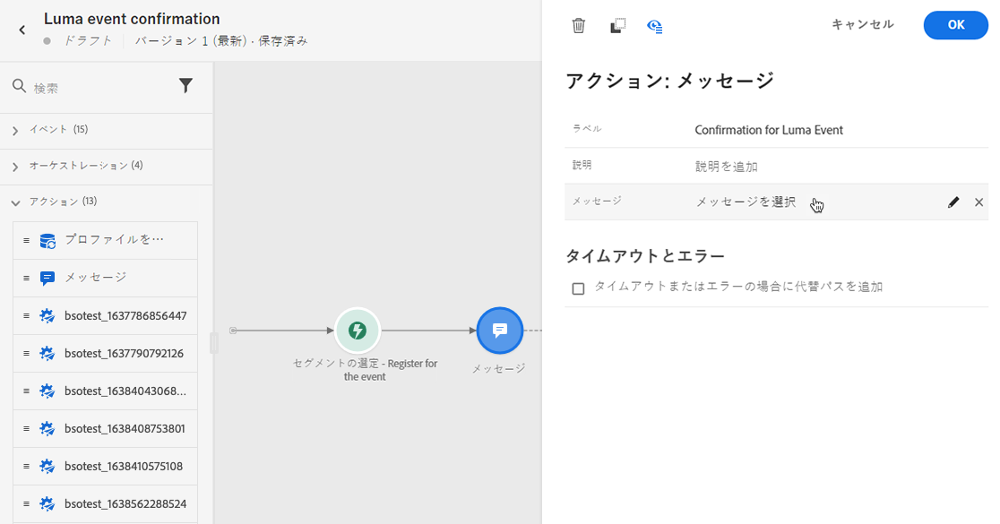

イベントに登録したすべてのユーザーに確認メールが送信されます。

<!--The event registration's subscription list tracks the profiles who registered and you can send them targeted event updates.-->

## オプトアウト {#opt-out}

受信者がコミュニケーションを購読解除できるようにするには、オプトアウトランディングページへのリンクを E メールに含めます。

受信者の同意の管理と、これが重要な理由について詳しくは、 [この節](../consent.md).

### オプトアウト管理 {#opt-out-management}

ブランドからの連絡を購読解除する機能を受信者に提供することは、法的要件です。適用される法律について詳しくは、[Experience Platform のドキュメント](https://experienceleague.adobe.com/docs/experience-platform/privacy/regulations/overview.html?lang=ja#regulations){target=&quot;_blank&quot;}を参照してください。

したがって、受信者に送信されるすべての メールに、**登録解除リンク**&#x200B;を必ず含める必要があります。

* 受信者がこのリンクをクリックすると、オプトアウトを確認するボタンを含んだランディングページが表示されます。
* オプトアウトボタンをクリックすると、プロファイルデータがこの情報で更新されます。

### オプトアウトの設定 {#configure-opt-out}

E メールの受信者がランディングページを通じてコミュニケーションを購読解除できるようにするには、次の手順に従います。

1. ランディングページを作成します。 [詳細情報](create-lp.md)

1. プライマリページを定義します。 [詳細情報](create-lp.md#configure-primary-page)

1. [デザイン](design-lp.md) プライマリページコンテンツ：ランディングページ固有のを使用 **[!UICONTROL フォーム]** コンポーネント、定義 **[!UICONTROL オプトアウト]** チェックボックスをオンにして更新を選択 **[!UICONTROL チャネル（E メール）]**:ランディングページのオプトアウトボックスをチェックするプロファイルは、すべてのコミュニケーションからオプトアウトされます。

   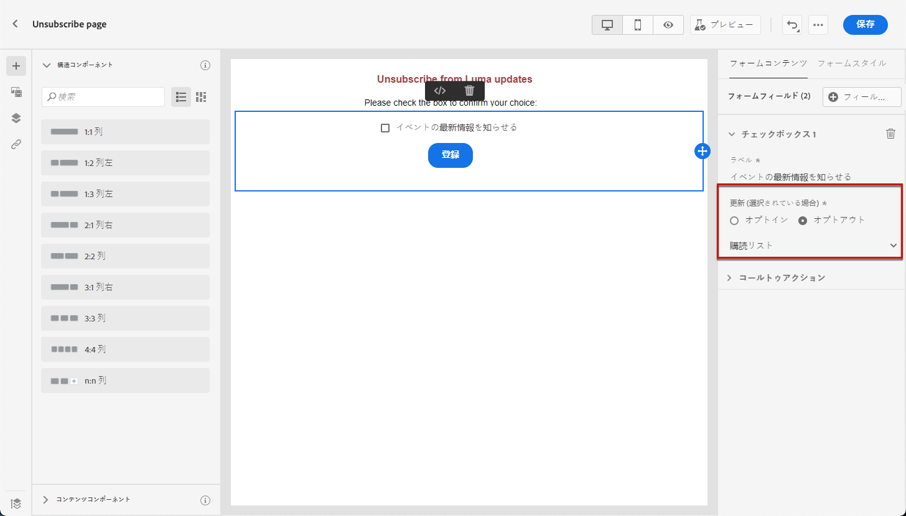

   <!--You can also build your own landing page and host it on the third-party system of your choice. To keep?-->

1. 確認を追加 [サブページ](create-lp.md#configure-subpages) フォームを送信するユーザーに表示されます。

   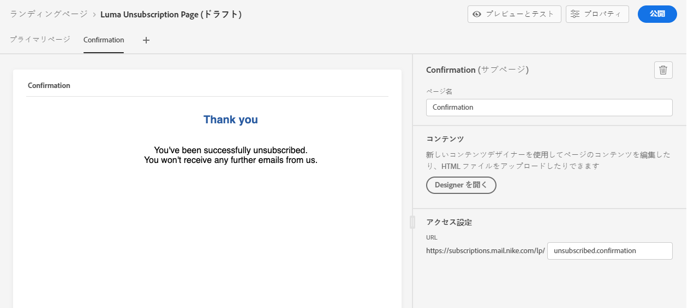

   >[!NOTE]
   >
   >必ずプライマリページの **[!UICONTROL コールトゥアクション]** セクション **[!UICONTROL フォーム]** コンポーネント。 [詳細情報](design-lp.md)

1. ページのコンテンツを設定して定義したら、 [公開](create-lp.md#publish) ランディングページ

   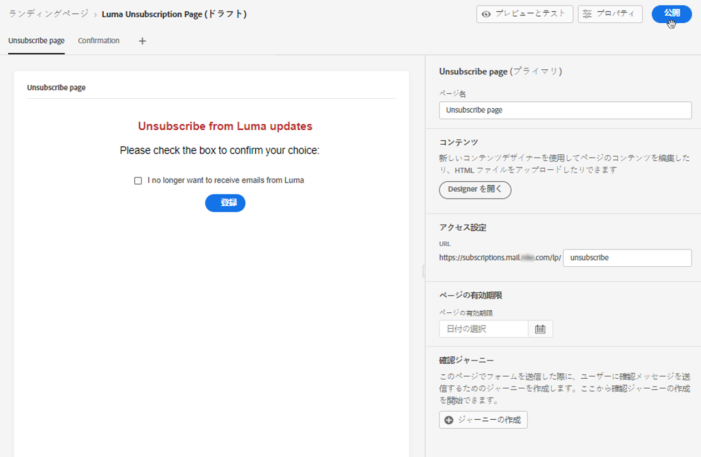

1. [電子メールメッセージの作成](../create-message.md) in [!DNL Journey Optimizer].

1. コンテンツ内のテキストを選択し、 [リンクを挿入](../message-tracking.md#insert-links) コンテキストツールバーを使用する。 ボタンにリンクを使用することもできます。

   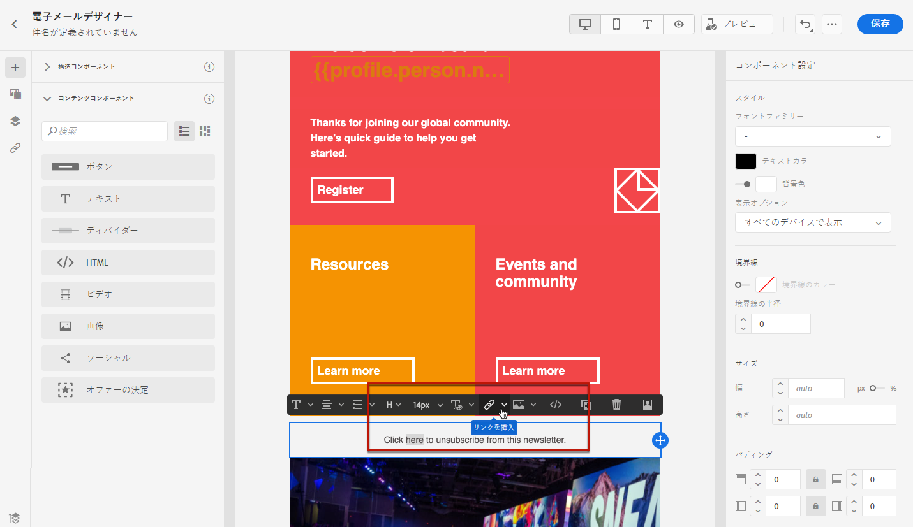

1. 選択 **[!UICONTROL ランディングページ]** から **[!UICONTROL リンクタイプ]** ドロップダウンリストから、 [ランディングページ](create-lp.md#configure-primary-page) オプトアウト用に作成した

   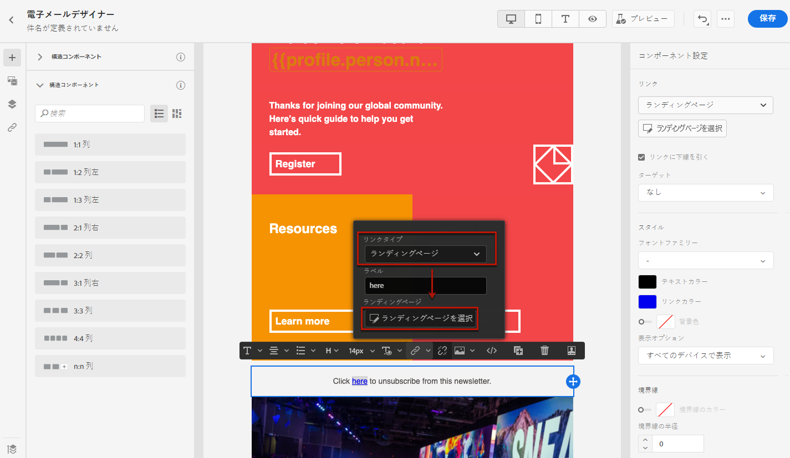

1. コンテンツを保存し、[メッセージを公開](../publish-manage-message.md)します。

1. ジャーニーを通じてメッセージを送信します。 [詳細情報](../building-journeys/journey.md)。

1. メッセージを受け取ると、受信者が E メールの購読解除リンクをクリックすると、ランディングページが表示されます。

   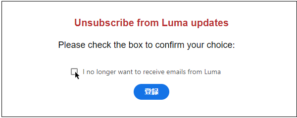

   受信者がボックスをオンにしてフォームを送信した場合：

   * オプトアウトした受信者は、確認メッセージ画面にリダイレクトされます。

   * プロファイルデータは更新され、再度購読しない限り、ブランドからの通信は受信されません。

対応するプロファイルの選択が更新されたことを確認するには、Experience Platform に移動し、ID 名前空間と対応する ID 値を選択してプロファイルにアクセスします。詳しくは、[Experience Platform のドキュメント](https://experienceleague.adobe.com/docs/experience-platform/profile/ui/user-guide.html?lang=ja#getting-started){target=&quot;_blank&quot;}を参照してください。

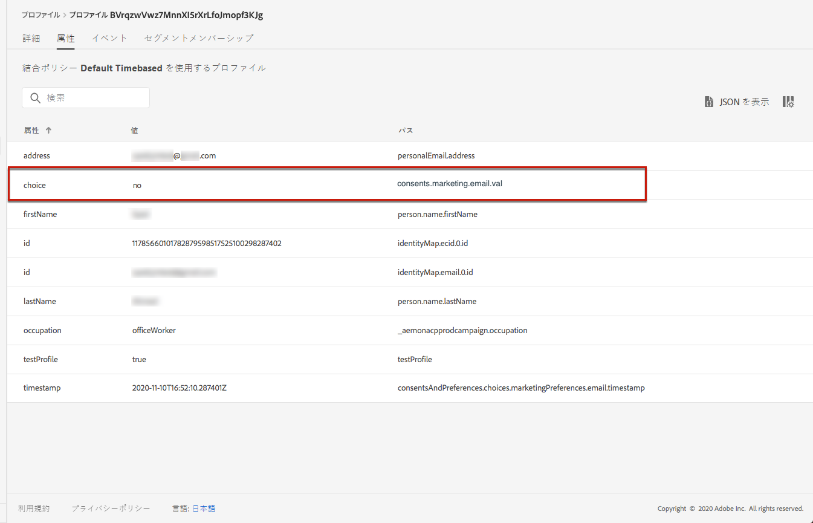

「**[!UICONTROL 属性]**」タブで、**[!UICONTROL choice]** の値が **[!UICONTROL no]** に変更されたことを確認できます。

<!--

### Other ways to opt out

You can also enable your recipients to unsubscribe whithout using landing pages.

* **One-click opt-out**

    You can add a one-click opt-out link into your email content. This will enable your recipients to quickly unsubscribe from your communications, without being redirected to a landing page where they need to confirm opting out. [Learn more](../message-tracking.md#one-click-opt-out-link)

* **Unsubscribe link in header**

    If the recipients' email client supports displaying an unsubscribe link in the email header, emails sent with [!DNL Journey Optimizer] automatically include this link. [Learn more](../consent.md#unsubscribe-email)
-->
