# ランディングページのユースケース {#lp-use-cases}

次に、[!DNL Journey Optimizer]のランディングページを使用して、顧客がコミュニケーションの一部または全部の受信をオプトイン/オプトアウトできるようにする方法の例を示します。

## サービスの購読 {#subscription-to-a-service}

最も一般的なユースケースの1つは、ランディングページを通じて顧客を[ サービス ](subscription-list.md) （ニュースレターやイベントなど）に登録するように招待することです。 主な手順は、次のグラフに示されています。

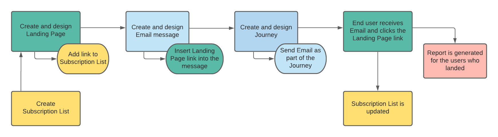

例えば、来月にイベントを開催し、イベント登録キャンペーン <!--to keep your customers that are interested updated on that event-->を開始したいとします。 これを行うには、受信者がこのイベントに登録できるようにするランディングページへのリンクを含むメールを送信します。 登録したユーザーは、この目的のために作成した購読リストに追加されます。

### ランディングページの設定 {#set-up-lp}

イベント登録用のランディングページを設定するには、購読リストを作成し、登録フォームを使用してランディングページをデザインし、必要なページと設定を設定します。 次の手順に従います。

1. イベント登録の購読リストを作成し、登録ユーザーを保存します。 購読リスト [ここ](subscription-list.md#define-subscription-list)を作成する方法を説明します。

   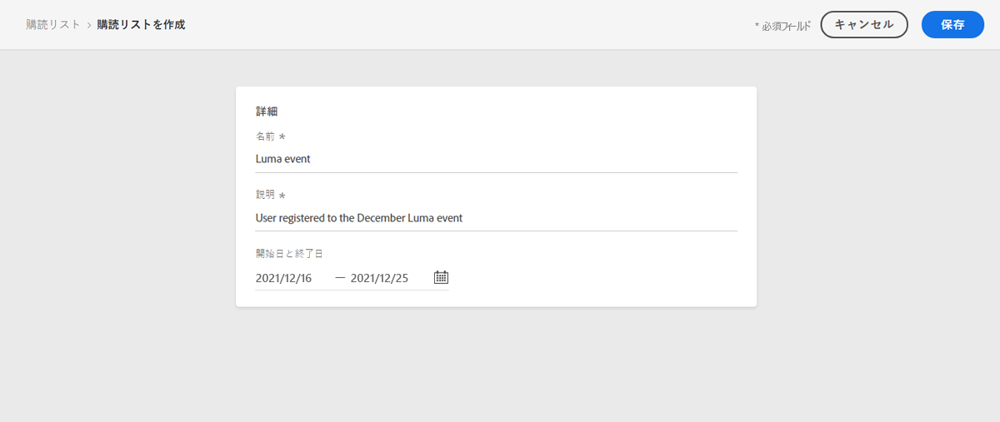

1. [ ランディングページ ](create-lp.md)を作成して、受信者がイベントに登録できるようにします。

   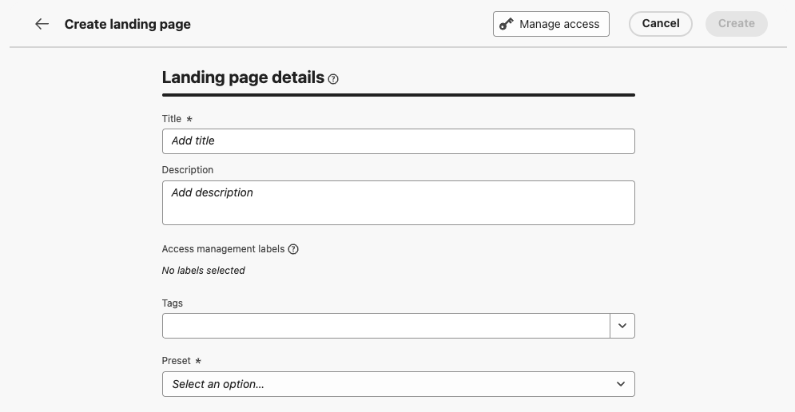

1. 登録[ プライマリランディングページ ](create-lp.md#configure-primary-page)を設定します。

1. [ ランディングページのコンテンツ ](design-lp.md)をデザインするときは、作成した購読リストを選択して、登録チェックボックスを選択したプロファイルで更新します。

   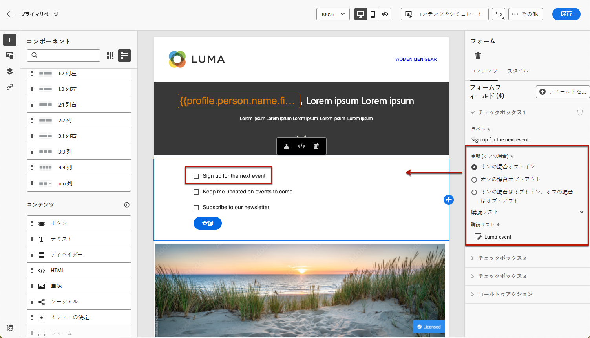

1. 受信者が登録フォームを送信すると、受信者に表示される「ありがとうございます」ページを作成します。 ランディングサブページ [ここ](create-lp.md#configure-subpages)を設定する方法について説明します。

   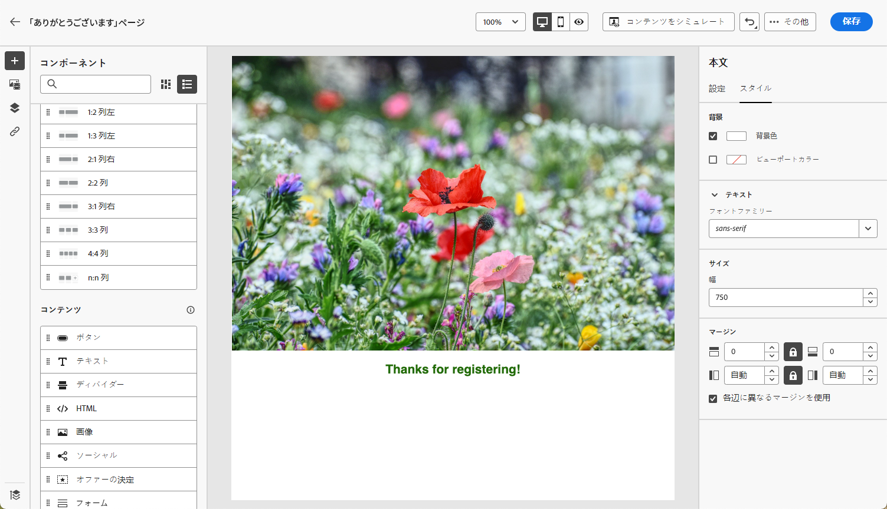

1. ランディングページを[公開](create-lp.md#publish-landing-page)します。

1. [ ジャーニー](../building-journeys/journey.md)で、**電子メール** アクティビティを追加して、登録ランディングページへのトラフィックを促進します。

   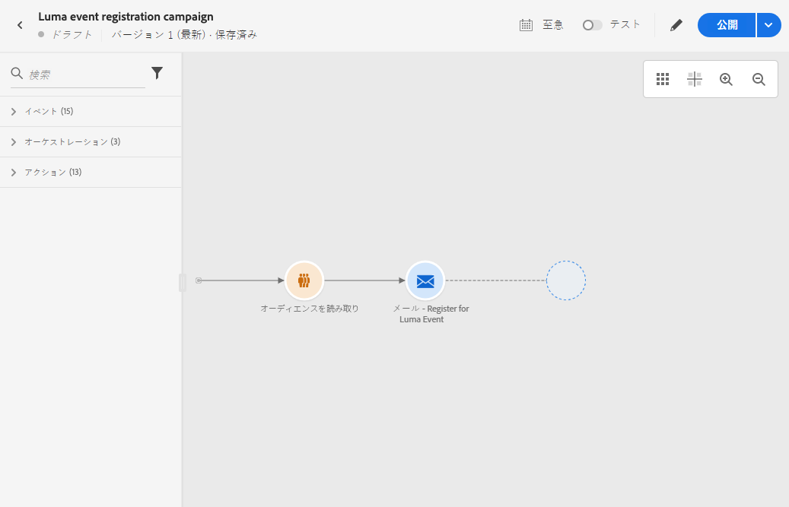

1. [電子メール ](../email/get-started-email-design.md)をデザインして、登録がイベントに対して開かれたことを知らせます。

1. [ メッセージコンテンツにリンク ](../email/message-tracking.md#insert-links)を挿入します。 **[!UICONTROL ランディングページ]**&#x200B;を&#x200B;**[!UICONTROL リンクタイプ]**&#x200B;として選択し、登録用に作成した[ ランディングページ ](create-lp.md#configure-primary-page)を選択します。

   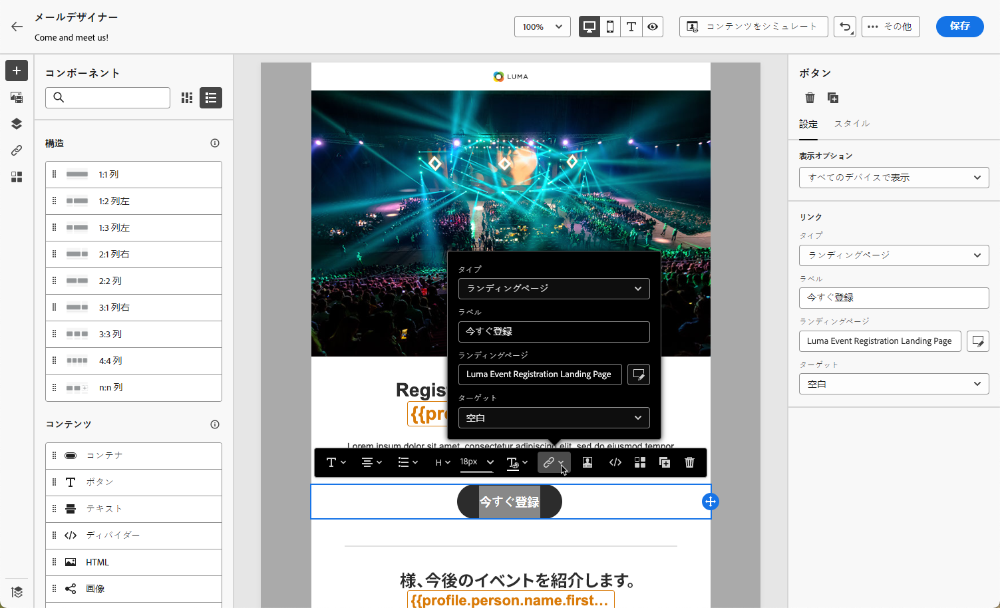

   >[!NOTE]
   >
   >メッセージを送信するには、選択したランディングページがまだ期限切れになっていないことを確認します。 有効期限[を更新する方法については、この節](create-lp.md#configure-primary-page)を参照してください。

   メールを受信した後、受信者がランディングページへのリンクをクリックすると、「ありがとうございます」ページに移動し、購読リストに追加されます。

### 確認メールを送信 {#send-confirmation-email}

さらに、イベントに登録した受信者に確認メールを送信することもできます。 これを行うには、次の手順に従います。

1. 別の[ ジャーニー](../building-journeys/journey.md)を作成します。 「**[!UICONTROL ジャーニーを作成]**」ボタンをクリックすると、ランディングページから直接実行できます。 [詳細情報](create-lp.md#configure-primary-page)

   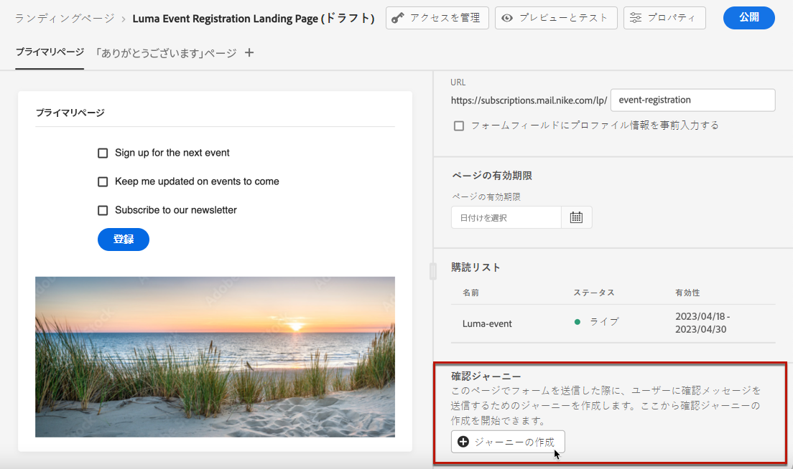

1. **[!UICONTROL イベント]** カテゴリを展開し、**[!UICONTROL オーディエンス選定]** アクティビティをキャンバスにドロップします。 [詳細情報](../building-journeys/audience-qualification-events.md)

1. 「**[!UICONTROL オーディエンス]**」フィールドをクリックし、作成したサブスクリプションリストを選択します。

   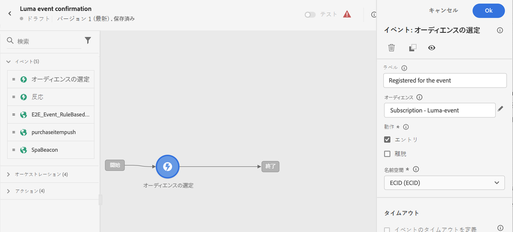

1. 選択した確認メールを追加し、ジャーニーを通じて送信します。

   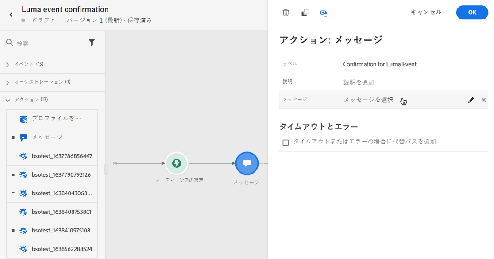

イベントに登録したすべてのユーザーには、確認メールが届きます。

<!--The event registration's subscription list tracks the profiles who registered and you can send them targeted event updates.-->

## オプトアウトランディングページ {#opt-out}

受信者がメール配信を登録解除できるようにするには、オプトアウトランディングページへのリンクをメールに含めることができます。

>[!NOTE]
>
>受信者の同意の管理と、これが重要である理由について、[この節](../privacy/opt-out.md)で詳しく説明します。

### オプトアウト管理 {#opt-out-management}

受信者に、ブランドからのコミュニケーションの受信を登録解除する機能を提供することは、法的要件です。 該当する法律について詳しくは、[Experience Platform ドキュメント ](https://experienceleague.adobe.com/docs/experience-platform/privacy/regulations/overview.html#regulations){target="_blank"}を参照してください。

したがって、受信者に送信されるすべての電子メールには、常に&#x200B;**登録解除リンク**&#x200B;を含める必要があります。

* このリンクをクリックすると、受信者はオプトアウトを確認するボタンを含むランディングページに誘導されます。
* オプトアウトボタンをクリックすると、プロファイルデータがこの情報で更新されます。

### メールオプトアウトの設定 {#configure-opt-out}

メールの受信者がランディングページを通じてメールの購読を解除できるようにするには、次の手順に従います。

1. ランディングページの制作。 [詳細情報](create-lp.md)

1. プライマリページを定義します。 [詳細情報](create-lp.md#configure-primary-page)

1. [ プライマリページのコンテンツをデザイン ](design-lp.md): ランディングページ固有の&#x200B;**[!UICONTROL フォーム]** コンポーネントを使用し、**[!UICONTROL オプトアウト]** チェックボックスを定義し、**[!UICONTROL チャネル（メール）]**&#x200B;を更新することを選択します。ランディングページのオプトアウトボックスをチェックするプロファイルは、すべてのコミュニケーションからオプトアウトされます。

   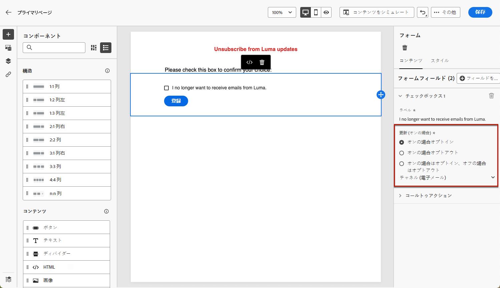

   <!--You can also build your own landing page and host it on the third-party system of your choice.-->

1. フォームを送信するユーザーに表示される確認[ サブページ ](create-lp.md#configure-subpages)を追加します。

   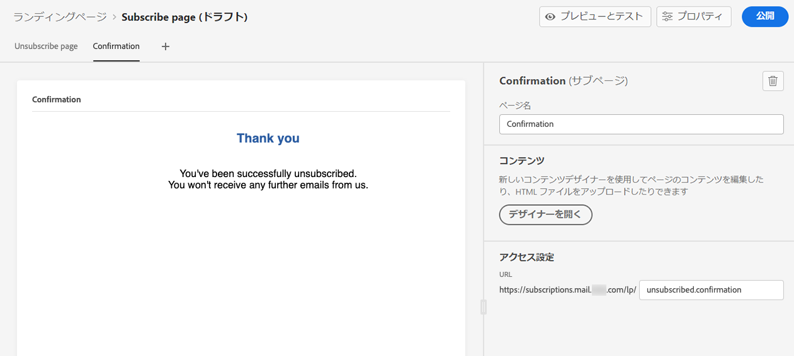

   >[!NOTE]
   >
   >**[!UICONTROL Form]** コンポーネントのプライマリページの&#x200B;**[!UICONTROL Call to action]** セクションにあるサブページを参照してください。 [詳細情報](design-lp.md)

1. ページのコンテンツを設定して定義したら、ランディングページを[公開](create-lp.md#publish-landing-page)します。

1. ジャーニーで[電子メールメッセージ ](../email/get-started-email-design.md)を作成します。

1. コンテンツ内のテキストを選択し、コンテキストツールバーを使用して[ リンクを挿入](../email/message-tracking.md#insert-links)します。 ボタンへのリンクも使用できます。

1. 「**[!UICONTROL リンクタイプ]**」ドロップダウンリストから「**[!UICONTROL ランディングページ]**」を選択し、オプトアウト用に作成した「[ ランディングページ ](create-lp.md#configure-primary-page)」を選択します。

   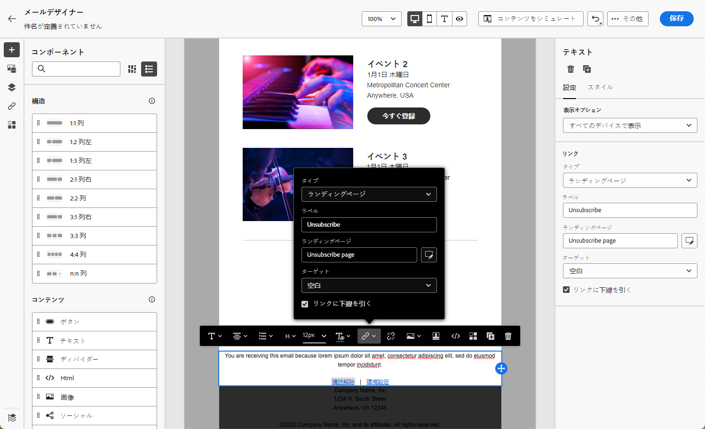

   >[!NOTE]
   >
   >メッセージを送信するには、選択したランディングページがまだ期限切れになっていないことを確認します。 有効期限[を更新する方法については、この節](create-lp.md#configure-primary-page)を参照してください。

1. ジャーニーを公開して実行します。 [詳細情報](../building-journeys/journey.md)。

1. メッセージを受信すると、受信者がメール内の登録解除リンクをクリックすると、ランディングページが表示されます。

   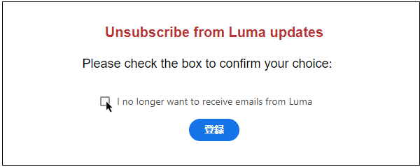

   >[!WARNING]
   >
   >メールの「購読解除」リンクをクリックすると、ランディングページのみが開きます。 受信者は、**ランディングページのオプトアウトボタンをクリックしてフォームを送信し、購読解除を完了してプロファイルの同意を更新する必要があります**。

   受信者がこのボックスにチェックを入れてフォームを送信した場合：

   * オプトアウトされた受信者は、確認メッセージ画面にリダイレクトされます。

   * プロファイルデータは更新され、再度購読しない限り、ブランドからのコミュニケーションは受け取りません。

対応するプロファイルの選択が更新されたことを確認するには、Experience Platformに移動し、ID名前空間と対応するID値を選択してプロファイルにアクセスします。 詳しくは、[Experience Platform ドキュメント ](https://experienceleague.adobe.com/docs/experience-platform/profile/ui/user-guide.html#getting-started){target="_blank"}を参照してください。

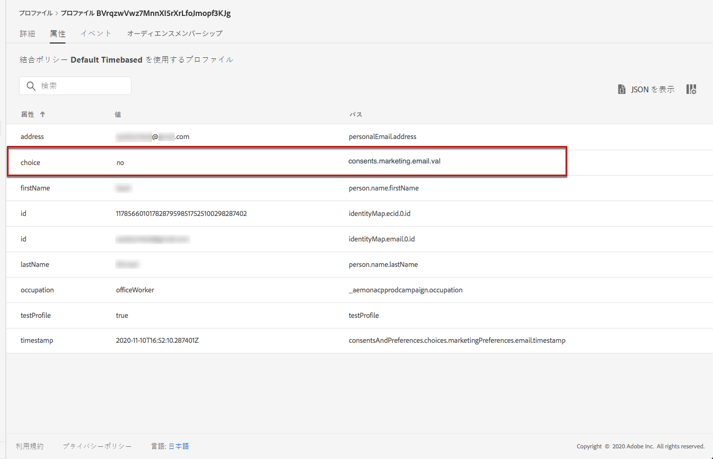

「**[!UICONTROL 属性]**」タブでは、**[!UICONTROL 選択肢]**&#x200B;の値が&#x200B;**[!UICONTROL no]**&#x200B;に変更されていることがわかります。

オプトアウト情報は、**同意サービスデータセット**&#x200B;に保存されます。 [ データセットの詳細](../data/get-started-datasets.md)

>[!NOTE]
>
>デフォルトの[Adobe Experience Platform](https://experienceleague.adobe.com/docs/experience-platform/profile/home.html){target="_blank"} **[!UICONTROL Profiles]**&#x200B;結合ポリシーの結合メソッドが&#x200B;**[!UICONTROL Dataset Precedence]**&#x200B;である場合は、**[!UICONTROL AJO Consent Service Dataset]**&#x200B;を有効にし、結合ポリシーで優先順位を付けてください。 [詳細情報](https://experienceleague.adobe.com/docs/experience-platform/profile/merge-policies/ui-guide.html#dataset-precedence-profile){target="_blank"}
>
>このデータセットにバッチが追加されていない場合でも、オプトイン/オプトアウト情報が含まれます。

**関連項目：**

* [ワンクリックのオプトアウト](../email/email-opt-out.md#one-click-opt-out)
* [メールヘッダーのオプトアウトリンク](../email/email-opt-out.md#unsubscribe-header)

<!--
### Other ways to opt out

You can also enable your recipients to unsubscribe whithout using landing pages.

* **One-click opt-out**

    You can add a one-click opt-out link into your email content. This will enable your recipients to quickly unsubscribe from your communications, without being redirected to a landing page where they need to confirm opting out. [Learn more](../privacy/opt-out.md#opt-out-personalization)

* **Unsubscribe link in header**

    If the recipients' email client supports displaying an unsubscribe link in the email header, emails sent with [!DNL Journey Optimizer] automatically include this link. [Learn more](../email/email-opt-out.md#unsubscribe-header)
-->

## ランディングページ提出イベントを活用する {#leverage-lp-event}

ランディングページで送信された情報を使用して、さらにアクションを実行できます。 例えば、ユーザーが特定の購読リストに登録している場合、その情報を活用して、そのユーザーに他の購読リストを推奨するメールを送信できます。

これを行うには、送信情報を含む&#x200B;**[!UICONTROL AJO メールトラッキングエクスペリエンスイベントスキーマ]**&#x200B;に基づいて[ ルールベースの単一イベント ](../event/about-creating.md)を作成し、ジャーニー](../building-journeys/general-events.md)でこのイベントを[使用する必要があります。

>[!NOTE]
>
>ランディングページ送信イベントを操作する際は、イベント `interactionType` フィールドが特定のユーザーのアクションを正確に反映しない場合があることに注意してください。 ユーザーがオプトアウト、購読、または別のアクションを実行したかどうかを正確に判断するには、イベント `interactionType`のみに依存するのではなく、実際のプロファイル属性（同意の環境設定など）またはフォームフィールド値を常に検証します。

<!--
DETAILED STEPS TBC:

Follow the steps below.

1. Go to **[!UICONTROL Administration]** > **[!UICONTROL Configurations]**, and in the **[!UICONTROL Events]** section, select **[!UICONTROL Manage]**.

    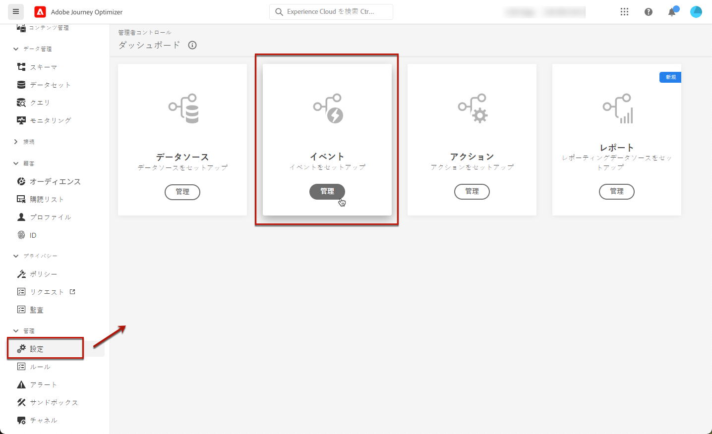

1. The list of events displays. Select **[!UICONTROL Create Event]**.

    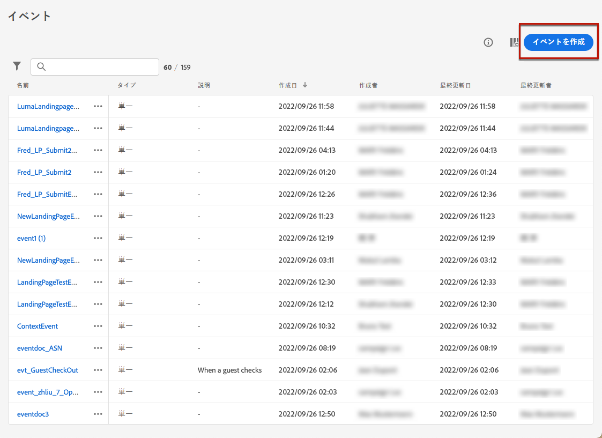

1. The event configuration pane opens on the right side of the screen. Configure a rule-based unitary event. [Learn more](../event/about-creating.md)

1. Define the schema: select **[!UICONTROL AJO Email Tracking Experience Event Schema v.1]** (available by default in [!DNL Journey Optimizer]).

    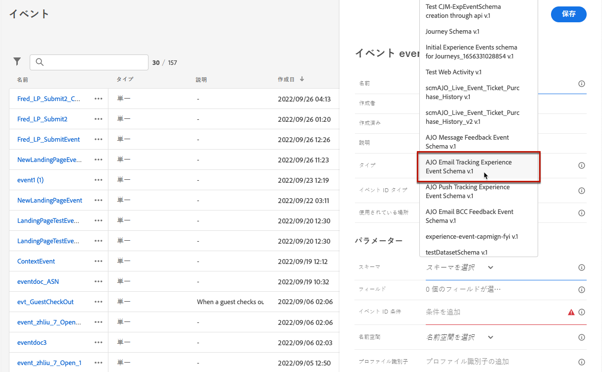

1. In the **[!UICONTROL Fields]** section, select the following elements:

    * **[!UICONTROL _experience]** > **[!UICONTROL customerJourneyManagement]** > **[!UICONTROL messageInteraction]** > **[!UICONTROL Interaction Type]**
    
    * **[!UICONTROL _experience]** > **[!UICONTROL customerJourneyManagement]** > **[!UICONTROL messageInteraction]** > **[!UICONTROL Landing Page Details]** > **[!UICONTROL Landing Page ID]**

    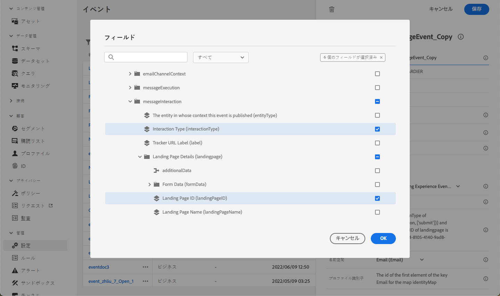

1. Click inside the **[!UICONTROL Event ID condition]** field. Using the simple personalization editor, define the condition for the **[!UICONTROL Interaction Type]** and **[!UICONTROL Landing Page ID]** fields. This will be used by the system to identify the events that will trigger your journey.

    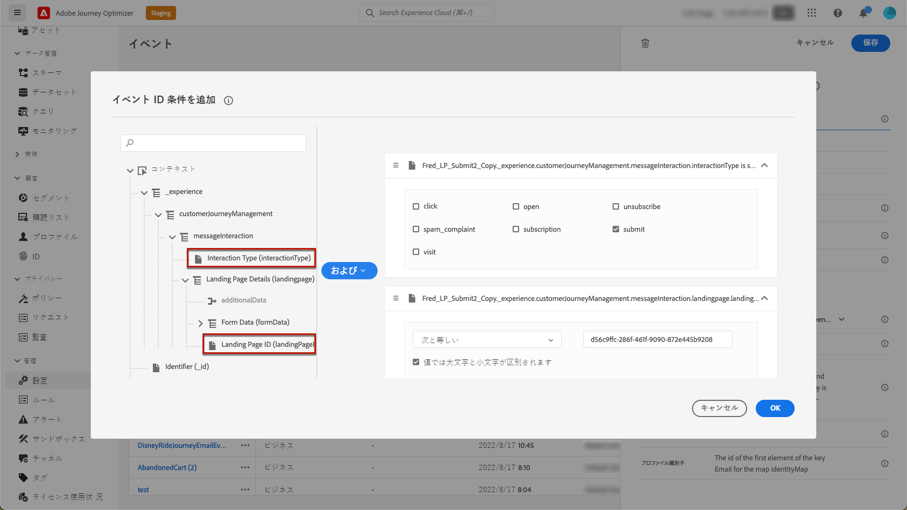

    >[!NOTE]
    >
    >To find the landing page ID, you can insert the landing page as a link into an email and select the source code from the contextual toolbar to display the landing page information.
    >
    >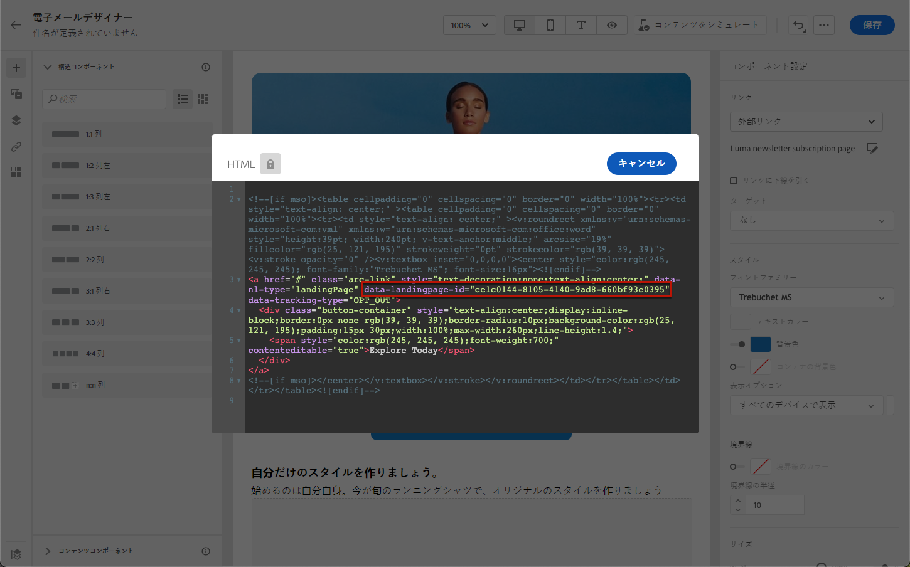

1. Save your changes.

1. Create a [journey](../building-journeys/journey.md). You can do it directly from the landing page by clicking the **[!UICONTROL Create journey]** button. Learn more [here](create-lp.md#configure-primary-page)

    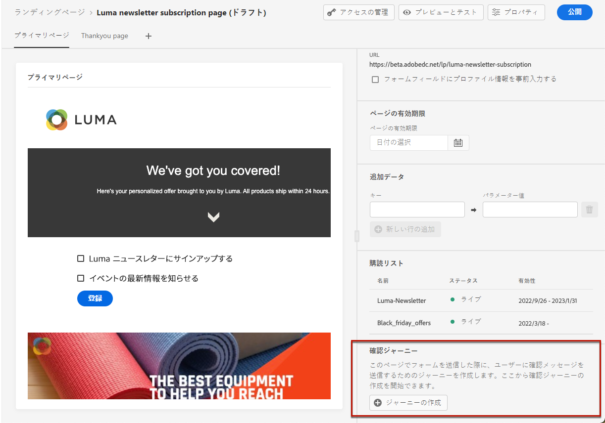

1. In the journey, unfold the **[!UICONTROL Events]** category and drop the event that you created into the canvas. Learn more [here](../building-journeys/audience-qualification-events.md)

    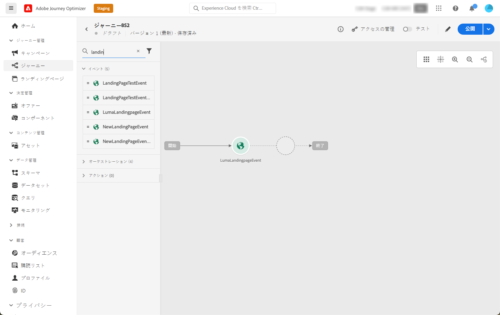

1. Unfold the **[!UICONTROL Actions]** category and drop an email action into the canvas.

    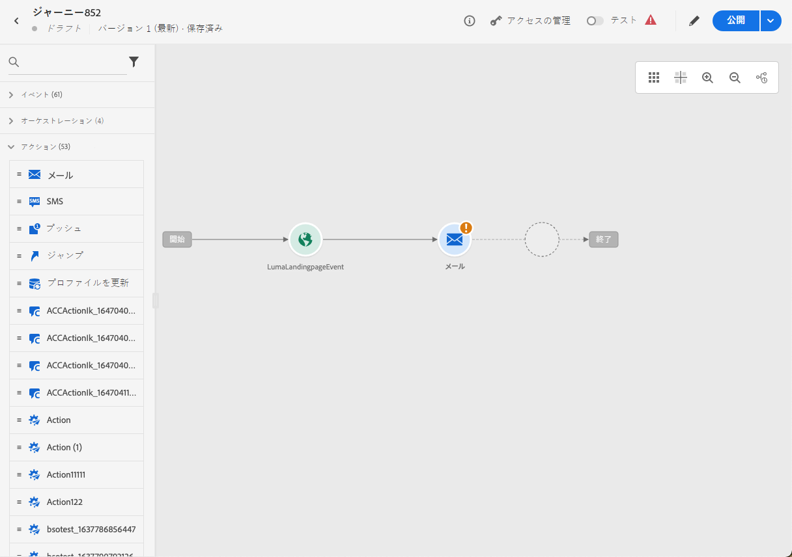

///How do you use the information from the event to send an email to the users? 
-->
