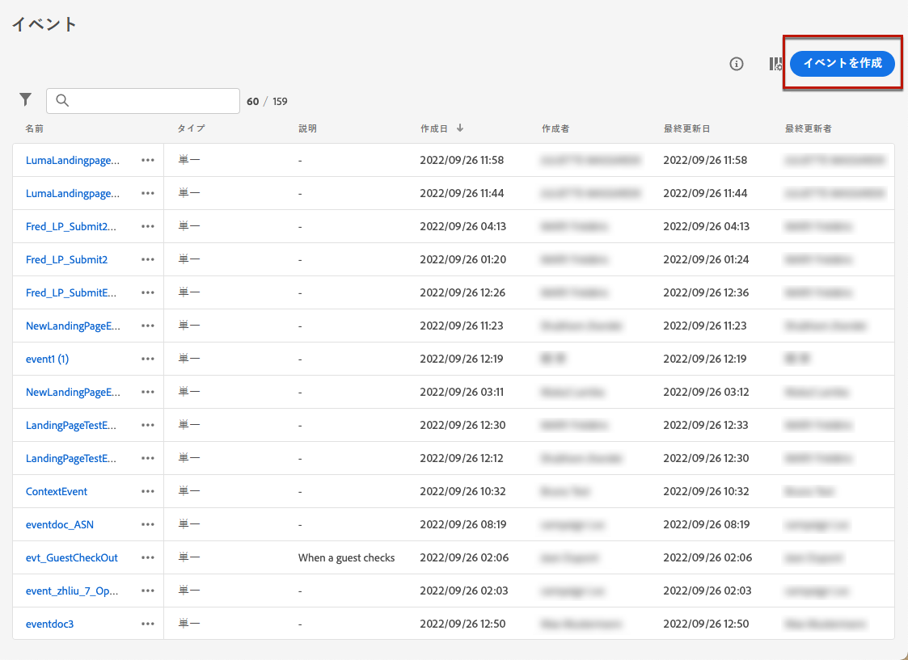

# ランディングページの使用例 {#lp-use-cases}

次の例では、ランディングページを使用 [!DNL Journey Optimizer] して、お客様が通信の一部または全部を受けられるように設定する方法を示します。

## サービスに対するサブスクリプション {#subscription-to-a-service}

最も一般的な用途の1つは、ランディングページを使用して、ニュースレターやイベントなどのサービス ](subscription-list.md) を提供するためのユーザーへの参加を要請する [ ことです。次の図に、主な手順を示します。

例えば、来月にイベントを整理し、イベント登録キャンペーン <!--to keep your customers that are interested updated on that event--> を起動するとします。 これを行うには、ジャンプ先のページへのリンクを含む電子メールを送信します。これにより、受信者はこのイベントに登録することができます。 登録したユーザーは、この目的で作成した購読リストに追加されます。

### ランディングページの設定 {#set-up-lp}

1. 登録されたユーザーを格納するイベント登録のサブスクリプション一覧を作成します。 ここで ](subscription-list.md#define-subscription-list) は、購読リスト [ を作成する方法を説明しています。

   

1. [送付状 ](create-lp.md) を作成して、受信者がイベントに登録できるようにします。

   

1. 「登録 [ 第1踊り場」ページ ](create-lp.md#configure-primary-page) を設定します。

1. ランディングページの [ コンテンツ ](design-lp.md) をデザインするときに、登録チェックボックスを選択したプロファイルで更新するために作成したサブスクリプションリストを選択します。

   

1. 登録フォームを送信したときに表示される「お礼」ページを作成します。 ここでは ](create-lp.md#configure-subpages) 、ランディングサブページ [ の設定方法について説明します。

   

1. [ランディングページをパブリッシュ ](create-lp.md#publish) します。

1. [このフライト ](../building-journeys/journey.md) では、電子メール **の操作を行って、トラフィックを登録ランディングページに追加** します。

   

1. [イベントに対して登録が開かれたことを示すために、電子メール ](../email/get-started-email-design.md) をデザインします。

1. [メッセージコンテンツへのリンク ](../email/message-tracking.md#insert-links) を挿入します。 「As **[!UICONTROL Link type]** 」を選択 **[!UICONTROL Landing page]** し、登録用に作成したランディングページ ](create-lp.md#configure-primary-page) を選択 [ します。

   

   >[!NOTE]
   >
   >メッセージを送信するには、選択したランディングページが期限切れになっていないことを確認してください。 ここでは、このセクション ](create-lp.md#configure-primary-page) の有効 [ 期限を更新する方法について説明します。

   電子メールが受信されると、受信者がランディングページへのリンクをクリックすると、そのリンクが「お礼」ページに送られ、購読リストに追加されます。

### 確認の電子メールを送信する {#send-confirmation-email}

さらに、イベントに登録した受信者に確認の電子メールを送信することもできます。 そのためには、次の手順を実行します。

1. 別の [ 旅 ](../building-journeys/journey.md) を作成します。 ボタンをクリック **[!UICONTROL Create journey]** して、ランディングページから直接これを行うことができます。 詳しく [ は、こちらを参照してください。](create-lp.md#configure-primary-page)

   

1. **[!UICONTROL Events]**&#x200B;カテゴリを展開し、キャンバスにアクティビティを **[!UICONTROL Segment Qualification]** ドロップします。詳しく [ は、こちらを参照してください。](../building-journeys/segment-qualification-events.md)

1. **[!UICONTROL Segment]**&#x200B;フィールドをクリックして、作成したサブスクリプションリストを選択します。

   

1. 確認の電子メールを追加し、その過程で送信します。

   

イベントに対して登録したすべてのユーザーが、確認の電子メールを送信します。

<!--The event registration's subscription list tracks the profiles who registered and you can send them targeted event updates.-->

## オプトアウト {#opt-out}

受信者が通信を中止できるようにするには、脱退用のランディングページへのリンクを電子メールに含めることができます。

このセクション ](../privacy/opt-out.md) で [ は、宛先の同意を管理する方法と、これが重要な理由について詳しく説明します。

### オプトアウト管理 {#opt-out-management}

ブランドからの配信を受信中止するために受信者に送信する機能を提供することは、法律上の要件です。 経験プラットフォームのマニュアル ](https://experienceleague.adobe.com/docs/experience-platform/privacy/regulations/overview.html#regulations) に記載 [ されている法律について詳しくは、target = &quot;_blank&quot;} を参照してください。

そのため、宛先に送信されるすべての電子メールには、購読中止のリンク **を必ず含める** 必要があります。

* このリンクをクリックすると、受信を確認するためのボタンなどのランディングページが表示されます。
* 「脱退」ボタンをクリックすると、プロファイルデータがこの情報に基づいて更新されます。

### オプトアウトの設定 {#configure-opt-out}

ランディングページを使用して、電子メールの受信者が通信を中止できるようにするには、次の手順を実行します。

1. ランディングページを作成します。 [詳細情報](create-lp.md)

1. プライマリページを定義します。 [詳細情報](create-lp.md#configure-primary-page)

1. [プライマリページのコンテンツをデザイン ](design-lp.md) します。ランディングページ特有 **[!UICONTROL Form]** のコンポーネントを使用し、チェックボックスを定義 **[!UICONTROL Opt-out]** して、更新 **[!UICONTROL Channel (email)]** するかどうかを選択します。ランディングページの脱退ボックスをチェックするプロファイルは、すべての通信からオプトアウトされます。

   

   <!--You can also build your own landing page and host it on the third-party system of your choice.-->

1. フォームを送信するユーザーに表示される確認 [ サブページ ](create-lp.md#configure-subpages) を追加します。

   

   >[!NOTE]
   >
   >コンポーネントの **[!UICONTROL Form]** メインページの **[!UICONTROL Call to action]** セクションでサブページを参照していることを確認してください。[詳細情報](design-lp.md)

1. ページのコンテンツを設定して定義したら、ランディングページを [ パブリッシュ ](create-lp.md#publish) します。

   

1. [フライト中に電子メールメッセージ ](../email/get-started-email-design.md) を作成することができます。

1. コンテンツ [ 内のテキストを選択し、状況に応じたツールバーを使用してリンク ](../email/message-tracking.md#insert-links) を挿入します。 ボタン上のリンクを使用することもできます。

   

1. **[!UICONTROL Landing page]**&#x200B;ドロップダウンリストから **[!UICONTROL Link type]** 、オプトアウト用に作成したランディングページ ](create-lp.md#configure-primary-page) を選択 [ します。

   

   >[!NOTE]
   >
   >メッセージを送信するには、選択したランディングページが期限切れになっていないことを確認してください。 ここでは、このセクション ](create-lp.md#configure-primary-page) の有効 [ 期限を更新する方法について説明します。

1. このような旅をパブリッシュして実行します。 [詳しく ](../building-journeys/journey.md) は、こちらを参照してください。

1. メッセージが受信されると、受信者が電子メールの購読中止のリンクをクリックすると、そのジャンプ先のページが表示されます。

   

   受信者がボックスを確認し、フォームを送信した場合は、次のようになります。

   * 脱退した受信者は、確認メッセージ画面にリダイレクトされます。

   * プロファイルデータは更新されており、再購読されていない限り、そのブランドからの通信は受信されません。

適切なプロファイルの選択内容が更新されたことを確認するには、「経験のあるプラットフォーム」に移動して、id 名前空間とそれに対応する id 値を選択し、プロファイルにアクセスしてください。 詳細については、操作プラットフォームのマニュアル ](https://experienceleague.adobe.com/docs/experience-platform/profile/ui/user-guide.html#getting-started) {target = &quot;_blank&quot;} を参照して [ ください。

**[!UICONTROL Attributes]**&#x200B;タブでは、の「」の **[!UICONTROL choice]** 値が「に **[!UICONTROL no]** 変更されました」と表示されています。

<!--

### Other ways to opt out

You can also enable your recipients to unsubscribe whithout using landing pages.

* **One-click opt-out**

    You can add a one-click opt-out link into your email content. This will enable your recipients to quickly unsubscribe from your communications, without being redirected to a landing page where they need to confirm opting out. [Learn more](../privacy/opt-out.md#one-click-opt-out-link)

* **Unsubscribe link in header**

    If the recipients' email client supports displaying an unsubscribe link in the email header, emails sent with [!DNL Journey Optimizer] automatically include this link. [Learn more](../privacy/opt-out.md#unsubscribe-header)

////////

## Leverage landing page submission event {#leverage-lp-event}

You can use information that was submitted on a landing page to send communications to your customers. For example, if a user subscribes to a given subscription list, you can leverage that information to send an email recommending other subscription lists to that user.

To do this, you need to create an event containing the landing page submission information and use it in a journey. Follow the steps below.

1. Go to **[!UICONTROL Administration]** > **[!UICONTROL Configurations]**, and in the **[!UICONTROL Events]** section, select **[!UICONTROL Manage]**.

    

1. The list of events displays. Select **[!UICONTROL Create Event]**.

    

1. The event configuration pane opens on the right side of the screen. Configure a rule-based unitary event. [Learn more](../event/about-creating.md)

1. Define the schema: select **[!UICONTROL AJO Email Tracking Experience Event Schema v.1]** (available by default in [!DNL Journey Optimizer]).

    

1. In the **[!UICONTROL Fields]** section, select the following elements:

    * **[!UICONTROL _experience]** > **[!UICONTROL customerJourneyManagement]** > **[!UICONTROL messageInteraction]** > **[!UICONTROL Interaction Type]**
    
    * **[!UICONTROL _experience]** > **[!UICONTROL customerJourneyManagement]** > **[!UICONTROL messageInteraction]** > **[!UICONTROL Landing Page Details]** > **[!UICONTROL Landing Page ID]**

    

1. Click inside the **[!UICONTROL Event ID condition]** field. Using the simple expression editor, define the condition for the **[!UICONTROL Interaction Type]** and **[!UICONTROL Landing Page ID]** fields. This will be used by the system to identify the events that will trigger your journey.

    

    >[!NOTE]
    >
    >To find the landing page ID, you can insert the landing page as a link into an email and select the source code from the contextual toolbar to display the landing page information.
    >
    >

1. Save your changes.

1. Create a [journey](../building-journeys/journey.md). You can do it directly from the landing page by clicking the **[!UICONTROL Create journey]** button. Learn more [here](create-lp.md#configure-primary-page)

    

1. In the journey, unfold the **[!UICONTROL Events]** category and drop the event that you created into the canvas. Learn more [here](../building-journeys/segment-qualification-events.md)

    

1. Unfold the **[!UICONTROL Actions]** category and drop an email action into the canvas.

    

///How do you use the information from the event to send an email to the users? -->
