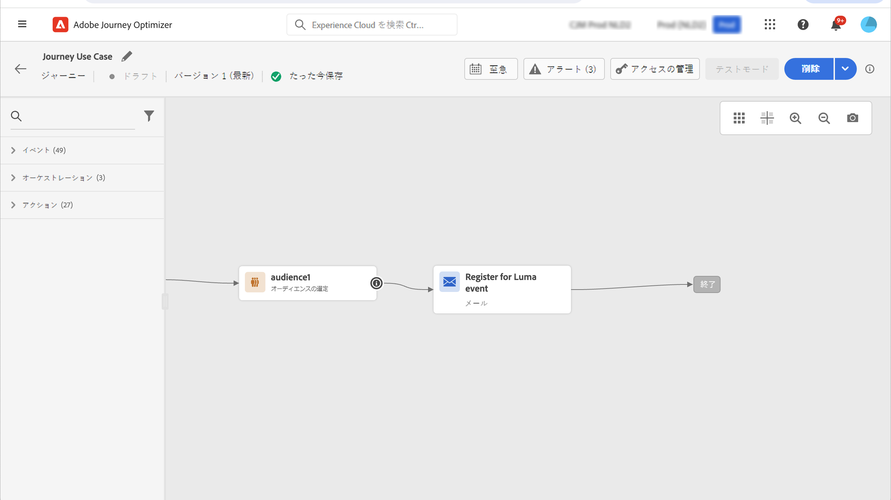
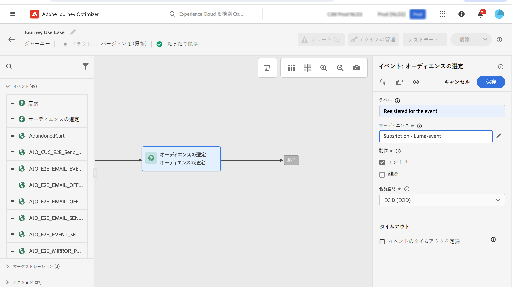
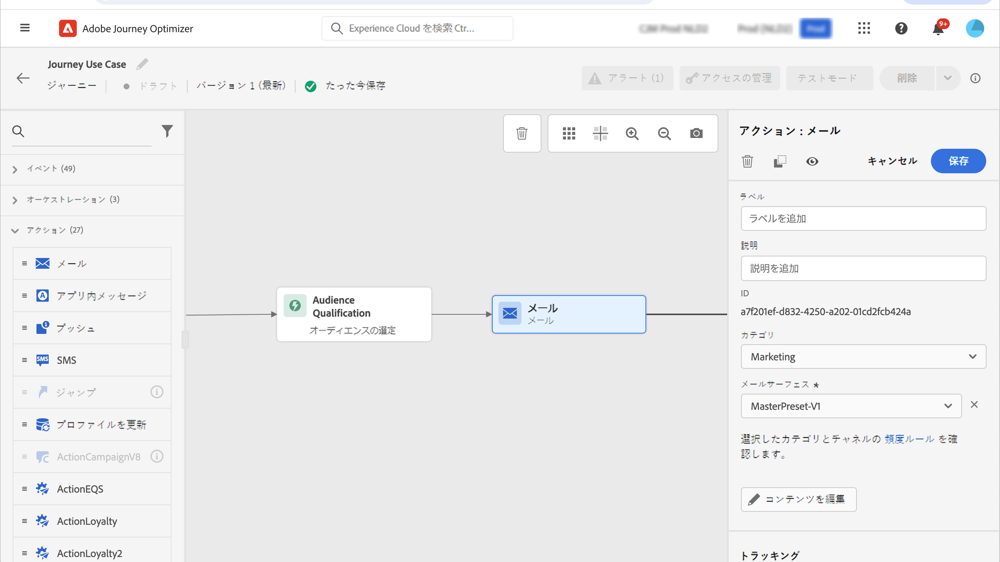

# ランディングページのユースケース {#lp-use-cases}

以下に、 [!DNL Journey Optimizer] ランディングページを使用して、顧客が一部またはすべてのお知らせの受信をオプトイン／オプトアウトできるようにする例を示します。

## サービスの購読 {#subscription-to-a-service}

最も一般的な使用例の 1 つは、ランディングページを通じて（ニュースレターやイベントなどの）[サービスを購読する](subscription-list.md)ように顧客を招待することです。主な手順は次のグラフに示します。

例えば、来月イベントを開催し、<!--to keep your customers that are interested updated on that event-->イベント登録キャンペーンを開始するとします。これを行うには、受信者がこのイベントに登録できるようにするランディングページへのリンクを含むメールを送信します。登録したユーザーは、この目的で作成した購読リストに追加されます。

### ランディングページの設定 {#set-up-lp}

1. イベント登録の購読リストを作成します。このリストには、登録済みユーザーが格納されます。購読リストの作成方法については、[こちら](subscription-list.md#define-subscription-list)を参照してください。

   

1. [ランディングページを作成](create-lp.md)し、受信者がイベントに登録できるようにします。

   

1. 登録の[プライマリランディングページ](create-lp.md#configure-primary-page)を設定します。

1. [ランディングページのコンテンツ](design-lp.md)をデザインする際に、作成した購読リストを選択し、登録チェックボックスをオンにしたプロファイルで更新します。

   

1. 受信者が登録フォームを送信したときに、受信者に表示される「ありがとうございました」ページを作成します。ランディングサブページの設定方法については、[こちら](create-lp.md#configure-subpages)を参照してください。

   

1. ランディングページを[公開](create-lp.md#publish)します。

1. [ジャーニー](../building-journeys/journey.md)で、**メール**&#x200B;アクティビティを追加して、登録ランディングページにトラフィックを誘導します。

   

1. イベントの登録が開始されたことを通知する[メールをデザイン](../email/get-started-email-design.md)します。

1. メッセージコンテンツに[リンクを挿入](../email/message-tracking.md#insert-links)します。「**[!UICONTROL ランディングページ]**」を&#x200B;**[!UICONTROL リンクタイプ]**&#x200B;として選択し、登録用に作成した[ランディングページ](create-lp.md#configure-primary-page)を選択します。

   

   >[!NOTE]
   >
   >メッセージを送信するには、選択したランディングページがまだ期限切れでないことを確認します。有効期限の更新方法について詳しくは、[この節](create-lp.md#configure-primary-page)を参照してください。

   メールを受信した受信者がランディングページへのリンクをクリックすると、「ありがとうございました」ページに移動し、購読リストに追加されます。

### 確認メールの送信 {#send-confirmation-email}

さらに、イベントに登録した受信者に確認メールを送信できます。これを行うには、以下の手順に従います。

1. 別の[ジャーニー](../building-journeys/journey.md)を作成します。「**[!UICONTROL ジャーニーの作成]**」ボタンをクリックすると、ランディングページから直接実行できます。[詳細情報](create-lp.md#configure-primary-page)

   

1. **[!UICONTROL イベント]**&#x200B;カテゴリを展開し、**[!UICONTROL オーディエンスの選定]**&#x200B;アクティビティをキャンバスにドロップします。[詳細情報](../building-journeys/audience-qualification-events.md)

1. 「**[!UICONTROL オーディエンス]**」フィールドをクリックし、作成した購読リストを選択します。

   

1. 選択した確認メールを追加し、ジャーニーを通じて送信します。

   

イベントに登録したすべてのユーザーに確認メールが送信されます。

<!--The event registration's subscription list tracks the profiles who registered and you can send them targeted event updates.-->

## オプトアウトランディングページ {#opt-out}

受信者がお知らせの登録を解除止できるように、オプトアウトのランディングページへのリンクをメールに含めることができます。

>[!NOTE]
>
>[この節](../privacy/opt-out.md)では、受信者の同意の管理と、これが重要である理由について説明します。

### オプトアウト管理 {#opt-out-management}

ブランドからの連絡を登録解除する機能を受信者に提供することは、法的要件です。適用される法律について詳しくは、[Experience Platform ドキュメント](https://experienceleague.adobe.com/docs/experience-platform/privacy/regulations/overview.html?lang=ja#regulations){target="_blank"}を参照してください。

したがって、受信者に送信されるすべての メールに、**登録解除リンク**&#x200B;を必ず含める必要があります。

* 受信者がこのリンクをクリックすると、オプトアウトを確認するボタンを含んだランディングページが表示されます。
* オプトアウトボタンをクリックすると、プロファイルデータがこの情報を使用して更新されます。

### メールオプトアウトの設定 {#configure-opt-out}

メールの受信者がランディングページを通じてコミュニケーションを登録解除するには、次の手順に従います。

1. ランディングページを作成します。[詳細情報](create-lp.md)

1. プライマリページを定義します。[詳細情報](create-lp.md#configure-primary-page)

1. プライマリページコンテンツの[デザイン](design-lp.md)：ランディングページ固有の&#x200B;**[!UICONTROL フォーム]**&#x200B;コンポーネントを使用して、「**[!UICONTROL オプトアウト]**」チェックボックスを定義し、**[!UICONTROL チャネル（メール）]**&#x200B;の更新を選択します。ランディングページでオプトアウトボックスをオンにしたプロファイルは、すべてのお知らせからオプトアウトされます。

   

   <!--You can also build your own landing page and host it on the third-party system of your choice.-->

1. フォームを送信するユーザーに表示される確認用の[サブページ](create-lp.md#configure-subpages)を追加します。

   

   >[!NOTE]
   >
   >必ずプライマリページの&#x200B;**[!UICONTROL フォーム]**&#x200B;コンポーネントの「**[!UICONTROL コールトゥアクション]**」セクションにあるサブページを参照してください。[詳細情報](design-lp.md)

1. ページのコンテンツを設定して定義したら、ランディングページを[公開](create-lp.md#publish)します。

1. ジャーニーで[メールメッセージを作成します](../email/get-started-email-design.md)。

1. コンテンツ内のテキストを選択し、コンテキストツールバーを使用して[リンクを挿入](../email/message-tracking.md#insert-links)します。ボタンにリンクを使用することもできます。

1. **[!UICONTROL リンクタイプ]**&#x200B;ドロップダウンリストから「**[!UICONTROL ランディングページ]**」を選択し、オプトアウト用に作成した[ランディングページ](create-lp.md#configure-primary-page)を選択します。

   

   >[!NOTE]
   >
   >メッセージを送信するには、選択したランディングページがまだ期限切れでないことを確認します。有効期限の更新方法について詳しくは、[この節](create-lp.md#configure-primary-page)を参照してください。

1. ジャーニーを公開して実行します。[詳細情報](../building-journeys/journey.md)。

1. メッセージを受け取った受信者がメールの登録解除リンクをクリックすると、ランディングページが表示されます。

   

   受信者がボックスをオンにしてフォームを送信した場合：

   * オプトアウトした受信者は、確認メッセージ画面にリダイレクトされます。

   * プロファイルデータは更新され、再度登録しない限り、ブランドからのお知らせは届きません。

対応するプロファイルの選択が更新されたことを確認するには、Experience Platform に移動し、ID 名前空間と対応する ID 値を選択してプロファイルにアクセスします。詳しくは、[Experience Platform ドキュメント](https://experienceleague.adobe.com/docs/experience-platform/profile/ui/user-guide.html?lang=ja#getting-started){target="_blank"}を参照してください。

「**[!UICONTROL 属性]**」タブで、**[!UICONTROL choice]** の値が **[!UICONTROL no]** に変更されたことを確認できます。

オプトアウト情報は、**同意サービスデータセット**&#x200B;に保存されます。[データセットの詳細](../data/get-started-datasets.md)

>[!NOTE]
>
>デフォルトの [Adobe Experience Platform](https://experienceleague.adobe.com/docs/experience-platform/profile/home.html?lang=ja){target="_blank"} **[!UICONTROL プロファイル]**&#x200B;結合ポリシーの結合方法が&#x200B;**[!UICONTROL データセットの優先順位]**&#x200B;である場合は、必ず **[!UICONTROL AJO 同意サービスデータセット]**&#x200B;を有効にし、結合ポリシーで優先順位を付けてください。[詳細情報](https://experienceleague.adobe.com/docs/experience-platform/profile/merge-policies/ui-guide.html?lang=ja#dataset-precedence-profile){target="_blank"}
>
>このデータセットにバッチが追加されていない場合でも、オプトイン／オプトアウト情報は含まれます。

**関連トピック：**

* [ワンクリックオプトアウト](../email/email-opt-out.md#one-click-opt-out-link)
* [メールヘッダーのオプトアウトリンク](../email/email-opt-out.md#unsubscribe-header)

<!--

### Other ways to opt out

You can also enable your recipients to unsubscribe whithout using landing pages.

* **One-click opt-out**

    You can add a one-click opt-out link into your email content. This will enable your recipients to quickly unsubscribe from your communications, without being redirected to a landing page where they need to confirm opting out. [Learn more](../privacy/opt-out.md#one-click-opt-out-link)

* **Unsubscribe link in header**

    If the recipients' email client supports displaying an unsubscribe link in the email header, emails sent with [!DNL Journey Optimizer] automatically include this link. [Learn more](../privacy/opt-out.md#unsubscribe-header)

////////

## Leverage landing page submission event {#leverage-lp-event}

You can use information that was submitted on a landing page to send communications to your customers. For example, if a user subscribes to a given subscription list, you can leverage that information to send an email recommending other subscription lists to that user.

To do this, you need to create an event containing the landing page submission information and use it in a journey. Follow the steps below.

1. Go to **[!UICONTROL Administration]** > **[!UICONTROL Configurations]**, and in the **[!UICONTROL Events]** section, select **[!UICONTROL Manage]**.

    

1. The list of events displays. Select **[!UICONTROL Create Event]**.

    

1. The event configuration pane opens on the right side of the screen. Configure a rule-based unitary event. [Learn more](../event/about-creating.md)

1. Define the schema: select **[!UICONTROL AJO Email Tracking Experience Event Schema v.1]** (available by default in [!DNL Journey Optimizer]).

    

1. In the **[!UICONTROL Fields]** section, select the following elements:

    * **[!UICONTROL _experience]** > **[!UICONTROL customerJourneyManagement]** > **[!UICONTROL messageInteraction]** > **[!UICONTROL Interaction Type]**
    
    * **[!UICONTROL _experience]** > **[!UICONTROL customerJourneyManagement]** > **[!UICONTROL messageInteraction]** > **[!UICONTROL Landing Page Details]** > **[!UICONTROL Landing Page ID]**

    

1. Click inside the **[!UICONTROL Event ID condition]** field. Using the simple personalization editor, define the condition for the **[!UICONTROL Interaction Type]** and **[!UICONTROL Landing Page ID]** fields. This will be used by the system to identify the events that will trigger your journey.

    

    >[!NOTE]
    >
    >To find the landing page ID, you can insert the landing page as a link into an email and select the source code from the contextual toolbar to display the landing page information.
    >
    >

1. Save your changes.

1. Create a [journey](../building-journeys/journey.md). You can do it directly from the landing page by clicking the **[!UICONTROL Create journey]** button. Learn more [here](create-lp.md#configure-primary-page)

    

1. In the journey, unfold the **[!UICONTROL Events]** category and drop the event that you created into the canvas. Learn more [here](../building-journeys/audience-qualification-events.md)

    

1. Unfold the **[!UICONTROL Actions]** category and drop an email action into the canvas.

    

///How do you use the information from the event to send an email to the users? -->
