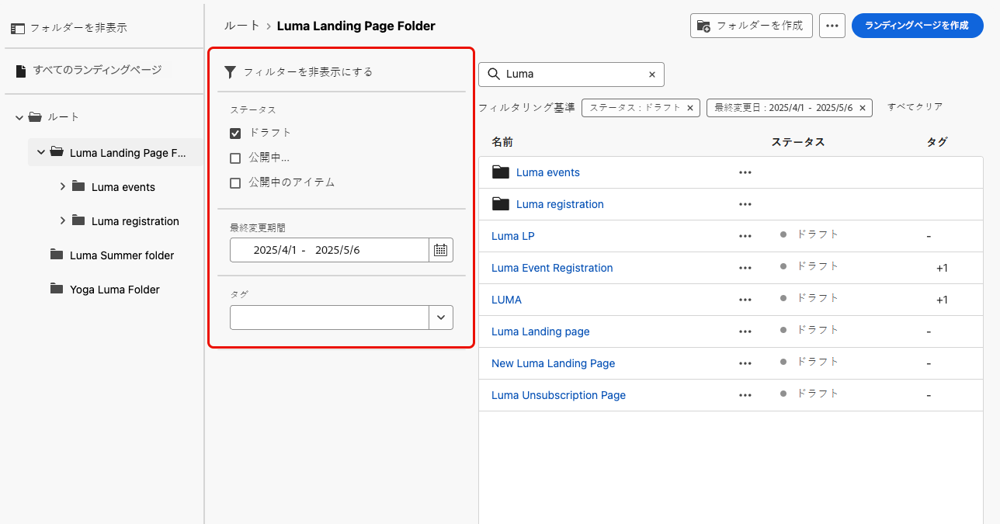

# ランディングページの管理 {#manage-lp}

## ランディングページへのアクセス {#access-landing-pages}

ランディングページのリストにアクセスするには、左側のメニューから&#x200B;**[!UICONTROL コンテンツ管理]**／**[!UICONTROL ランディングページ]**&#x200B;を選択します。

既存のランディングページがすべて表示されます。

左側のパネルを使用すると、ランディングページをフォルダーに整理できます。 デフォルトでは、すべての項目が表示されます。フォルダーを選択すると、選択したフォルダーに含まれるランディングページとフォルダーのみが表示されます。 [詳細情報](#folders)

特定の項目を検索するには、検索フィールドに名前を入力します。[ フォルダー ](#folders) を選択すると、そのフォルダーの第 1 レベルの階層にあるすべてのランディングページまたはフォルダーに検索が適用され <!--(not nested items)--> す。

ランディングページは、ステータス、変更日またはタグに基づいてフィルタリングできます。

このリストで、ランディングページの横にある 3 つのドットをクリックし、目的のアクションを選択できます。

* [ 公開済み ](create-lp.md#publish-landing-page) ランディングページの場合は、[ ランディングページレポート ](../reports/lp-report-global-cja.md) および [ 過去 24 時間のライブレポート ](../reports/lp-report-live.md) にアクセスします。

* ランディングページの **削除** と **非公開** を行います。 [公開済み](create-lp.md#publish-landing-page)のランディングページは削除できません。削除するには、まず非公開にする必要があります。

  >[!CAUTION]
  >
  >メッセージで参照されているランディングページを非公開にした場合、そのランディングページへのリンクが壊れ、アクセスしようとした場合、エラーページが表示されます。

* **複製** すべてのランディングページ。

* ランディングページに関連付けられた[タグ](../start/search-filter-categorize.md#tags)を編集する。

* ランディングページをフォルダーに移動します。 [詳細情報](#folders)

## フォルダーを使用したランディングページの管理 {#folders}

>[!CONTEXTUALHELP]
>id="ajo_lp_folders"
>title="ランディングページをフォルダーに整理します"
>abstract="フォルダーを使用すると、組織のニーズに応じてランディングページを分類および管理できます。"

ランディングページを簡単に移動するために、フォルダーを使用して、より効果的に構造化された階層に整理できます。 これにより、組織のニーズに応じて項目を分類および管理できます。

1. 「**[!UICONTROL すべてのランディングページ]**」ボタンをクリックすると、フォルダーのグループ化を行わずに以前に作成したすべての項目が表示されます。

   

1. **[!UICONTROL ルート]**&#x200B;フォルダーをクリックして、作成したすべてのフォルダーを表示します。

   >[!NOTE]
   >
   >フォルダーをまだ作成していない場合は、すべてのランディングページが表示されます。

1. **[!UICONTROL ルート]**&#x200B;フォルダー内の任意のフォルダーをクリックして、そのコンテンツを表示します。

1. **[!UICONTROL ルート]**&#x200B;フォルダーまたは他のフォルダーをクリックすると、「**[!DNL Create folder]**」ボタンが表示されます。これを選択します。

   

1. 新しいフォルダーの名前を入力し、「**[!UICONTROL 保存]**」をクリックします。新しいフォルダーは、**[!UICONTROL Root]** フォルダー内、または現在選択されているフォルダー内に表示されます。

1. 「**[!UICONTROL その他のアクション]**」ボタンをクリックして、フォルダーの名前を変更または削除できます。

   

1. **[!UICONTROL その他のアクション]** ボタンを使用して、ランディングページを別の既存のフォルダーに移動することもできます。

1. これで、作成したフォルダーに移動できます。ここで [ 作成 ](create-lp.md#create-landing-page.md) した新しいランディングページはそれぞれ現在のフォルダーに保存されます。

   
