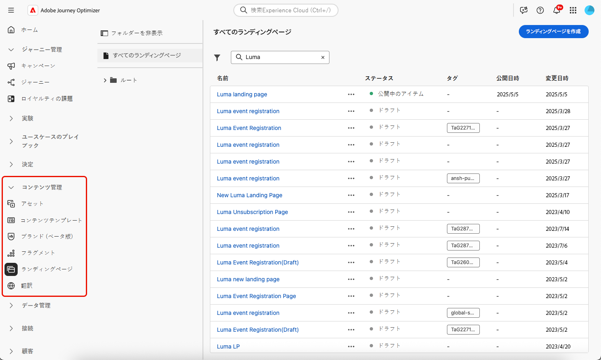

# ランディングページの管理 {#manage-lp}

## ランディングページへのアクセス {#access-landing-pages}

ランディングページのリストにアクセスするには、左側のメニューから&#x200B;**[!UICONTROL コンテンツ管理]**／**[!UICONTROL ランディングページ]**&#x200B;を選択します。

既存のランディングページがすべて表示されます。

左側のパネルでは、ランディングページをフォルダーに整理できます。デフォルトでは、すべての項目が表示されます。フォルダーを選択すると、選択したフォルダーに含まれるランディングページとフォルダーのみが表示されます。[詳細情報](#folders)

特定の項目を検索するには、検索フィールドに名前を入力します。[フォルダー](#folders)を選択すると、このフォルダーの階層の最初のレベルにあるすべてのランディングページまたはフォルダーに検索が適用されます<!--(not nested items)-->。

ランディングページは、ステータス、変更日、タグに基づいてフィルタリングできます。

このリストから、ランディングページの横にある「...」をクリックして、目的のアクションを選択できます。

* [公開済み](create-lp.md#publish-landing-page)のランディングページについては、[ランディングページのレポート](../reports/lp-report-global-cja.md)と[過去 24 時間のライブレポート](../reports/lp-report-live.md)にアクセスします。

* ランディングページを&#x200B;**削除**&#x200B;および&#x200B;**非公開**&#x200B;にします。[公開済み](create-lp.md#publish-landing-page)のランディングページは削除できません。削除するには、まず非公開にする必要があります。

  >[!CAUTION]
  >
  >メッセージで参照されているランディングページを非公開にした場合、そのランディングページへのリンクが壊れ、アクセスしようとした場合、エラーページが表示されます。

* 任意のランディングページを&#x200B;**複製**&#x200B;します。

* ランディングページに関連付けられた[タグ](../start/search-filter-categorize.md#tags)を編集します。

* ランディングページをフォルダーに移動します。[詳細情報](#folders)

## フォルダーを使用したランディングページの管理 {#folders}

>[!CONTEXTUALHELP]
>id="ajo_lp_folders"
>title="ランディングページをフォルダーに整理"
>abstract="フォルダーを使用して、組織のニーズに応じてランディングページを分類および管理します。"

ランディングページを簡単に移動するには、フォルダーを使用して、より効果的に構造化された階層に整理します。これにより、組織のニーズに応じて項目を分類および管理できます。

1. 「**[!UICONTROL すべてのランディングページ]**」ボタンをクリックして、フォルダーのグループ化を使用せずに、以前に作成したすべての項目を表示します。

   

1. **[!UICONTROL ルート]**&#x200B;フォルダーをクリックして、作成したすべてのフォルダーを表示します。

   >[!NOTE]
   >
   >フォルダーをまだ作成していない場合は、すべてのランディングページが表示されます。

1. **[!UICONTROL ルート]**&#x200B;フォルダー内の任意のフォルダーをクリックして、そのコンテンツを表示します。

1. **[!UICONTROL ルート]**&#x200B;フォルダーまたは他のフォルダーをクリックすると、「**[!DNL Create folder]**」ボタンが表示されます。これを選択します。

   

1. 新しいフォルダーの名前を入力し、「**[!UICONTROL 保存]**」をクリックします。新しいフォルダーは、**[!UICONTROL ルート]**&#x200B;フォルダー内や、現在選択されているフォルダー内に表示されます。

1. 「**[!UICONTROL その他のアクション]**」ボタンをクリックして、フォルダーの名前を変更または削除できます。

   

1. 「**[!UICONTROL その他のアクション]**」ボタンを使用すると、ランディングページを別の既存フォルダーに移動することもできます。

1. これで、作成したフォルダーに移動できます。ここから[作成](create-lp.md#create-landing-page.md)した新しいランディングページはそれぞれ現在のフォルダーに保存されます。

   
