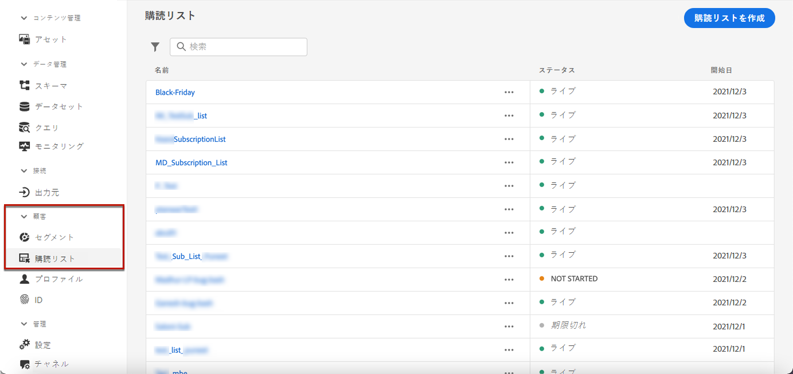
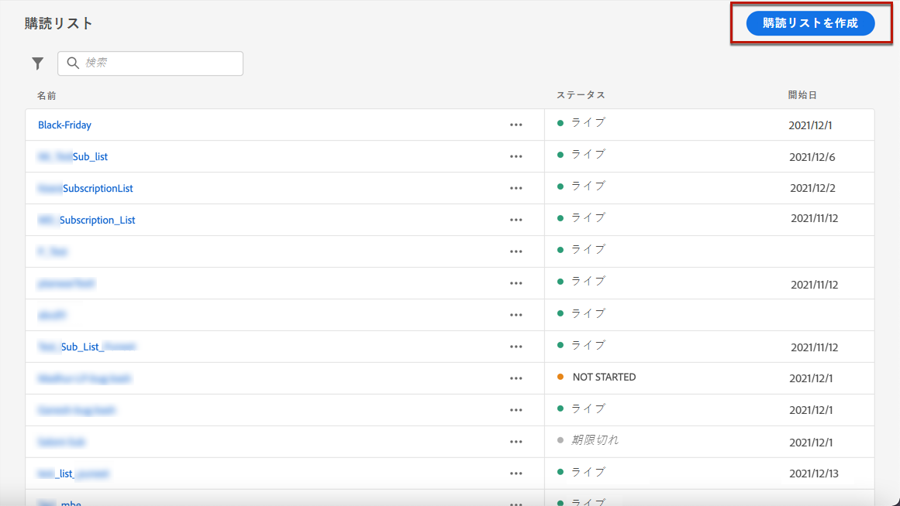
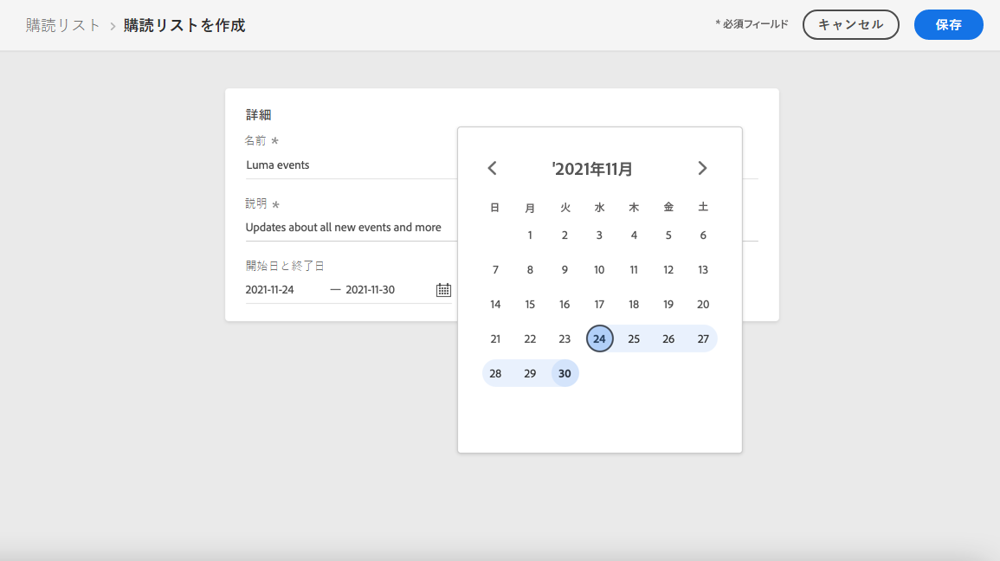
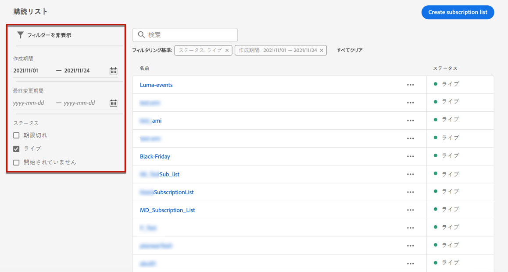

# 購読リスト {#create-subscription-list}

## 購読リストとは  {#subscription-list-definition}

購読サービスとは、特定の対象、イベント、興味などに関するコミュニケーションの受信を選択した顧客に対して継続的に提供される、マーケティング商品やサービスを指します。[!DNL Journey Optimizer] では、これらのオプトイン済みの顧客は、購読リストに収集されます。

購読サービスには、次のようなものがあります。

* ニュースレターの例：&quot;シリーズを実行中&quot;
* イベントの例：&quot;Summit 2021&quot;
* ウェビナー（例：「暗号の詳細を学ぼう」）
* 特定の製品、スポーツ、サービスなどに対する興味（例：「今後 12 か月で家を購入することに関心がある」）
* 通知方法に関する環境設定（例：「新曲のお知らせをメールで受信する」）

プロファイルは、[ランディングページ](create-lp.md)から購読リストに追加できます。例については、[この節](lp-use-cases.md#subscription-to-a-service)で示します。

## 購読リストを定義 {#define-subscription-list}

購読リストを作成するには、次の手順に従います。

1. 購読リストにアクセスするには、 **[!UICONTROL 顧客]**／**[!UICONTROL 購読リスト]**&#x200B;を選択します。

   

1. 「**[!UICONTROL 購読リストを作成]**」ボタンを選択します。

   

1. 名前と説明を追加します。これらのフィールドは必須です。

1. 開始日と終了日を定義できます。

   

1. 「**[!UICONTROL 保存]**」をクリックします。

リストには、作成したすべての購読リストが表示されます。リストは、作成日や変更日、およびステータスに基づいてフィルター処理できます。

ステータスは次のいずれかになります。

* **[!UICONTROL 未開始]**：定義された開始日は本日より後の日付です。購読されたプロファイルは、この購読リストに関するお知らせをまだ受け取っていません。
* **[!UICONTROL ライブ]**：現在の日付が、購読リストの開始日と終了日の間にある、または終了日／開始日を定義していませんん（つまり、購読リストが常にライブになっています）。
* **[!UICONTROL 期限切れ]**：終了日が過ぎたので、購読リストは無効になりました。購読されたプロファイルには、今後この購読リストに関するお知らせは届きません。

購読リストを作成したら、ランディングページで使用できます。ランディングページフォームからオプトインしたプロファイルがリストに追加されます。[詳細情報](design-lp.md)

[ジャーニーを作成](../building-journeys/journey-gs.md#jo-build)してパーソナライズ機能を追加する際に、購読リストをセグメントとして使用することもできます。

>[!NOTE]
>
>特定のレポートを通じて、購読リストの影響を監視できます。[詳細情報](subscription-report.md)

<!--

**Questions**

* Can't see the newly created subscription list in UI because their name included spacing > bug - to follow up (should be fixed for Dec. release)

* Can you update the subscription list in a way other than through a LP? Not in UI but with APIs > to follow up with Fred

-->
