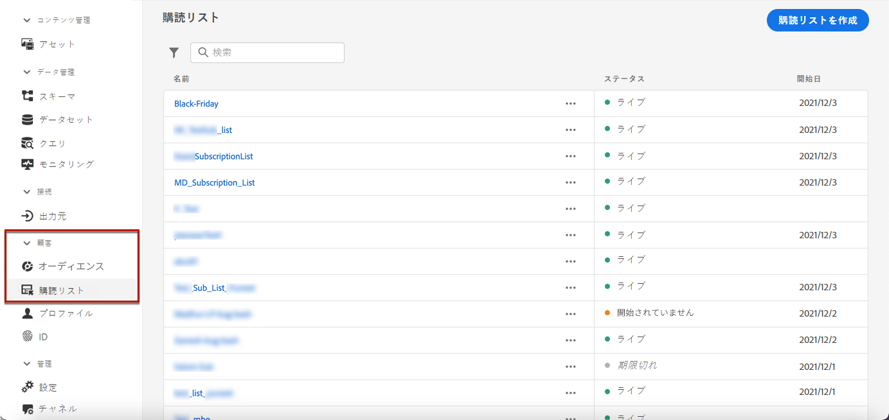
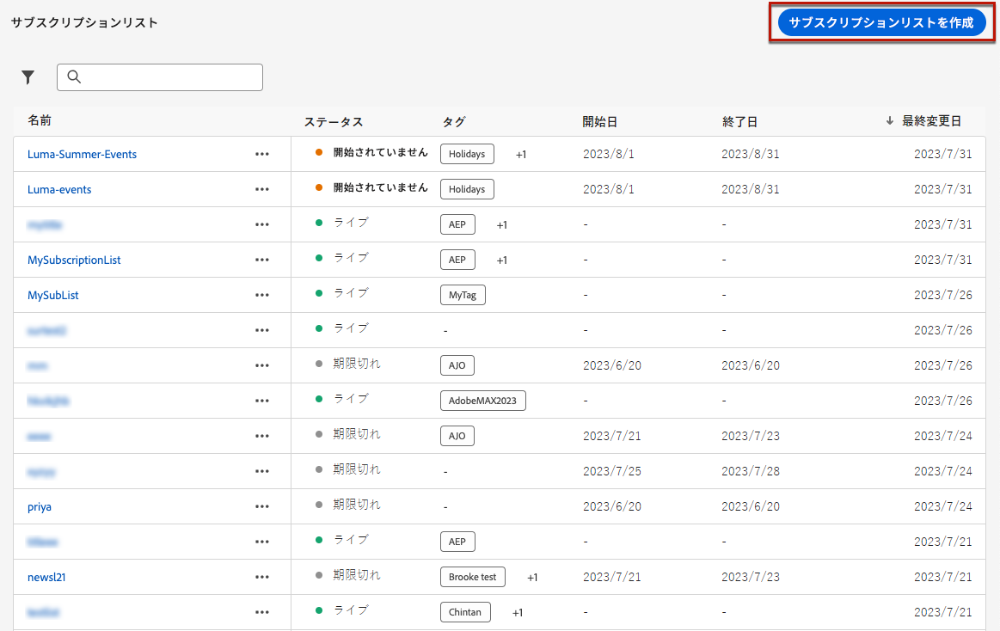
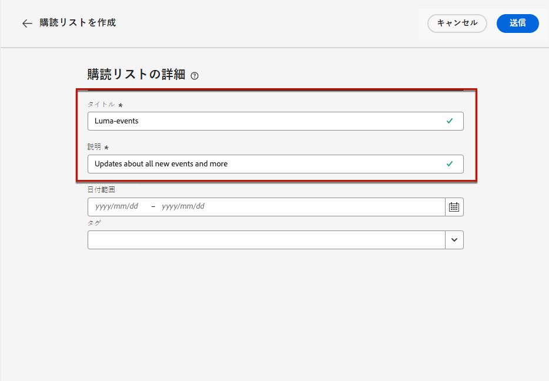
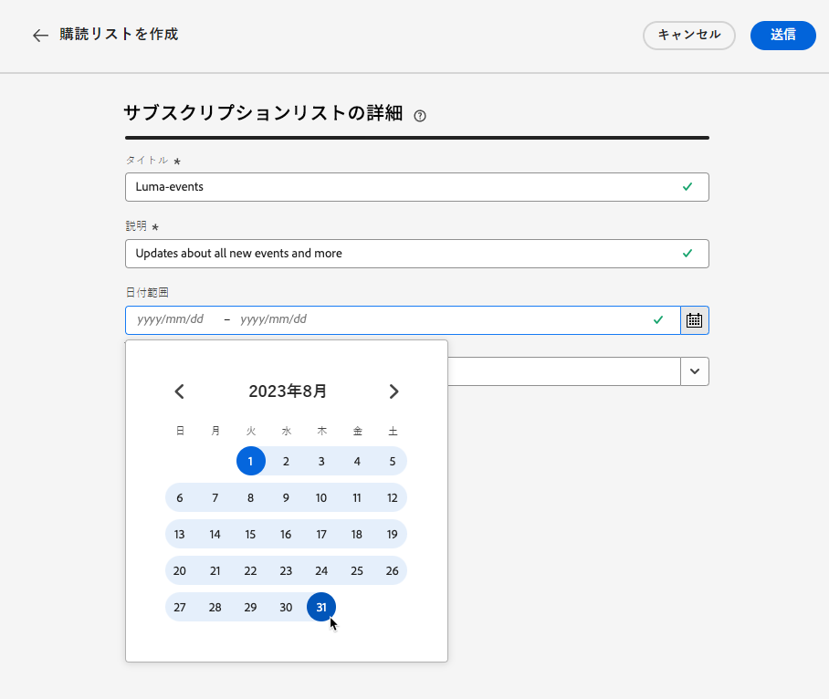
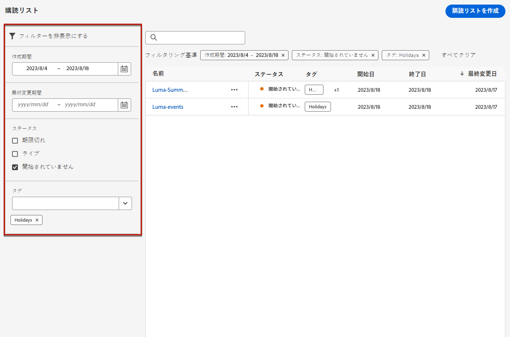

# 購読リスト {#create-subscription-list}

>[!CONTEXTUALHELP]
>id="ajo_subscription_list"
>title="サブスクリプションリストの設定"
>abstract="サブスクリプションリストを作成して、特定の件名またはイベントに関するお知らせの受信をオプトインしたプロファイルを収集します。 "
>additional-url="https://experienceleague.adobe.com/docs/journey-optimizer/using/content-management/landing-pages/subscription-list.html?lang=ja#define-subscription-list" text="購読リストの作成"

サブスクリプションサービスとは、特定のテーマ/イベント/関心などに関するコミュニケーションを継続的に受け取ることをオプトインした顧客に提供されるマーケティング商品やサービスのことです。 [!DNL Journey Optimizer] では、これらのオプトイン済みの顧客は、購読リストに収集されます。

購読サービスは、次の目的で使用できます。

* ニュースレター（例：「連載中のシリーズ」）
* イベント（例：「Summit 2021」）
* ウェビナー（例：「暗号の詳細を学ぼう」）
* 特定の製品、スポーツ、サービスなどに対する興味（例：「今後 12 か月で家を購入することに関心がある」）
* 通知方法に関する環境設定（例：「新曲のお知らせをメールで受信する」）

プロファイルは、[ランディングページ](create-lp.md)から購読リストに追加できます。 例については、[この節](lp-use-cases.md#subscription-to-a-service)で示します。

## 購読リストの作成 {#define-subscription-list}

>[!NOTE]
>
>購読リストを作成する際、関連するストリーミングセグメントが Adobe Experience Platform で自動的に生成されます。 ストリーミングセグメントを正常に作成するには、結合ポリシーで「**Active-On-Edge**」オプションを有効にする必要があります。 ストリーミングセグメントの実施要件について詳しくは、[Adobe Experience Platform ドキュメント](https://experienceleague.adobe.com/ja/docs/experience-platform/segmentation/methods/streaming-segmentation)を参照してください。

購読リストを作成するには、次の手順に従います。

1. 購読リストにアクセスするには、 **[!UICONTROL 顧客]**／**[!UICONTROL 購読リスト]**&#x200B;を選択します。

   

1. 「**[!UICONTROL 購読リストを作成]**」ボタンを選択します。

   

1. 名前と説明を追加します。 これらのフィールドは必須です。

   

   >[!CAUTION]
   >
   >現在、「**[!UICONTROL タイトル]**」フィールドには、別の購読リストに既に存在する名前やスペースを入力することはできません。

1. 開始日と終了日を定義できます。

   

1. 「**[!UICONTROL タグ]**」フィールドから Adobe Experience Platform タグを選択または作成してランディングページを分類し、検索の向上を図ります。 [詳細情報](../start/search-filter-categorize.md#tags)

1. 「**[!UICONTROL 保存]**」をクリックします。

## 購読リストの使用 {#use-subscription-lists}

購読リストを作成すると、次の操作を実行できます。

* 購読リストにプロファイルを追加

  ニュースレターを購読したり、イベントに登録したりすることで、**リストに参加**&#x200B;するようユーザーを招待できます。 また、サブスクライバーに&#x200B;**パーソナライズされたメッセージを送信**&#x200B;することもできます。

  例えば、オーディエンスにイベントへの登録やニュースレターの購読を招待するには、イベントへの参加や購読を行うためのランディングページへのリンクを含むメッセージを送信できます。 ランディングページのフォームを通じてオプトインしたプロファイルは、この目的のために作成した購読リストに追加されます。

* サブスクライバーにメッセージを送信

  ジャーニーを作成してパーソナライゼーションを追加する際に、購読リストをオーディエンスとして使用することもできます。

  例えば、お客様がストリーミングサービスを購読すると、ウェルカムメールシリーズの即時ディスパッチがトリガーされ、初めてアプリにログインして表示の環境設定を行うように促すことができます。

購読リストの使用方法について詳しくは、[このユースケース](lp-use-cases.md#subscription-to-a-service)を参照してください。

## 購読リストの参照 {#browse-subscription-lists}

リストには、作成したすべての購読リストが表示されます。 リストは、作成日や変更日、およびステータスに基づいてフィルター処理できます。

ステータスは次のいずれかになります。

* **[!UICONTROL 未開始]**：定義された開始日は本日より後の日付です。 購読されたプロファイルは、この購読リストに関するお知らせをまだ受け取っていません。
* **[!UICONTROL ライブ]**：現在の日付が、購読リストの開始日と終了日の間にある、または終了日／開始日を定義していませんん（つまり、購読リストが常にライブになっています）。
* **[!UICONTROL 期限切れ]**：終了日が過ぎたので、購読リストは無効になりました。 購読されたプロファイルには、今後この購読リストに関するお知らせは届きません。

## 購読リストの監視 {#monitor-subscription-lists}

専用のレポートを通じて、購読リストの影響を監視できます。 次の 2 つのタイプのレポートにアクセスできます。

* 購読リストのライブレポート

  「過去 24 時間」タブからアクセスできるライブレポートには、過去 24 時間以内に発生したイベントが、イベント発生から最小 2 分の時間間隔で表示されます。 [詳細情報](../reports/subscription-report-live.md)

* Customer Journey Analytics を使用した購読リストの全期間レポート

  これらのレポートでは、少なくとも 2 時間前に発生したイベントに焦点を当て、選択した期間のイベントが表示されます。 **購読レポート**&#x200B;は、特定のリストに関連付けられたプロファイルの購読と登録解除に関する重要なインサイトを提供し、エンゲージメントとコンバージョンを促進する様々な購読キャンペーンとイニシアチブの効果を理解するのに役立ちます。 [詳細情報](../reports/subscription-report-global-cja.md)
