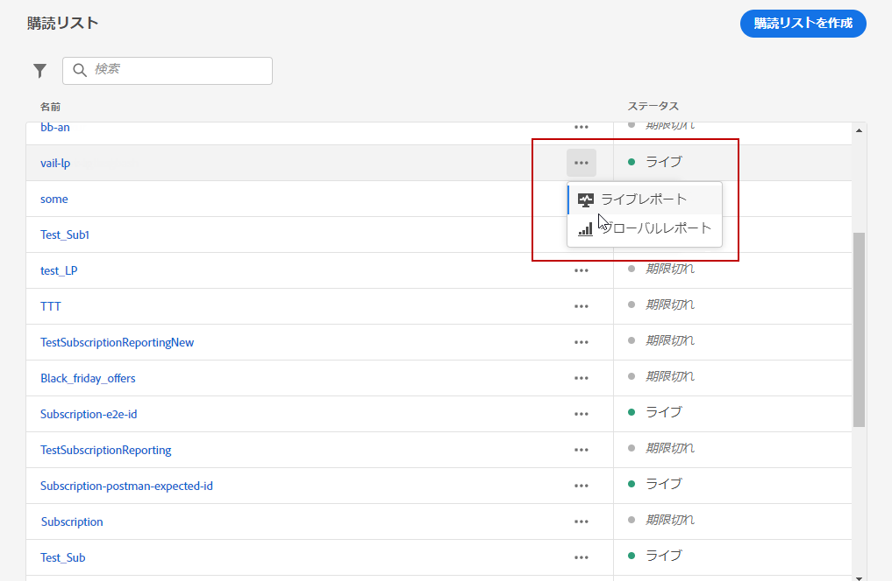
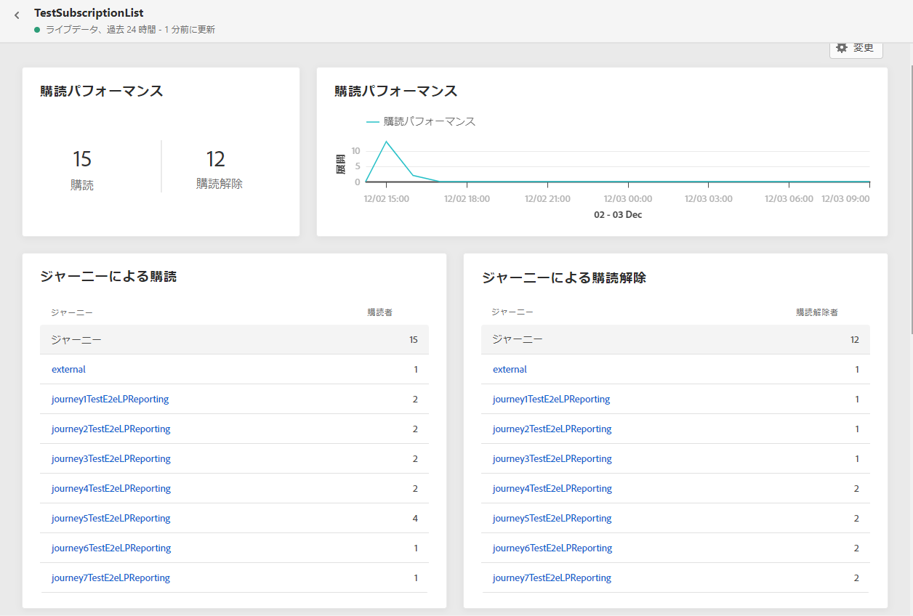
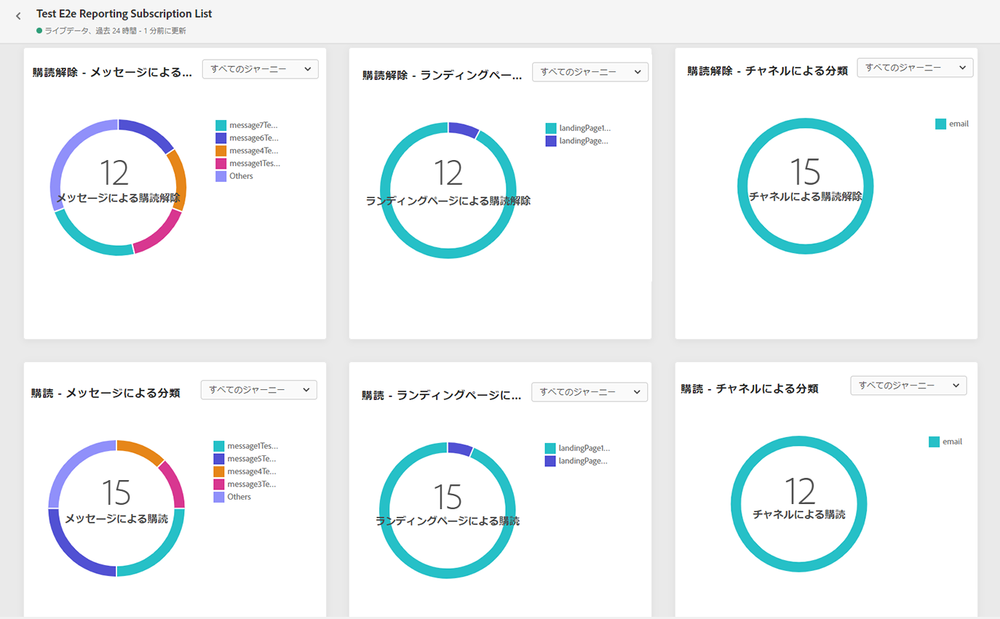
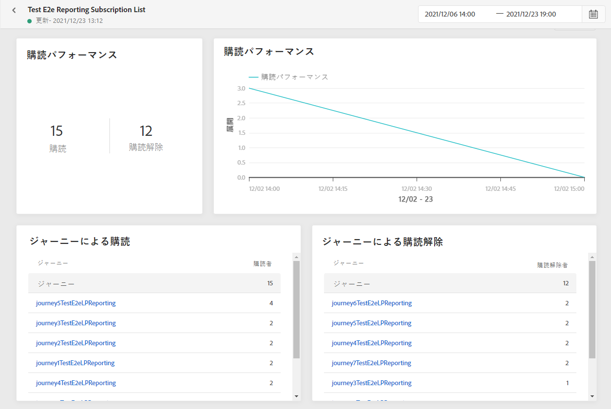
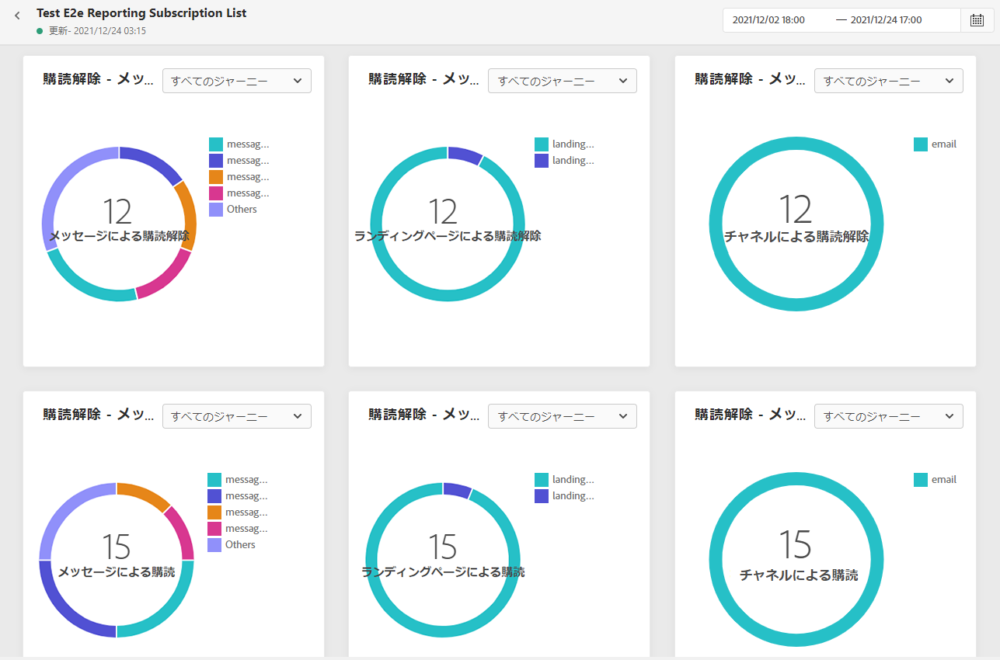

# 購読レポート {#subscription-report}

購読レポートには、購読者のアクティビティの詳細が表示されます。次の 2 つのレポートタイプを使用できます。

* **[!UICONTROL ライブレポート]**：過去 24 時間の配信の購読と購読解除のみを測定および視覚化します。

* **[!UICONTROL グローバルレポート]**：選択した期間における配信の購読と購読解除を測定および視覚化します。

レポートにアクセスするには、選択した購読リストの詳細メニューから「**ライブ**」または「**[!UICONTROL グローバルレポート]**」を選択します。

## 購読ライブレポート {#subscription-live}

**[!UICONTROL 購読パフォーマンス]** KPI と&#x200B;**[!UICONTROL ジャーニー別の購読]**/**[!UICONTROL ジャーニー別の購読解除]**&#x200B;テーブルには、ランディングページに対する訪問者のエンゲージメントに関する主な情報の詳細が示されます。テーブルと KPI には、次のように、ランディングページに関連して使用できるデータが含まれています。

* **[!UICONTROL 購読]**：過去 24 時間の購読の合計数。

* **[!UICONTROL 購読解除]**：過去 24 時間の購読解除の合計数。

**[!UICONTROL 購読パフォーマンス]**&#x200B;グラフには、過去 24 時間の購読の推移が表示されます。

**購読 - 分類**&#x200B;および&#x200B;**購読解除 - 分類**&#x200B;グラフは、メッセージ、ランディングページ、チャネルに応じて、過去 24 時間に購読または購読解除したユーザーの合計数を表します。

## 購読のグローバルレポート {#subscription-global}

**[!UICONTROL 購読パフォーマンス]** KPI と&#x200B;**[!UICONTROL ジャーニー別の購読]**/**[!UICONTROL ジャーニー別の購読解除]**&#x200B;テーブルには、ランディングページに対する訪問者のエンゲージメントに関する主な情報の詳細が示されます。テーブルと KPI には、次のように、ランディングページに関連して使用できるデータが含まれています。

* **[!UICONTROL 購読]**：該当する期間中の購読の合計数。

* **[!UICONTROL 購読解除]**：該当する期間中の購読解除の合計数。

**[!UICONTROL 購読パフォーマンス]**&#x200B;グラフには、該当する期間中の購読の推移が表示されます。

**購読 - 分類**&#x200B;および&#x200B;**購読解除 - 分類**&#x200B;は、メッセージ、ランディングページおよびチャネルに応じて、選択した期間に購読または購読解除したユーザーの合計数を表します。
