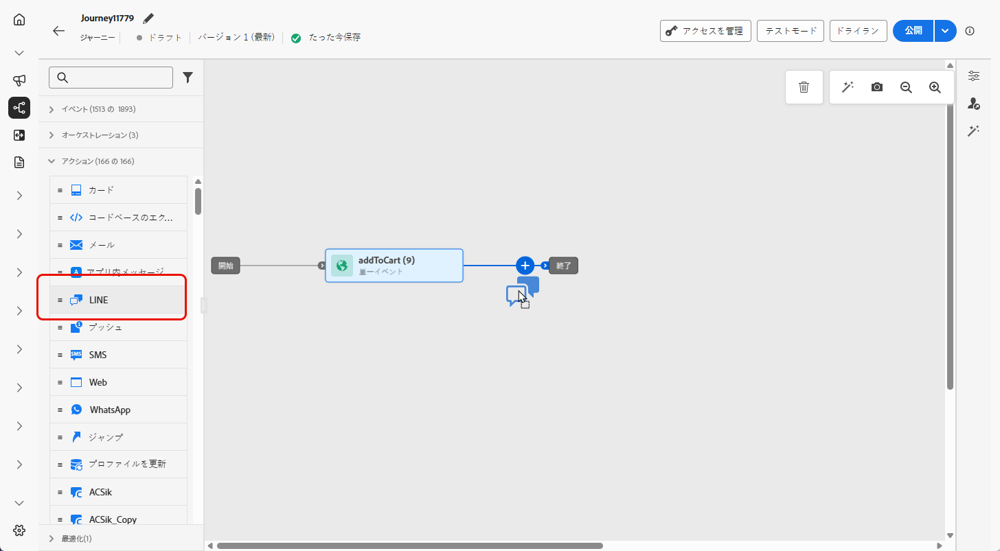
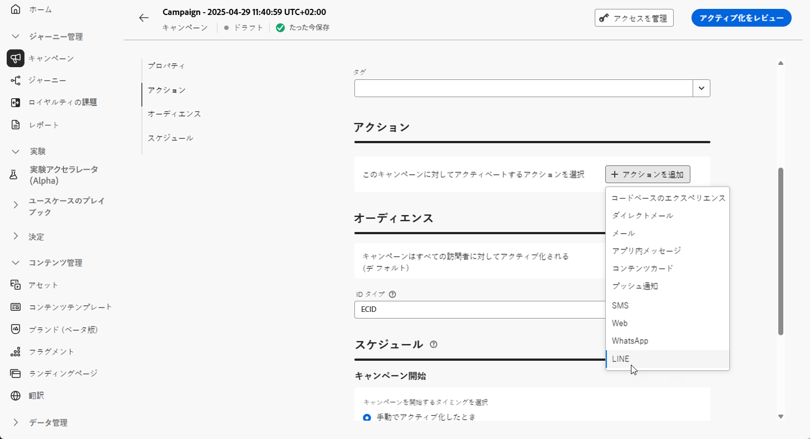

# LINE メッセージの作成 {#create-line}

## LINE メッセージの追加 {#create-line-journey-campaign}

キャンペーンまたはジャーニーに LINE メッセージを追加する方法については、以下のタブを参照してください。

>[!BEGINTABS]

>[!TAB ジャーニーへの LINE メッセージの追加]

1. ジャーニーを開き、パレットの「**アクション**」セクションから **LINE** アクティビティをドラッグ＆ドロップします。

   

1. メッセージに関する基本情報（ラベル、説明、カテゴリ）を入力したあと、使用するメッセージ設定を選択します。

   ジャーニーの設定方法について詳しくは、[このページ](../building-journeys/journey-gs.md)を参照してください。

   **[!UICONTROL 設定]**&#x200B;フィールドはデフォルトで、ユーザーがチャネルで最後に使用した設定で事前入力されます。

これで、以下に説明するように、「**[!UICONTROL コンテンツを編集]** ボタンから LINE メッセージのコンテンツのデザインを開始できます。

>[!TAB キャンペーンへの LINE メッセージの追加]

1. **[!UICONTROL キャンペーン]**&#x200B;メニューにアクセスし、「**[!UICONTROL キャンペーンを作成]**」をクリックします。

1. 実施するキャンペーンのタイプを選択します。

   * **Scheduled - Marketing**：キャンペーンをすぐに実行するか、指定日に実行します。スケジュール済みキャンペーンは、マーケティングメッセージを送信することを目的としています。ユーザーインターフェイスから設定および実行します。

   * **API トリガー - マーケティング／トランザクション**：API 呼び出しを使用してキャンペーンを実行します。API トリガーキャンペーンは、マーケティングメッセージまたはトランザクションメッセージのいずれか、つまり、個人が実行したアクション（パスワードのリセット、買い物かごの購入など）に続いて送信されるメッセージを送信することを目的としています。

1. 「**[!UICONTROL プロパティ]**」セクションで、キャンペーンの「**[!UICONTROL タイトル]**」と「**[!UICONTROL 説明]**」を編集します。

1. 「**[!UICONTROL オーディエンスを選択]**」ボタンをクリックして、使用可能な Adobe Experience Platform オーディエンスのリストからターゲットオーディエンスを定義します。[詳細情報](../audience/about-audiences.md)

1. 「**[!UICONTROL ID 名前空間]**」フィールドで、選択したオーディエンスから個人を識別するために使用する名前空間を選択します。[詳細情報](../event/about-creating.md#select-the-namespace)

1. 「**[!UICONTROL アクション]**」セクションで、「**[!UICONTROL LINE]**」を選択し、新しい設定を選択または作成します。

   LINE 設定について詳しくは、[このページ](line-configuration.md)を参照してください。

   

1. 「**[!UICONTROL 実験を作成]**」をクリックしてコンテンツ実験の設定を開始し、パフォーマンスを測定してターゲットオーディエンスに最適なオプションを特定するための処理を作成します。[詳細情報](../content-management/content-experiment.md)

1. 「**[!UICONTROL アクションのトラッキング]**」セクションで、SMS メッセージ内のリンクのクリックを追跡するかどうかを指定します。

1. キャンペーンは、特定の日付に実行するか、繰り返し頻度で実行するように設計されています。キャンペーンの&#x200B;**[!UICONTROL スケジュール]**&#x200B;を設定する方法については、[この節](../campaigns/create-campaign.md#schedule)を参照してください。

1. **[!UICONTROL アクショントリガー]**&#x200B;メニューから、SMS メッセージの「**[!UICONTROL 頻度]**」を選択します。

   * 1 回
   * 毎日
   * 毎週
   * 月

これで、以下に説明するように、「**[!UICONTROL コンテンツを編集]**」ボタンからテキストメッセージのコンテンツのデザインを開始できます。

>[!ENDTABS]

## LINE コンテンツの定義{#line-content}

Adobe Journey Optimizer では、LINE 向けに次のメッセージタイプをサポートしています。

* **テキスト**：プレーンテキストまたは書式設定済みのテキストメッセージを送信します。
* **ステッカー**：LINE のオリジナルステッカーを組み込んで、キャラクターと表現力を加えます。
* **画像**：画像を添付して視覚的なアピールを高めます。
* **ビデオ**：ビデオコンテンツを共有して、動的な通信を実現します。
* **場所**：場所情報をマップと共に送信します。
* **テンプレート**：定義済みのテンプレートを利用して、一貫性のあるメッセージを実現します。
* **Flex メッセージ**：JSON ベースの Flex メッセージを使用して、リッチコンテンツを含む複雑なレイアウトを作成します。

これらのメッセージタイプは、JSON コンテンツを直接編集して設定できるので、動的でパーソナライズされたメッセージ戦略が可能になります。

LINE コンテンツを設定するには、次の手順に従います。

1. ジャーニーまたはキャンペーンの設定画面で、「**[!UICONTROL コンテンツを編集]**」ボタンをクリックして、テキストメッセージのコンテンツを設定します。

1. 「**[!UICONTROL コードを編集]**」をクリックして、JSON コンテンツを編集します。

1. パーソナライゼーションエディターを使用して、コンテンツの定義、パーソナライゼーションと動的コンテンツの追加を行います。プロファイル名や市区町村など、任意の属性を使用できます。また、条件ルールを定義することもできます。パーソナライゼーションエディターの[パーソナライゼーション](../personalization/personalize.md)と[動的コンテンツ](../personalization/get-started-dynamic-content.md)について詳しくは、次のページを参照してください。

1. 「**[!UICONTROL 保存]**」をクリックして、プレビューでメッセージを確認します。

1. 「**[!UICONTROL コンテンツをシミュレート]**」ボタンを使用して、LINE メッセージコンテンツとパーソナライズされたコンテンツをプレビューします。

テストを実行してコンテンツを検証したら、LINE メッセージをオーディエンスに送信できます。これらの手順について詳しくは、[このページ](send-line.md)を参照してください。

送信したら、キャンペーンまたはジャーニーレポート内で LINE の影響を測定できます。レポートについて詳しくは、[この節](../reports/campaign-global-report-cja.md)を参照してください。
