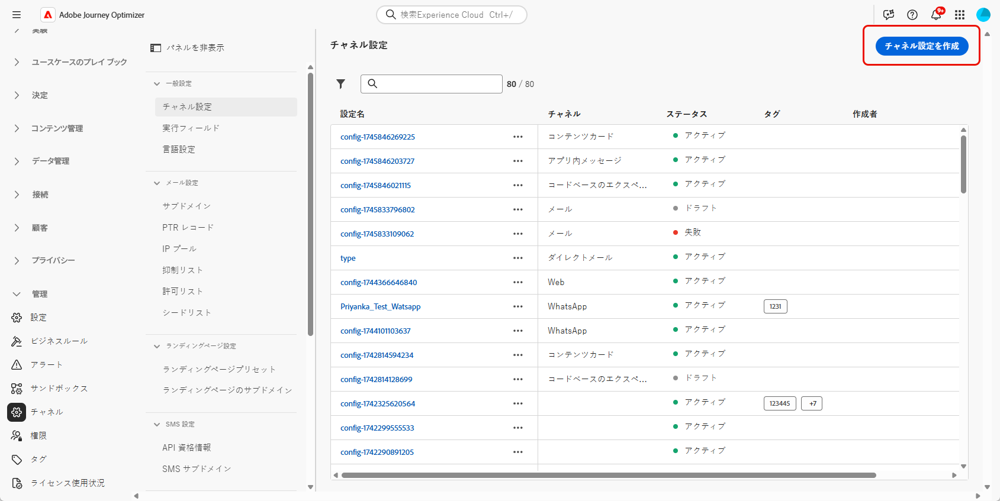
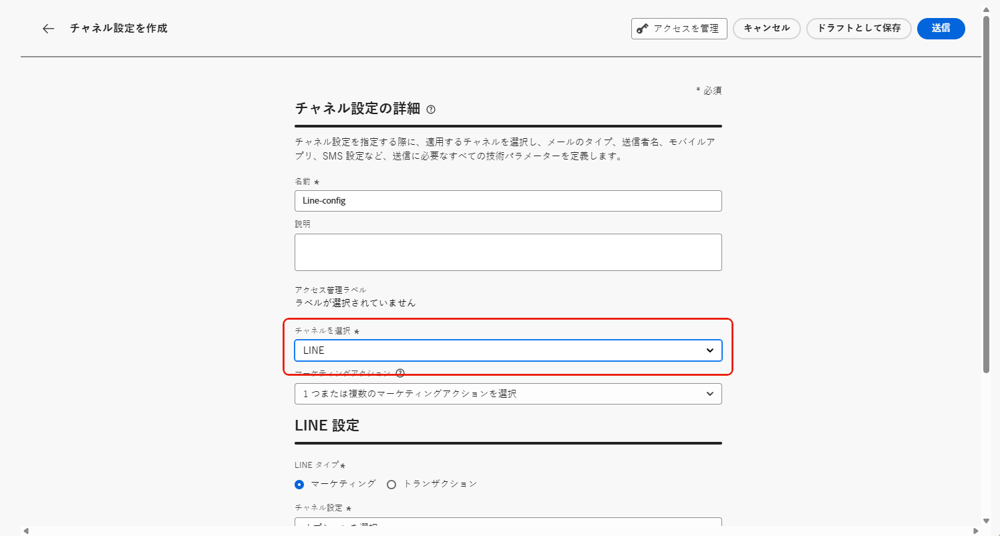

# Journey Optimizerでの LINE チャネルの設定 {#line-configuration}

1. **[!UICONTROL チャネル]**／**[!UICONTROL 一般設定]**／**[!UICONTROL チャネル設定]**&#x200B;メニューにアクセスし、「**[!UICONTROL チャネル設定を作成]**」をクリックします。

   

1. 設定の名前と説明（オプション）を入力し、設定するチャネルを選択します。

   >[!NOTE]
   >
   > 名前は、文字（A ～ Z）で始める必要があります。使用できるのは英数字のみです。アンダースコア（`_`）、ドット（`.`）、ハイフン（`-`）も使用できます。

1. 設定にカスタムまたはコアのデータ使用ラベルを割り当てるには、「**[!UICONTROL アクセスを管理]**」を選択します。[オブジェクトレベルのアクセス制御（OLAC）について詳しくは、こちらを参照してください](../administration/object-based-access.md)。

1. **LINE** チャネルを選択します。

   

1. この設定を使用してメッセージに同意ポリシーを関連付けるには、**[!UICONTROL マーケティングアクション]**&#x200B;を選択します。顧客の環境設定に従うために、そのマーケティングアクションに関連付けられているすべての同意ポリシーが活用されます。[詳細情報](../action/consent.md#surface-marketing-actions)

1. 設定するメッセージのタイプを選択します。

   * **マーケティング**：小売店の毎週のプロモーションなど、プロモーションメッセージの場合。 これらのメッセージは、ユーザーの同意が必要であり、ユーザーのオプトインに関する LINE のポリシーに従う必要があります。
   * **トランザクション**：注文確認、パスワードリセット通知、配信の更新など、非商用メッセージの場合。 これらのメッセージは、アドビからのお知らせを登録解除したユーザーにも送信できますが、厳密には特定のトランザクションコンテキストに制限されています。

1. **[!UICONTROL チャネル設定]** を選択します。

   **[!UICONTROL チャンネル設定]** を設定するには、Adobeの担当者にお問い合わせください。

   

1. マッピングする **[!UICONTROL LINE ユーザー ID]** を選択します。 これは、LINE チャネル内の個々のユーザーにメッセージをリンクするために使用される識別子です。

1. 自分のブランド名など、自分の **[!UICONTROL 送信者名]** を入力します。

1. 変更を送信します。

LINE メッセージ作成時に設定を選択できるようになりました。
