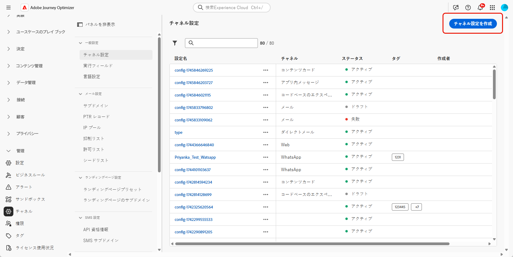
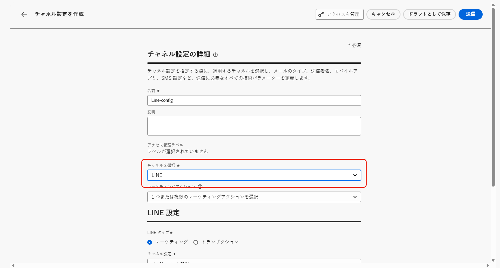

# Journey Optimizer での LINE チャネルの設定 {#line-configuration}

>[!BEGINSHADEBOX]

**このページ：** インターフェイスまたはAPIからLINE チャネル設定を設定して、Adobe Journey OptimizerがLINE Messaging APIで認証し、お客様にメッセージを送信できるようにします。

>[!ENDSHADEBOX]

1. **[!UICONTROL チャネル]**／**[!UICONTROL 一般設定]**／**[!UICONTROL チャネル設定]**&#x200B;メニューにアクセスし、「**[!UICONTROL チャネル設定を作成]**」をクリックします。

   

1. 設定の名前と説明（オプション）を入力し、設定するチャネルを選択します。

   >[!NOTE]
   >
   > 名前は、文字（A ～ Z）で始める必要があります。 使用できるのは英数字のみです。 アンダースコア（`_`）、ドット（`.`）、ハイフン（`-`）も使用できます。

1. 設定にカスタムまたはコアのデータ使用ラベルを割り当てるには、「**[!UICONTROL アクセスを管理]**」を選択します。 [オブジェクトレベルのアクセス制御（OLAC）について詳しくは、こちらを参照してください](../administration/object-based-access.md)。

1. **LINE** チャネルを選択します。

   

1. この設定を使用してメッセージに同意ポリシーを関連付けるには、**[!UICONTROL マーケティングアクション]**&#x200B;を選択します。 顧客の意向に従うために、そのマーケティングアクションに関連付けられているすべての同意ポリシーが活用されます。 [詳細情報](../action/consent.md#surface-marketing-actions)

1. 設定のメッセージのタイプを選択します。

   * **マーケティング**：小売店の毎週のプロモーションなど、プロモーションメッセージの場合。 これらのメッセージには、ユーザーの同意が必要であり、ユーザーのオプトインに関する LINE のポリシーに準拠する必要があります。
   * **トランザクション**：注文確認、パスワードリセット通知、配信の更新など、非商用メッセージの場合。 これらのメッセージは、アドビからのお知らせを登録解除したユーザーにも送信できますが、厳密には特定のトランザクションコンテキストに制限されています。

1. 「**[!UICONTROL チャネル設定]**」を選択します。

   **[!UICONTROL チャネル設定]**&#x200B;を行うには、アドビ担当者にお問い合わせください。

   

1. マッピングする **[!UICONTROL LINE ユーザー ID]** を選択します。 これは、LINE チャネル内の個々のユーザーにメッセージをリンクするために使用される識別子です。

   >[!NOTE]
   >
   >ここにマッピングするLINE ユーザーIDは、既にお客様の[!DNL Real-Time Customer Profile]に存在している必要があります。 LINE ユーザーIDを取得し（LINE ログインまたはLIFF SDK経由など）、Adobe Experience Platformに取り込み、ID サービスを使用して既知のIDに合成することで、[!DNL Journey Optimizer]が統合プロファイルに到達できるようにします。 [Journey OptimizerのIDの詳細](../audience/get-started-identity.md)。
   >
   >ID サービスを使用してLINE ユーザーIDをお客様のプロファイルと統合するエンドツーエンドの例については、コミュニティ記事[AEP ID ステッチを使用したLINE ユーザーIDとお客様のプロファイルの統合](https://experienceleaguecommunities.adobe.com/adobe-journey-optimizer-15/unifying-line-user-ids-with-customer-profiles-in-adobe-journey-optimizer-using-aep-identity-stitching-248680){target="_blank"}を参照してください。

1. ブランド名など、**[!UICONTROL 送信者名]**&#x200B;を入力します。

1. 変更を送信します。

LINE メッセージを作成する際に、設定を選択できるようになりました。

## LINE Channel settings API の設定 {#line-api}

この API は、LINE Messaging API への接続に必要な認証と設定の詳細を保存するチャネル設定を指定します。 これらの設定により、Adobe Journey Optimizer は指定された資格情報を使用して LINE を通じてメッセージを認証および送信できます。

**エンドポイント**

```
POST https://platform.adobe.io/journey/imp/config/channel-settings
```

| ヘッダー名 | 説明 |
|-|-|
| 認証 | 技術アカウントからのユーザートークン |
| x-api-key | Adobe Developer Console からのクライアント ID |
| x-gw-ims-org-id | IMS 組織 ID |
| x-sandbox-name | サンドボックス名（例：prod） |
| Content-Type | application/json である必要があります |


**リクエスト本文**

```json
{
    "name": "your_defined_name",
    "channelRegistryId": "line",
    "channel": "line",
    "channelSettings": {
        "channelId": "your_line_channel_id",
        "channelSecret": "your_line_channel_secret"
    }
}
```

**チャネル設定の応答**

```json
{
"id": "3603ed66-ae86-42b8-8a90-d4b4e54e7c3b",
"name": "your_defined_name",
"channelRegistryId": "line",
"channel": "line",
"channelSettings": {
    "channelId": "your_line_channel_id",
    "channelSecret": "your_line_channel_secret"
    },
    "channelPublicationId": "v1_line",
    "createdAt": "2025-07-30T12:00:00.000Z",
    "modifiedAt": "2025-07-30T12:00:00.000Z",
    "isFromLatestVersion": true,
    "_etag": "\"eab98d24-18af-48ae-90f9-e59d4f8cfb2b\""
}
```
