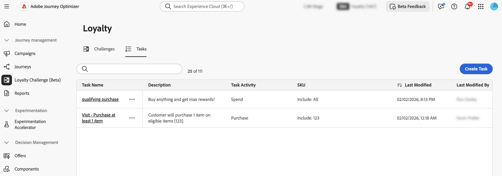

# 課題とタスクへのアクセスと管理 {#access-loyalty-challenges}

>[!BEGINSHADEBOX]

**ロイヤルティの課題に関するドキュメント：**

* [ロイヤルティに関する課題を解決](get-started.md)
* **課題とタスクへのアクセスと管理** ◀︎ **現在のユーザー**
* [課題の創出](create-challenges.md)
* [タスクの作成](create-tasks.md)
* [ ロイヤルティチャレンジ API リファレンス ](https://developer.adobe.com/journey-optimizer-apis/references/loyalty-challenges/){target="_blank"}

>[!ENDSHADEBOX]

>[!AVAILABILITY]
>
>この機能は現在&#x200B;**プライベートベータ版**&#x200B;です。 リリースサイクルと可用性フェーズについて詳しくは、[Journey Optimizer リリースサイクル](../rn/releases.md)を参照してください。

## 課題とタスクへのアクセスと管理

ロイヤルティチャレンジにアクセスするには、Journey Optimizerに移動し、**[!UICONTROL ジャーニー管理]** セクションの&#x200B;**[!UICONTROL ロイヤルティチャレンジ（Beta）]**&#x200B;を選択します。 ロイヤルティ課題インターフェイスは、あらゆる課題とタスクを表示、管理、整理するための一元的な場所を提供します。

このインターフェイスでは、次の2つの主なインベントリにアクセスできます。

* **課題**：ロイヤルティに関するすべての課題を表示および管理し、その状況を監視し、課題の表示、編集、複製、削除などの迅速なアクションを実行します
* **タスク**：複数の課題で使用できる再利用可能なタスクを参照し、タスク定義を個別に管理します

## 課題とインベントリー {#challenges-tab}

「**[!UICONTROL 課題]**」タブには、最終変更日で並べ替えられたすべての課題が表示され、最も最近変更された課題が最初に表示されます。

表示されるキー情報：

* **[!UICONTROL 状態]**：チャレンジの現在の状態（ドラフトまたは公開済み）
* **[!UICONTROL タスク]**：チャレンジで設定されたタスクの数
* **[!UICONTROL ジャーニー]**：課題に関連付けられた自動生成ジャーニーへのリンク
* **[!UICONTROL ステータス]**：課題を提供する自動生成ジャーニーの現在のステータス。
* **[!UICONTROL 開始日/終了日（UTC）]**：チャレンジがアクティブになり、有効期限が切れる

「課題」タブでは、課題に対してアクションを実行できます。

* **チャレンジを表示**: チャレンジ名を選択して、その詳細ページを開きます
* **チャレンジを複製**:  アイコンを選択し、**[!UICONTROL 複製]**&#x200B;を選択します。 タスク、コンテンツ、メッセージをすべてそのままの状態でコピーが作成されます。
* **チャレンジを削除**:  アイコンを選択し、**[!UICONTROL 削除]**&#x200B;を選択します。

  >[!IMPORTANT]
  >
  >チャレンジが公開された場合でも、チャレンジを削除できます。 削除する前に影響を考慮する：

* **チャレンジを編集**: チャレンジ名を選択して詳細ページを開き、必要な変更を加えます。

  公開済みチャレンジを編集のために開く場合は、まずドラフト状態に戻す必要があります。 自動生成されたジャーニーに対して直接行ったカスタマイズは、すべて失われます。 変更を加えた後、課題を保存して再度公開してから、関連するジャーニーを公開します。 [ チャレンジを開始する方法を学ぶ](create-challenges.md#launch)

  >[!IMPORTANT]
  >
  >公開したチャレンジをドラフトに戻すことはできません。 先に進む前に、アクティブなジャーニーへの影響を考慮してください。

## タスクの在庫 {#tasks-tab}

「**[!UICONTROL タスク]**」タブには、複数の課題で使用できるすべての再利用可能なタスクが表示されます。 ここで作成したタスクは、チャレンジを作成または編集する際に選択できるようになります。

表示されるキー情報：

* **[!UICONTROL 説明]**: タスクに必要な内容の簡単な説明
* **[!UICONTROL タスクアクティビティ]**：アクティビティのタイプ（購入、支出）
* **[!UICONTROL SKU]**：対象アイテムまたは除外アイテム
* **[!UICONTROL チャレンジで使用]**：現在このタスクを使用しているチャレンジの数

「タスク」タブでは、タスクに対してアクションを実行できます。

* **タスクの表示/編集**：タスク名を選択して、完全な設定を表示し、タスクを編集します
* **タスクを複製**:  アイコンを選択し、**[!UICONTROL 複製]**&#x200B;を選択します
* **タスクを削除**:  アイコンを選択し、**[!UICONTROL 削除]**&#x200B;を選択します。

  >[!IMPORTANT]
  >
  >タスクは、1つ以上の課題で使用されている場合でも削除できます。 削除前に、タスクを参照する課題への影響を検討します。
