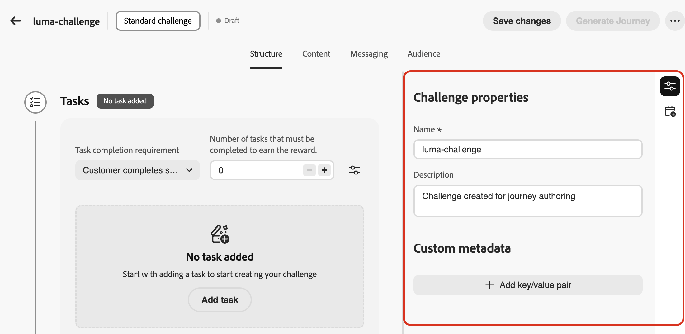
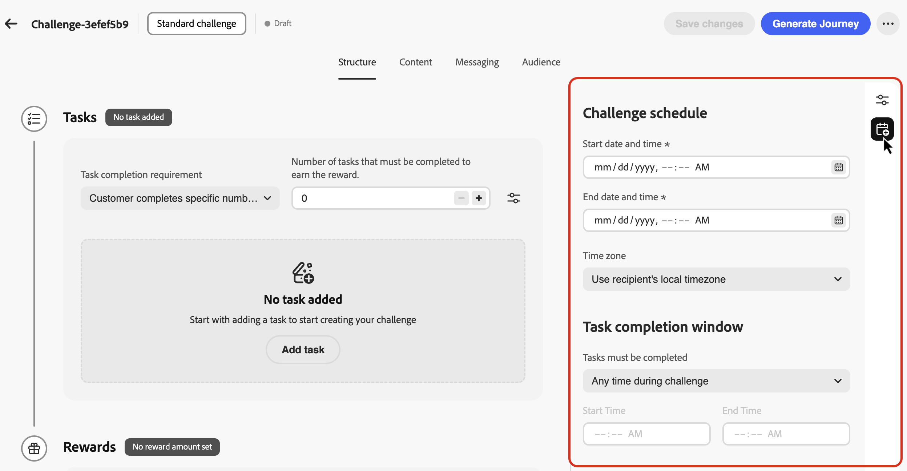
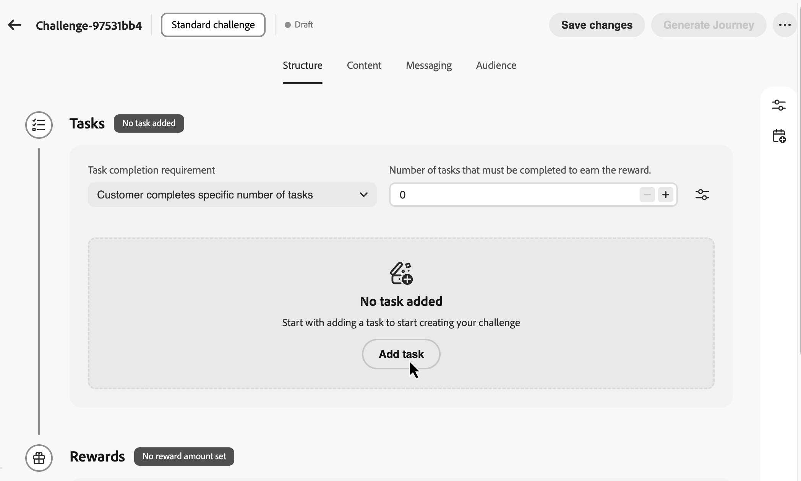
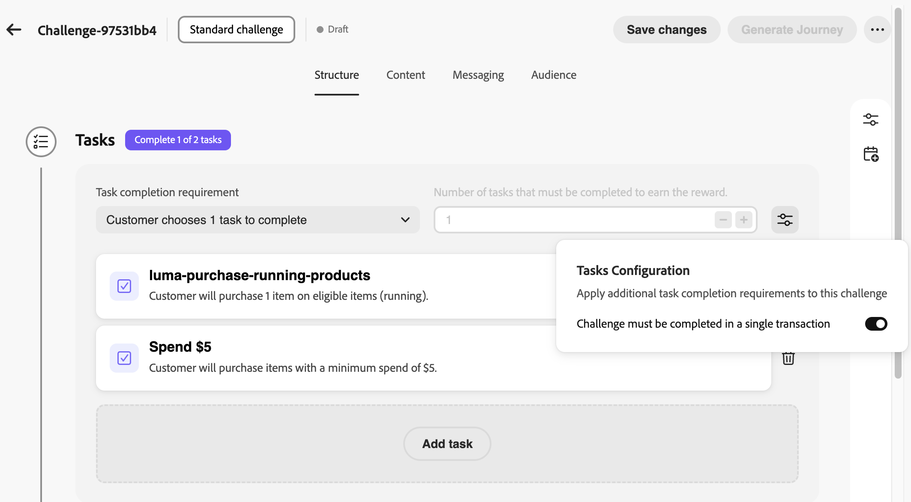
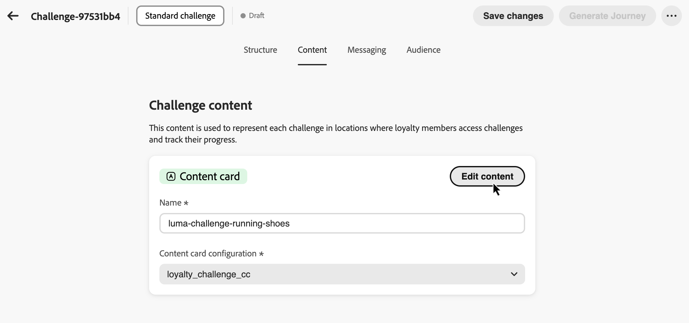
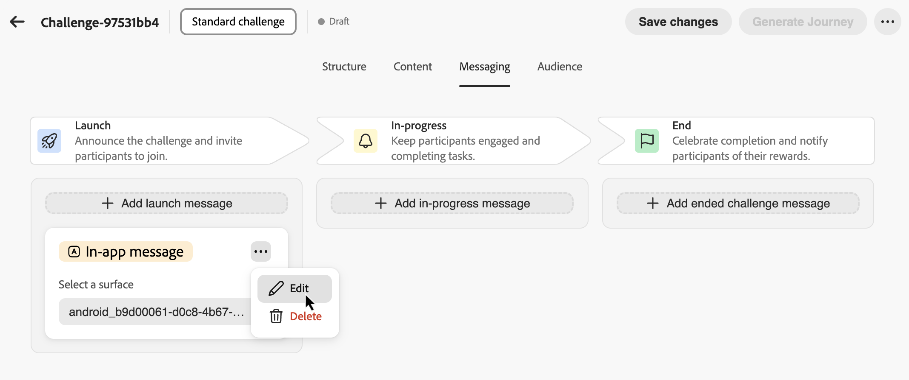
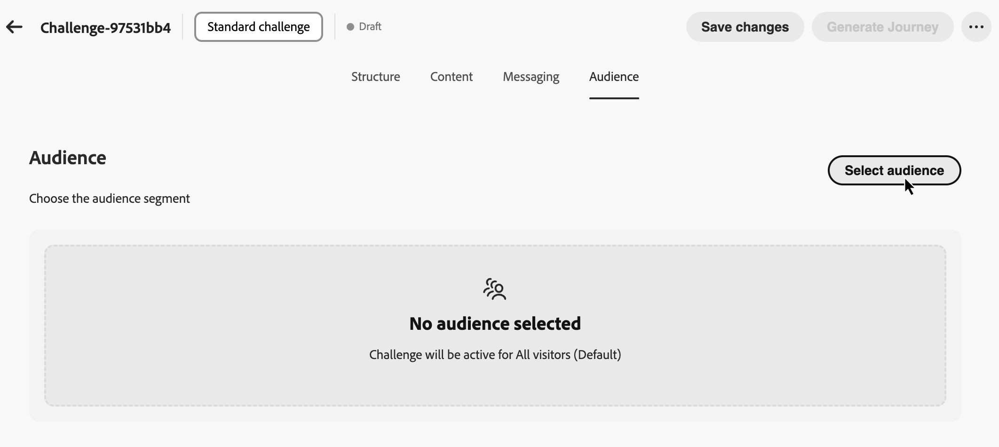
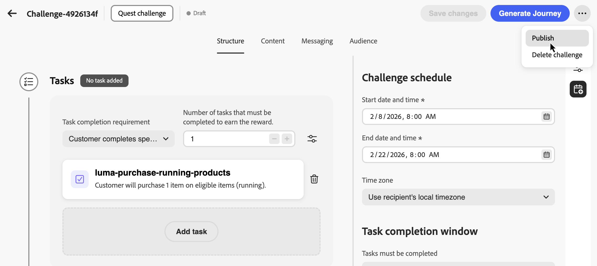

# 課題の創出 {#create-challenges}

>[!BEGINSHADEBOX]

**ロイヤルティの課題に関するドキュメント：**

* [ロイヤルティに関する課題を解決](get-started.md)
* [課題とタスクへのアクセスと管理](access-loyalty-challenges.md)
* **課題を作成** ◀︎ **現在の状況**
* [タスクの作成](create-tasks.md)
* [ ロイヤルティチャレンジ API リファレンス ](https://developer.adobe.com/journey-optimizer-apis/references/loyalty-challenges/){target="_blank"}

>[!ENDSHADEBOX]

>[!AVAILABILITY]
>
>この機能は現在&#x200B;**プライベートベータ版**&#x200B;です。 リリースサイクルと可用性フェーズについて詳しくは、[Journey Optimizer リリースサイクル](../rn/releases.md)を参照してください。

このページでは、チャレンジタイプの選択から、そのプロパティの設定、課題を顧客に提供するジャーニーの生成と公開に至るまで、ロイヤルティチャレンジを作成するプロセス全体を説明します。

## 課題の構築 {#create-the-challenge}

1. Journey Optimizerの&#x200B;**[!UICONTROL ロイヤルティチャレンジ （Beta）]**&#x200B;に移動します。

1. 「**[!UICONTROL チャレンジ]**」タブを選択し、「**[!UICONTROL チャレンジを作成]**」を選択します。

   

1. チャレンジの種類を選択します。

   * **[!UICONTROL Standard]**：お客様は、指定された数のタスクを任意の順序で完了できます\
     *例：使用可能な5つのタスクのうち3つを完了*

   * **[!UICONTROL Streak]**：顧客は同じタスクを複数回連続して完了します\
     *例：7日連続で購入する*

   * **[!UICONTROL 順次]**：顧客は定義された順序でタスクを完了します\
     *例：購入→レビュー→共有（この順序で完了する必要があります）*

   チャレンジタイプを選択すると、チャレンジ作成インターフェイスが開き、複数の設定タブが表示されます。 まず、チャレンジ構造を設定します。

## チャレンジ構造の設定 {#structure}

「**[!UICONTROL 構造]**」タブで、チャレンジの構成方法（プロパティ、スケジュール、完了するタスク、達成する報酬）を定義します。

### チャレンジプロパティを定義し、カスタムメタデータを使用して {#properties}

>[!CONTEXTUALHELP]
>id="ajo_loyalty_challenge_properties"
>title="チャレンジプロパティ"
>abstract="チャレンジのプロパティ ペインで、チャレンジの名前と説明を設定し、トラッキングまたは外部統合用のカスタムキー/値メタデータを追加します。"

1. **[!UICONTROL チャレンジのプロパティ]** ペインで、チャレンジのグローバル設定を定義します。

   * **[!UICONTROL 名前]**：チャレンジの説明的な名前を入力します。 この名前が課題インベントリに表示されます。
   * **[!UICONTROL 説明]**：課題の目的と目標を説明する説明を入力します。

1. 「**[!UICONTROL カスタムメタデータ]**」セクションを使用して、キーと値のペアを使用してカスタムメタデータを追加します。 このメタデータは、追跡や外部システムとの統合に使用できます。

   

### チャレンジのスケジュール {#schedule}

>[!CONTEXTUALHELP]
>id="ajo_loyalty_challenge_schedule"
>title="チャレンジスケジュール"
>abstract="スケジュールを使用して、チャレンジがライブになるタイミングを定義します。チャレンジが顧客に使用可能になる開始日時、およびチャレンジが完了の受け付けを停止する終了日時を設定します。 タイムゾーンを選択し、**[!UICONTROL タスク完了ウィンドウのセクション]**&#x200B;で、顧客がタスクを完了できるタイミングを選択します。"

チャレンジの実行時に設定します。

1. 「**[!UICONTROL スケジュールを開く]**」アイコンを選択します。

   

1. 次のスケジュール設定オプションを設定します。

   * **[!UICONTROL 開始日時]**：チャレンジが顧客に使用可能になる日時を設定します。
   * **[!UICONTROL 終了日時]**：チャレンジが期限切れになり、新しい完了を受け入れなくなった日時を設定します。
   * **[!UICONTROL タイムゾーン]**：チャレンジでは、デフォルトで受信者のローカルタイムゾーンが使用されます。
   * **[!UICONTROL タスクを完了する必要があります]**：顧客がタスクを完了できるタイミングを選択します。

      * **[!UICONTROL チャレンジ中はいつでも]**：お客様は、チャレンジの開始日と終了日の間はいつでもタスクを完了できます。
      * **[!UICONTROL 日の特定の時間内]**:「**[!UICONTROL 開始時間]**」と「**[!UICONTROL 終了時間]**」を設定して、タスクの完了を特定の日別時間に制限します。

これで、チャレンジスケジュールが設定されました。 続いて、顧客が完了する必要があるタスクを追加します。

### タスクの追加 {#add-tasks}

>[!CONTEXTUALHELP]
>id="ajo_loyalty_challenge_tasks"
>title="タスク"
>abstract="チャレンジを完了するために実行するタスクを選択します。 次に、チャレンジの完了方法を設定します。使用可能なオプションは、チャレンジのタイプ（標準、ストリーク、またはシーケンシャル）によって異なります。"

タスクとは、顧客が報酬を得るために実行しなければならない特定のアクションを定義します。 タスクのタイプ（購入、支出）、数量、製品フィルターなどの属性を設定できます。

課題にタスクを追加するには、次の手順に従います。

1. 「**[!UICONTROL タスク]**」セクションで、「**[!UICONTROL タスクを追加]**」を選択します。

   

1. **[!UICONTROL タスクインベントリ]**&#x200B;が開きます。 リストから1つ以上のタスクを選択し、**[!UICONTROL 追加]**&#x200B;を選択します。 新しいタスクを作成するには、**[!UICONTROL 新規]**&#x200B;を選択します。 [ タスクの作成と設定方法について説明します](create-tasks.md)。

1. チャレンジが完了したと見なされるタイミングを指定します。 使用可能な設定は、チャレンジのタイプによって異なります。

   +++標準的な課題

   「**[!UICONTROL タスクの完了要件]**」ドロップダウンで、次のいずれかを選択します。

   * **[!UICONTROL お客様が完了する1つのタスクを選択]** - *お客様は任意の1つのタスクを選択して完了し、報酬を獲得できます*
   * **[!UICONTROL お客様は特定の数のタスクを完了します]** - *お客様は定義された数のタスクを完了する必要があります。 完了する必要なタスク数を指定してください。*

   +++

   +++Streakの課題

   「**[!UICONTROL ストリークの種類]**」ドロップダウンで、次のいずれかを選択します。

   * **連続**：お客様は、連続した日にタスクを中断なく完了する必要があります。 *例：月曜日、火曜日、水曜日に購入します。1日欠けると連鎖が途切れます。*

   * **連続しない**：お客様は、完了と完了の間にギャップがあるタスクを完了できます。 *例：30日間で7回の購入を完了し、休憩を許可します。*

   「**[!UICONTROL Streak length]**」フィールドで、タスクを完了する必要がある回数を指定します。 *例：「7日間の購入ストリーク」の場合は7に設定します。*

   +++

   +++順を追った課題

   「**[!UICONTROL タスクの完了要件]**」ドロップダウンで、次のいずれかを選択します。

   * **[!UICONTROL お客様が完了する1つのタスクを選択]** - *お客様は任意の1つのタスクを選択して完了し、報酬を獲得できます*
   * **[!UICONTROL お客様は特定の数のタスクを完了します]** - *お客様は、定義した順番に、定義された数のタスクを完了する必要があります。 タスクを見逃したりスキップしたりすると、シーケンスが壊れます。 完了する必要なタスク数を指定してください*

   +++

1. デフォルトでは、標準的な課題と連続的な課題により、顧客は複数のトランザクションでタスクを完了できます。 すべてのタスクを1つのトランザクションで完了させるには、**[!UICONTROL 設定]** アイコンを選択し、以下のオプションを切り替えます。

   

課題にタスクを追加したら、顧客が達成する報酬を設定します。

### 報酬の設定 {#rewards}

>[!CONTEXTUALHELP]
>id="ajo_loyalty_challenge_rewards"
>title="リワード"
>abstract="顧客がポイントを獲得するタイミングを選択します。チャレンジ全体を完了するタイミング、またはタスクのマイルストーンを進行するタイミングを選択します。 報酬プロバイダー（ポイントと報酬を管理するロイヤルティソリューション）を選択し、金額を設定します。完全な完了の場合は単一の合計、マイルストーンの場合はタスクごとの値を選択し、支払うタスクに対してのみ報酬をオンにします。"

報酬とは、課題を完了した場合に顧客が受け取るロイヤルティポイントまたはメリットのことです。

報酬を配信するタイミングと方法を設定するには：

1. **[!UICONTROL 特典配信]** ドロップダウンメニューで、特典を配信するタイミングを選択します。

   * **[!UICONTROL チャレンジが完了したら報酬を提供する]**：お客様がチャレンジ全体を完了すると報酬を受け取る\
     *例：5つのタスクをすべて完了すると、100 ポイントが付与されます*

   * **[!UICONTROL チャレンジの進捗状況が確認されると、タスク完了マイルストーンで報酬を提供します]**：顧客が個々のタスクを完了すると、報酬が段階的に提供されます（複数のタスクを必要とするチャレンジにのみ利用可能）\
     *例：タスク 1の後に10 ポイント、タスク 2の後に20 ポイント、タスク 3*&#x200B;の後に50 ポイント

1. 報酬プロバイダーを選択します。 顧客ポイントと特典を管理するロイヤルティソリューションです。

   

1. 選択した配信方法に基づいて報酬額を設定します。

   +++課題が完了したら報酬を提供

   顧客がチャレンジ全体を完了したときに与える合計報酬額を指定します。

   *以下の例では、チャレンジを完了すると、顧客に100 ポイントが付与されます。*

   

   +++

   +++タスク完了のマイルストーンで報酬を提供する

   タスク完了マイルストーンの報酬額を指定します。 このオプションを使用すると、課題を進めながら顧客のモチベーションを高めるプログレッシブ報酬を作成できます。

   報酬を配信する任意のタスクに対して、報酬オプションを切り替え、顧客がその特定のタスクを完了したときに授与するポイント数を指定します。 特定のタスクの完了に対してのみ報酬を与えることもできます。例えば、10個のタスクがある場合、1個、5個、10個のタスクのみを報酬として与えることができます。

   *次の例では、最初のタスクを完了すると10 ポイント、2番目のタスクを完了すると50 ポイントが加算されます。*

   

   +++

タスクと報酬を使用してチャレンジ構造を設定した後、顧客にチャレンジを表示するコンテンツカードをデザインします。

## コンテンツカードの設定 {#configure-content-cards}

>[!CONTEXTUALHELP]
>id="ajo_loyalty_challenge_content"
>title="コンテンツ"
>abstract="顧客デバイスでのチャレンジを表すコンテンツカードを設定し、チャレンジ情報、進捗状況、報酬を表示します。 カードの名前を入力し、チャネル設定を選択して、配信が適切な技術設定（ヘッダー、サブドメイン、モバイルアプリなど）を使用できるようにしてから、「コンテンツを編集」を選択して、カードエクスペリエンスをデザインおよびパーソナライズします。"

コンテンツカードは、顧客デバイス上の課題を視覚的に表し、課題情報、進捗状況、報酬を表示します。 [ コンテンツカードの詳細](../content-card/create-content-card.md)。

課題に対してコンテンツカードを設定するには：

1. 「**[!UICONTROL コンテンツ]**」タブに移動し、コンテンツカードの&#x200B;**[!UICONTROL 名前]**&#x200B;を入力します。

1. **[!UICONTROL チャネル設定]**&#x200B;を選択します。 チャネル設定には、ヘッダーパラメーター、サブドメイン、モバイルアプリなど、メッセージを送信するためのあらゆる技術的なパラメーターが含まれています。 [ チャネル設定の詳細](../configuration/channel-surfaces.md)。

1. 「**[!UICONTROL コンテンツを編集]**」を選択して、コンテンツカードをデザインします。 [ コンテンツカードをデザインおよびパーソナライズする方法について説明します](../content-card/design-content-card.md)。

   

コンテンツカードを設定したら、課題のライフサイクル全体を通じて顧客をエンゲージするメッセージを設定します。

### メッセージの設定 {#configure-messaging}

>[!CONTEXTUALHELP]
>id="ajo_loyalty_challenge_messaging"
>title="メッセージ"
>abstract="メッセージは、課題のライフサイクル全体にわたってエンゲージメントを促進します。 「メッセージ」タブで、各ステージのメッセージを追加します。ローンチ（チャレンジが開始された時点）、進行中（リマインダーと進捗状況の更新）、完了（成功を祝い、報酬を確認）。 各段階で、メッセージを追加し、チャネルを選択し、チャネル設定を選択してから「編集」を選択してメッセージコンテンツをデザインします。"

マルチチャネルメッセージを設定し、課題のライフサイクルの主要な段階で顧客をエンゲージします。 メッセージはオプションですが、顧客エンゲージメントを最大化するためにお勧めします。

1. 「**[!UICONTROL メッセージ]**」タブに移動し、各ライフサイクルステージのメッセージを設定します。

   * **Launch** メッセージ：チャレンジの開始時に顧客に通知
   * **進行中**&#x200B;のメッセージ：リマインダーと進行状況の更新に関する顧客の関心を維持
   * **完了** メッセージ：成功を祝い、報酬配分を確認します

1. 各ステージの「メッセージを追加」ボタンをクリックして、そのステージのメッセージを作成します。

1. 目的のチャネルを選択します：**[!UICONTROL アプリ内]**、**[!UICONTROL 電子メール]**、または&#x200B;**[!UICONTROL プッシュ通知]**。関連するチャネル設定を選択します。

1.  アイコンを選択し、**[!UICONTROL 編集]**&#x200B;を選択してメッセージコンテンツをデザインします。

   

特定のチャネルのメッセージを作成する方法については、次の節を参照してください。[ アプリ内メッセージ ](../in-app/get-started-in-app.md) - [ メールメッセージ ](../email/get-started-email.md) - [ プッシュ通知](../push/get-started-push.md)

メッセージ設定が完了したら、チャレンジに参加する資格のある顧客を定義します。

## チャレンジオーディエンスの選択 {#audience}

>[!CONTEXTUALHELP]
>id="ajo_loyalty_challenge_audience"
>title="オーディエンス"
>abstract="「オーディエンス」タブで、使用可能なAdobe Experience Platform オーディエンスからチャレンジに参加できるユーザーを選択します。"

ロイヤルティの課題に参加できる顧客を特定。

1. 「**[!UICONTROL オーディエンス]**」タブに移動し、「**[!UICONTROL オーディエンスを選択]**」ボタンをクリックします。

   

1. オーディエンス選択ダイアログで、利用可能なAdobe Experience Platform オーディエンスのリストからターゲットオーディエンスを選択し、**[!UICONTROL オーディエンスを追加]**&#x200B;を選択します。 [ オーディエンスの操作方法を学ぶ](../audience/about-audiences.md)。

これで、課題の構造、コンテンツ、メッセージ、ターゲットオーディエンスが完全に設定されました。 チャレンジを起動するには、チャレンジと関連するジャーニーを公開する必要があります。

## 課題の立ち上げ {#launch}

チャレンジを起動するには、**3つの手順**&#x200B;が必要です：（1） チャレンジを公開する、（2） ジャーニーを生成する、（3） ジャーニーを公開する。 課題を顧客に提供するには、3つのタスクを完了する必要があります。

1. チャレンジの設定を確認して、すべての必須フィールドが完了していることを確認します。

1.  アイコンをクリックし、**[!UICONTROL 公開]**&#x200B;を選択します。

   

1. 「**[!UICONTROL ジャーニーを生成]**」を選択して、チャレンジ配信を調整するジャーニーを作成します。

   

1. Journey Optimizerは、「ドラフト」ステータスでジャーニーを自動的に作成します。 ジャーニーがジャーニーインベントリに表示され、名前フォーマットは&#x200B;*「ジャーニー: [ チャレンジ名]」*&#x200B;です。 [ ジャーニーインベントリの詳細](../building-journeys/journey-ui.md)。

   

1. ジャーニーを開いて公開します。 ジャーニーは、指定したチャレンジ開始日に自動的に開始され、設定に従ってコンテンツとメッセージが配信されます。 [ ジャーニーを公開する方法について説明します](../building-journeys/publish-journey.md)。

1. チャレンジが開始されたら、[ ジャーニーレポート ](../reports/journey-global-report-cja.md)でパフォーマンスとメッセージ配信を監視します。

>[!NOTE]
>
>自動生成されたジャーニーをカスタマイズして、ロジックやメッセージを追加することもできます。 ただし、ジャーニーに直接加えた変更は、チャレンジ設定には同期されません。 後で課題を編集すると、ジャーニーが再生成されるときにジャーニーのカスタマイズが失われます。
