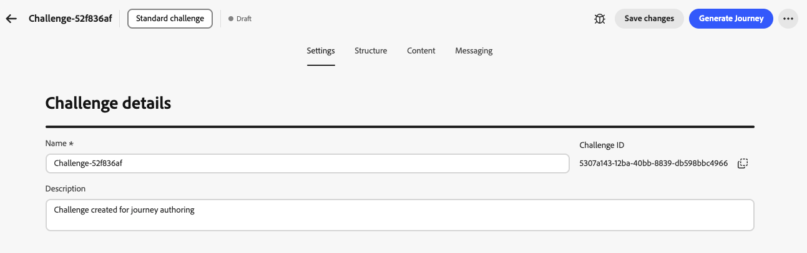
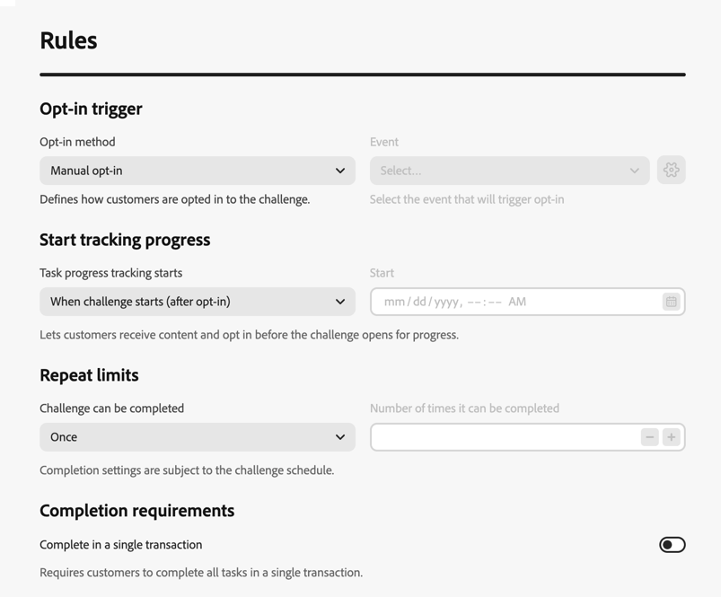
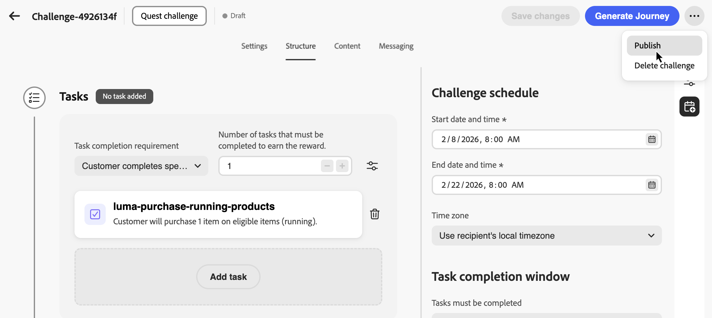

# 課題の創出 {#create-challenges}

>[!BEGINSHADEBOX]

**目次**

[ロイヤルティに関する課題を解決](get-started.md)

<table style="table-layout:fixed">
<tr style="border: 0;">
<td style="vertical-align:top;">

**課題の作成と管理**

* [課題とタスクへのアクセスと管理](access-loyalty-challenges.md)
* **課題を作成** ◀︎ **現在の状況**
* [タスクの作成](create-tasks.md)
* [ロイヤルティチャレンジのパフォーマンスを監視する](loyalty-reporting.md)

</td>
<td style="vertical-align:top;">

**設定と統合**

* [ロイヤルティに関する課題の設定](loyalty-admin.md)
* [ロイヤルティデータとデータセット](loyalty-data-and-datasets.md)
* [ロイヤルティチャレンジ API リファレンス](https://developer.adobe.com/journey-optimizer-apis/references/loyalty-challenges){target="_blank"}

</td>
</tr>
</table>

>[!ENDSHADEBOX]

>[!AVAILABILITY]
>
>この機能は現在&#x200B;**プライベートベータ版**&#x200B;です。 リリースサイクルと可用性フェーズについて詳しくは、[Journey Optimizer リリースサイクル](../rn/releases.md)を参照してください。

このページでは、課題タイプの選択、設定、構造、コンテンツ、メッセージの設定から、課題を顧客に提供するジャーニーの生成と公開に至るまで、ロイヤルティ課題を作成するプロセス全体を説明します。

## 課題の構築 {#create-the-challenge}

1. Journey Optimizerの&#x200B;**[!UICONTROL ロイヤルティチャレンジ （Beta）]**&#x200B;に移動します。

1. 「**[!UICONTROL チャレンジ]**」タブを選択し、「**[!UICONTROL チャレンジを作成]**」を選択します。

   

1. チャレンジの種類を選択します。

   * **[!UICONTROL Standard]**：お客様は、指定された数のタスクを任意の順序で完了できます\
     *例：使用可能な5つのタスクのうち3つを完了*

   * **[!UICONTROL Streak]**：顧客は同じタスクを複数回連続して完了します\
     *例：7日連続で購入する*

   * **[!UICONTROL 順次]**：顧客は定義された順序でタスクを完了します\
     *例：購入→レビュー→共有（この順序で完了する必要があります）*

   * **[!UICONTROL 独自のデータを取り込む]**: タスクや報酬などのチャレンジフレームワークをロイヤルティチャレンジデータ統合から組み立てる場合は、**[!UICONTROL 独自のデータを取り込む]**&#x200B;を選択します。 このタイプを選択すると、**[!UICONTROL 構造]** タブは読み取り専用になります。 **[!UICONTROL 設定]**、**[!UICONTROL コンテンツ]**、**[!UICONTROL メッセージング]**&#x200B;を、他のチャレンジタイプと同じように設定します。

     >[!AVAILABILITY]
     >
     >**[!UICONTROL 独自のデータを取り込む]** チャレンジの種類は、現在、制限された組織のセットで利用でき、今後のリリースでより広く利用できるようになります。

   チャレンジタイプを選択すると、チャレンジエディターが開き、**[!UICONTROL 設定]**、**[!UICONTROL 構造]**、**[!UICONTROL コンテンツ]**、および&#x200B;**[!UICONTROL メッセージ]**&#x200B;のタブが表示されます。 **[!UICONTROL 設定]**&#x200B;から開始して、課題の詳細、オーディエンス、スケジュール、ルールを定義します。 次に、**[!UICONTROL 独自のデータを取り込む]**&#x200B;を除くすべてのタイプについて、**[!UICONTROL 構造]** （タスクと報酬）を設定します。

## チャレンジ設定の設定 {#settings}

**[!UICONTROL 設定]** タブで、チャレンジ レベルのプロパティを設定します。チャレンジの実行時、メンバーがオプトインして進捗状況を取得する方法、オプションのメタデータを参加できるユーザーを指定します。

### 課題の詳細 {#challenge-details}

>[!CONTEXTUALHELP]
>id="ajo_loyalty_challenge_properties"
>title="課題の詳細"
>abstract="課題の名前と説明を設定します。 課題 ID は、課題の作成時に自動的に割り当てられ、API または統合使用のためにコピーできます。"

1. 「**[!UICONTROL チャレンジの詳細]**」セクションで、次の項目を定義します。

   * **[!UICONTROL 名前]**：チャレンジの説明的な名前を入力します。 この名前が課題インベントリに表示されます。
   * **[!UICONTROL チャレンジ ID]**：チャレンジの作成時に割り当てられた一意のID。 コピー制御を使用して、APIまたは外部システムでこのIDを参照します。
   * **[!UICONTROL 説明]**：課題の目的と目標を説明する説明を入力します。

   

### オーディエンス {#audience}

>[!CONTEXTUALHELP]
>id="ajo_loyalty_challenge_audience"
>title="オーディエンス"
>abstract="課題に参加できるユーザーを選択します。 Adobe Experience Platform オーディエンスを追加するか、オーディエンスを空のままにすると、すべてのロイヤルティメンバーが実施要件を満たします。 オプションで、前提条件として他の課題の完了が必要です。"

ロイヤルティへの取り組みに参加できる登録者を定義。

1. **[!UICONTROL Audience]** セクションで、**[!UICONTROL Add audience]**&#x200B;を選択して、チャレンジを特定のAdobe Experience Platform オーディエンスに制限します。 [ オーディエンスの操作方法を学ぶ](../audience/about-audiences.md)。

   

1. **[!UICONTROL チャレンジの前提条件]**&#x200B;で、**[!UICONTROL チャレンジの完了を要求]**&#x200B;を選択して、選択した1つ以上のチャレンジを既に完了しているメンバーに資格を制限します。

### スケジュール {#schedule}

>[!CONTEXTUALHELP]
>id="ajo_loyalty_challenge_schedule"
>title="課題スケジュール"
>abstract="開始日時、終了日時、タイムゾーンを使用して、課題がライブになるタイミングを設定します。 タスク完了ウィンドウで、課題期間中に顧客がタスクを完了できるタイミングを選択します。"

チャレンジの実行時に設定します。

1. **[!UICONTROL スケジュール]** セクションで、次のように設定します。

   * **[!UICONTROL 開始日時]**：チャレンジが顧客に対して使用可能になる日時。
   * **[!UICONTROL 終了日時]**：チャレンジが期限切れになり、新しい完了を受け入れなくなった日時。
   * **[!UICONTROL タイムゾーン]**：チャレンジ スケジュールに使用されるタイムゾーン。

   

1. **[!UICONTROL タスク完了ウィンドウ]**&#x200B;で、お客様がタスクを完了できるタイミングを選択します。

   * **[!UICONTROL チャレンジ中はいつでも]**：お客様は、チャレンジの開始日と終了日の間はいつでもタスクを完了できます。
   * **[!UICONTROL 特定の時間内]**:**[!UICONTROL 開始時間]**&#x200B;と&#x200B;**[!UICONTROL 終了時間]**&#x200B;を設定して、タスクの完了を特定の日別時間に制限します。

### ルール {#rules}

メンバーがオプトインする方法、タスクの進捗状況がチャレンジにカウントされるタイミング、チャレンジを完了できる回数を設定します。

* **[!UICONTROL オプトイントリガー]**:

   * **[!UICONTROL オプトイン方法]**：お客様がチャレンジに手動で参加するか、イベントトリガーを通じて参加するかを選択します。
   * **[!UICONTROL Event]**: イベントベースのオプトインの場合は、トリガーがオプトインするイベントを選択します。 管理者は、 ボタンをクリックして、イベント定義を作成できます。 [ イベント定義の設定方法を学ぶ](loyalty-admin.md#event-definitions)

* **[!UICONTROL 進行状況の追跡を開始]**:

   * **[!UICONTROL タスクの進捗状況の追跡を開始]**: タスクの完了がチャレンジの進捗状況にカウントされるタイミングを選択します。 例えば、**[!UICONTROL チャレンジが（オプトイン後に）開始されると]**&#x200B;を選択し、メンバーがオプトインし、チャレンジがアクティブになった後に進捗が開始されます。

     チャレンジがメンバーに表示されるタイミングと、進捗状況が追跡されるタイミングを切り離すことができます。 たとえば、タスクが完了する前に、チャレンジカードを表示し、オプトインを受け入れることで、後日、進行状況を確認することができます。

   * **[!UICONTROL 開始]**: カスタム開始オプションを選択すると、進行状況の追跡が開始される日時を設定します。

* **[!UICONTROL 繰り返し制限]**:

   * **[!UICONTROL チャレンジを完了できます]**：チャレンジを1回または複数回完了できるかどうかを選択します。 例えば、**[!UICONTROL 1回]**&#x200B;または定義された完了数などです。

   * **[!UICONTROL 完了できる回数]**：繰り返しが有効になっている場合は、メンバーがチャレンジを完了できる回数を指定します。

### カスタムメタデータ {#custom-metadata}

「**[!UICONTROL カスタムメタデータ]**」セクションで、「**[!UICONTROL キーと値のペアを追加]**」を選択して、カスタムメタデータを追加します。 メタデータを使用して、追跡や外部システムとの統合を行うことができます。

## チャレンジ構造の設定 {#structure}

「**[!UICONTROL 構造]**」タブで、お客様が完了する必要があるタスクと獲得する報酬を定義します。 このタブは、**[!UICONTROL 独自のデータを取り込む]**&#x200B;課題には使用されません。

### タスクを追加 {#add-tasks}

>[!CONTEXTUALHELP]
>id="ajo_loyalty_challenge_tasks"
>title="タスク"
>abstract="課題を完了するために実行するタスクを選択します。 次に、課題の完了方法を設定します。使用可能なオプションは、課題タイプ（標準、ストリーク、シーケンシャル）によって異なります。"

タスクとは、顧客が報酬を得るために実行しなければならない特定のアクションを定義します。 タスクタイプ（購入、支出、カスタムイベント）、数量、製品フィルター、その他の属性を設定できます。

課題にタスクを追加するには、次の手順に従います。

1. 「**[!UICONTROL タスク]**」セクションで、「**[!UICONTROL タスクを追加]**」を選択します。

   

1. **[!UICONTROL タスクインベントリ]**&#x200B;が開きます。 リストから1つ以上のタスクを選択し、**[!UICONTROL 追加]**&#x200B;を選択します。 新しいタスクを作成するには、**[!UICONTROL 新規]**&#x200B;を選択します。 [ タスクの作成と設定方法について説明します](create-tasks.md)。

1. チャレンジが完了したと見なされるタイミングを指定します。 使用可能な設定は、チャレンジのタイプによって異なります。

   +++標準的な課題

   「**[!UICONTROL タスクの完了要件]**」ドロップダウンで、次のいずれかを選択します。

   * **[!UICONTROL お客様が完了する1つのタスクを選択]** - *お客様は任意の1つのタスクを選択して完了し、報酬を獲得できます*
   * **[!UICONTROL お客様は特定の数のタスクを完了します]** - *お客様は定義された数のタスクを完了する必要があります。 完了する必要なタスク数を指定してください。*

   +++

   +++Streakの課題

   「**[!UICONTROL ストリークの種類]**」ドロップダウンで、次のいずれかを選択します。

   * **連続**：お客様は、連続した日にタスクを中断なく完了する必要があります。 *例：月曜日、火曜日、水曜日に購入します。1日欠けると連鎖が途切れます。*

   * **連続しない**：お客様は、完了と完了の間にギャップがあるタスクを完了できます。 *例：30日間で7回の購入を完了し、休憩を許可します。*

   「**[!UICONTROL Streak length]**」フィールドで、タスクを完了する必要がある回数を指定します。 *例：「7日間の購入ストリーク」の場合は7に設定します。*

   +++

   +++順を追った課題

   「**[!UICONTROL タスクの完了要件]**」ドロップダウンで、次のいずれかを選択します。

   * **[!UICONTROL お客様が完了する1つのタスクを選択]** - *お客様は任意の1つのタスクを選択して完了し、報酬を獲得できます*
   * **[!UICONTROL お客様は特定の数のタスクを完了します]** - *お客様は、定義した順番に、定義された数のタスクを完了する必要があります。 タスクを見逃したりスキップしたりすると、シーケンスが壊れます。 完了する必要なタスク数を指定してください*

   +++

1. デフォルトでは、標準的な課題と連続的な課題により、顧客は複数のトランザクションでタスクを完了できます。 すべてのタスクを1つのトランザクションで完了させるには、タスクオプションメニューを開き、「1つのトランザクション」オプションを切り替えます。

   

課題にタスクを追加したら、顧客が達成する報酬を設定します。

### 報酬を設定 {#rewards}

>[!CONTEXTUALHELP]
>id="ajo_loyalty_challenge_rewards"
>title="報酬"
>abstract="顧客がポイントを獲得するタイミング（課題全体を完了したタイミングや、タスクの進行状況に応じたマイルストーンを達成したタイミング）を選択します。 報酬プロバイダー（ポイントや報酬を管理するロイヤルティソリューション）を選択し、金額（完全な完了の場合は単一の合計、マイルストーンの場合はタスクごとの値）を設定して、報酬を支払うタスクにのみ報酬をオンにします。"

報酬とは、課題を完了した場合に顧客が受け取るロイヤルティポイントまたはメリットのことです。

報酬を配信するタイミングと方法を設定するには：

1. **[!UICONTROL 特典配信]** ドロップダウンメニューで、特典を配信するタイミングを選択します。

   * **[!UICONTROL チャレンジが完了したら報酬を提供する]**：お客様がチャレンジ全体を完了すると報酬を受け取る\
     *例：5つのタスクをすべて完了すると、100 ポイントが付与されます*

   * **[!UICONTROL チャレンジの進捗状況が確認されると、タスク完了マイルストーンで報酬を提供します]**：顧客が個々のタスクを完了すると、報酬が段階的に提供されます（複数のタスクを必要とするチャレンジにのみ利用可能）\
     *例：タスク 1の後に10 ポイント、タスク 2の後に20 ポイント、タスク 3*&#x200B;の後に50 ポイント

1. 報酬プロバイダーを選択します。 顧客ポイントと特典を管理するロイヤルティソリューションです。 報酬プロバイダーは、チャレンジを作成する前に、**[!UICONTROL ロイヤルティ管理者]** メニューで作成されます。 [報酬プロバイダーの設定方法について](loyalty-admin.md#reward-providers)

   

1. 選択した配信方法に基づいて報酬額を設定します。

   +++課題が完了したら報酬を提供

   顧客がチャレンジ全体を完了したときに与える合計報酬額を指定します。

   *以下の例では、チャレンジを完了すると、顧客に100 ポイントが付与されます。*

   

   +++

   +++タスク完了のマイルストーンで報酬を提供する

   タスク完了マイルストーンの報酬額を指定します。 このオプションを使用すると、課題を進めながら顧客のモチベーションを高めるプログレッシブ報酬を作成できます。

   報酬を配信する任意のタスクに対して、報酬オプションを切り替え、顧客がその特定のタスクを完了したときに授与するポイント数を指定します。 特定のタスクの完了に対してのみ報酬を与えることもできます。例えば、10個のタスクがある場合、1個、5個、10個のタスクのみを報酬として与えることができます。

   *次の例では、最初のタスクを完了すると10 ポイント、2番目のタスクを完了すると50 ポイントが加算されます。*

   

   +++

タスクと報酬を使用してチャレンジ構造を設定した後、顧客にチャレンジを表示するコンテンツカードをデザインします。

## コンテンツカードを設定 {#configure-content-cards}

>[!CONTEXTUALHELP]
>id="ajo_loyalty_challenge_content"
>title="コンテンツ"
>abstract="顧客のデバイスで課題を表し、課題情報、進行状況、報酬を表示するコンテンツカードを設定します。 カードの名前を入力し、配信に適切な技術設定（例：ヘッダー、サブドメイン、モバイルアプリ）が使用されるようにチャネル設定を選択してから、「コンテンツを編集」を選択して、カードのエクスペリエンスをデザインおよびパーソナライズします。"

コンテンツカードは、顧客デバイス上の課題を視覚的に表し、課題情報、進捗状況、報酬を表示します。 [ コンテンツカードの詳細](../content-card/create-content-card.md)。

課題に対してコンテンツカードを設定するには：

1. 「**[!UICONTROL コンテンツ]**」タブに移動し、コンテンツカードの&#x200B;**[!UICONTROL 名前]**&#x200B;を入力します。

1. **[!UICONTROL チャネル設定]**&#x200B;を選択します。 チャネル設定には、ヘッダーパラメーター、サブドメイン、モバイルアプリなど、メッセージを送信するためのすべての技術的なパラメーターが含まれます。[ チャネル設定の詳細](../configuration/channel-surfaces.md)。

1. 「**[!UICONTROL コンテンツを編集]**」を選択して、コンテンツカードをデザインします。 [ コンテンツカードをデザインおよびパーソナライズする方法について説明します](../content-card/design-content-card.md)。

   

コンテンツカードを設定したら、課題のライフサイクル全体を通じて顧客をエンゲージするメッセージを設定します。

### メッセージを設定 {#configure-messaging}

>[!CONTEXTUALHELP]
>id="ajo_loyalty_challenge_messaging"
>title="メッセージ"
>abstract="メッセージは、課題のライフサイクルをまたいだエンゲージメントに役立ちます。 「メッセージ」タブで、各ステージ（ローンチ（課題開始時）、進行中（リマインダーと進行状況の更新）、完了（成功を祝い、報酬を確認））に対してメッセージを追加します。 各ステージに対して、メッセージを追加し、チャネルを選択し、チャネル設定を選択してから、「編集」を選択してメッセージコンテンツをデザインします。"

マルチチャネルメッセージを設定し、課題のライフサイクルの主要な段階で顧客をエンゲージします。 メッセージはオプションですが、顧客エンゲージメントを最大化するためにお勧めします。

1. 「**[!UICONTROL メッセージ]**」タブに移動し、各ライフサイクルステージのメッセージを設定します。

   * **Launch** メッセージ：チャレンジの開始時に顧客に通知
   * **進行中**&#x200B;のメッセージ：リマインダーと進行状況の更新に関する顧客の関心を維持
   * **完了** メッセージ：成功を祝い、報酬配分を確認します

1. 各ステージの「メッセージを追加」ボタンをクリックして、そのステージのメッセージを作成します。

1. 目的のチャネルを選択します：**[!UICONTROL アプリ内]**、**[!UICONTROL 電子メール]**、または&#x200B;**[!UICONTROL プッシュ通知]**。関連するチャネル設定を選択します。

1.  アイコンを選択し、**[!UICONTROL 編集]**&#x200B;を選択してメッセージコンテンツをデザインします。

   

特定のチャネルのメッセージを作成する方法については、次の節を参照してください。[ アプリ内メッセージ ](../in-app/get-started-in-app.md) - [ メールメッセージ ](../email/get-started-email.md) - [ プッシュ通知](../push/get-started-push.md)

これで、課題の設定、構造、コンテンツ、メッセージが完全に設定されました。 チャレンジを起動するには、チャレンジと関連するジャーニーを公開する必要があります。

## 課題の立ち上げ {#launch}

チャレンジを起動するには、**3つの手順**&#x200B;が必要です：（1） チャレンジを公開する、（2） ジャーニーを生成する、（3） ジャーニーを公開する。 課題を顧客に提供するには、3つのタスクを完了する必要があります。

1. チャレンジの設定を確認して、すべての必須フィールドが完了していることを確認します。

1.  アイコンをクリックし、**[!UICONTROL 公開]**&#x200B;を選択します。

   

1. 「**[!UICONTROL ジャーニーを生成]**」を選択して、チャレンジ配信を調整するジャーニーを作成します。

   

1. Journey Optimizerは、「ドラフト」ステータスでジャーニーを自動的に作成します。 ジャーニーがジャーニーインベントリに表示され、名前フォーマットは&#x200B;*「ジャーニー: [ チャレンジ名]」*&#x200B;です。 [ ジャーニーインベントリの詳細](../building-journeys/journey-ui.md)。

   

1. ジャーニーを開いて公開します。 ジャーニーは、指定したチャレンジ開始日に自動的に開始され、設定に従ってコンテンツとメッセージが配信されます。 [ ジャーニーを公開する方法について説明します](../building-journeys/publish-journey.md)。

1. チャレンジが開始されたら、[ ロイヤルティチャレンジレポート ](loyalty-reporting.md)で、プログラムのKPI、チャレンジの結果、タスクレベルの指標を監視します。 [ ジャーニーレポート ](../reports/journey-global-report-cja.md)でメッセージ配信を監視することもできます。

>[!NOTE]
>
>自動生成されたジャーニーをカスタマイズして、ロジックやメッセージを追加することもできます。 ただし、ジャーニーに直接加えた変更は、チャレンジ設定には同期されません。 後で課題を編集すると、ジャーニーが再生成されるときにジャーニーのカスタマイズが失われます。
