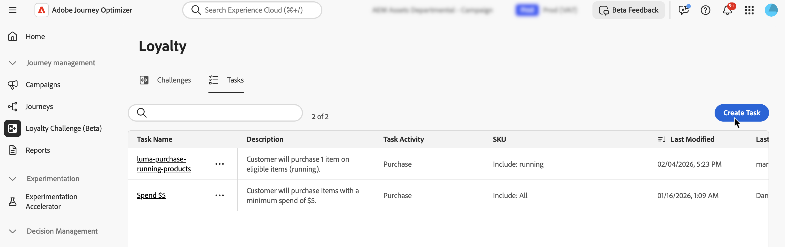
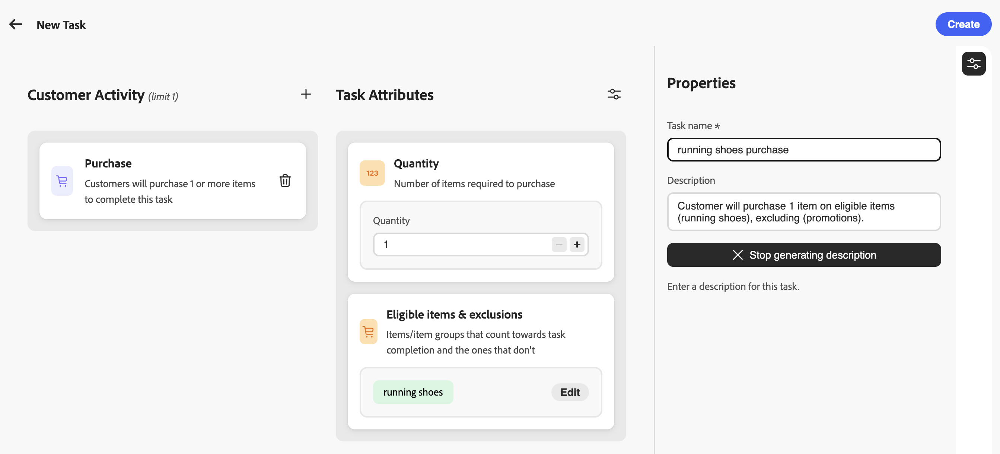

# タスクの作成 {#create-tasks}

>[!BEGINSHADEBOX]

**ロイヤルティの課題に関するドキュメント：**

* [ロイヤルティに関する課題を解決](get-started.md)
* [課題とタスクへのアクセスと管理](access-loyalty-challenges.md)
* [課題の創出](create-challenges.md)
* **タスクを作成** ◀︎ **現在のユーザー**
* [ ロイヤルティチャレンジ API リファレンス ](https://developer.adobe.com/journey-optimizer-apis/references/loyalty-challenges/){target="_blank"}

>[!ENDSHADEBOX]

>[!AVAILABILITY]
>
>この機能は現在&#x200B;**プライベートベータ版**&#x200B;です。 リリースサイクルと可用性フェーズについて詳しくは、[Journey Optimizer リリースサイクル](../rn/releases.md)を参照してください。

タスクとは、ロイヤルティに関する課題に直面した場合に、顧客が報酬を得るために実行しなければならない特定のアクションやマイルストーンを定義することです。 タスクのタイプ、数量、製品要件を設定することで、魅力的でパーソナライズされたロイヤルティの体験を生み出すことができます。

各タスクは、課題の完了に貢献する、測定可能な行動を表します。 タスクとは、個別に作成して1つ以上の課題に追加するか、課題の中で直接作成できる、再利用可能なコンポーネントのことです。

## タスクの作成 {#create-task}

>[!CONTEXTUALHELP]
>id="ajo_loyalty_task_create"
>title="タスクの作成"
>abstract="顧客アクティビティ（購入または支出）を選択し、アクティビティ固有の属性（数量または金額、対象となるアイテムと除外、最小支出または最大トランザクションなどのオプション制限）を設定します。 プロパティ ペインで、タスク名と説明を設定します。"

タスクは、2つのエントリポイントから作成できます。 設定プロセスは、どこから開始しても同じです。

>[!BEGINTABS]

>[!TAB  タスクインベントリから]

「**[!UICONTROL タスク]**」タブを選択し、「**[!UICONTROL タスクを作成]**」を選択します。 インベントリから作成されたタスクは保存され、複数の課題で再利用できます。

>[!TAB  チャレンジ内から]

既存の課題を開くか、新しい課題を作成します。 「**[!UICONTROL タスクを追加]**」を選択し、「**[!UICONTROL 新規]**」ボタンをクリックします。 このようにして作成されたタスクは、自動的にチャレンジに追加され、他のチャレンジで再利用するためにタスクインベントリに保存されます。

>[!ENDTABS]

## 顧客アクティビティの選択 {#choose-activity}

このタスクを完了するために顧客が実行する必要があるアクティビティのタイプを選択します。

* **[!UICONTROL 購入]**：このタスクを完了するには、1つ以上のアイテムを購入する必要があります
* **[!UICONTROL 支出]**：このタスクを完了するには、顧客が指定した金額を費やす必要があります

アクティビティを選択するには、**+** アイコンをクリックし、成果の目標に最も適した顧客アクティビティを選択します。 各アクティビティタイプには、タスク要件をさらに定義して形成するための、特定の設定可能な属性が用意されています。

## タスク属性の定義 {#define-attributes}

選択したアクティビティタイプに基づいてタスク属性を設定します。 以下のタブを参照して、各アクティビティタイプで使用可能な属性を確認します。

>[!BEGINTABS]

>[!TAB 購入アクティビティ ]

**購入**&#x200B;活動に使用できる属性：

* **[!UICONTROL 数量]**：このタスクを完了するために購入する必要がある品目の数を入力します。
* **[!UICONTROL 対象アイテムと除外]**: タスクの完了にカウントされるアイテムまたはアイテム グループとそうでないアイテムまたはアイテム グループを定義します。[対象となる項目と除外事項について詳しく見る](#eligible-items-exclusions)
* **[!UICONTROL 最低支出額]**：最低購入額の要件を設定します。
* **[!UICONTROL 最大トランザクション数]**：タスクを完了するために使用できるトランザクション数を制限します。

>[!TAB  アクティビティを使用]

**費用**&#x200B;活動に使用できる属性：

* **[!UICONTROL 金額]**: タスクを完了するために必要な合計支出額を入力します。
* **[!UICONTROL 対象アイテムと除外]**: タスクの完了にカウントされるアイテムまたはアイテム グループとそうでないアイテムまたはアイテム グループを定義します。[対象となる項目と除外事項について詳しく見る](#eligible-items-exclusions)
* **[!UICONTROL 最大トランザクション数]**：支出要件を満たすために許可されるトランザクション数を指定します。 この属性は、パラメーターアイコンからアクティブにできます。

>[!ENDTABS]

## 実施要件を満たす品目と除外事項の定義 {#eligible-items-exclusions}

>[!CONTEXTUALHELP]
>id="ajo_loyalty_task_eligible_items_exclusion"
>title="対象商品と除外事項"
>abstract="**購入**&#x200B;と&#x200B;**支出**&#x200B;の両方のアクティビティで、**[!UICONTROL 適格品目と除外]**&#x200B;属性を使用して、どの品目とグループが対象で、どの品目とグループが除外されるかを定義できます。 これにより、チャレンジ目標に沿って、特定の製品、カテゴリー、場所をターゲットにすることができます。 たとえば、支出タスクを特定の商品カテゴリーに制限したり、ギフトカードやプロモーション商品をタスク完了に向けてカウントから除外したりすることができます。"

<!-- SCREENSHOT: Eligible items & exclusions popup showing the two sections: "Eligible task purchases are limited to the following" and "The following are excluded from this task" with text input fields -->

**購入**&#x200B;と&#x200B;**支出**&#x200B;の両方のアクティビティで、**[!UICONTROL 適格品目と除外]**&#x200B;属性を使用して、どの品目とグループが対象で、どの品目とグループが除外されるかを定義できます。 これにより、チャレンジ目標に沿って、特定の製品、カテゴリー、場所をターゲットにすることができます。

たとえば、支出タスクを特定の商品カテゴリーに制限したり、ギフトカードやプロモーション商品をタスク完了に向けてカウントから除外したりすることができます。

* 対象となる品目を定義するには、**[!UICONTROL 対象タスク購入でコンマで区切った特定の品目ID、カテゴリ、または宛先IDを入力します。次の]** フィールドに制限されます。 このフィールドを空のままにすると、すべての購入がデフォルトで有効になります。 `*`を入力して、すべての購入を明示的に対象にすることもできます。

  例：`SKU001, SKU002, CategoryA`

* タスクから項目を除外するには、**[!UICONTROL に特定の項目ID、カテゴリ、または宛先IDを入力します。このタスク]** フィールドには、次のものが除外されます。

  例：`CLEARANCE01, GIFTCARD, SALE_CATEGORY`

## タスクのプロパティの定義 {#define-task-properties}

タスク **[!UICONTROL プロパティ]** ペインで、基本的なタスク情報を設定します。

* **[!UICONTROL タスク名]**: タスクのわかりやすい名前を入力します。
* **[!UICONTROL タスクの説明]**：説明は、設定されたアクティビティと属性に基づいて自動的に生成されます。 カスタムの説明を入力するには、自動生成オプションをオフにして、テキストフィールドに説明を入力します。

すべての属性とプロパティを設定したら、**[!UICONTROL 作成]**&#x200B;を選択してタスクを保存します。 タスクはタスクインベントリに保存され、チャレンジ内から作成された場合、そのチャレンジに自動的に追加されます。
