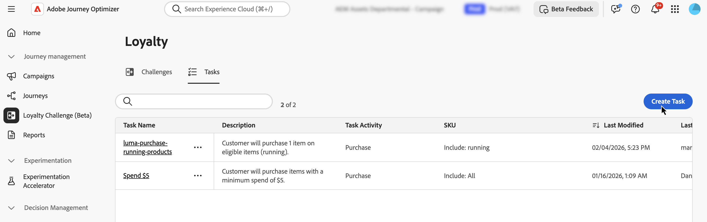
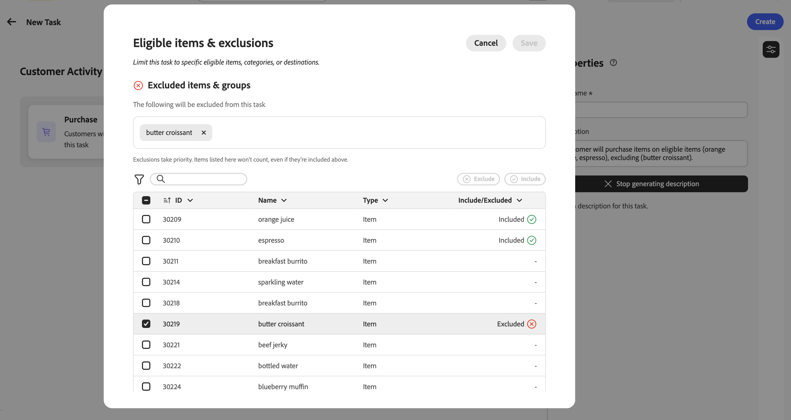

# タスクの作成 {#create-tasks}

>[!BEGINSHADEBOX]

**目次**

[ロイヤルティに関する課題を解決](get-started.md)

<table style="table-layout:fixed">
<tr style="border: 0;">
<td style="vertical-align:top;">

**課題の作成と管理**

* [課題とタスクへのアクセスと管理](access-loyalty-challenges.md)
* [課題の創出](create-challenges.md)
* **タスクを作成** ◀︎ **現在のユーザー**
* [ロイヤルティチャレンジのパフォーマンスを監視する](loyalty-reporting.md)

</td>
<td style="vertical-align:top;">

**設定と統合**

* [ロイヤルティに関する課題の設定](loyalty-admin.md)
* [ロイヤルティデータとデータセット](loyalty-data-and-datasets.md)
* [ロイヤルティチャレンジ API リファレンス](https://developer.adobe.com/journey-optimizer-apis/references/loyalty-challenges){target="_blank"}

</td>
</tr>
</table>

>[!ENDSHADEBOX]

>[!AVAILABILITY]
>
>この機能は現在&#x200B;**プライベートベータ版**&#x200B;です。 リリースサイクルと可用性フェーズについて詳しくは、[Journey Optimizer リリースサイクル](../rn/releases.md)を参照してください。

タスクとは、ロイヤルティに関する課題に直面した場合に、顧客が報酬を得るために実行しなければならない特定のアクションやマイルストーンを定義することです。 購入と支出のタスク、または組織が既にキャプチャしたAdobe Experience Platform エクスペリエンスイベントを追跡する&#x200B;**[!UICONTROL カスタムイベント]** タスクを設定できます。

各タスクは、課題の完了に貢献する、測定可能な行動を表します。 タスクとは、個別に作成して1つ以上の課題に追加するか、課題の中で直接作成できる、再利用可能なコンポーネントのことです。

## タスクを作成 {#create-task}

>[!CONTEXTUALHELP]
>id="ajo_loyalty_task_create"
>title="タスクを作成"
>abstract="顧客アクティビティ（購入、支出またはカスタムイベント）を選択し、アクティビティ固有の属性を設定します。 プロパティパネルで、タスク名と説明を設定します。"

タスクは、2つのエントリポイントから作成できます。 設定プロセスは、どこから開始しても同じです。

>[!BEGINTABS]

>[!TAB  タスクインベントリから]

「**[!UICONTROL タスク]**」タブを選択し、「**[!UICONTROL タスクを作成]**」を選択します。 インベントリから作成されたタスクは保存され、複数の課題で再利用できます。

>[!TAB  チャレンジ内から]

既存の課題を開くか、新しい課題を作成します。 「**[!UICONTROL タスクを追加]**」を選択し、「**[!UICONTROL 新規]**」ボタンをクリックします。 このようにして作成されたタスクは、自動的にチャレンジに追加され、他のチャレンジで再利用するためにタスクインベントリに保存されます。

>[!ENDTABS]

## 顧客アクティビティの選択 {#choose-activity}

このタスクを完了するために顧客が実行する必要があるアクティビティのタイプを選択します。

* **[!UICONTROL 購入]**：このタスクを完了するには、1つ以上のアイテムを購入する必要があります
* **[!UICONTROL 支出]**：このタスクを完了するには、顧客が指定した金額を費やす必要があります
* **[!UICONTROL カスタムイベント]**：お客様は、Adobe Experience Platform エクスペリエンスイベントで表されるアクティビティを実行する必要があります。 たとえば、ホテルのチェックイン、モバイルアプリのアクション、レビューの提出などがあります。 基になるイベントは、既にExperience Platformでキャプチャされ、**[!UICONTROL ロイヤルティ管理者]** メニューのイベント定義を通じてマッピングされている必要があります。 [&#x200B; イベント定義の設定方法を学ぶ](loyalty-admin.md#event-definitions)

アクティビティを選択するには、**+** アイコンをクリックし、成果の目標に最も適した顧客アクティビティを選択します。各アクティビティタイプには、タスク要件をさらに定義して形成するための、特定の設定可能な属性が用意されています。

## タスク属性の定義 {#define-attributes}

選択したアクティビティタイプに基づいてタスク属性を設定します。 以下のタブを参照して、各アクティビティタイプで使用可能な属性を確認します。

>[!BEGINTABS]

>[!TAB 購入アクティビティ ]

**購入**&#x200B;活動に使用できる属性：

* **[!UICONTROL 数量]**：このタスクを完了するために購入する必要がある品目の数を入力します。
* **[!UICONTROL 適格項目と除外]**: タスクの完了にカウントされる項目または項目グループとそうでない項目を定義するか、**[!UICONTROL 独自のデータを取り込むか]**&#x200B;を選択して、外部データから適格性を促進します。 [詳細情報](#eligible-items-exclusions)
* **[!UICONTROL 最低支出額]**：最低購入額の要件を設定します。
* **[!UICONTROL 最大トランザクション数]**：タスクを完了するために使用できるトランザクション数を制限します。

>[!TAB  アクティビティを使用]

**費用**&#x200B;活動に使用できる属性：

* **[!UICONTROL 金額]**: タスクを完了するために必要な合計支出額を入力します。
* **[!UICONTROL 対象アイテムと除外]**: タスクの完了にカウントされるアイテムまたはアイテム グループとそうでないアイテムまたはアイテム グループを定義します。 [対象となる項目と除外事項について詳しく見る](#eligible-items-exclusions)
* **[!UICONTROL 最大トランザクション数]**：支出要件を満たすために許可されるトランザクション数を指定します。 この属性は、パラメーターアイコンからアクティブにできます。

>[!TAB  カスタムイベントアクティビティ ]

**[!UICONTROL カスタムイベント]** アクティビティで使用できる属性：

* **[!UICONTROL カスタムイベント値]**：顧客が完了する必要があるカスタムイベントの値を入力します。 コンマを使用して各値を区切ります。 これらの値は、**[!UICONTROL ロイヤルティ管理者]** メニューで設定されたイベント定義と一致する必要があります。 [&#x200B; イベント定義の設定方法を学ぶ](loyalty-admin.md#event-definitions)

>[!ENDTABS]

## 実施要件を満たす品目と除外品目を定義 {#eligible-items-exclusions}

>[!CONTEXTUALHELP]
>id="ajo_loyalty_task_eligible_items_exclusion"
>title="実施要件を満たす品目と除外品目"
>abstract="**購入**&#x200B;と&#x200B;**支出**&#x200B;の両方のアクティビティに対して、**[!UICONTROL 実施要件のあるアイテムと除外]**&#x200B;属性を使用して、タスクの完了にカウントするアイテムとグループ、および除外されるアイテムを選択します。 管理者が設定した製品インベントリからアイテムまたはグループを検索し、必要に応じてそれらを含めるか除外します。"

<!-- SCREENSHOT: Eligible items & exclusions picker showing the item and group table with Include and Exclude actions -->

**購入**&#x200B;および&#x200B;**支出** アクティビティの場合、**[!UICONTROL 対象アイテムと除外]** セクションを使用して、対象となるアイテムとグループと除外されるグループを定義できます。 これにより、課題の目標に合わせて、特定の製品、カテゴリ、地域をターゲットにすることができます。

ピッカーで使用できる項目とグループは、**[!UICONTROL ロイヤルティ管理者]** メニューの管理者ユーザーによって定義されます。 管理者は、対象品目に使用される製品在庫をアップロードし、マーケターがタスクを構築すると自動的に適用される組織全体の除外を設定します。 [製品インベントリ &#x200B;](loyalty-admin.md#product-inventory)と[除外](loyalty-admin.md#exclusions)の設定方法について説明します

**[!UICONTROL カスタムイベント]** タスクでは、対象となる項目と除外は使用されません。完了は、設定した&#x200B;**[!UICONTROL カスタムイベント値]**&#x200B;によって駆動されます。

例えば、タスクを特定の商品カテゴリーに制限したり、ギフトカードやプロモーションアイテムをタスクの完了に向けてカウントから除外したりすることができます。

### タスクの対象となる項目の設定

対象アイテムを定義するには、**[!UICONTROL 対象アイテムと除外]** セクションから&#x200B;**[!UICONTROL 追加]**&#x200B;を選択します。

ピッカーで、タスクの完了にカウントする項目またはグループを選択し、**[!UICONTROL 含める]**&#x200B;を選択します。 含まれている項目とグループが対象リストに追加されます。

対象商品やグループが選択されていない場合、除外が設定されていない限り、購入は特定の在庫セットに限定されません。

### タスクから項目を除外

タスクからアイテムを除外するには、**[!UICONTROL 対象アイテムと除外]** セクションから&#x200B;**[!UICONTROL 追加]**&#x200B;を選択します。

タスクの完了にカウントしない項目またはグループを選択し、**[!UICONTROL 除外]**&#x200B;を選択します。

グローバル除外リストの項目は、除外として自動的に追加されます。 除外は除外よりも優先されます。除外としてリストされた項目は、含まれるグループの一部である場合でも、カウントされません。

### 自身のデータを持ち込んで適格性と除外条件を指定 {#byod-personalization}

>[!AVAILABILITY]
>
>**[!UICONTROL 独自のデータを取り込む]** オプションは、現在、制限された組織のセットで利用でき、今後のリリースでより広く利用できるようになります。

Journey Optimizerでアイテムとグループを選択するだけでなく、**[!UICONTROL 独自のデータを取り込む]** オプションを使用して、実行時に外部ロイヤルティチャレンジ データから適格性を促すこともできます。

**[!UICONTROL 自分のデータを取り込む]**&#x200B;が選択されている場合、参加者ごとの実施要件は、アイテム IDのリストではなく、ロイヤルティチャレンジ環境と同期されたデータから実行時に解決されます。

このオプションを使用するには、**[!UICONTROL 対象アイテムと除外]**&#x200B;でパーソナライゼーションアイコンを選択し、**[!UICONTROL 独自のデータを取り込む]**&#x200B;を選択します。

>[!IMPORTANT]
>
>このタスクをチャレンジに割り当てる場合は、チャレンジの種類として&#x200B;**[!UICONTROL Standard]**&#x200B;を選択します。 このオプションは、タスクと報酬を含む構造全体が外部から提供される完全なデータ主導型の課題に対して予約されているため、**[!UICONTROL 自分のデータをチャレンジ レベルで持ち込むのを選択しないでください]**。

## タスクのプロパティの定義 {#define-task-properties}

タスク **[!UICONTROL プロパティ]** ペインで、基本的なタスク情報を設定します。

* **[!UICONTROL タスク名]**: タスクのわかりやすい名前を入力します。
* **[!UICONTROL タスクの説明]**：説明は、設定されたアクティビティと属性に基づいて自動的に生成されます。 カスタムの説明を入力するには、自動生成オプションをオフにして、テキストフィールドに説明を入力します。

すべての属性とプロパティを設定したら、**[!UICONTROL 作成]**&#x200B;を選択してタスクを保存します。 タスクはタスクインベントリに保存され、チャレンジ内から作成された場合、そのチャレンジに自動的に追加されます。
