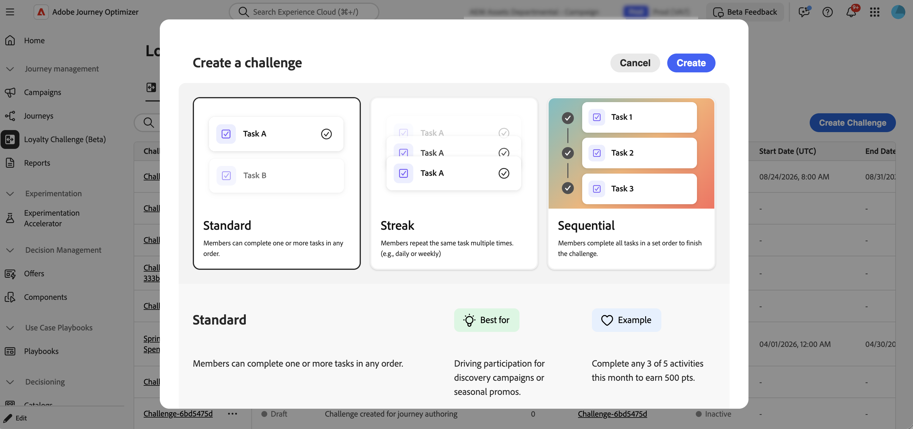

# ロイヤルティに関する課題を解決 {#get-started-loyalty-challenges}

>[!BEGINSHADEBOX]

**目次**

**[ロイヤルティチャレンジを開始](get-started.md)** ◀︎ **今いる**

<table style="table-layout:fixed">
<tr style="border: 0;">
<td style="vertical-align:top;">

**課題の作成と管理**

* [課題とタスクへのアクセスと管理](access-loyalty-challenges.md)
* [課題の創出](create-challenges.md)
* [タスクの作成](create-tasks.md)
* [ロイヤルティチャレンジのパフォーマンスを監視する](loyalty-reporting.md)

</td>
<td style="vertical-align:top;">

**設定と統合**

* [ロイヤルティに関する課題の設定](loyalty-admin.md)
* [ロイヤルティデータとデータセット](loyalty-data-and-datasets.md)
* [ロイヤルティチャレンジ API リファレンス](https://developer.adobe.com/journey-optimizer-apis/references/loyalty-challenges){target="_blank"}

</td>
</tr>
</table>

>[!ENDSHADEBOX]

>[!AVAILABILITY]
>
>この機能は現在&#x200B;**プライベートベータ版**&#x200B;です。 リリースサイクルと可用性フェーズについて詳しくは、[Journey Optimizer リリースサイクル](../rn/releases.md)を参照してください。

## 概要 {#overview}

>[!CONTEXTUALHELP]
>id="ajo_loyalty_inventory"
>title="ロイヤルティの課題"
>abstract="ロイヤルティの課題を使用すると、顧客行動を推進し、ブランドとの関係を深める、魅力的でゲーミフィケーションを取り入れたロイヤルティプログラムを作成できます。 購入やレビューの書き込みから、ソーシャルメディアへの関与や友人の紹介まで、特定のアクションに対して顧客に報酬を与える課題を作成しましょう。"

ロイヤルティの課題を使用すると、顧客行動を推進し、ブランドとの関係を深める、魅力的でゲーミフィケーションを取り入れたロイヤルティプログラムを作成できます。 購入やレビューの書き込みから、ソーシャルメディアへの関与や友人の紹介まで、特定のアクションに対して顧客に報酬を与える課題を作成しましょう。

ロイヤルティの課題を活用することで、次のことが可能になります。

* **柔軟なチャレンジの種類をデザイン**：ビジネス目標に合わせて、Standard、Streak、またはSequential チャレンジを作成します
* **報酬を戦略的に設定**：タスクのマイルストーンまたは完全な完了時にポイントを提供して、エンゲージメントを維持します
* **エクスペリエンスをパーソナライズ**: コンテンツカードとマルチチャネルメッセージを使用して、没入感のあるブランド体験を構築します
* **シームレスな統合**：既存のロイヤルティプロバイダーとつながり、Experience Platform データを活用する
* **自動的に追跡**: カスタム開発なしで自動生成されたジャーニーを通じて、顧客の進捗状況を監視します
* **パフォーマンスを測定**：組み込みのレポートダッシュボードを使用して、プログラム KPI、チャレンジの結果、タスクレベルの指標を追跡します

次のようなチャレンジエクスペリエンスを構築できます。

* **標準課題**：お客様は、指定された数のタスクを任意の順序で完了できます。 このタイプは、柔軟性と複数のパスを補完する場合に使用します。\
  *例：「サマーウェルネスチャレンジ」 - 5つのタスクのうち3つを完了する：健康製品の購入、ソーシャルメディアでの共有、友人への紹介、レビューの執筆、バーチャルイベントへの参加*

* **連続する課題**：顧客は同じタスクを複数回連続して完了します。 このタイプは、時間をかけて一貫性のある繰り返し行動を促すために使用します。\
  *例：「Coffee Lover&#39;s Week」 - 7日間連続でコーヒー製品を購入すると、無料のドリンク報酬が得られます*

* **連続した課題**：顧客は定義された順序でタスクを完了します。 このタイプは、特定のジャーニーやオンボーディングプロセスを通じて顧客を導くために使用できます。\
  *例：「新規会員ジャーニー」 – メールに登録する→初めての購入→商品レビューを書く→友達を紹介する（正確な順序で記入）*

* **独自のデータ課題を持ち込む** （制限付き可用性）: チャレンジフレームワーク（タスクと報酬）は、ロイヤルティチャレンジデータ統合から組み立てられます。 コンテンツ、メッセージ、オーディエンスは、他のチャレンジタイプと同様に設定します。

## 仕組み {#how-it-works}

ロイヤルティに関する課題の作成と立ち上げは、次のワークフローに従います。

1. **チャレンジを作成** – 名前、タイプ（標準、ストリーク、シーケンシャル、または利用可能な場合は独自のデータを取り込む）、日付範囲など、基本的なチャレンジのプロパティを定義します。 [&#x200B; チャレンジの種類を選択する方法について説明します](create-challenges.md#create-the-challenge)。

1. **タスクを追加** - タスクの種類（購入、支出、またはカスタムイベント）、数量、製品フィルター、報酬など、顧客が完了しなければならない特定のアクションを定義します。

1. **コンテンツカードのデザイン** – お客様のデバイスに表示されるJourney Optimizer コンテンツカードを使用して、課題の視覚的な表現を作成します。 コンテンツカードには、チャレンジ情報、進捗状況、報酬が表示されます。

1. **メッセージの設定** （オプション） – 主要なライフサイクルの段階（起動、処理中、完了）に対して、マルチチャネルメッセージ（アプリ内、電子メール、プッシュ）を設定します。

1. **ターゲットオーディエンスの選択** - Adobe Experience Platformからオーディエンスを選択して、チャレンジに参加できる顧客を定義します。

1. **チャレンジを開始** - チャレンジを公開してから、ジャーニーを生成します。 Journey Optimizerが、課題のジャーニーを自動的に作成します。 自動生成されたジャーニーを公開して、課題を顧客が利用できるようにします。

詳細な手順については、[課題の作成](create-challenges.md)を参照してください。

## 前提条件 {#prerequisites}

ロイヤルティの課題を使用する前に、次のことを確認してください。

+++必要な権限

ロイヤルティチャレンジを使用するには、Journey OptimizerとAdobe Experience Platformで適切な権限が必要です。

**Journey Optimizer:**

* `journeys.read`
* `journeys.write`
* `journeys.delete`
* `journeys.publish`
* `journeys_events.read`
* `journeys_events.write`
* `journeys_events.delete`
* `journeys_report.read`
* `messages.read`
* `messages_report.read`

**Adobe Experience Platform:**

* `segments.read`
* `profiles.read`
* `identity_namespace.read`

機能にアクセスできない場合や、追加の権限が必要な場合は、管理者にお問い合わせください。

+++

+++ロイヤルティプログラムの設定（管理者）

管理者は、**[!UICONTROL ロイヤルティ管理者]** メニューで、報酬プロバイダー、イベント定義、製品インベントリ、除外、およびグローバル設定を設定します。 課題のみを作成するマーケターは、このメニューにアクセスする必要はありません。 [&#x200B; ロイヤルティに関する課題を設定する方法を学ぶ](loyalty-admin.md)

左側のナビゲーションに「**[!UICONTROL ロイヤルティ管理者]**」メニューが表示されない場合は、管理者にお問い合わせください。

+++

+++ターゲットオーディエンス

課題を解決する前に、Adobe Experience Platformに必要なターゲットオーディエンスが存在することを確認しましょう。 チャレンジの設定中に、どの顧客が参加する資格があるかを定義するオーディエンスを選択します。 [&#x200B; オーディエンスの操作方法を学ぶ](../audience/about-audiences.md)。

+++

## さらに深く掘り下げましょう {#lets-dive-deeper}

ロイヤルティに関する課題とその仕組みを理解したところで、次はその詳細について説明します。 インターフェイスにアクセスし、最初の課題を作成し、顧客が完了するタスクを定義するには、次のトピックを参照してください。

<table style="table-layout:fixed">
<tr style="border: 0;">
  <td>
    
    

    <a href="access-loyalty-challenges.md"><strong>課題とタスクへのアクセスと管理</strong></a>
    

    

    <em> インベントリにアクセスし、課題とタスクを管理する方法を学ぶ</em>
    

  </td>
  <td>
    
    

    <a href="create-challenges.md"><strong>課題の作成</strong></a>
    

    

    <em>最初のロイヤルティチャレンジを作成および設定する方法を学ぶ</em>
    

  </td>
  <td>
    
    

    <a href="create-tasks.md"><strong> タスクの作成</strong></a>
    

    

    <em>課題に対して顧客が完了するタスクを定義する方法について説明します</em>
    

  </td>
  <td>
    
    

    <a href="loyalty-reporting.md"><strong>パフォーマンスの監視</strong></a>
    

    

    <em>組み込みのダッシュボードを使用して、プログラムのKPI、チャレンジの結果、タスクの指標を追跡</em>
    

  </td>
  <!--
    <a href="loyalty-admin.md"><strong>Configure the loyalty program</strong></a>
  <td>
    <a href="loyalty-admin.md">
    <em>Set up reward providers, event definitions, and org settings for fulfillment</em>
    </a>
    

  -->
    <a href="loyalty-admin.md"><strong> ロイヤルティに関する課題の設定</strong></a>
    

    

    <em>報酬プロバイダー、イベント定義、組織設定の設定</em>
    

  </td>
</tr>
</table>

## API リファレンス {#api-reference}

ロイヤルティの課題をプログラムで管理するには、[&#x200B; ロイヤルティの課題API](https://developer.adobe.com/journey-optimizer-apis/references/loyalty-challenges){target="_blank"}を使用します。 APIを使用すると、REST エンドポイントを介して課題とタスクを作成、更新、管理できます。
