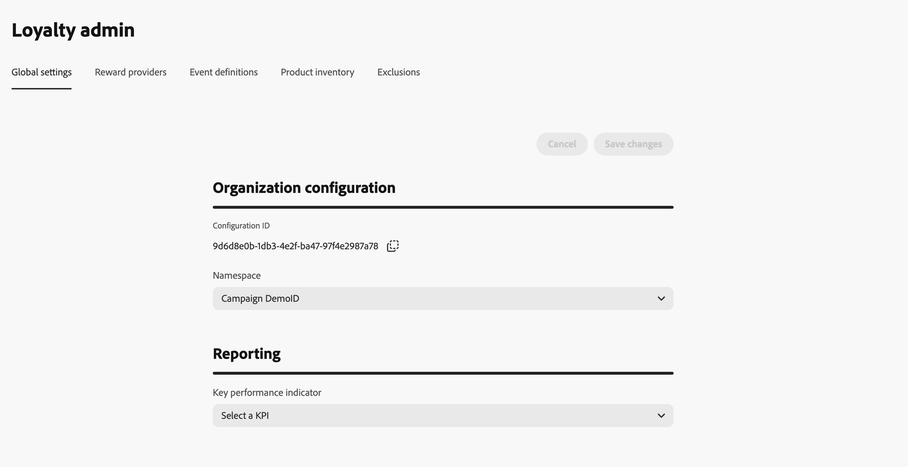
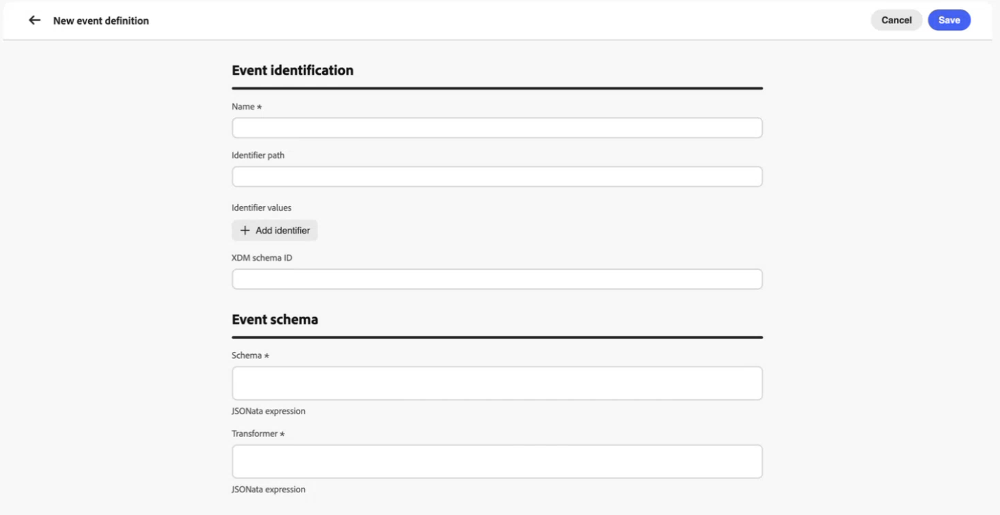
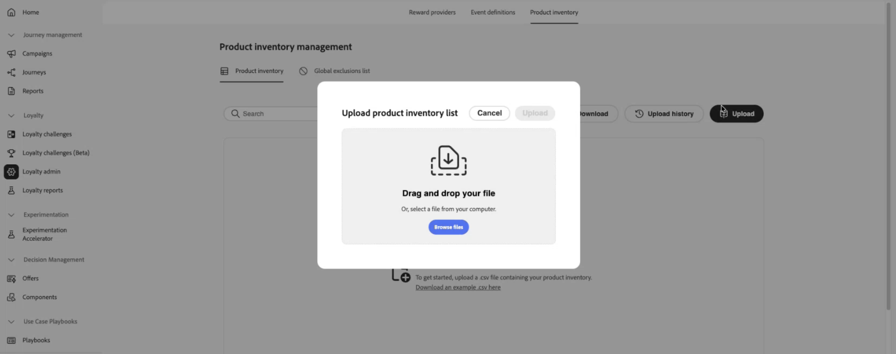
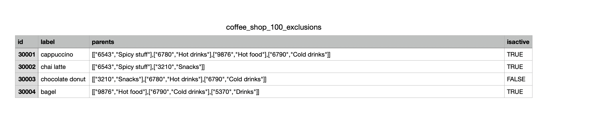
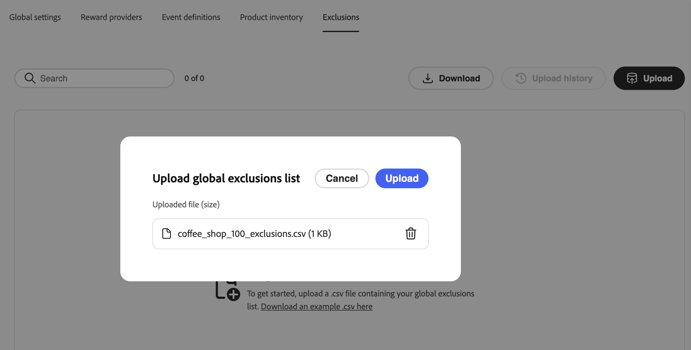

# ロイヤルティプログラムの設定 {#loyalty-admin}

>[!BEGINSHADEBOX]

**ロイヤルティの課題に関するドキュメント：**

* [ロイヤルティに関する課題を解決](get-started.md)
* [課題とタスクへのアクセスと管理](access-loyalty-challenges.md)
* [課題の創出](create-challenges.md)
* [タスクの作成](create-tasks.md)
* [ロイヤルティチャレンジのパフォーマンスを監視する](loyalty-reporting.md)
* **ロイヤルティプログラムの設定** ◀︎ **現在地**
* [ロイヤルティチャレンジ API リファレンス](https://developer.adobe.com/journey-optimizer-apis/references/loyalty-challenges){target="_blank"}

>[!ENDSHADEBOX]

>[!AVAILABILITY]
>
>この機能は現在&#x200B;**プライベートベータ版**&#x200B;です。 [!DNL Journey Optimizer]のリリースサイクルと可用性フェーズについて詳しくは、[ リリースサイクル ](../rn/releases.md)を参照してください。

## 概要 {#access-loyalty-admin}

ロイヤルティプログラム設定は、マーケターが課題を作成する前に、報酬フルフィルメント、イベントマッピング、製品インベントリ、除外を設定することで、[!DNL Journey Optimizer]を外部のロイヤルティシステムに接続します。

>[!NOTE]
>
>ロイヤルティプログラムの設定には、ロイヤルティチャレンジに必要な権限に加えて、[!DNL Journey Optimizer] インスタンスへの管理者アクセス権が必要です。 Adobe管理者に連絡してアクセス権を取得してください。

設定インターフェイスを開くには、**[!UICONTROL ロイヤルティ]**&#x200B;に移動し、**[!UICONTROL ロイヤルティ管理者]**&#x200B;を選択します。 インターフェイスはタブで構成されています。

* **Global settings** — プログラムのExperience Platform ID名前空間を選択します。 [ グローバル設定の設定方法について説明します](#global-settings)
* **報酬プロバイダー** – 顧客が進行状況を確認したり、課題を完了したりすると、報酬を実現するAPIを接続します。 [報酬プロバイダーの設定方法について](#reward-providers)
* **イベント定義** – 受信エクスペリエンスイベントを&#x200B;**[!UICONTROL カスタムイベント]** タスクで使用されるアクティビティにマッピングします。 [ イベント定義の設定方法を学ぶ](#event-definitions)
* **製品在庫** — タスクの実施要件ルールで使用するアイテムからグループへのマッピングをアップロードします。 [製品インベントリの設定方法について](#product-inventory)
* **除外** — タスク設定用に、組織全体のアイテムおよびグループの除外をアップロードします。 [除外の設定方法について](#exclusions)

## グローバル設定 {#global-settings}

>[!CONTEXTUALHELP]
>id="ajo_loyalty_admin_global_settings"
>title="グローバル設定"
>abstract="グローバル設定イベントや課題をまたいでメンバーを識別するために使用するID名前空間など、ロイヤルティプログラムの組織レベルの設定を定義します。"

「**[!UICONTROL グローバル設定]**」タブを開き、**[!UICONTROL 名前空間]** ドロップダウンで、ロイヤルティプログラムのAdobe Experience Platform [ID名前空間](https://experienceleague.adobe.com/ja/docs/experience-platform/identity/features/namespaces)を選択します。 この名前空間は、データ内のメンバープロファイルの識別方法と一致する必要があります。



➡️ [ID名前空間の操作方法について説明します](https://experienceleague.adobe.com/ja/docs/experience-platform/identity/features/namespaces){target="_blank"}

## ポイントプロバイダー {#reward-providers}

>[!CONTEXTUALHELP]
>id="ajo_loyalty_admin_reward_providers"
>title="ポイントプロバイダー"
>abstract="報酬プロバイダーは、顧客が課題を完了したときに[!DNL Journey Optimizer]さんが報酬を実現するために呼び出す外部システムを定義します。 プロバイダーエンドポイント、報酬定義、プロキシ設定、各統合の認証を設定します。"

>[!CONTEXTUALHELP]
>id="ajo_loyalty_admin_reward_providers_connection"
>title="ポイントプロバイダー接続"
>abstract="プロバイダー名、説明、エンドポイント URL、およびフルフィルメント呼び出しに必要なHTTP ヘッダーなど、[!DNL Journey Optimizer]が報酬APIに接続する方法を設定します。"

>[!CONTEXTUALHELP]
>id="ajo_loyalty_admin_reward_providers_details"
>title="報酬の定義"
>abstract="報酬の定義は、このプロバイダーが発行できる各報酬タイプ （ポイントや星など）を指定し、報酬が満たされたときにペイロード [!DNL Journey Optimizer]が送信します。"

>[!CONTEXTUALHELP]
>id="ajo_loyalty_admin_reward_providers_proxy"
>title="報酬プロキシ"
>abstract="オプションで、フルフィルメント呼び出しを報酬API エンドポイントに直接送信する代わりに、プロキシサーバーを介してルーティングします。 ホスト、ポート、資格情報、およびプロキシが有効かどうかを設定します。 資格情報の値は通常、`{ "userName": "test", "password": "xxxx" }`のようになります。"

**報酬プロバイダー**&#x200B;は、[!DNL Journey Optimizer]に、チャレンジの進行状況が記録されたり、チャレンジが完了したりしたときに、フルフィルメント呼び出しを送信する場所を伝えます。 例えば、ロイヤルティポイントや星を会員アカウントに付与するAPIです。

報酬プロバイダーを作成するには、次の手順に従います。

1. **[!UICONTROL 報酬プロバイダー]** タブを開き、**[!UICONTROL 報酬プロバイダーの作成]**&#x200B;を選択します。

   

1. **[!UICONTROL 名前]**&#x200B;と&#x200B;**[!UICONTROL 説明]**&#x200B;を入力します。

1. 「**[!UICONTROL URL]**」フィールドに、フルフィルメント要求を受信するAPI エンドポイントを入力します。

1. API用に必要に応じて&#x200B;**[!UICONTROL ヘッダー]**&#x200B;を追加します（API キーやコンテンツタイプなど）。

1. 報酬プロバイダーに関連付けられているリソースを設定します。 フィールドの詳細については、以下の各セクションを展開します。

   +++報酬の定義

   プロバイダーがサポートする報酬タイプごとに1つのエントリを追加します（プログラムポイント、星、マネークレジットなど）。 定義ごとに：

   * **[!UICONTROL 名前]**&#x200B;と&#x200B;**[!UICONTROL 説明]**&#x200B;を入力します。
   * 定義が&#x200B;**[!UICONTROL 有効]**&#x200B;かどうかを指定します。
   * **[!UICONTROL Default]**&#x200B;に切り替えて、1つの定義をこのプロバイダーのデフォルトとしてマークします。
   * フルフィルメント呼び出しで送信された&#x200B;**ペイロード**&#x200B;を定義します。

   

   +++

   +++報酬プロキシ

   フルフィルメント呼び出しをエンドポイントに直接送信するのではなく、中間サーバーを介してルーティングします。 報酬プロバイダーと&#x200B;**[!UICONTROL プロキシを作成]**&#x200B;画面で、プロキシ認証に&#x200B;**[!UICONTROL 資格情報]** フィールドを使用します。

   * **[!UICONTROL 名前]**&#x200B;と&#x200B;**[!UICONTROL 説明]**&#x200B;を入力します。
   * **[!UICONTROL ホスト]**&#x200B;と&#x200B;**[!UICONTROL ポート]**&#x200B;を入力します。
   * プロキシが&#x200B;**[!UICONTROL 有効]**&#x200B;かどうかを指定します。
   * **[!UICONTROL 資格情報]**&#x200B;に、プロキシのユーザー名とパスワードをJSONとして入力します。 資格情報の値は通常、次のようになります。

     ```json
     { "userName": "test", "password": "xxxx" }
     ```

   

   +++

   +++認証トークンジェネレーター

   APIでベアラートークンまたは同様の認証が必要な場合に使用します。

   * **[!UICONTROL 名前]**&#x200B;と&#x200B;**[!UICONTROL 説明]**&#x200B;を入力します。
   * **[!UICONTROL 認証タイプ]**&#x200B;で、認証タイプ （Bearerなど）を入力します。
   * HTTP メソッド（POSTなど）を選択します。
   * 応答にトークン エンドポイント URLと&#x200B;**[!UICONTROL トークン キー]**&#x200B;を入力します（例：`access_token`）。
   * 認証トークン ジェネレーターが&#x200B;**[!UICONTROL 有効]**&#x200B;かどうかを指定します。
   * トークンエンドポイントに必要なヘッダーを追加します。

   [!DNL Journey Optimizer]は、この設定を使用して、報酬APIへの各呼び出しの前に新しいトークンを取得します。

   

   +++

1. **[!UICONTROL 報酬プロバイダーの作成]**&#x200B;を選択します。 プロバイダーとすべての設定済みリソースは一緒に保存されます。

保存すると、プロバイダーが報酬プロバイダーのリストに表示されます。 マーケターは、チャレンジ報酬を設定する際にそれを選択できます。 [ チャレンジ報酬の設定方法を学ぶ](create-challenges.md#rewards)

報酬プロバイダーを編集するには、「**[!UICONTROL 報酬プロバイダー]**」タブを開き、プロバイダーを選択し、フィールドを更新します。 報酬定義、プロキシ、認証トークンジェネレーターの変更は、更新すると自動的に保存されます。

>[!NOTE]
>
>**[!UICONTROL 独自のデータを持ち込む]**&#x200B;課題は、独自のデータ統合を通じて報酬を実現します。 ここで設定した報酬プロバイダーは、これらの課題には適用されません。 [独自のデータを持ち込む課題の作成方法を学ぶ](create-challenges.md#create-the-challenge)

## イベント定義 {#event-definitions}

>[!CONTEXTUALHELP]
>id="ajo_loyalty_admin_event_definitions"
>title="イベント定義"
>abstract="イベント定義は、外部ソースからの受信イベントデータを識別および解釈する方法を[!DNL Journey Optimizer]に伝えます。 各定義は、購入やチェックインなど、特定のイベントタイプをマッピングするため、システムは顧客の課題タスクへの進捗状況を追跡できます。"

>[!CONTEXTUALHELP]
>id="ajo_loyalty_admin_event_schema"
>title="イベントスキーマとトランスフォーマ"
>abstract="組織がカスタム JSON形式でイベントを送信する場合は、**[!UICONTROL スキーマ]**&#x200B;を使用してペイロードを検証し、**[!UICONTROL トランスフォーマ]** （JSONata式など）を使用して、フィールドをロイヤルティチャレンジが期待する形式にマッピングします。"

>[!CONTEXTUALHELP]
>id="ajo_loyalty_admin_event_identification"
>title="イベントの特定"
>abstract="識別子パス、識別子の値、XDM スキーマ ID、またはこれらのフィールドの組み合わせを使用して、受信ペイロードのイベントを[!DNL Journey Optimizer]が認識する方法を指定します。"

**[!UICONTROL イベント定義]**&#x200B;は、[!DNL Journey Optimizer]に対して、どのAdobe Experience Platform エクスペリエンスイベントを処理するかを指示します。 たとえば、購入やホテルのチェックインなどです。 マーケターは、**[!UICONTROL カスタムイベント]** タスクを作成する際に、これらの定義を参照します。 どの定義にも一致しないイベントは無視されます。

組織が独自のJSON形式でイベントを送信すると、**[!UICONTROL Schema]**&#x200B;と&#x200B;**[!UICONTROL Transformer]**&#x200B;が[!DNL Journey Optimizer]がペイロードを検証し、それを解析して、アクティビティを追跡するかどうかを決定するのに役立ちます。

イベント定義を作成するには、次の手順に従います。

1. 「**[!UICONTROL イベント定義]**」タブを開き、新しい定義を作成します。

   

1. イベントの&#x200B;**[!UICONTROL 名前]**&#x200B;を入力します（例：`Coffee purchase`）。 マーケターが&#x200B;**[!UICONTROL カスタムイベント]** タスクを設定する際にこの名前が表示されます。

1. 受信ペイロードで[!DNL Journey Optimizer]がイベントを認識する方法を指定します。 **[!UICONTROL 識別子パス]**、**[!UICONTROL XDM スキーマ ID]**、またはその両方を指定します。

   * **[!UICONTROL 識別子パス]** — ペイロードのフィールドへのパス（例：`data.memberId`）。 ペイロードの値でイベントを照合する場合に使用します。
   * **[!UICONTROL 識別子の値]** – この定義が一致するために存在する必要がある識別子パスの値。
   * **[!UICONTROL XDM スキーマ ID]** – このイベントタイプのExperience Platform XDM スキーマのID。 これは、既知のスキーマに対してイベントをキャプチャする場合に使用します。

1. 必要に応じて、文字列を&#x200B;**[!UICONTROL スキーマ]**&#x200B;および&#x200B;**[!UICONTROL トランスフォーマ]**&#x200B;にペーストします。

   * **[!UICONTROL スキーマ]** – 受信ペイロードの検証文字列。
   * **[!UICONTROL Transformer]** — ペイロードをロイヤルティチャレンジが期待する形式にマッピングする変換式（JSONataなど）。

1. イベント定義を保存します。 **[!UICONTROL イベント定義]** リストに表示され、マーケターが&#x200B;**[!UICONTROL カスタムイベント]** タスクを作成すると使用できます。 [ タスクの作成方法を学ぶ](create-tasks.md#choose-activity)

## 製品インベントリ {#product-inventory}

>[!CONTEXTUALHELP]
>id="ajo_loyalty_admin_product_inventory"
>title="製品インベントリ"
>abstract="商品識別子を商品グループにマッピングするCSV ファイルをアップロードします。 マーケターは、購入と支出のタスクに適格な品目を設定する際に、すべての品目IDを入力することなく、これらのグループを参照できます。"

**[!UICONTROL 製品在庫]** タブには、カタログ項目がグループ化されているため、マーケターは各項目IDを入力しなくてもタスクでそれらをターゲットにできます。 各項目識別子を1つ以上の&#x200B;**製品グループ**&#x200B;にマッピングする&#x200B;**CSV ファイル**&#x200B;をアップロードします（同じ項目を複数のグループに属させることができます）。 タスクの実施要件を設定する際に、インポートしたグループを使用できます。 [ タスクの作成方法を学ぶ](create-tasks.md)

商品インベントリファイルをアップロードするには、次の手順に従います。

1. 各項目識別子を1つ以上の製品グループにマッピングするCSV ファイルを準備します。 以下のセクションを展開して、例を表示します。

   +++製品インベントリのCSVの例

   

   +++

1. 「**[!UICONTROL 製品インベントリ]**」タブを開きます。

1. 「**[!UICONTROL アップロード]**」を選択し、CSV ファイルを選択します。

   

1. インベントリリストで読み込んだデータを確認します。 リストには、項目ごとに1行が表示されます。 ]**列に含まれる**[!UICONTROL  グループは、そのアイテムのすべての製品グループをピルとして表示するか、アイテムが複数のグループに属する場合は複数のピルを表示します。

   

1. 製品グループ内のすべてのアイテムを表示するには、任意の行の&#x200B;]**列に含まれる**[!UICONTROL  グループで、そのグループのピルを選択します。 グループの詳細ビューには、グループ内のすべての項目が一覧表示されます。

   

1. **[!UICONTROL アップロード履歴]**&#x200B;を開いて、以前のCSV アップロードを表示します。

## 除外 {#exclusions}

>[!CONTEXTUALHELP]
>id="ajo_loyalty_admin_exclusions"
>title="除外"
>abstract="プログラム全体で除外されたカタログ項目とグループを定義するCSV ファイルをアップロードします。 インポートされた除外グループは、マーケターがタスクに対して適格な項目と除外を設定すると表示されます。"

「**[!UICONTROL 除外]**」タブでは、プログラム全体で除外されるカタログ項目とグループが定義されるため、マーケターは、すべてのタスクで同じ除外をリストする必要はありません。 各項目識別子を1つ以上の&#x200B;**除外グループ**&#x200B;にマッピングする&#x200B;**CSV ファイル**&#x200B;をアップロードします（同じ項目を複数のグループに属させることができます）。

インポート後、マーケターが&#x200B;**[!UICONTROL 対象アイテムと除外]**&#x200B;を設定すると、除外されたアイテムとグループがタスクビルダーに表示されます。 [ タスクに対する適格項目と除外項目を定義する方法を説明します](create-tasks.md#eligible-items-exclusions)

除外をアップロードするには、次の手順に従います。

1. 各項目識別子を1つ以上の除外グループにマッピングするCSV ファイルを準備します。 以下のセクションを展開して、例を表示します。

   +++除外CSVの例

   

   +++

1. 「**[!UICONTROL 除外]**」タブを開きます。

1. 「**[!UICONTROL アップロード]**」を選択し、CSV ファイルを選択します。

   

1. 除外リストで読み込んだデータを確認します。 リストには、項目ごとに1行が表示されます。 ]**列に含まれる**[!UICONTROL  グループは、そのアイテムのすべての除外グループをピルとして表示するか、アイテムが複数のグループに属する場合は複数のピルを表示します。

<!-- SCREENSHOT: Exclusions list after CSV upload -->

1. 除外グループ内のすべてのアイテムを表示するには、任意の行の&#x200B;]**列に含まれる**[!UICONTROL  グループで、そのグループのピルを選択します。 グループの詳細ビューには、グループ内のすべての項目が一覧表示されます。

<!-- SCREENSHOT: Exclusion group details -->

1. **[!UICONTROL アップロード履歴]**&#x200B;を開いて、以前のCSV アップロードを表示します。
