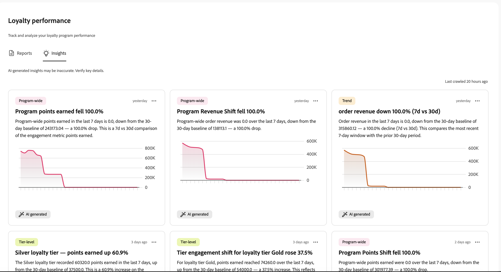

# ロイヤルティチャレンジのパフォーマンスを監視する {#loyalty-reporting}

>[!BEGINSHADEBOX]

**目次**

[ロイヤルティに関する課題を解決](get-started.md)

<table style="table-layout:fixed">
<tr style="border: 0;">
<td style="vertical-align:top;">

**課題の作成と管理**

* [課題とタスクへのアクセスと管理](access-loyalty-challenges.md)
* [課題の創出](create-challenges.md)
* [タスクの作成](create-tasks.md)
* **ロイヤルティチャレンジのパフォーマンスを監視** ◀︎ **現在地**

</td>
<td style="vertical-align:top;">

**設定と統合**

* [ロイヤルティに関する課題の設定](loyalty-admin.md)
* [ロイヤルティデータとデータセット](loyalty-data-and-datasets.md)
* [ロイヤルティチャレンジ API リファレンス](https://developer.adobe.com/journey-optimizer-apis/references/loyalty-challenges){target="_blank"}

</td>
</tr>
</table>

>[!ENDSHADEBOX]

>[!AVAILABILITY]
>
>この機能は現在&#x200B;**プライベートベータ版**&#x200B;です。 リリースサイクルと可用性フェーズについて詳しくは、[Journey Optimizer リリースサイクル](../rn/releases.md)を参照してください。

ロイヤルティの課題レポートを使用して、課題のパフォーマンスを確認します。 一元的に管理することで、新規登録者、課題の完了者、プログラムの売上を確認できます。 Adobe Customer Journey Analyticsから。

レポートダッシュボードを開くには、Journey Optimizerの&#x200B;**[!UICONTROL ロイヤルティチャレンジ（Beta）]**&#x200B;に移動し、左側のナビゲーションで&#x200B;**[!UICONTROL ロイヤルティレポート]**&#x200B;を選択します。

レポートインターフェイスには、次の2つのタブがあります。

* **[レポート](#reports-view)**：課題の数値とグラフ。
* **[インサイト](#insights-cards)**：今すぐ注目すべき点をハイライトするカード。

## レポートビュー {#reports-view}

「**レポート**」タブでは、選択した期間のプログラムの実行状況の概要を表示します。 ページ上部の日付選択ツールを使用し、**[!UICONTROL フィルターを適用]** ボタンを選択してレポート期間を変更し、更新された数値とグラフを確認します。

**主要指標**&#x200B;領域には、4つの数字が一目で表示されます。 各指標には、前期と比較した変化率も表示されます。

* **ロイヤルティメンバー**：期間中にアクティブだったロイヤルティメンバーの数。
* **チャレンジサインアップ**：メンバーがチャレンジに登録した回数。
* **収益**：チャレンジ アクティビティに関連付けられた総収益。
* **平均完了率**：少なくとも1つのチャレンジを完了した登録済みメンバーの割合。

右側の&#x200B;**最新のインサイト** パネルには、プログラムから生成された最新のAIによるインサイトが表示されます。 「**[!UICONTROL すべて表示]**」を選択して、完全な「**インサイト**」タブを開きます。

主要な指標の下にある「**チャレンジ**」セクションには、チャレンジのアクティビティに関する2つのビューが表示されます。

* **チャレンジのエンゲージメント**：開始済みのメンバー数、進行中のメンバー数、期間中に完了したチャレンジ数を示すタイムライン。
* **チャレンジレポート**：種類、タスク、ステータス、登録番号などの詳細を含むあらゆる課題のテーブル。 検索バーを使用して、特定の課題を見つけます。 レポート全体と、エンゲージメントの傾向とパフォーマンスの詳細を確認するには、課題を選択します。

  +++チャレンジレポートの例

  

  +++

## 「インサイト」タブ {#insights-cards}

「**インサイト**」タブには、AIが生成したカードが表示され、ロイヤルティプログラムの異常値、トレンド、機会にフラグが立てられます。 各カードは、ひとつの観察を表し、現在のプログラムデータに対して、どの程度重要であるかがランク付けされます。

右上の&#x200B;**最後にクロールした**&#x200B;のタイムスタンプは、insight エンジンがプログラムデータを最後に処理した日時を示します。

### カード操作 {#insight-card-actions}

各カードには、次の2つのアクションを含む メニューがあります。

* **却下**：インサイトリストからカードを完全に削除します。
* **Snooze**：カードを一時的に非表示にします。 **1日**、**3日**、または&#x200B;**7日**&#x200B;にスヌーズを選択します。 スヌーズ期間が終了すると、カードが再び表示されます。

<!--
### Priority badges {#insight-badges}

Each card has a priority badge — **High**, **Medium**, or **Low** — based on how significant the underlying signal is relative to your current program data. These levels are relative: there are always a few **High** cards, even in a quiet week. **High** means "most relevant right now", not that a fixed threshold was crossed.
-->

### カテゴリタグ {#insight-category-tags}

各カードには、**カテゴリタグ**&#x200B;が付いており、insightがどのプログラムに関連しているかを特定できます。

| カテゴリ | 内容 |
| --- | --- |
| **プログラム全体** | ロイヤルティプログラムの全体的な健全性とパフォーマンス |
| **階層レベル** | 顧客層をまたいだ収益率、移動、配信 |
| **チャレンジ** | 特定の課題や課題をまたいだアクティビティ、完了率、異常値 |
| **製品** | ビュー、引き換え、カタログレベルのトレンドなど、製品カタログのパフォーマンス |
| **メンバーライフサイクル** | 登録、エンゲージメント、解約の各段階における会員の進捗状況 |
| **トレンド** | 週次サイクル、季節的な急増、トレンドの逆転など、時間ベースのパターン |
