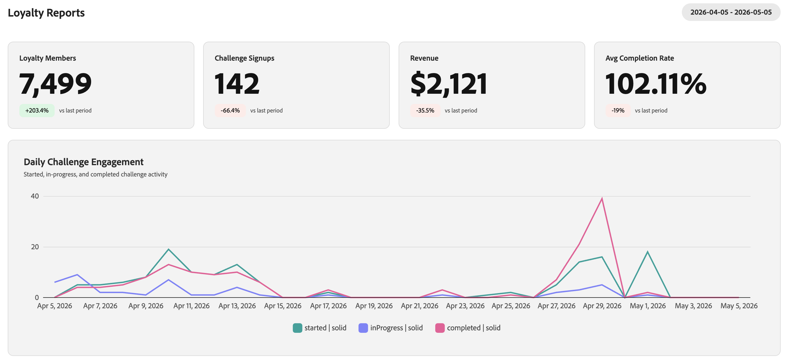
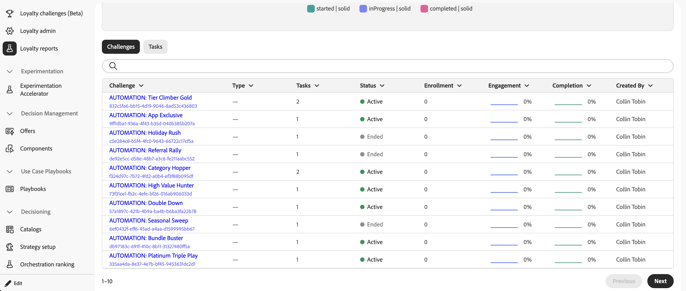

# ロイヤルティチャレンジのパフォーマンスを監視する {#loyalty-reporting}

>[!BEGINSHADEBOX]

**ロイヤルティの課題に関するドキュメント**

[ロイヤルティに関する課題を解決](get-started.md)

+++課題の創出と管理

* [課題とタスクへのアクセスと管理](access-loyalty-challenges.md)
* [課題の創出](create-challenges.md)
* [タスクの作成](create-tasks.md)
* **ロイヤルティチャレンジのパフォーマンスを監視** ◀︎ **現在地**

+++

+++設定と統合

<!-- * [Configure loyalty challenges](loyalty-admin.md) -->
* [ロイヤルティデータとデータセット](loyalty-data-and-datasets.md)
* [ロイヤルティチャレンジ API リファレンス](https://developer.adobe.com/journey-optimizer-apis/references/loyalty-challenges){target="_blank"}

+++

>[!ENDSHADEBOX]

>[!AVAILABILITY]
>
>この機能は現在&#x200B;**プライベートベータ版**&#x200B;です。 リリースサイクルと可用性フェーズについて詳しくは、[Journey Optimizer リリースサイクル](../rn/releases.md)を参照してください。

ロイヤルティチャレンジレポートは、チャレンジレベルのダッシュボードを提供しており、オーディエンスのfunnelパフォーマンス、タスク完了率、報酬の発行、売上への影響などの主要指標を追跡することができます。 あらゆるデータはAdobe Customer Journey Analyticsから取得され、専用のカスタムインターフェイスで表示されます。

<!--
A direct **Analyze in CJA** button will be added to the reporting interface before the feature reaches general availability.
-->

## ロイヤルティレポートへのアクセス {#access-reports}

ロイヤルティレポートダッシュボードを開くには、Journey Optimizerの&#x200B;**[!UICONTROL ロイヤルティチャレンジ（Beta）]**&#x200B;に移動し、左側のナビゲーションから&#x200B;**[!UICONTROL ロイヤルティレポート]**&#x200B;を選択します。

レポートインターフェイスには3つのビューがあり、それぞれ異なる詳細レベルを提供します。 **[概要](#overview)**&#x200B;には、アクティブなすべての課題の概要が表示されます。 その下に2つのタブがあり、より詳細なビューを切り替えることができます。

* **[課題](#challenges-view)**: ドリルダウン機能を使用した課題ごとの内訳。
* **[タスク](#tasks-view)**：収益と完了指標のタスクレベルのビュー。

ページ上部の日付選択ツールを使用して、すべてのビューの日付範囲を調整できます。 標準の日付プリセットも使用できます。

## 概要 {#overview}

**概要** ページには、選択した期間のすべてのアクティブな課題について集計された指標が表示されます。

ページの上部には、次の指標が表示されます。

**ロイヤルティメンバー** – 選択した期間中にアクティブだったロイヤルティプログラムメンバーの数。
**チャレンジ登録数** – すべてのチャレンジにおける新しいチャレンジ登録数の合計数。
**収益** – 期間中のチャレンジ アクティビティに関連付けられた合計収益。
**平均完了率** – 少なくとも1つのチャレンジを完了した登録済み顧客の割合。

これらの指標の下には、**デイリーチャレンジエンゲージメント**&#x200B;のタイムラインが、期間中にチャレンジ参加がどのように進化したかを示し、3つのシリーズをプロットしています。

* **さんが**&#x200B;にチャレンジを開始した顧客
* **進行中**&#x200B;のステータスに移動した顧客，
* **完了**&#x200B;した顧客はチャレンジを行います。

## 課題のビュー {#challenges-view}

「**課題**」タブでは、個々の課題ごとのパフォーマンスが分類されます。 各チャレンジには、タイプ、ステータス、登録、完了などの主要な列が一覧表示されます。 リストは最終変更日で並べ替えられ、一度に10個の課題が表示されます。 下部の「**次へ**」ボタンを使用して、さらに参照します。

リストから任意の課題を選択して、その詳細ビューを開きます。 このレポートには、総売上、登録、完了率、トレンドチャートなどの複数の指標ブロックと、日々の内訳が含まれています。

+++チャレンジレポートの例

+++

## タスク表示 {#tasks-view}

「**タスク**」タブには、タスクのパフォーマンスに関するクロスチャレンジビューが表示されます。 収益ごとに上位タスクを切り替えたり、完了ごとに上位タスクを切り替えたりして、最も関連性の高い指標に注力できます。

また、このタブでは、収益ごとに上位6つのタスクが強調表示され、どのタスクが最も価値を生み出しているかをすばやく把握できます。

レーダーグラフの下には、タスクリストにすべてのタスクが表示され、完了、収益、各タスクが属する課題などの主要な列が表示されています。 リストは収益別に並べ替えられ、一度に10個のタスクが表示されます。 「**次へ**」ボタンを使用して、さらに参照します。

