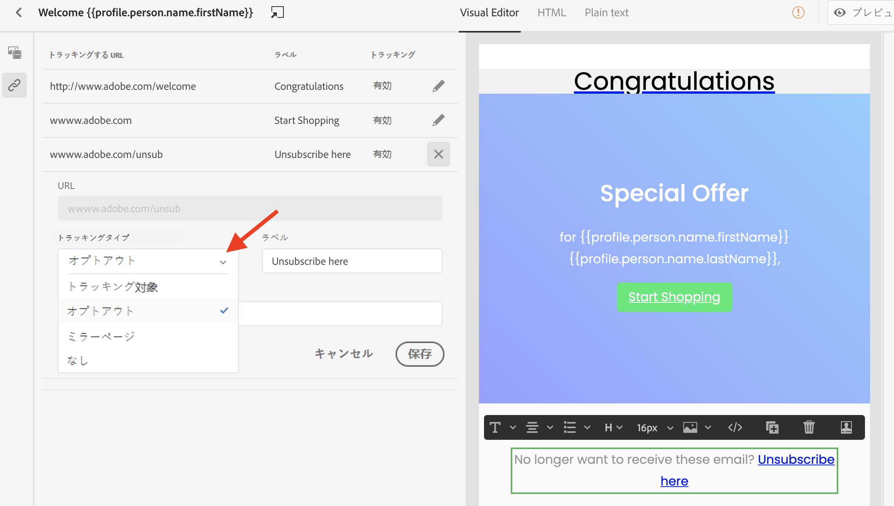

# メッセージトラッキング {#tracking}

Journey Optimizer を使用すると、送信されたメッセージと受信者の動作をトラッキングできます。

メッセージレベルでのトラッキングを有効にするには、「**[!UICONTROL メールの開封トラッキング]**」または「**[!UICONTROL メールのクリックトラッキング]**」オプション、あるいはその両方をオンにします。これにより、リンクの開封やクリックを通じて受信者の行動をトラッキングできます。[メッセージ作成の詳細情報](create-message.md)。

メッセージをデザインする際に、トラッキング対象のリンクをコンテンツに追加できます。また、E メールデザイナーでは、トラッキングの有効化と無効化、各リンクのトラッキングタイプの編集など、トラッキングする URL を管理できます。[E メールデザイナーの操作の詳細情報](create-email-content.md)。

開封されたメッセージの数とクリックされたリンクの数が、[「実行」タブ](message-monitoring.md)に表示されます。
