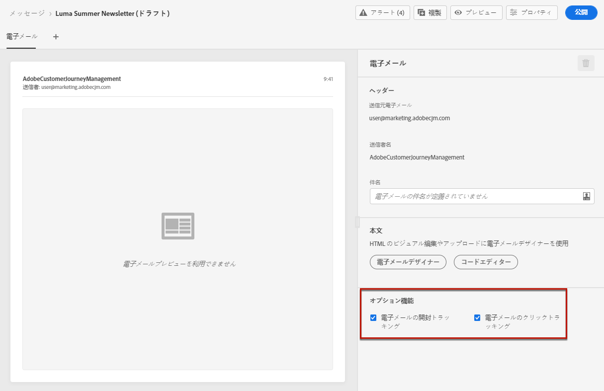
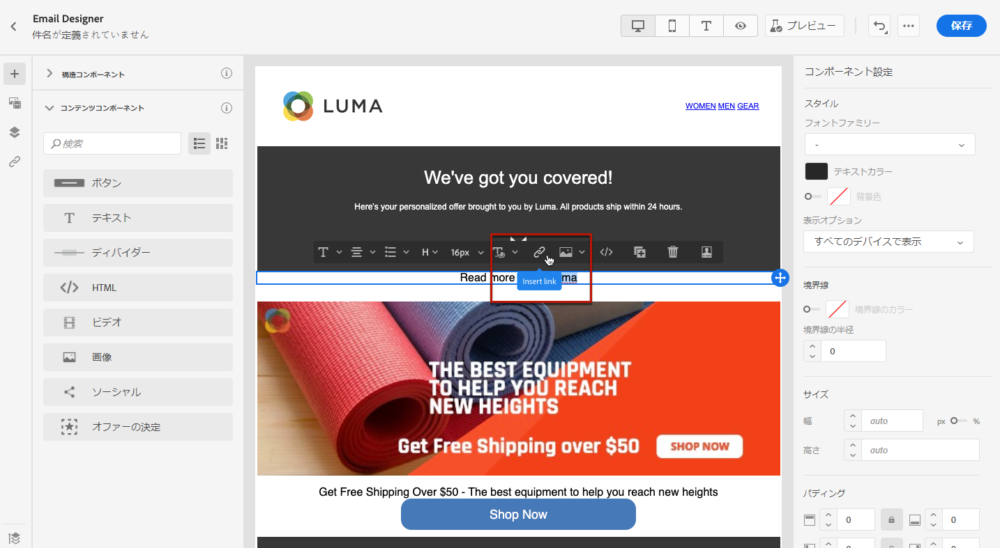
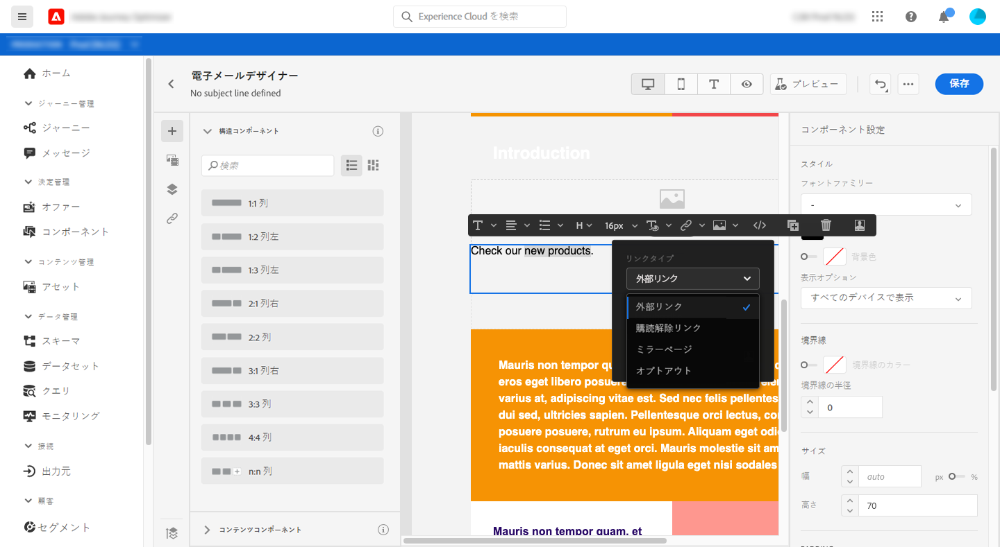
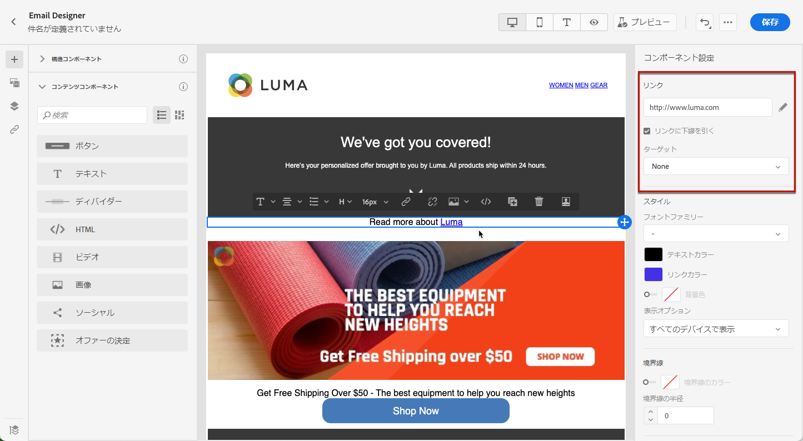
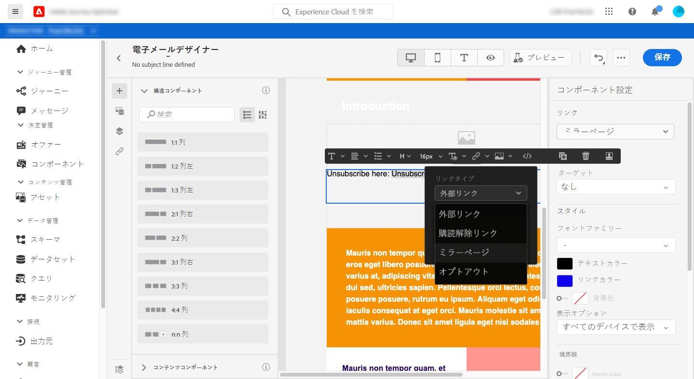
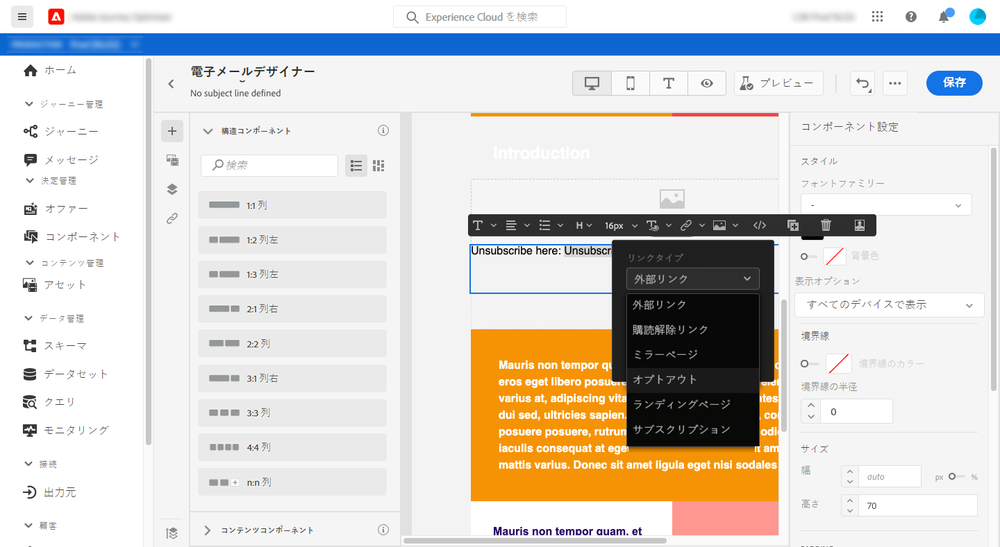
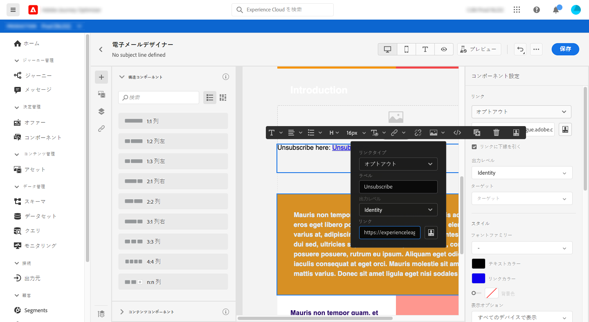
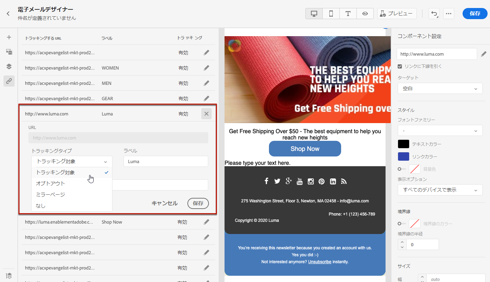

# リンクの追加とメッセージのトラッキング {#tracking}

[!DNL Journey Optimizer] を使用すると、受信者の行動を監視するために、コンテンツにリンクを追加し送信済みメッセージをトラッキングすることができます。

## トラッキングの有効化 {#enable-tracking}

[メッセージの作成](create-message.md)時に「**[!UICONTROL 電子メールの開封トラッキング]**」オプションや「**[!UICONTROL 電子メールのクリックトラッキング]**」オプションをオンにすることで、メールメッセージレベルでのトラッキングを有効にできます。

>[!NOTE]
>
>デフォルトでは、両方のオプションが有効になっています。

これにより、次の方法で受信者の行動を追跡できます。

* **[!UICONTROL E メールの開封トラッキング]**：開封されたメッセージ。
* **[!UICONTROL E メールのクリックトラッキング]**：メール内のリンクのクリック数。

## リンクの挿入 {#insert-links}

メッセージをデザインする際に、リンクをコンテンツに追加できます。

>[!NOTE]
>
>[トラッキングが有効](#enable-tracking)になっている場合、メッセージコンテンツに含まれるすべてのリンクがトラッキングされます。

メールコンテンツにリンクを挿入するには、次の手順に従います。

1. 要素を選択し、コンテキストツールバーの「**[!UICONTROL リンクを挿入]**」をクリックします。

   

1. 作成するリンクのタイプを選択します。

   * **[!UICONTROL 外部リンク]**：外部 URL へのリンクを挿入します。

   * **[!UICONTROL 購読解除リンク]**：ブランドからのコミュニケーションの受信を解除するリンクを挿入する。オプトアウト管理の詳細については、[この節](consent.md#opt-out-management)を参照してください。

   * **[!UICONTROL ミラーページ]**：web ブラウザーにメールコンテンツを表示するためのリンクを挿入します。詳しくは、[この節](#mirror-page)を参照してください。

   * **[!UICONTROL オプトアウト]**：ユーザーがオプトアウトを確認しなくてもコミュニケーションをすばやく購読解除できるリンクを挿入します。詳しくは、[この節](#one-click-opt-out-link)を参照してください。

   

1. リンクをパーソナライズできます。パーソナライズされた URL について詳しくは、[この節](personalization/personalization-syntax.md#perso-urls)を参照してください。

1. 変更を保存します。

1. リンクを作成した後も、右側の「**[!UICONTROL コンポーネント設定]**」ウィンドウから変更できます。

   * 鉛筆アイコンをクリックしてリンクを編集します。
   * リンクに下線を引くかどうかは、対応するオプションをオンにすることで選択できます。

   

## ミラーページへのリンク {#mirror-page}

ミラーページは、web ブラウザーを使用してオンラインでアクセス可能な HTML ページです。その内容はメールの内容と同じです。

メールにミラーページへのリンクを追加するには、[リンクを挿入](#insert-links)し、リンクのタイプとして「**[!UICONTROL ミラーページ]**」を選択します。

ミラーページが自動的に作成されます。

>[!NOTE]
>
>自動生成されたリンクは編集できません。

メールが送信され、受信者がミラーページのリンクをクリックすると、メールの内容がデフォルトの web ブラウザーに表示されます。

>[!NOTE]
>
>テストプロファイルに送信される[配達確認](preview.md#send-proofs)では、ミラーページへのリンクはアクティブになっていません。 最終的なメッセージでのみアクティブ化されます。

ミラーページの保持期間は 60 日です。 この期間が経過すると、ミラーページは使用できなくなります。

## ワンクリックオプトアウトリンク {#one-click-opt-out-link}

受信者がブランドからのコミュニケーションをすばやく購読解除できるようにするには、メールコンテンツにワンクリックオプトアウトリンクを挿入します。この機能を利用すると、選択の確認が必要なランディングページにユーザーがリダイレクトされなくなるので、購読解除プロセスを高速化できます。

メールにオプトアウトリンクを追加するには、次の手順に従います。

1. [リンクを挿入](#insert-links)し、リンクのタ イプとして「**[!UICONTROL オプトアウト]**」を選択します。

   

1. オプトアウトを適用する方法として、チャネル、ID、購読のいずれかのレベルを選択します。

   

   * **[!UICONTROL チャネル]**：オプトアウトは、現在のチャネルのプロファイルのターゲット（メールアドレスなど）に今後送信されるメッセージに適用されます。複数のターゲットが 1 つのプロファイルに関連付けられている場合、オプトアウトはそのチャネルのプロファイル内のすべてのターゲット（メールアドレスなど）に適用されます。
   * **[!UICONTROL ID]**：オプトアウトは、現在のメッセージに使用されている特定のターゲット（メールアドレスなど）に今後送信されるメッセージに適用されます。
   * **[!UICONTROL 購読]**：オプトアウトは、特定の購読リストに関連付けられた今後のメッセージに適用されます。このオプションは、現在のメッセージが購読リストに関連付けられている場合にのみ選択できます。

1. 購読解除後にユーザーがリダイレクトされるランディングページの URL を入力します。このページは、オプトアウトが成功したことを確認するためにのみ表示されます。

   

   リンクをパーソナライズできます。パーソナライズされた URL について詳しくは、[この節](personalization/personalization-syntax.md)を参照してください。

1. 変更を保存します。

メッセージが送信されたあと、受信者がオプトアウトリンクをクリックした場合、すぐにオプトアウトされます。

## トラッキングの管理 {#manage-tracking}

[E メールデザイナー](create-email-content.md)を使用すると、追跡する URL を管理できます（各リンクのトラッキングタイプの編集など）。

1. 左側のウィンドウの「**[!UICONTROL リンク]**」アイコンをクリックし、追跡するコンテンツのすべての URL のリストを表示します。

   このリストを使用すると、一元的なビューを表示したり、メールコンテンツ内の各 URL を見つけたりできます。

1. リンクを編集するには、対応する鉛筆アイコンをクリックします。

   

1. 必要に応じて、「**[!UICONTROL トラッキングタイプ]**」を変更できます。

   

   追跡する URL ごとに、トラッキングモードを次のいずれかの値に設定できます。

   * **[!UICONTROL トラッキング対象]**：この URL のトラッキングを有効化します。
   * **[!UICONTROL オプトアウト]**：この URL をオプトアウトまたは購読解除 URL とみなします。
   * **[!UICONTROL ミラーページ]**：この URL をミラーページの URL とみなします。
   * **[!UICONTROL なし]**：この URL のトラッキングを有効化しません。<!--This information is saved: if the URL appears again in a future message, its tracking is automatically deactivated.-->

開封されたメッセージの数とクリックされたリンクの数が、[「実行」タブ](message-monitoring.md)に表示されます。

開封数とクリック数に関するレポートは、[E メールのライブレポート](reports/email-live-report.md)と[E メールのグローバルレポート](reports/email-global-report.md)で利用できます。
