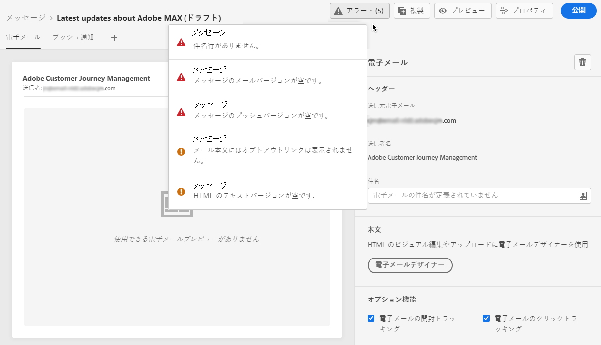

# メッセージに関するアラートを確認する {#publish-manage-messages}

## 公開前にチェック {#message-alerting}

メッセージの作成中、メッセージを公開する前に重要なアクションを実行する必要がある場合は、アラートが表示されます。

次に示すように、画面の右上にアラートが表示されます。

>[!NOTE]
>
>このボタンが表示されない場合、アラートは検出されていません。

次の 2 種類のアラートが発生する可能性があります。

* **警告**&#x200B;は、推奨奨事項とベストプラクティスを表します。例えば、オプトアウトリンクがない場合は、メッセージが表示されます。

* **エラー**&#x200B;は、解決されない限り、メッセージを公開することができません。例えば、件名がないことを警告するメッセージが表示されます。

考えられるすべての警告とエラーの詳細は、[以下](#alerts-and-warnings)のとおりです。

>[!CAUTION]
>
> 公開する前に、すべての&#x200B;**エラー**&#x200B;アラートを解決する必要があります。

## 警告とエラーのリスト {#alerts-and-warnings}

システムでチェックされる設定と要素は以下のとおりです。また、設定を調整して対応する問題を解決する方法に関する情報もあります。

**警告**：

* **[!UICONTROL メール本文にオプトアウトンクがありません]**：購読解除リンクをメール本文に追加するのがベストプラクティスです。設定方法について詳しくは、[この節](consent.md)を参照してください。

* **[!UICONTROL テキストバージョンの html が空です]**：メール本文のテキストバージョンを必ず定義してください。このバージョンは、HTML コンテンツを表示できない場合に使用されます。テキストバージョンの作成方法については、[この節](create-email-content.md#generate-text-version)を参照してください。

* **[!UICONTROL メールの本文に空のリンクが存在します]**：メール内のすべてのリンクが正しいことを確認します。コンテンツとリンクの管理方法については、[この節](create-email-content.md)を参照してください。

* **[!UICONTROL メールのサイズが 100KB の制限を超えています]**：配信を最適化するには、メールのサイズが 100KB を超えないようにしてください。メールコンテンツの編集方法については、[この節](create-email-content.md)を参照してください。

**エラー**：

* **[!UICONTROL 件名が存在しません]**：メールの件名は必須です。定義およびパーソナライズの方法については、[この節](create-email.md)を参照してください。

   <!--HTML is empty when Amp HTML is present-->

* **[!UICONTROL プッシュバリアントが空です]**：このエラーは、プッシュ通知の本文またはタイトルが見つからない場合に表示されます。プッシュ通知の内容を定義する方法については、[この節](create-push.md)を参照してください。

* **[!UICONTROL メールバリアントが空です]**：このエラーは、メールのコンテンツが設定されていない場合に表示されます。メールコンテンツの設計方法については、[この節](design-emails.md)を参照してください。

* **[!UICONTROL プリセットが存在しません]**：メッセージの作成後に選択したプリセットを削除した場合は、メッセージを公開できません。このエラーが発生した場合は、メッセージ&#x200B;**[!UICONTROL プロパティ]**&#x200B;で別のプリセットを選択します。ブランディングの詳細については、[この節](../configuration/about-subdomain-delegation.md)を参照してください。

* **[!UICONTROL プッシュの iOS / Android ペイロードが 4KB の制限を超えています]**：プッシュ通知のサイズは、4KB を超えることはできません。この制限を守るために、画像や絵文字の使用を減らすようにしてください。プッシュ通知コンテンツの管理方法については、[この節](create-push.md)を参照してください。

>[!CAUTION]
>
> メッセージを公開するには、すべての&#x200B;**エラー**&#x200B;アラートを解決する必要があります。

<!--Other issues can stop publication such as:
* The push notification title is empty-->
