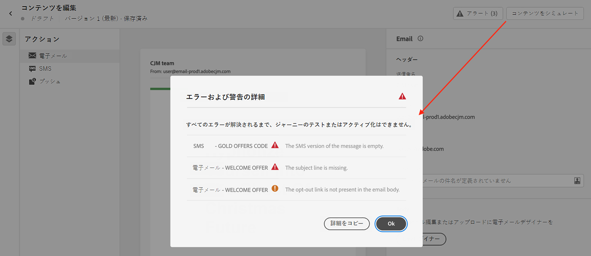

# メッセージに関するアラートのチェック {#messages-alerts}

## 送信前のチェック {#message-alerting}

メッセージを設計する際に、キー設定が見つからない場合は、インターフェイスにアラートが表示されます。

メッセージコンテンツの編集時に、画面の右上にアラートが表示されます。

>[!NOTE]
>
>このボタンが表示されない場合、アラートは検出されていません。

次の 2 種類のアラートが発生する可能性があります。

* **警告**&#x200B;は、推奨奨事項とベストプラクティスを表します。例えば、オプトアウトリンクがない場合は、メッセージが表示されます。

* **エラー** ジャーニーが解決されない限り、ジャーニーのテストやアクティブ化を防ぎます。 例えば、件名がないことを警告するメッセージが表示されます。

考えられるすべての警告とエラーの詳細は、[以下](#alerts-and-warnings)のとおりです。

>[!CAUTION]
>
> すべてを解決する必要があります **エラー** メッセージを使用してジャーニーをテストまたはアクティブ化する前にアラートを送信します。

## 警告とエラーのリスト {#alerts-and-warnings}

システムでチェックされる設定と要素は以下のとおりです。また、設定を調整して対応する問題を解決する方法に関する情報もあります。

**警告**：

* **[!UICONTROL メール本文にオプトアウトンクがありません]**：購読解除リンクをメール本文に追加するのがベストプラクティスです。設定方法について詳しくは、[この節](consent.md#opt-out-management)を参照してください。

   >[!NOTE]
   >
   >マーケティングタイプの電子メールメッセージには、オプトアウトリンクを含める必要があります。これはトランザクションメッセージには必要ありません。メッセージカテゴリ (**[!UICONTROL マーケティング]** または **[!UICONTROL トランザクション]**) が [チャンネル表面](../configuration/message-presets.md#email-type) （例：メッセージプリセット）レベルとタイミング [メッセージの作成](get-started-content.md#create-new-message).

* **[!UICONTROL HTML のテキストバージョンが空です]**：メール本文のテキストバージョンを必ず定義してください。このバージョンは、HTML コンテンツを表示できない場合に使用されます。テキストバージョンの作成方法については、[この節](../design/text-version-email.md)を参照してください。

* **[!UICONTROL メールの本文に空のリンクが存在します]**：メール内のすべてのリンクが正しいことを確認します。コンテンツとリンクの管理方法については、[この節](../design/create-email-content.md)を参照してください。

* **[!UICONTROL メールのサイズが 100KB の制限を超えています]**：配信を最適化するには、メールのサイズが 100KB を超えないようにしてください。メールコンテンツの編集方法については、[この節](../design/create-email-content.md)を参照してください。

**エラー**：

* **[!UICONTROL 件名行がありません]**：電子メールの件名は必須です。定義およびパーソナライズの方法については、[この節](create-email.md)で説明します。

   <!--HTML is empty when Amp HTML is present-->

* **[!UICONTROL メッセージのプッシュバージョンが空です]**：このエラーは、プッシュ通知の本文またはタイトルがない場合に表示されます。プッシュ通知コンテンツを定義する方法については、[この節](create-push.md)で説明します。

* **[!UICONTROL メッセージの電子メールバージョンが空です]**：このエラーは、電子メールのコンテンツが設定されていない場合に表示されます。メールコンテンツの設計方法については、[この節](../design/design-emails.md)で説明します。

* **[!UICONTROL サーフェスが存在しません]**:メッセージの作成後に選択したサーフェスを削除した場合は、メッセージを使用できません。 このエラーが発生した場合は、メッセージ内の別のサーフェスを選択します **[!UICONTROL プロパティ]**. でのチャネルサーフェスの詳細を説明します [この節](../configuration/message-presets.md).

* **[!UICONTROL プッシュの iOS / Android ペイロードが 4KB の制限を超えています]**：プッシュ通知のサイズは、4KB を超えることはできません。この制限を守るために、画像や絵文字の使用を減らすようにしてください。プッシュ通知コンテンツの管理方法については、[この節](create-push.md)を参照してください。

>[!CAUTION]
>
> メッセージを使用するには、次のすべてを解決する必要があります **エラー** アラート。

<!--Other issues can stop publication such as:
* The push notification title is empty-->
