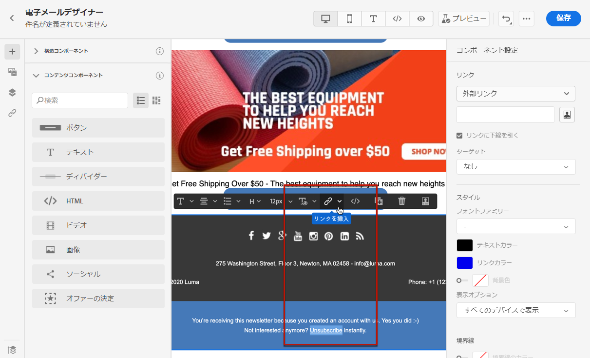
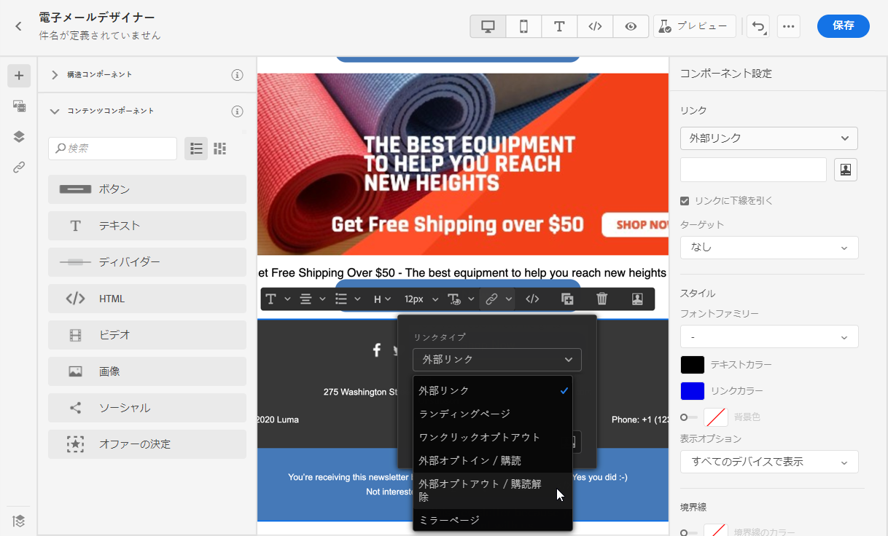
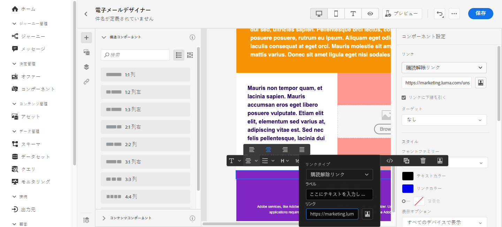
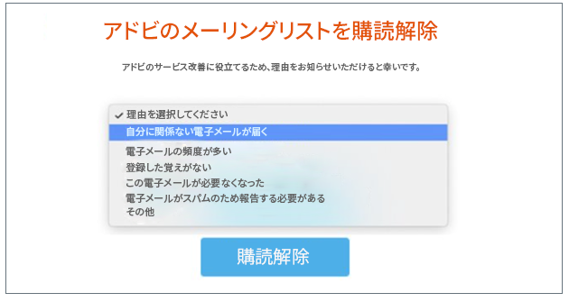
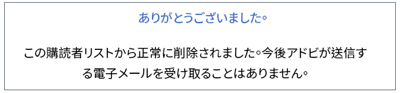
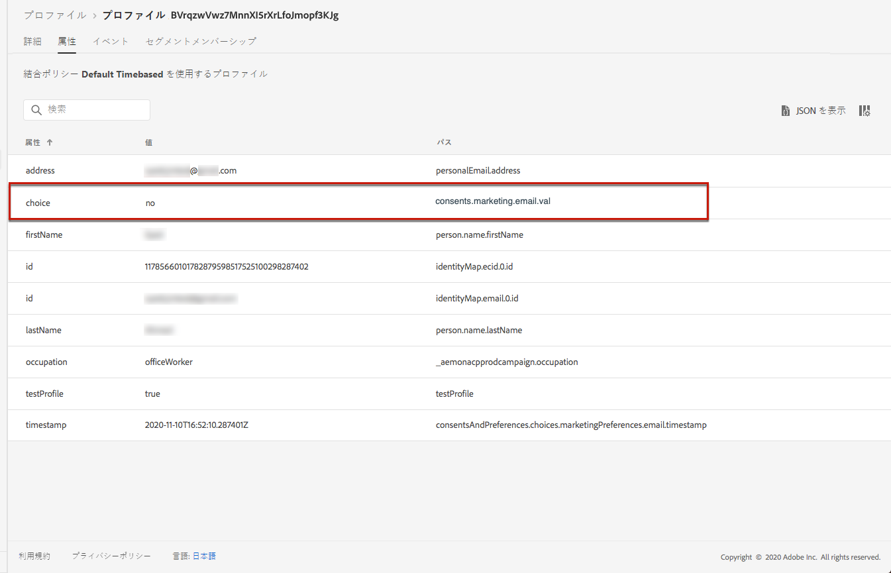
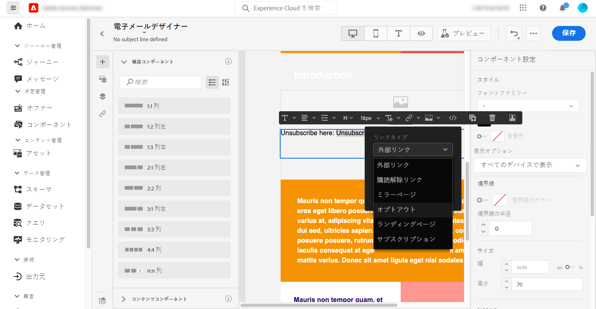
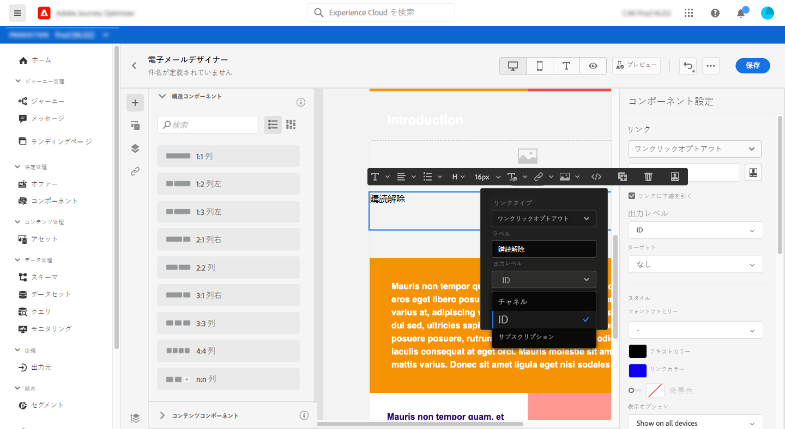
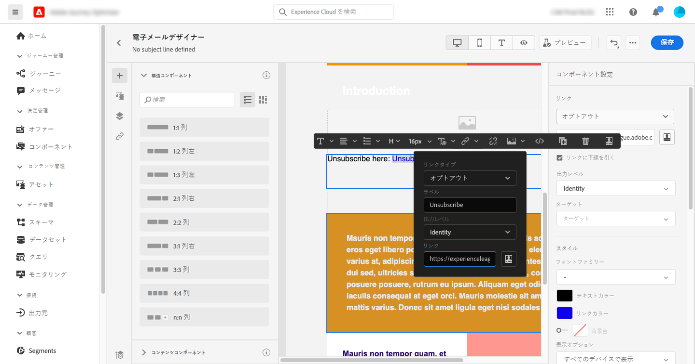
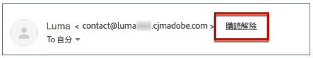

# 同意の管理 {#consent}

[!DNL Journey Optimizer] を使用すると通信に対する受信者の同意を追跡できるため、受信者の好みや登録を管理することで、受信者がブランドとどのように関わりたいと思っているかを把握できます。

GDPR などの規制では、データサブジェクトからの情報を使用するには、特定の要件を満たす必要があると規定されています。また、データサブジェクトは、いつでも同意を変更できる必要があります。

**なぜそれが重要なのでしょうか？**

* これらの規制に準拠できないと、ブランドに法規制上のリスクが生じます。
* この機能を使用すると、未承諾の通信を受信者に送信して、メッセージがスパムと見なされたり、ブランドの評判が損なわれたりする危険性を避けることができます。

プライバシーの管理と適用される法規制について詳しくは、[Experience Platform のドキュメント](https://experienceleague.adobe.com/docs/experience-platform/privacy/home.html?lang=ja){target=&quot;_blank&quot;}を参照してください。

>[!NOTE]
>
>[!DNL Journey Optimizer] の場合、同意は Experience Platform [同意スキーマ](https://experienceleague.adobe.com/docs/experience-platform/xdm/field-groups/profile/consents.html?lang=ja)で処理されます{target=&quot;_blank&quot;}。デフォルトでは同意フィールドの値は空で、通信内容の受信に対する同意として扱われます。このデフォルト値は、[ここ](https://experienceleague.adobe.com/docs/experience-platform/xdm/data-types/consents.html?lang=ja#choice-values)に一覧表示されている値の 1 つにオンボーディングする際に変更できます{target=&quot;_blank&quot;}。

## 電子メールのオプトアウト管理 {#opt-out-management}

ブランドからの連絡を購読解除する機能を受信者に提供することは、法的要件です。適用される法律について詳しくは、[Experience Platform のドキュメント](https://experienceleague.adobe.com/docs/experience-platform/privacy/regulations/overview.html?lang=ja#regulations){target=&quot;_blank&quot;}を参照してください。

したがって、受信者に送信されるすべての メールに&#x200B;**購読解除リンク**&#x200B;を必ず含める必要があります。

* 受信者がこのリンクをクリックすると、オプトアウトを確認するランディングページが表示されます。
* 選択内容を確認した後、プロファイルのデータはこの情報で更新されます。

### 外部オプトアウト {#opt-out-external-lp}

これを行うには、外部のランディングページへのリンクをメールに挿入し、ユーザーがブランドからの通信内容の受信を購読解除できるようにします。

#### 購読解除リンクの追加 {#add-unsubscribe-link}

最初にメッセージに購読解除リンクを追加する必要があります。これを行うには、以下の手順に従います。

1. 登録解除ランディングページを作成します。

1. 任意のサードパーティ製システムでホストします。

1. [!DNL Journey Optimizer] で[メッセージを作成](create-message.md)します。

1. コンテンツ内のテキストを選択し、コンテキストツールバーを使用して[リンクを挿入](message-tracking.md#insert-links)します。

   

1. 「**[!UICONTROL リンクタイプ]**」ドロップダウンリストから「**[!UICONTROL 外部のオプトアウト／購読解除]**」を選択します。

   

1. 「**[!UICONTROL リンク]**」フィールドに、サードパーティ製のランディングページへのリンクを貼り付けます。

   

1. 「**[!UICONTROL 保存]**」をクリックします。

1. コンテンツを保存し、[メッセージを公開](publish-manage-message.md)します。

#### オプトアウト用の API 呼び出しの実装 {#opt-out-api}

受信者がランディングページから選択内容を送信する際にオプトアウトするには、Adobe I/Oを使用して&#x200B;**購読 API 呼び出し**&#x200B;を実装し、対応するプロファイルの環境設定を更新します。

Adobe I/O のこの POST 呼び出しは次のとおりです。

エンドポイント：platform.adobe.io/journey/imp/consent/preferences

クエリパラメーター：

* **params**：暗号化されたペイロードが格納されています
* **sig**：署名
* **pid**：暗号化されたプロファイル ID

次の 3 つのパラメーターが、受信者に送信されるサードパーティのランディングページ URL に含まれます。


ヘッダー要件：

* x-api-key
* x-gw-ims-org-id
* x-sandbox-name
* 認証（技術アカウントからのユーザートークン） 

リクエスト本文：

```
{
   "marketing": [
       {
            "type": "email",           
            "choice": "no",          
            "scope": "channel"       
        }
    ],
 
}
```

[!DNL Journey Optimizer] はこれらのパラメーターを使用し、Adobe I/O 呼び出しを通じて対応するプロファイルの選択内容を更新します。

#### 購読解除リンク付きでメッセージを送信 {#send-message-unsubscribe-link}

ランディングページの購読解除リンクを設定し、API 呼び出しを実装すると、メッセージを送信する準備が整います。

1. [ジャーニー](../building-journeys/journey.md)を通してリンクを含むメッセージを送信します。

1. メッセージを受け取った受信者が購読解除リンクをクリックすると、ランディングページが表示されます。

   

1. 受信者がフォームを送信した場合（ここではランディングページの「**購読解除**」ボタンをクリック）、[Adobe I/O 呼び出し](#opt-out-api)を通してプロファイルデータが更新されます。

1. その後、オプトアウトした受信者は、オプトアウトが成功したことを示す確認メッセージ画面にリダイレクトされます。

   

   その結果、購読を再度登録しない限り、このユーザーはブランドから連絡を受けることはありません。

1. 対応するプロファイルの選択が更新されたことを確認するには、Experience Platform に移動し、ID 名前空間と対応する ID 値を選択してプロファイルにアクセスします。詳しくは、[Experience Platform のドキュメント](https://experienceleague.adobe.com/docs/experience-platform/profile/ui/user-guide.html?lang=ja#getting-started){target=&quot;_blank&quot;}を参照してください。

   

   「**[!UICONTROL 属性]**」タブで、**[!UICONTROL choice]** の値が **[!UICONTROL no]** に変更されたことを確認できます。

### ワンクリックオプトアウト {#one-click-opt-out}

購読解除をするためのより簡単なプロセスを求めているお客様が多いので、ワンクリックオプトアウトリンクをメールコンテンツに追加することもできます。このリンクにより、選択内容の確認が必要なランディングページにリダイレクトされることなく、受信者は通信内容を素早く購読解除できます。これにより、購読解除プロセスを加速することができます。

メールにオプトアウトリンクを追加するには、次の手順に従います。

1. [リンクを挿入](message-tracking.md#insert-links)し、リンクのタイプとして「**[!UICONTROL オプトアウトをワンクリック]**」を選択します。

   

1. オプトアウトを適用する方法として、チャネル、ID、購読のいずれかのレベルを選択します。

   

   * **[!UICONTROL チャネル]**：オプトアウトは、現在のチャネルのプロファイルのターゲット（メールアドレスなど）に今後送信されるメッセージに適用されます。複数のターゲットが 1 つのプロファイルに関連付けられている場合、オプトアウトはそのチャネルのプロファイル内のすべてのターゲット（メールアドレスなど）に適用されます。
   * **[!UICONTROL ID]**：オプトアウトは、現在のメッセージに使用されている特定のターゲット（メールアドレスなど）に今後送信されるメッセージに適用されます。
   * **[!UICONTROL 購読]**：オプトアウトは、特定の購読リストに関連付けられた今後のメッセージに適用されます。このオプションは、現在のメッセージが購読リストに関連付けられている場合にのみ選択できます。

1. 購読解除後にユーザーがリダイレクトされるランディングページの URL を入力します。このページは、オプトアウトが成功したことを確認するためにのみ表示されます。

   

   リンクをパーソナライズできます。パーソナライズされた URL について詳しくは、[この節](../personalization/personalization-syntax.md)を参照してください。

1. 変更を保存します。

メッセージが[ジャーニー](../building-journeys/journey.md)を通して送信された後、受信者がオプトアウトリンクをクリックすると、受信者のプロファイルは直ちにオプトアウトされます。

### メッセージヘッダーの購読解除リンク {#unsubscribe-email}

受信者の E メールクライアントがメールヘッダーに購読解除リンクを表示することをサポートしている場合、[!DNL Journey Optimizer] と共に送信されるメールには自動的にこのリンクが含まれます。

例えば、購読解除リンクは Gmail では次のように表示されます。



E メールクライアントに応じて、ヘッダーから購読解除リンクをクリックすると、次のいずれかの影響を受けます。

* 対応するプロファイルはすぐにオプトアウトされ、この選択は Experience Platform で更新されます。詳しくは、[Experience Platform のドキュメント](https://experienceleague.adobe.com/docs/experience-platform/profile/ui/user-guide.html#getting-started){target=&quot;_blank&quot;}を参照してください。

* これは、メールコンテンツから購読解除リンクをクリックするのと同じ効果があります。受信者は、オプトアウトを確認するボタンを含むランディングページにリダイレクトされます。オプトアウト管理の詳細については、[この節](#opt-out-management)を参照してください。

## プッシュのオプトアウト管理 {#push-opt-out-management}

プッシュの受信者は、自分のデバイスから登録を解除できます。

例えば、アプリのダウンロード時や使用時に、通知の停止を選択できます。同様に、モバイルオペレーティングシステムから通知設定を変更することもできます。
