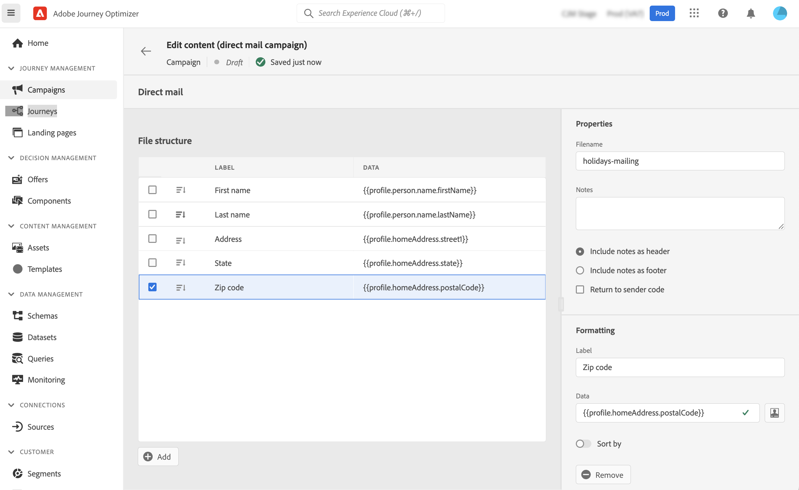

# ダイレクトメールメッセージの作成 {#create-direct}

>[!CONTEXTUALHELP]
>id="ajo_direct_mail"
>title="ダイレクトメールの作成"
>abstract="スケジュールされたキャンペーンでダイレクトメールメッセージを作成し、ダイレクトメールプロバイダーが顧客にメールを送信するために必要な抽出ファイルを設計します。"

ダイレクトメールは、ダイレクトメールプロバイダーが顧客にメールを送信するために必要な抽出ファイルをパーソナライズおよび生成できるオフラインチャネルです。

ダイレクトメールを作成すると、Journey Optimizerによって、すべてのターゲットプロファイルと選択したデータ（郵送先住所、プロファイル属性など）を含むファイルが生成されます。 その後、ダイレクトメールプロバイダーはそのファイルを取得でき、実際の送信処理をおこないます。

ダイレクトメールメッセージは、スケジュールされたキャンペーンのコンテキストでのみ作成できます。 API トリガーキャンペーンやジャーニーでは使用できません。

>[!IMPORTANT]
>
>ダイレクトメールメッセージを送信する前に、次の設定が完了していることを確認します。
>
>1. A [ファイルルーティング設定](../configuration/direct-mail-configuration.md#file-routing-configuration) 抽出ファイルをアップロードして保存するサーバーを指定します。
>1. A [ダイレクトメールメッセージサーフェス](../configuration/direct-mail-configuration.md#direct-mail-surface) ファイルルーティング設定を参照する

## ダイレクトメールメッセージを作成する {#create}

ダイレクトメールメッセージを作成して送信する手順は次のとおりです。

1. 新しいスケジュール済みキャンペーンを作成し、「 **[!UICONTROL ダイレクトメール]** を選択し、使用するチャネルサーフェスを選択します。 [ダイレクトメールサーフェスの作成方法を説明します](../configuration/direct-mail-configuration.md#direct-mail-surface)

   

1. クリック **[!UICONTROL 作成]** 次に、キャンペーンの基本情報（名前、説明）を定義します。 [キャンペーンの設定方法を説明します](../campaigns/create-campaign.md)

   

1. 次をクリック： **[!UICONTROL コンテンツを編集]** 」ボタンをクリックして、ダイレクトメールプロバイダーに送信する抽出ファイルを設定します。

1. 抽出ファイルの名前を **[!UICONTROL ファイル名]** フィールドに入力します。

   抽出ファイルの先頭または末尾に情報を追加することが必要となる場合があります。これをおこなうには、 **[!UICONTROL メモ]** フィールドを指定して、メモをヘッダーまたはフッターとして含めるかどうかを指定します。

   <!--Click on the button to the right of the Output file field and enter the desired label. You can use personalization fields, content blocks and dynamic text (see Defining content). For example, you can complete the label with the delivery ID or the extraction date.-->

   

1. 左側の領域を使用して、抽出ファイルに列として表示する情報を定義します。

   1. 次をクリック： **[!UICONTROL 追加]** ボタンをクリックして新しい列を追加し、リストから選択します。

   1. 内 **[!UICONTROL 書式設定]** 「 」セクションで、列のラベルを指定し、次に、 [式エディター](../personalization/personalization-build-expressions.md).

      

   1. 選択した列で抽出ファイルを並べ替えるには、「 **[!UICONTROL 並べ替え基準]** オプションをオンにします。 この **[!UICONTROL 並べ替え基準]** アイコンがファイル構造内で列のラベルの横に表示されます。

1. これらの手順を繰り返し、抽出ファイルを作成するのに必要な数の列を追加します。 追加できる列は 50 個までです。

   

   列を選択して **[!UICONTROL 削除]** ボタン **[!UICONTROL 書式設定]** 」セクションに入力します。

1. ダイレクトメールのコンテンツを定義したら、キャンペーンの設定を完了します。

   キャンペーンが開始されると、抽出ファイルが自動的に生成され、 [ファイルルーティング設定](../configuration/direct-mail-configuration.md).
