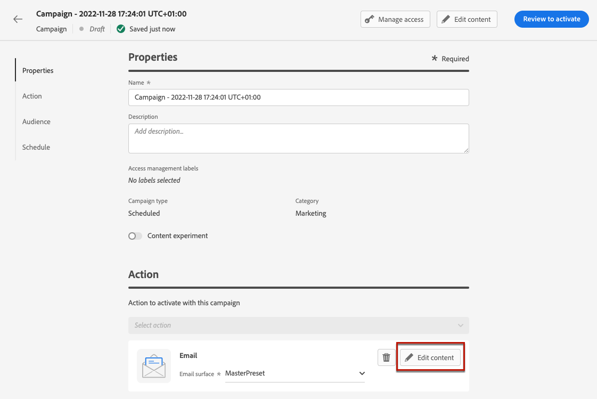
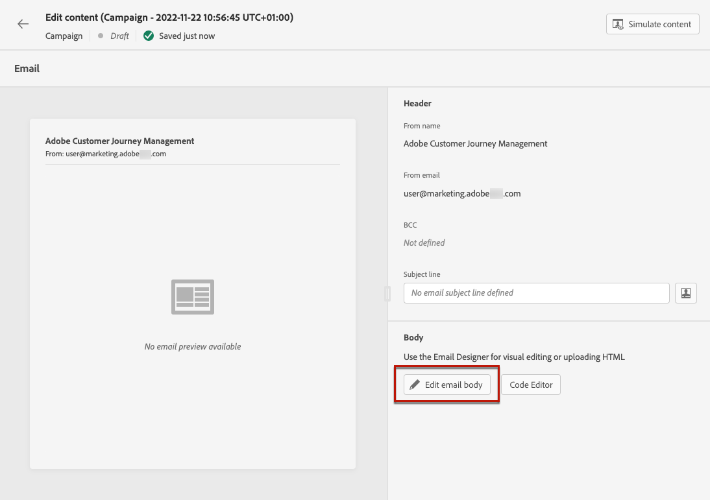

# メールの作成 {#create-email-bis}

E メールを作成するには、次の手順に従います。

## 1.ジャーニーまたはキャンペーンで E メールを作成する

を追加します。 **[!UICONTROL 電子メール]** アクションをジャーニーまたはキャンペーンに追加し、ケースに応じて以下の手順に従います。

>[!BEGINTABS]

>[!TAB ジャーニーへの E メールの追加]

1. ジャーニーを開き、 **[!UICONTROL 電子メール]** アクティビティ **[!UICONTROL アクション]** 」セクションに表示されます。

1. メッセージに関する基本情報（ラベル、説明、カテゴリ）を入力します。

1. を選択します。 [電子メール表面] を使用します。

   

ジャーニーの設定方法について詳しくは、 [このページ](../building-journeys/journey-gs.md).

>[!TAB キャンペーンへの E メールの追加]

1. スケジュール済みまたは API トリガーキャンペーンを新しく作成し、「 」を選択します。 **[!UICONTROL 電子メール]** を選択します。

1. を選択します。 [電子メール表面] を使用します。

   

1. 「**[!UICONTROL 作成]**」をクリックします。

1. 電子メールキャンペーンを作成する手順を実行します。

   

<!--
From the **[!UICONTROL Action]** section, specify if you want to track how your recipients react to your delivery: you can track email opens, and/or clicks on links and buttons in your email.

-->

キャンペーンの設定方法について詳しくは、 [このページ](../campaigns/get-started-with-campaigns.md).

>[!ENDTABS]

## メールコンテンツの定義

1. ジャーニーまたはキャンペーンの設定画面で、 **[!UICONTROL コンテンツを編集]** ボタンをクリックして、E メールのコンテンツを設定します。 [詳細情報]

   

1. 内 **[!UICONTROL ヘッダー]** セクション **[!UICONTROL コンテンツを編集]** screen, **[!UICONTROL 送信者名]**, **[!UICONTROL 送信元メール]** および **[!UICONTROL BCC]** フィールドは、選択した e メールサーフェスから取得されます。 [詳細情報] <!--check if same for journey-->

   

1. 件名を追加できます。 対応するフィールドに直接プレーンテキストを入力するか、 [式エディター](../personalization/personalization-build-expressions.md) 件名をパーソナライズします。

1. 次をクリック： **[!UICONTROL メール本文を編集]** ボタンをクリックして、 [!DNL Journey Optimizer] E メールデザイナー。 [詳細情報]

   

   また、 **[!UICONTROL コードエディター]** ボタンを使用して、表示されるポップアップウィンドウを使用して、プレーンHTMLで独自のコンテンツをコーディングします。

   

   >[!NOTE]
   >
   >E メールデザイナーで既にコンテンツを作成または読み込んでいる場合は、そのコンテンツがHTMLで表示されます。

## E メールのプレビュー

メッセージコンテンツを定義したら、プレビューして、E メールのレンダリングを制御し、テストプロファイルでパーソナライゼーション設定を確認できます。 [詳細情報]

また、エディターの上部セクションでアラートを確認します。単純な警告もありますが、メッセージの使用を妨げる可能性のある警告もあります。[詳細情報](alerts.md)。

## メールコンテンツの検証

E メールの準備が整ったら、 [ジャーニー](../building-journeys/journey-gs.md) または [campaign](../campaigns/create-campaign.md) メッセージを送信するにはを有効にします。

>[!NOTE]
>
>E メールの開封やインタラクションを通じて受信者の行動を追跡するには、 **[!UICONTROL トラッキング]** セクションがジャーニーの [メールアクティビティ](../building-journeys/journeys-message.md) または E メール内 [campaign](../campaigns/create-campaign.md).

また、エディターの上部セクションでアラートを確認します。単純な警告もありますが、メッセージの使用を妨げる可能性のある警告もあります。[詳細情報](alerts.md)

