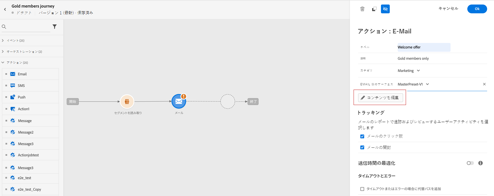
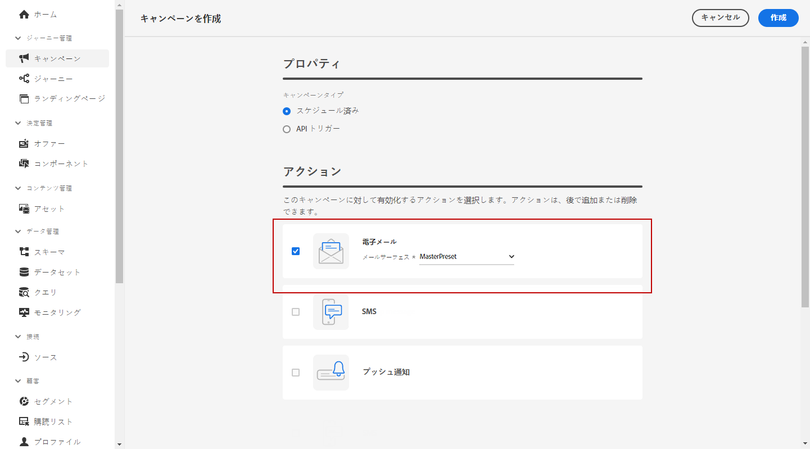

# メールの作成 {#configure-email}

>[!CONTEXTUALHELP]
>id="ajo_message_email"
>title="メールの作成"
>abstract="メールのパラメーターを 3 つの簡単な手順で定義します。"

メールは次の場所で作成できます。

* **ジャーニー**&#x200B;の場合：ジャーニーにメールアクティビティを追加し、基本設定を定義したら、「**[!UICONTROL アクション : メール]**」の右側のパネルを使用して、プッシュ通知のコンテンツを作成します。

   ジャーニーの設定方法について詳しくは、この[ページ](../building-journeys/journey-gs.md)を参照してください。

   

* **キャンペーン**&#x200B;の場合：キャンペーンを作成したら、アクションとして「メール」を選択し、基本設定を定義します。

   キャンペーンの設定方法について詳しくは、この[ページ](../campaigns/create-campaign.md#configure)を参照してください。

   

## メールコンテンツの定義{#email-content}

[!DNL Journey Optimizer] E メールデザイナーを使用[メールをゼロからデザインします](../design/create-email-content.md)。既存のコンテンツがある場合は、[E メールデザイナーに読み込む](../design/existing-content.md)または [!DNL Journey Optimizer] で[独自のコンテンツをコーディング](../design/code-content.md)できます。

[!DNL Journey Optimizer] には、開始に役立つ一連の[ビルトインテンプレート](../design/email-templates.md)が付属しています。任意のメールをテンプレートとして保存することもできます。

[!DNL Journey Optimizer] 式エディターを使用して、プロファイルのデータでメッセージをパーソナライズします。パーソナライズ機能について詳しくは、[この節](../personalization/personalize.md)参照してください。

## メールトラッキング{#email-tracking}

受信者の動作を開封数やリンクのクリック数で追跡する場合、「**[!UICONTROL メールの開封数]**」オプションと「**[!UICONTROL メールのクリック数]**」オプションを有効にします。

トラッキングの詳細については、[この節](../design/message-tracking.md)を参照してください。

## メールコンテンツの検証{#email-content-validate}

メールのレンダリングを制御し、左側の「プレビュー」セクションを使用して、テストプロファイルでパーソナライゼーションの設定を確認します。詳しくは、[この節](../design/preview.md)を参照してください。

また、エディターの上部セクションでアラートを確認します。単純な警告もありますが、メッセージの使用を妨げる可能性のある警告もあります。詳しくは、[この節](alerts.md)を参照してください。

>[!NOTE]
>
>「**[!UICONTROL 送信元メール]**」と「**[!UICONTROL 送信者名]**」は、[メッセージの作成](get-started-content.md)時に選択した&#x200B;**[!UICONTROL サーフェス]**&#x200B;によって決定されます。

