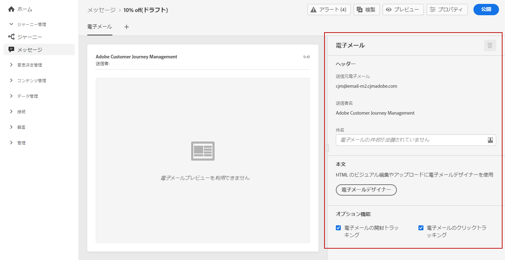

# メールの作成 {#configure-email}

>[!CONTEXTUALHELP]
>id="ajo_message_email"
>title="メールの作成"
>abstract="メールのパラメーターを 3 つの簡単な手順で定義します。"

[メッセージを作成](get-started-content.md)したら、「**[!UICONTROL E メール]**」タブを使用して、E メールチャネルの設定と内容を定義します。

>[!NOTE]
>
>「**[!UICONTROL 送信元メール]**」と「**[!UICONTROL 送信者名]**」は読み取り専用であり、[メッセージの作成](get-started-content.md)時に選択した&#x200B;**[!UICONTROL プリセット]**&#x200B;によって決定されます。

メールの設定手順は次のとおりです。

1. メールの件名を「**[!UICONTROL 件名]**」フィールドに入力します。右側のボタンをクリックして式エディターを開き、メールの件名を作成します。パーソナライゼーションの追加方法については、[この節](../personalization/personalize.md)を参照してください。

1. 「**[!UICONTROL E メールデザイナー]**」をクリックして、メールをデザインします。メールのデザイン方法については、[この節](../design/design-emails.md)を参照してください。

1. 受信者の動作を開封数やリンクのクリック数で追跡する場合、「**[!UICONTROL メールの開封トラッキング]**」オプションと「**[!UICONTROL メールのクリックトラッキング]**」オプションが有効になっていることを確認します。トラッキングの詳細については、[この節](../design/message-tracking.md)を参照してください。

>[!NOTE]
>
>マーケティングタイプの電子メールメッセージには、 [オプトアウトリンク](consent.md#opt-out-management)：トランザクションメッセージには必要ありません。 メッセージカテゴリ (**[!UICONTROL マーケティング]** または **[!UICONTROL トランザクション]**) が [メッセージプリセットレベル](../configuration/message-presets.md#email-type) そして [メッセージの作成](get-started-content.md#create-new-message).
