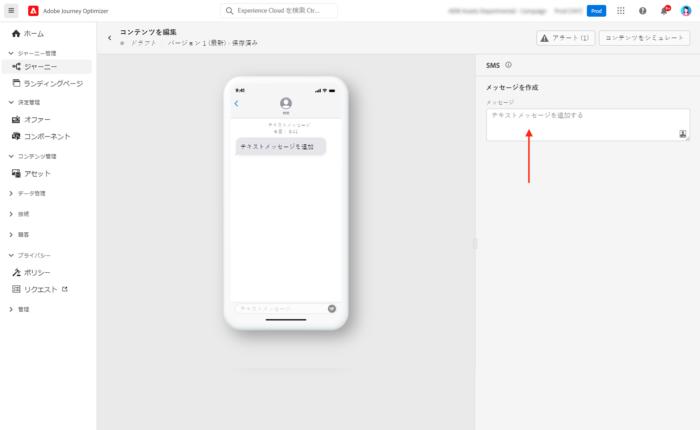
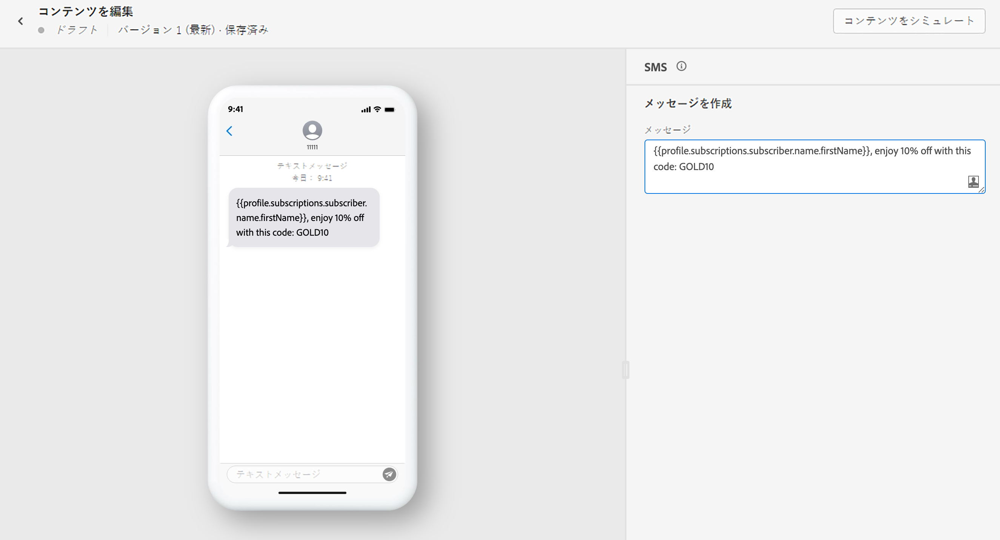
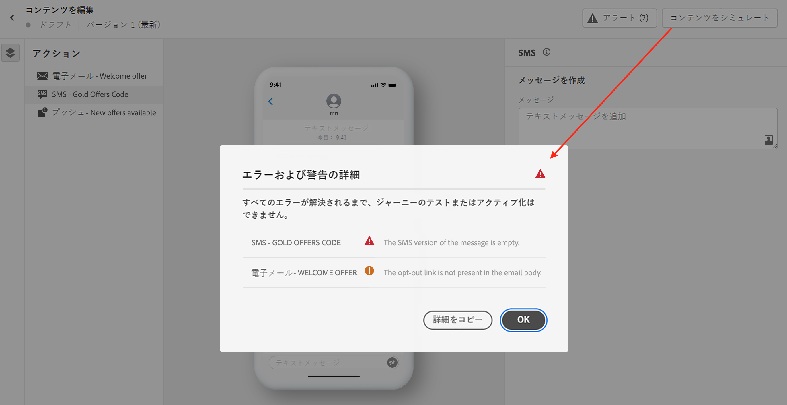

# SMS メッセージの作成 {#create-sms}

>[!CONTEXTUALHELP]
>id="ajo_message_sms"
>title="SMS の作成"
>abstract="テキストメッセージを追加し、式エディターを使用してパーソナライズを開始します。"

[!DNL Journey Optimizer] を使用すると、顧客のモバイルデバイスにテキストメッセージを送信できます。SMS エディターで、テキスト形式のメッセージの作成、パーソナライズおよびプレビューを行うことができます。

>[!NOTE]
>
>業界標準および規制に従って、すべての SMS マーケティングメッセージには、受信者が簡単に登録解除できる方法を含める必要があります。これをおこなうには、SMS 受信者は、オプトインおよびオプトアウトのキーワードを使用して返信できます。 [オプトアウトの管理方法の詳細](../privacy/opt-out.md#sms-opt-out-management-sms-opt-out-management)

SMS 配信を作成するには、次の手順を実行します。

* **ジャーニーの場合**：ジャーニーに SMS アクティビティを追加し、基本設定を定義したら、右側の&#x200B;**[!UICONTROL アクション : SMS]** パネルを使用して SMS メッセージのコンテンツを作成します。

   ジャーニーの設定方法について詳しくは、この[ページ](../building-journeys/journey-gs.md)を参照してください。

* **キャンペーンの場合**：キャンペーンを作成したら、アクションとして SMS を選択し、基本設定を定義します。

   キャンペーンの設定方法について詳しくは、この[ページ](../campaigns/create-campaign.md#configure)を参照してください。

SMS メッセージを初めて作成する場合は、SMS チャネルが設定されていることを確認してください。[詳細情報](../configuration/sms-configuration.md)。

## SMS コンテンツの定義{#sms-content}

SMS メッセージのパーソナライズを開始するには、次の手順に従います。

1. 「**[!UICONTROL メッセージ]**」フィールドをクリックして、式エディターを開きます。

   

1. 式エディターを使用して、コンテンツを定義し、動的コンテンツを追加します。 任意の属性（プロファイル名や市区町村など）を使用できます。 詳細情報： [パーソナライズ](../personalization/personalize.md) および [動的コンテンツ](../personalization/get-started-dynamic-content.md) を使用して、式エディターで設定できます。

1. 「**[!UICONTROL 保存]**」をクリックして、プレビューでメッセージを確認します。

   

## SMS を検証{#sms-preview}

>[!NOTE]
>
> 配信品質を高めるには、必ずプロバイダーがサポートする形式の電話番号を使用する必要があります。例えば、Twilio と Sinch は E.164 形式の電話番号のみをサポートしています。

メッセージのコンテンツを定義したら、テストプロファイルを使用してコンテンツのプレビューとテストを行います。[パーソナライズされたコンテンツ](../personalization/personalize.md)を挿入してある場合は、そのコンテンツがメッセージにどのように表示されるかを、テストプロファイルデータを利用して確認できます。

モバイルデバイスでの SMS メッセージの表示を視覚化するには、「**[!UICONTROL コンテンツをシミュレート]**」タブをクリックします。コンテンツのシミュレーションについて詳しくは、[この節](../design/preview.md)を参照してください。

また、エディターの上部セクションでアラートを確認します。単純な警告もありますが、メッセージの使用を妨げる可能性のある警告もあります。詳しくは、[この節](alerts.md)を参照してください。

<!--
## How-to video

Learn how to configure, author, and include SMS messaging into your customer journeys.

>[!VIDEO](https://video.tv.adobe.com/v/344460?quality=12)
-->
**関連トピック**

* [SMS チャネルの設定](../configuration/sms-configuration.md)
* [SMS レポート](../reports/journey-global-report.md#sms-global)
* [新規メッセージの作成](get-started-content.md)
* [ジャーニーへのメッセージの追加](../building-journeys/journeys-message.md)
