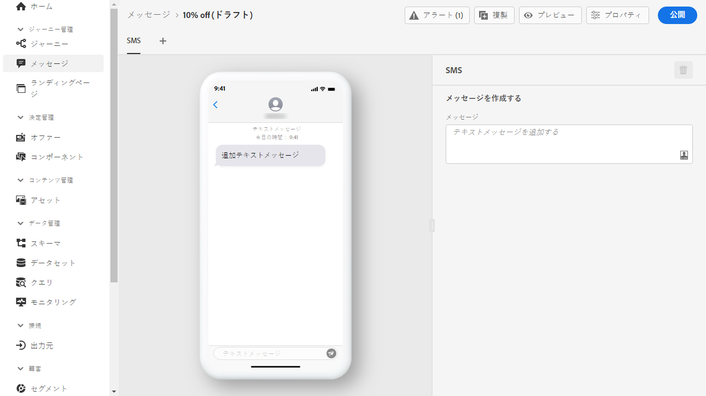
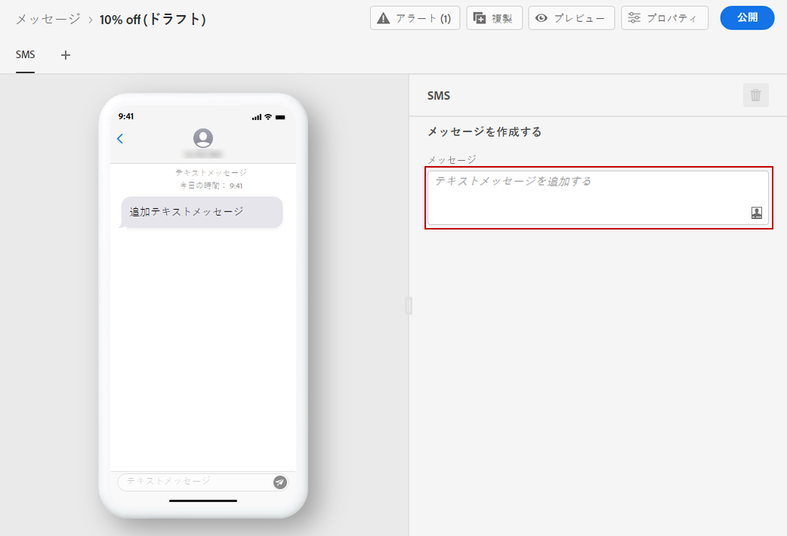
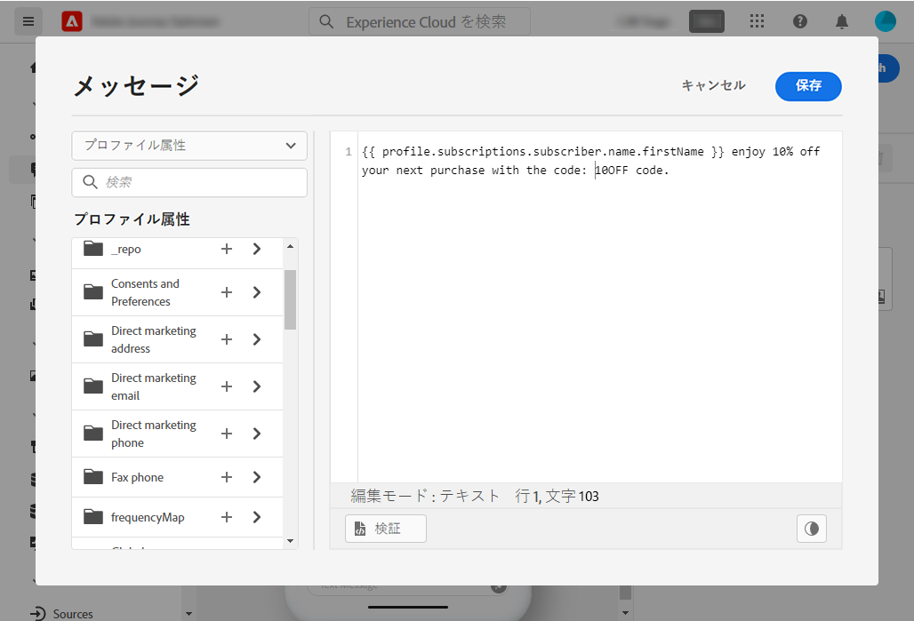

# SMS メッセージの作成 {#create-sms}

>[!CONTEXTUALHELP]
>id="ajo_message_sms"
>title="SMS の作成"
>abstract="テキストメッセージを追加し、式エディターを使用してパーソナライズを開始します。"

>[!NOTE]
>
>SMS チャネルは現在、一連の組織でのみ使用できます（使用が制限されています）。 詳しくは、Adobe担当者にお問い合わせください。

[メッセージを作成](get-started-content.md)したら、「**[!UICONTROL SMS]**」タブを使用して、SMS チャネルの設定とコンテンツを定義します。

SMS メッセージのパーソナライズを開始するには、次の手順に従います。

1. 「**[!UICONTROL テキストメッセージの追加]**」フィールドをクリックして、式エディターを開きます。

   

1. 式エディターを使用して、コンテンツとパーソナライゼーションデータを定義します。[この節で、](../personalization/personalize.md)式エディターでのパーソナライゼーションについて詳しく説明します

   >[!NOTE]
   >
   > SMS メッセージの長さは 160 文字に制限されています。

   

1. パーソナライズされたメッセージの準備が整ったら、「**[!UICONTROL 保存]**」をクリックします。

1. 「**[!UICONTROL プレビュー]**」をクリックして、モバイルデバイスで SMS メッセージがどのように表示されるかを視覚化します。詳しくは、[この節](../design/preview.md)を参照してください。

1. メッセージの準備が整ったら、「**[!UICONTROL 公開]**」ボタンを使用してメッセージを公開し、実行可能な状態にできます。このアクションにより、ジャーニーの次回の実行に使用される新しいバージョンのメッセージが公開されます。

ジャーニーで SMS メッセージを使用できるようになりました。[ジャーニーの作成方法を説明します](../building-journeys/journey-gs.md)。

## オプトインとオプトアウト{#sms-opt-in-out}

SMS 受信者は、オプトインおよびオプトアウトのキーワードを使用して返信できます。 Adobe Journey Optimizerは、業界標準および規制に従って、受信メッセージで次のキーワードを自動的に処理します。START、STOP、および UNSTOP。 これらのキーワードトリガーは、SMS プロバイダーからの自動標準返信です。

**関連トピック**

* [SMS チャネルの設定](../configuration/sms-configuration.md)
* [SMS レポート](../reports/journey-global-report.md#sms-global)
* [新規メッセージの作成](get-started-content.md)
* [ジャーニーへのメッセージの追加](../building-journeys/journeys-message.md)
