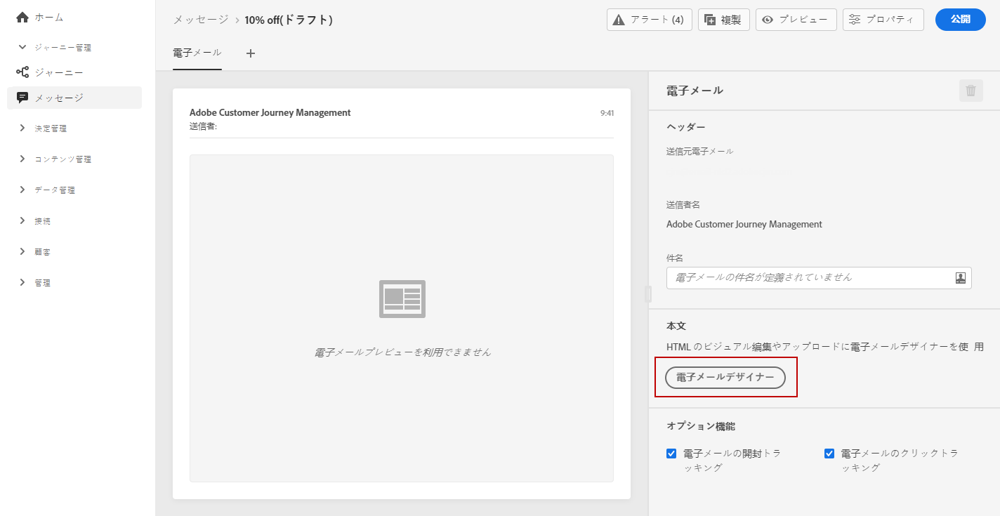
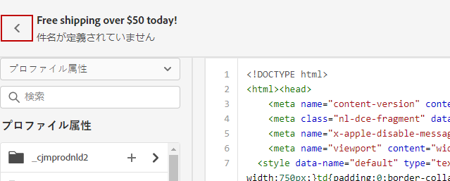
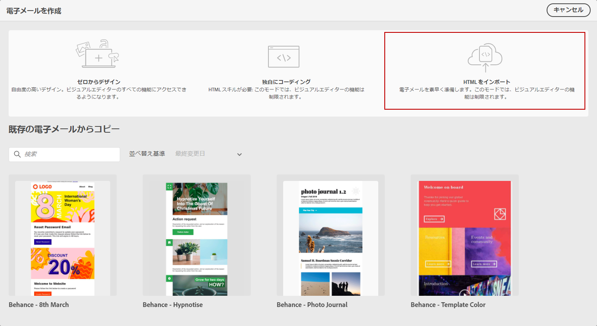
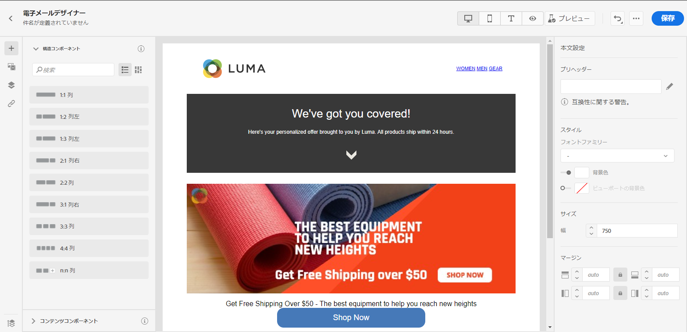

# メールコンテンツの読み込みまたはコーディング {#existing-content}

Journey Optimizer では、既存の HTML コンテンツを読み込んメールを設計できます。このコンテンツには、Raw HTML コードや、既存の HTML ファイルまたは zip フォルダーから取得したコンテンツを使用できます。

HTML コンテンツのコーディングを作成したり、既存のコンテンツを読み込んだりするには、次の手順に従います。

1. [メッセージの作成](create-message.md)

1. 「**[!UICONTROL コンテンツを編集]**」セクションから **[!UICONTROL E メールデザイナー]**&#x200B;を開きます。

   

1. 「**[!UICONTROL 独自のコードを作成]**」または「**[!UICONTROL HTML をインポート]**」を選択します。次の手順については、以下に記載した節を参照してください。

## 独自のコーディング {#import-raw-html-code}

**[!UICONTROL 独自のコードを作成]**&#x200B;モードでは、Raw HTML を読み込んだり、メールコンテンツをコーディングしたりできます。このメソッドには HTML に関するスキルが必要です。

>[!CAUTION]
>
> [Adobe Experience Manager Assets Essentials](assets-essentials.md) の画像は、このメソッドを使用する場合は参照できません。HTML コードで参照される画像は、公開場所に保存する必要があります。

1. E メールデザイナーのホームページで、「**[!UICONTROL 独自のコードを作成]**」を選択します。

   

1. Raw HTML コードを入力または貼り付けます。

1. 左側のペインを使用して、[!DNL Journey Optimizer] パーソナライゼーション機能を利用します。
詳しくは、[この節](../personalization/personalize.md)を参照してください。

   

1. E メールデザイナーを開いて新しいデザインのメールに取り掛かる場合は、オプションメニューから「**[!UICONTROL デザインの変更]**」を選択します。

   

1. 「**[!UICONTROL プレビュー]**」ボタンをクリックし、テストプロファイルを使用したメッセージデザインとパーソナライゼーションを確認します。詳しくは、[この節](preview.md)を参照してください。

   

1. コードの準備が整ったら、「**[!UICONTROL 保存]**」をクリックし、メッセージ作成画面に戻ってメッセージを完成させます。

   

## HTML の読み込み {#import-html-content-from-file}

E メールデザイナーでは HTML コンテンツを読み込むことができます。このコンテンツには次のようなものがあります。

* スタイルシートが組み込まれた **HTML ファイル**、
* HTML ファイル、スタイルシート（.css）、画像を含む **.zip フォルダー**。

   >[!NOTE]
   >
   >.zip ファイル構造に制限はありません。ただし、.zip フォルダーのツリー構造に合わせて、相対参照を指定する必要があります。

HTML コンテンツを含むファイルを読み込むには、次の手順に従います。

1. E メールデザイナーのホームページで、「**[!UICONTROL HTML を読み込む]**」を選択します。

   

1. HTML コンテンツを含む HTML または .zip ファイルをドラッグ＆ドロップします。

1. HTML コンテンツがアップロードされると、E メールデザイナーの機能を利用してメールの編集とプレビューをおこなうことができます。[詳しくは、この節](create-email-content.md)を参照してください。

   
