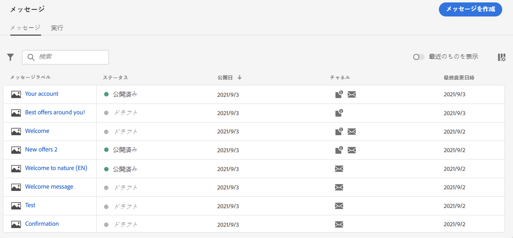
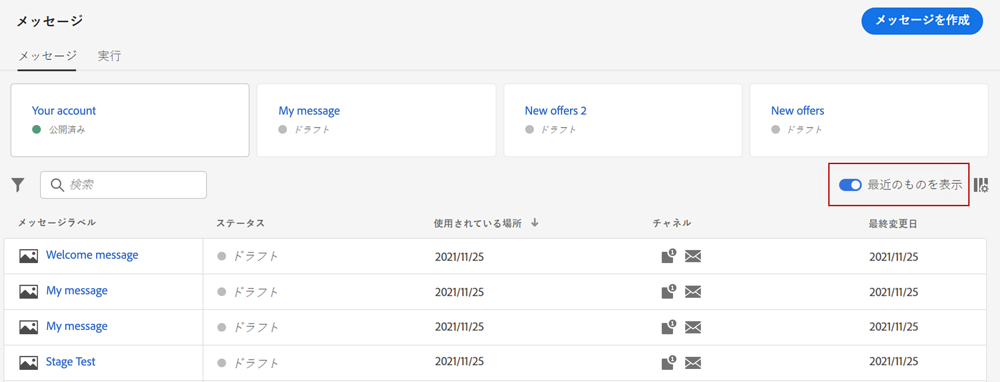
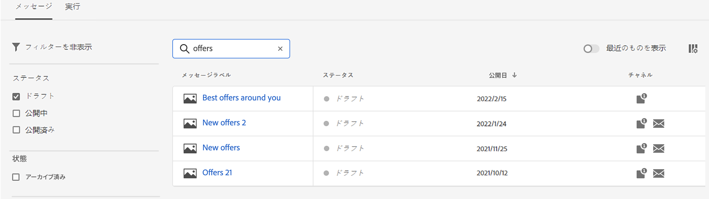
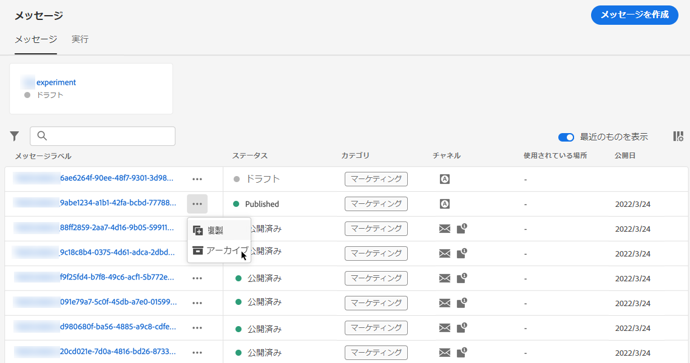
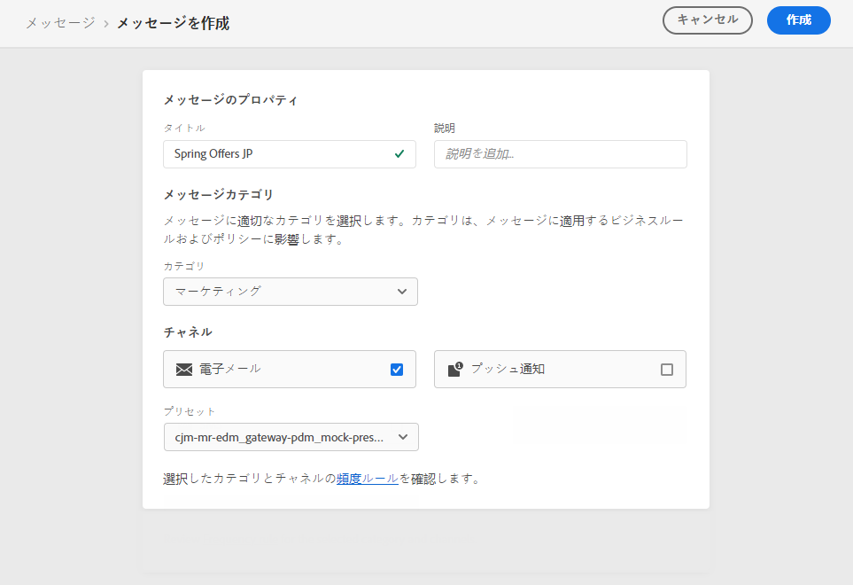
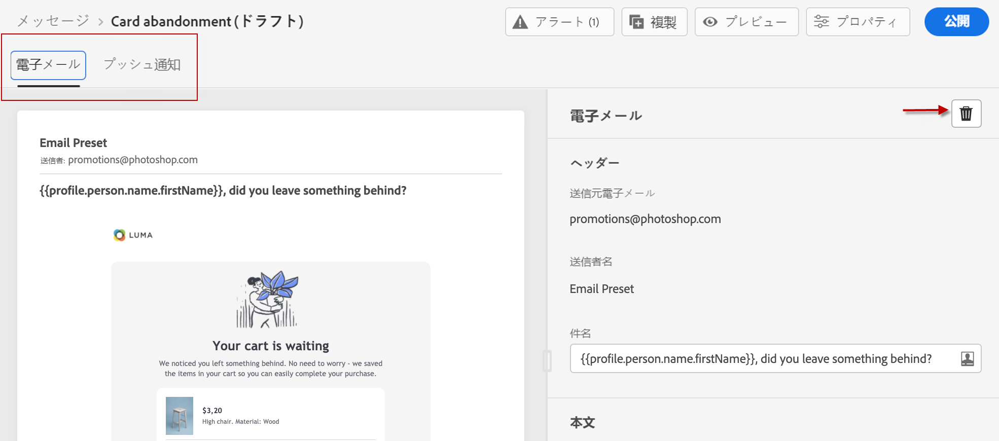
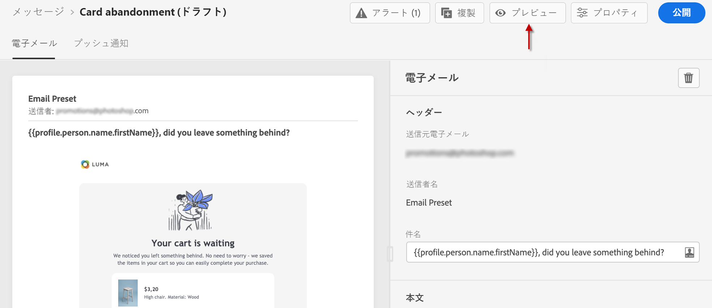
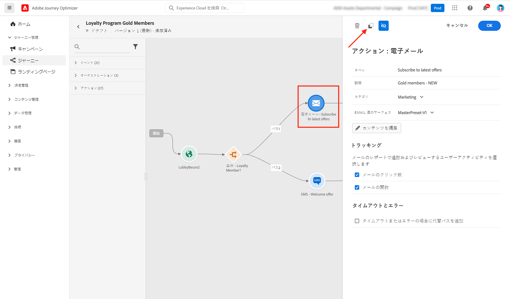
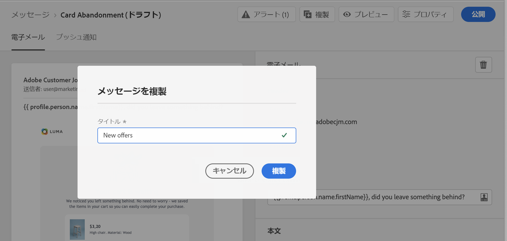
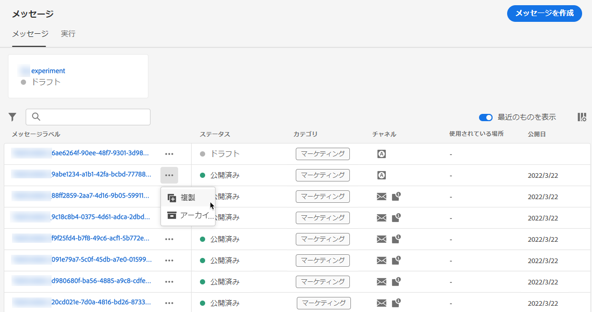

# メッセージの概要 {#get-started-contents-messages}

[!DNL Journey Optimizer] を使用すると、アセットやコンテンツなど複数のリソースを 1 か所で活用し、パーソナライズされたプッシュ通知やメールメッセージを作成して公開することができます。

* [!DNL Journey Optimizer] **メールデザイン機能**&#x200B;を活用して、レスポンシブなメールを作成または読み込みます。

* **Adobe Experience Manager Assets Essentials** を活用して独自のアセットデータベースを構築し、メールを強化します。

* プロファイル属性に基づいて&#x200B;**パーソナライズされたプッシュ通知とメールメッセージ**&#x200B;を作成し、顧客体験を強化します。

* これらのコンテンツに基づいて&#x200B;**プッシュ通知とメールメッセージを作成** し、それらを公開します。

## メッセージにアクセス {#access-messages}

メッセージは、左側のナビゲーションの「**[!UICONTROL メッセージ]**」ショートカットから使用できます。すべてのメッセージが、公開日（公開済みメッセージの場合）または作成日（ドラフトメッセージの場合）順にリストされます。

>[!NOTE]
>
>ユーザーは、製品プロファイルに応じて、メッセージにアクセスしたり、メッセージを作成、編集および公開したりできます。ユーザー権限の詳細については、 [この節](../administration/permissions.md)を参照してください。

* 「**[!UICONTROL 最近のイベントを表示]**」トグルを使用して、過去 5 日間にアクセスしたメッセージへのダイレクトリンクを追加します。

   

* フィルターアイコンを使用して、ドラフト、公開、または公開中のメッセージのみを表示します。次に示すように、メッセージラベルを検索することもできます。

   

* クイックアクションメニューの専用アイコンを使用して、未使用のメッセージをアーカイブし、メッセージリストをクリアできます。

   

   フィルターアイコンを使用してすべてのアーカイブ済みメッセージを表示し、**[!UICONTROL アーカイブ解除]**&#x200B;アイコンをクリックして、アーカイブされたメッセージのリストから項目を削除します。

   >[!NOTE]
   >
   >アーカイブ済みメッセージは開けません。最初にアーカイブを解除する必要があります。

## 新規メッセージの作成 {#create-new-message}

新しいメッセージを作成するには、次の手順に従います。

1. メッセージリストにアクセスし、「**[!UICONTROL メッセージを作成]**」をクリックします。

1. メッセージプロパティを定義します。

   

   * **[!UICONTROL タイトル]**（必須）と&#x200B;**[!UICONTROL 説明]**&#x200B;を入力します。

   * **[!UICONTROL メッセージカテゴリ]**（マーケティングまたはトランザクション）を選択します。

   * そのメッセージに使用するチャネル（メールまたはプッシュ通知）を選択します。メッセージを作成するためには、少なくとも 1 つのチャンネルを選択する必要があります。
   >[!NOTE]
   >
   >**[!UICONTROL 頻度ルール]**&#x200B;リンクをクリックして、選択したカテゴリおよびチャネルに適用される頻度ルールを表示します。[頻度ルール](../configuration/frequency-rules.md)の詳細情報。

   * メッセージに使用する&#x200B;**[!UICONTROL プリセット]**&#x200B;を選択します。

      プリセットには、ブランドに従ってメールやプッシュ通知を送信するために必要な、すべてのパラメーターが含まれます。[プリセット](../configuration/message-presets.md)の詳細情報。
   >[!CAUTION]
   >
   >選択したカテゴリとチャネルに対して有効なメッセージプリセットを選択する必要があります。

   メッセージインターフェイスの「**[!UICONTROL プロパティ]**」ボタンを使用すると、メッセージのタイトル、説明、プリセットにいつでもアクセスして変更できます。

1. 「**[!UICONTROL 作成]**」をクリックして、メッセージの作成を確定します。メッセージが、（**[!UICONTROL ドラフト]**&#x200B;ステータスで）メッセージリストに追加されます。

   選択したチャネルごとに 1 つのタブを使用できます。これらのタブを使用して、各チャネルのコンテンツを設定します。タブを削除するには、タブを選択し、右側の「**[!UICONTROL チャネルを削除]**」ボタンをクリックします。

   

   <!--
   >[!NOTE]
   >
   >If you enabled the **[!UICONTROL BCC email]** option in the preset, the BCC email address will display under the sender email. [Learn more](../configuration/email-settings.md#bcc-email)
   -->

   メッセージの内容を作成し、設定を調整できるようになりました。メールおよびプッシュ通知の設定に関する詳細は、次の節で確認できます。

   * [E メールの作成](create-email.md)
   * [プッシュ通知の作成](create-push.md)

   >[!NOTE]
   >   
   >式エディターでプロファイルのデータを使用し、メッセージをパーソナライズできます。パーソナライズ機能について詳しくは、[この節](../personalization/personalize.md)参照してください。

1. メッセージのレンダリングを制御し、左側の「プレビュー」セクションを使用して、テストプロファイルでパーソナライゼーションの設定を確認します。詳しくは、[この節](../design/preview.md)を参照してください。

   

1. エディターの上部セクションでアラートをチェックします。単純な警告もありますが、メッセージの公開を妨げる可能性のある警告もあります。詳しくは、[この節](alerts.md)を参照してください。

1. これで、「**[!UICONTROL 公開]**」ボタンをクリックしてメッセージを公開するか、メッセージをドラフトのままにしておいて、後から公開できます。メッセージの公開について詳しくは、[この節](publish-manage-message.md)を参照してください。

## メッセージの複製 {#duplicate-message}

既存のメッセージからメッセージを作成するには、次の手順に従います。

1. コピーするメッセージを開きます。

1. 「**[!UICONTROL 複製]**」ボタンを使用して、メッセージインターフェイスから削除します。

   

   すべての設定が新しいメッセージにコピーされます。

1. 複製を確認する前に、メッセージの名前を変更できます。

   

1. 新しいメッセージが作成されると、ウィンドウの下に確認メッセージが表示されます。

また、クイックアクションメニューの専用アイコンを使用して、メッセージリストからメッセージを複製することもできます。

同じ確認プロセスが適用されます。

