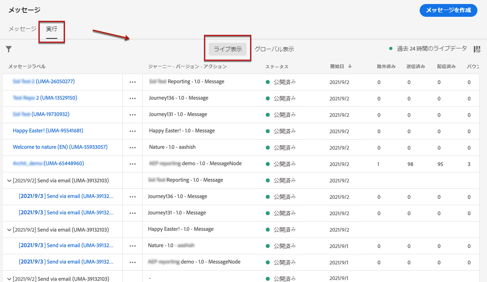
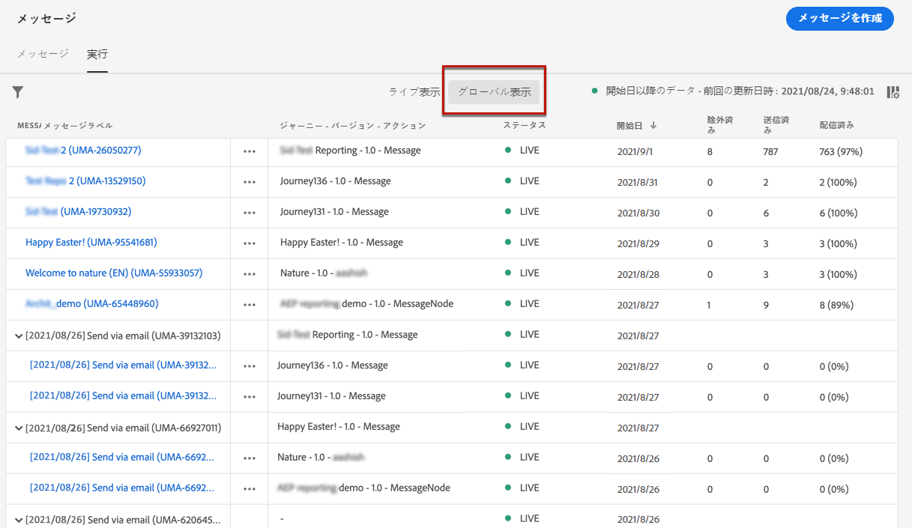
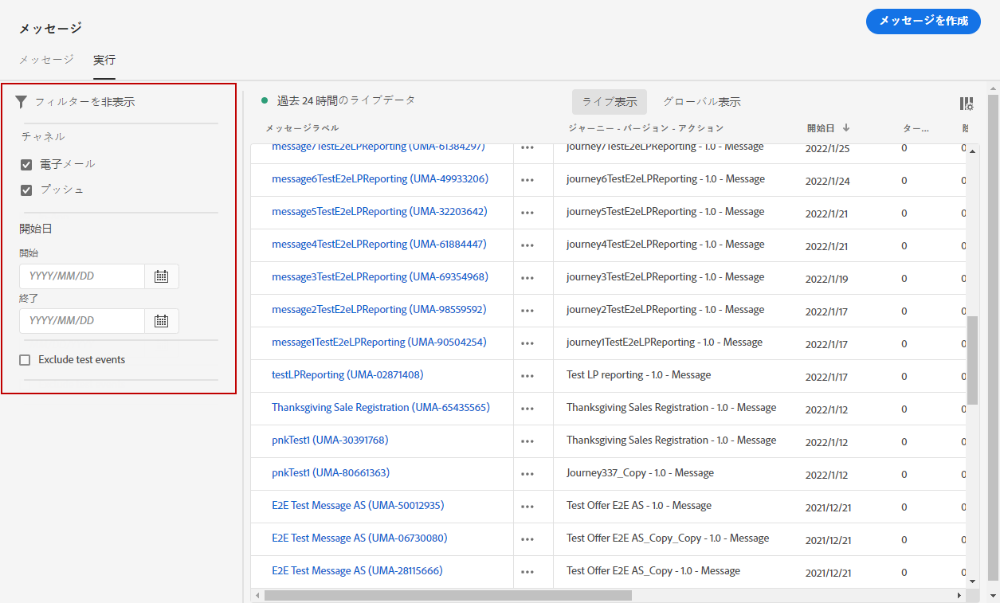
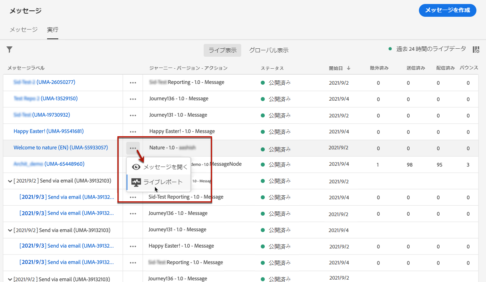
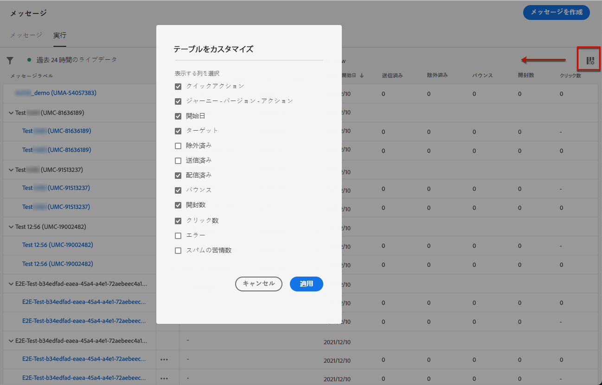
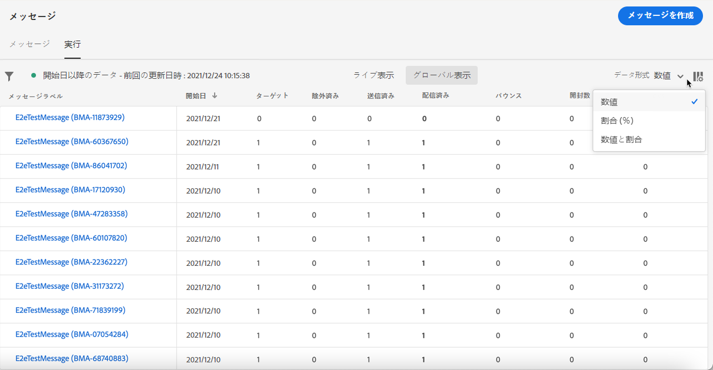

# メッセージの監視 {#monitor-message-execution}

メッセージが正常に実行、送信、および配信されていることを確認するため、[!DNL Journey Optimizer] では、現在公開およびトリガーされているメッセージを監視する機能を提供しています。**[!UICONTROL 実行]**&#x200B;リストから、ジャーニー<!--and APIs-->をまたいでメッセージがどのように実行されているかをリアルタイムで確認できます。

このリストにアクセスするには、**[!DNL Journey Optimizer]** ホームページで「**[!UICONTROL メッセージ]**」を選択し、「**[!UICONTROL 実行]**」タブをクリックします。

このタブには、「**[!UICONTROL ライブ表示]**」と「**[!UICONTROL グローバル表示]**」の 2 つのビューがあります。

* 「**[!UICONTROL ライブ表示]**」タブには、 **過去 24 時間に**&#x200B;に 1 つ以上の[ジャーニー](../building-journeys/journey.md)によってトリガーされた、**すべての実行済みメッセージの概要がリアルタイムで**&#x200B;で表示されます。

   

   このリストは、60 秒ごとに自動更新されます。特定のメッセージに対して過去 24 時間何も実行されなかった場合、そのメッセージについてはすべての列に null 値（0）が表示されます。

* 「**[!UICONTROL グローバル表示]**」タブには、**メッセージの開始日以降に** 1 つ以上の[ジャーニー](../building-journeys/journey.md)でトリガーされた&#x200B;**すべてのメッセージの概要**&#x200B;が表示されます。

   

   このリストは、90 分ごとに自動更新されます。データは、各メッセージ開始日以降の時間にわたって集計されます。

公開されていても、まだジャーニーでトリガーされていないメッセージは、どのタブにも表示されません。次の要素のみが表示されます。
* トリガーされたが、まだ開始されていない（保留中の）メッセージ。
* トリガーされ、現在実行中（進行中）のメッセージ。

>[!NOTE]
>
>メッセージが複数のジャーニーで使用されている場合、各実行に対してジャーニーごとに 1 行が表示されます。

デフォルトでは、メッセージは最新の実行日から表示されます。チャネル、開始日、終了日に従ってメッセージを検索するには、**[!UICONTROL フィルター]**&#x200B;アイコンをクリックし、します。

2 番目の列を使用すると、対応する[メッセージ](create-message.md)を開いたり、「**[!UICONTROL ライブ表示]**」を開いている場合は[ライブレポート](../reports/live-report.md)、「**[!UICONTROL グローバル表示]**」を開いている場合は[グローバルレポート](../reports/global-report.md)にアクセスしたりできます。<!--**[!UICONTROL Quick action]**-->

メッセージの実行ごとに、多数のインジケーターが表示されます。

* **[!UICONTROL メッセージラベル]**：[メッセージの作成](create-message.md)時に定義したメッセージのタイトル。自動的に生成される実行 ID が括弧で囲まれて表示されます。

   <!--**[!UICONTROL Execution ID]**: Automatically generated identifier.
  **[!UICONTROL Source]**: Name of the journey leveraging that message.-->

* **[!UICONTROL ジャーニー - バージョン - アクション]**：メッセージ配信を行うジャーニーの名前、ジャーニーのバージョン、メッセージ配信を行うジャーニー内のアクションのラベル。

* **[!UICONTROL ステータス]**：メッセージ実行ステータス。  

* **[!UICONTROL 開始日]** : ジャーニーからメッセージが実行された日時。

* **[!UICONTROL ターゲット]** : 各メッセージ実行のターゲットプロファイルの数。

* **[!UICONTROL 除外]**：除外ルールによって初期ターゲットから除外されたプロファイルの数。

* **[!UICONTROL 送信済み]**：送信されたメッセージの数。

* **[!UICONTROL 配信済み]**：バウンスやその他の配信エラーを生成せずに、受信者のメールボックス（メール）またはデバイス（プッシュ通知）に正常に配信されたメッセージの数。

* **[!UICONTROL バウンス数]**：配信エラーによって不達となったメッセージの数。[バウンスについての詳細](suppression-list.md)。

* **[!UICONTROL 開封数]**：開かれたメッセージの数。

* **[!UICONTROL クリック数]** : メール内のリンクがクリックされた回数。

   >[!NOTE]
   >
   >プッシュ通知にはクリック数はありません。ユーザがプッシュ通知をクリックすると、アプリが開き、「開封」とのみなされます。

* **[!UICONTROL エラー]** : 技術的なエラーが原因で送信できないメッセージの数。

* **[!UICONTROL スパム報告]**：受信者がスパムとマークしたメッセージの数。苦情の詳細については、[配信品質のベストプラクティスガイド](https://experienceleague.adobe.com/docs/deliverability-learn/deliverability-best-practice-guide/metrics-for-deliverability/complaints.html?lang=ja#metrics-for-deliverability){target=&quot;_blank&quot;}を参照してください。

テーブルに表示する列を選択できます。それには、画面上部の「**[!UICONTROL テーブルをカスタマイズ]**」アイコンをクリックし、表示する列を選択します。

**グローバル表示**&#x200B;の場合のみ、データを数値、割合またはその両方のどちらで表示するかを選択できます。「**データフォーマット**」ドロップダウンリストを使用して 3 つのオプションを切り替えることができます。

各ハイパーリンクをクリックすると、対応するメッセージの概要表示が開きます。[メッセージの詳細情報](create-message.md)。
