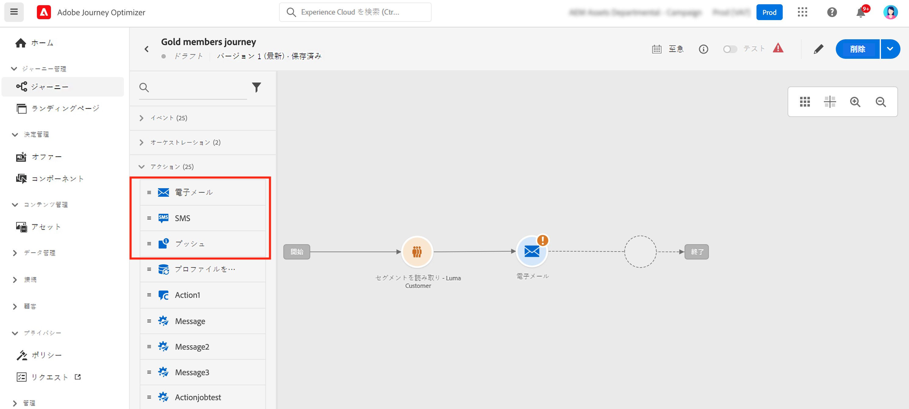
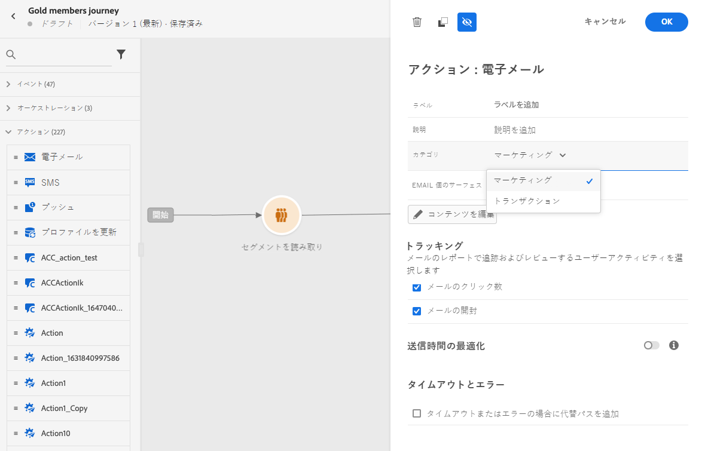
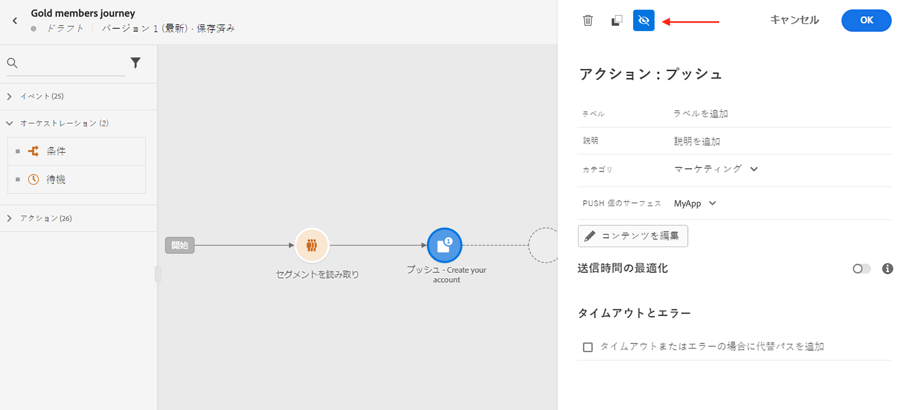
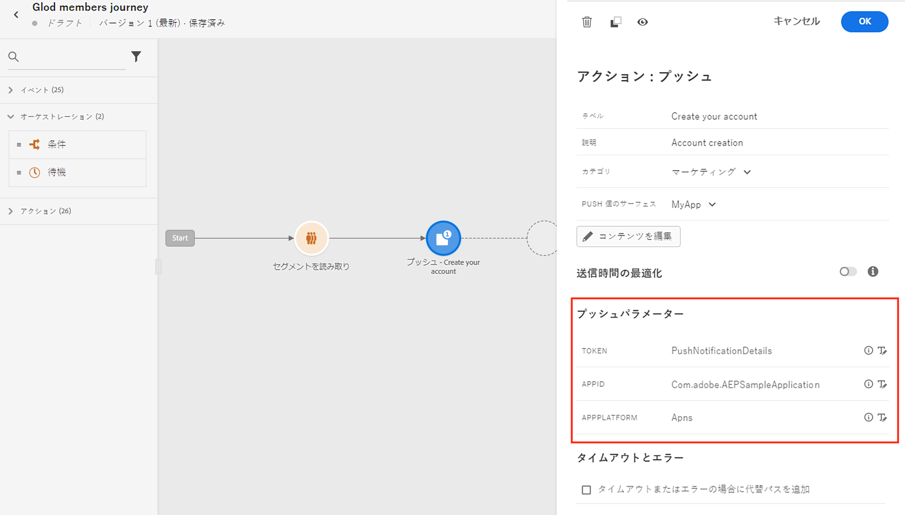
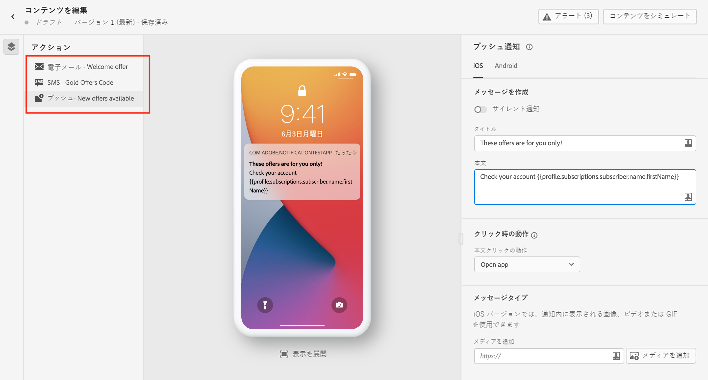
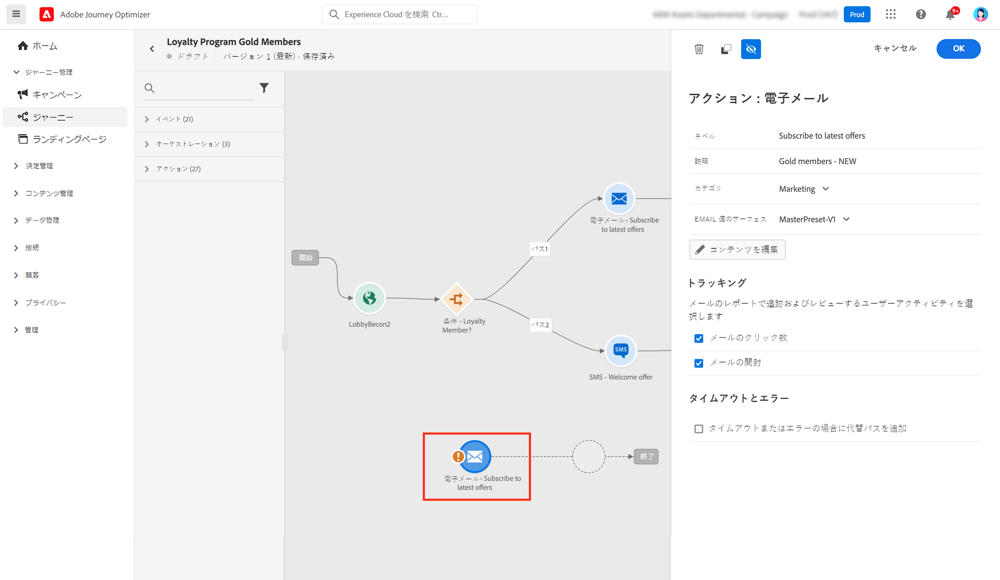
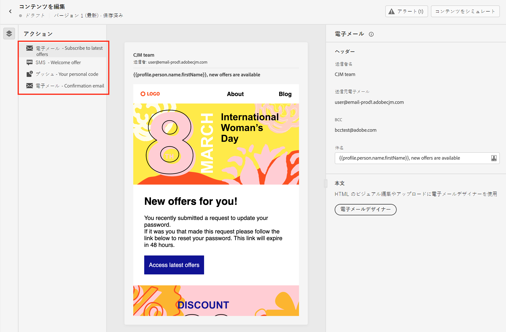
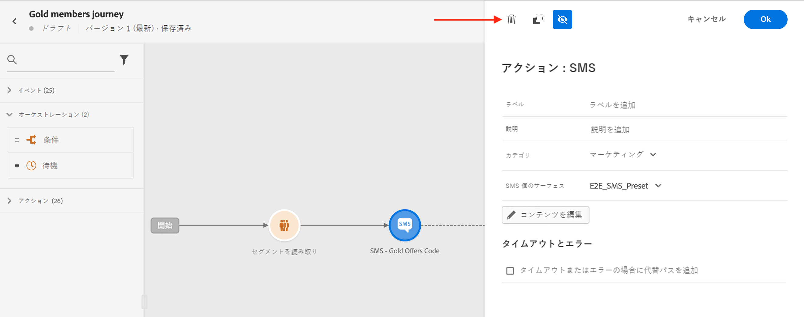

# ジャーニーでのメッセージの追加{#messages-in-journeys}

>[!CONTEXTUALHELP]
>id="ajo_message_category"
>title="メッセージカテゴリ"
>abstract="商用メッセージの場合は「マーケティング」を、商用以外のメッセージの場合（注文確認、パスワードのリセット通知、配信情報など）は「トランザクション」を選択します"

>[!CONTEXTUALHELP]
>id="ajo_message_surface"
>title="チャネルサーフェス"
>abstract="チャネルサーフェスは、キャンペーンまたはジャーニー経由でアクションを正常に配信するためのすべての設定を持つ、そのチャネルのインスタンスです。 このインスタンスはシステム管理者が定義します。"

ジャーニーで、チャネルアクションを使用して、オーディエンスに送信するメッセージをデザインし、パーソナライズします。ジャーニーキャンバスに電子メール、SMS またはプッシュアクションを追加すると、トリガー送信を作成することになります。連絡先がそのチャネルアクションに到達すると、Adobe Journey Optimizer は自動的にメッセージを送信します。

>[!NOTE]
>また、キャンペーンを作成してスケジュール済みメッセージを送信することもできます。詳しくは、[この節](../campaigns/get-started-with-campaigns.md)を参照してください。

ジャーニーでメッセージを追加するには、ジャーニーキャンバスでプッシュ、SMS またはメールアクティビティを追加します。

1. ジャーニーを「[イベント](../building-journeys/general-events.md)」または「[セグメントを読み取り](../building-journeys/read-segment.md)」アクティビティで開始します。

1. パレットの「**アクション**」セクションで、**メール**、**SMS** または&#x200B;**プッシュ**&#x200B;アクティビティをキャンバスに追加します。

   

1. ラベルと説明を入力します。

1. メッセージ&#x200B;**[!UICONTROL カテゴリ]**&#x200B;の選択：商用メッセージの場合は「**マーケティング**」を、商用以外のメッセージ（注文の確認、パスワードのリセット通知、配信情報など）の場合は「**トランザクション**」を選択します。

   

   >[!CAUTION]
   >
   >* 特定のチャネルとカテゴリに対して[頻度ルール](../configuration/frequency-rules.md)を定義した場合、そのチャネルとカテゴリを選択すると、それらがメッセージに自動的に適用されます。 現在、頻度ルールでは&#x200B;**[!UICONTROL マーケティング]**&#x200B;カテゴリのみを使用できます。
   >
   >* マーケティングのメッセージには、[オプトアウトリンク](../privacy/opt-out.md#opt-out-management)を含める必要があります。この設定は、トランザクションメッセージには必要ありません。これらのメッセージは、アドビからのお知らせを購読解除したプロファイルに送信される可能性があるためです。

1. チャネル&#x200B;**[!UICONTROL サーフェス]**（メッセージプリセットなど）を選択して、メッセージを送信します。

   サーフェスは、[システム管理者](../start/path/administrator.md)によって定義された設定です。ヘッダーパラメーター、サブドメイン、モバイルアプリなど、メッセージを送信するためのすべての技術的なパラメーターが含まれています。 [詳細情報](../configuration/channel-surfaces.md)。

   >[!CAUTION]
   >
   >選択したメッセージカテゴリとチャネルに対して、有効なチャネルサーフェスを選択する必要があります。

   メッセージインターフェイスの「**[!UICONTROL プロパティ]**」ボタンを使用すると、メッセージのラベル、説明、サーフェスにいつでもアクセスして変更できます。

1. メッセージコンテンツの作成.

   メッセージコンテンツを作成する詳細な手順については、次のページを参照してください。

   * [メールの作成](create-email.md)
   * [プッシュ通知の作成](create-push.md)
   * [SMS メッセージの作成](create-sms.md)

## 送信時間の最適化を有効にする{#sto-in-journeys}

メールおよびプッシュ通知の場合、**[!UICONTROL 送信時間の最適化]**&#x200B;を有効にできます。

**[!UICONTROL 送信時間の最適化]**&#x200B;を使用して、ユーザーごとにパーソナライズされた送信時間をスケジュールし、メッセージの開封率やクリック率を高めます。[詳細情報](../messages/send-time-optimization.md)。

## 詳細設定パラメーター{#adv-settings}

詳細設定パラメーターは読み取り専用で、デフォルトでは非表示になっています。

詳細設定パラメーターにアクセスするには、メッセージペインの上部にある「**[!UICONTROL 読み取り専用フィールドを表示]**」アイコンをクリックします。同じアイコンをクリックして、詳細設定を非表示にします。

詳細設定パラメーターがメッセージペインの下部に表示されます。 これらのパラメーターは、メッセージに関連付けられた[チャネルサーフェス](../configuration/channel-surfaces.md)（メッセージプリセットなど）で [システム管理者](../start/path/administrator.md)によって定義されます。

プッシュ通知の場合、次のパラメーター（トークン、AppID、AppPlatform）を表示できます。

電子メールの場合、 [プライマリメールアドレス](../configuration/primary-email-addresses.md).

特定のコンテキストでは、特定の用途でこれらの値を上書きできます。 値を強制的に指定するには、フィールドの右側にある「**[!UICONTROL パラメーターの上書きを有効にする]**」アイコンをクリックします。

このオプションは、例えば次のような目的に役立つ可能性があります。

* メールをテストします。 電子メールアドレスを追加できます。ジャーニーを公開すると、電子メールが送信されます。
* リストの購読者のメールアドレスを参照する。詳しくは、[このユースケース](../building-journeys/message-to-subscribers-uc.md)を参照してください。

>[!NOTE]
>
>電子メールアドレスの上書きは、特定の使用例に対してのみ使用してください。 ほとんどの場合、電子メールアドレスを変更する必要はありません。これは、 **[!UICONTROL 実行フィールド]** は、使用する必要があるものです。 [詳細情報](../configuration/primary-email-addresses.md)

## メッセージの参照{#browse-message}

1 つのジャーニーで複数のメッセージを使用する場合は、**コンテンツを編集**&#x200B;画面からメッセージを切り替えることができます。

[アラートをチェック](alerts.md)し、単一のビューから各コンテンツを[シミュレート](../design/preview.md)できます。

## メッセージの複製 {#duplicate-message}

ジャーニーキャンバスから既存のメッセージをコピーできます。

手順は次のとおりです。

1. コピーするメッセージを選択します。

1. **[!UICONTROL アクション]**&#x200B;パネルの&#x200B;**[!UICONTROL コピー]**&#x200B;ボタンを使用します。

   

1. **Ctrl l+ V** キーを押して、メッセージをペーストします。

   メッセージがジャーニーキャンバスに追加されます。すべての設定が新しいメッセージにコピーされます。

   

1. メッセージの編集時などに、最初のメッセージとコピーを区別できるように、次のようにメッセージの名前を変更します。

   

>[!NOTE]
>
>メールの場合、既存のメッセージをテンプレートに変換することもできます。 [詳細情報](../design/email-templates.md)。

## メッセージの削除{#delete-message}

メッセージを削除するには、チャネルアクションアクティビティパネル上部にあるごみ箱アイコンを使用します。

**[!UICONTROL 確認]**&#x200B;ボタンを使用して検証します。
