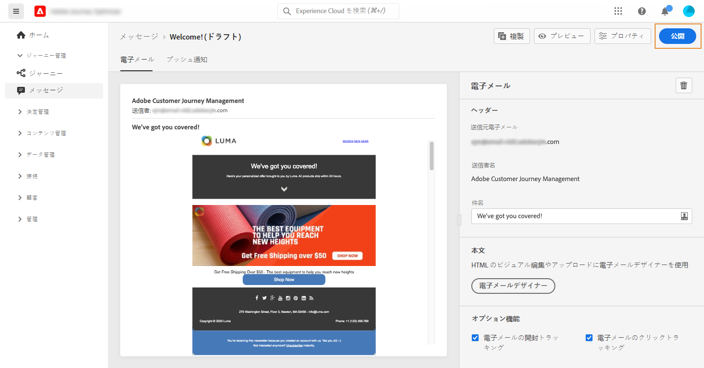
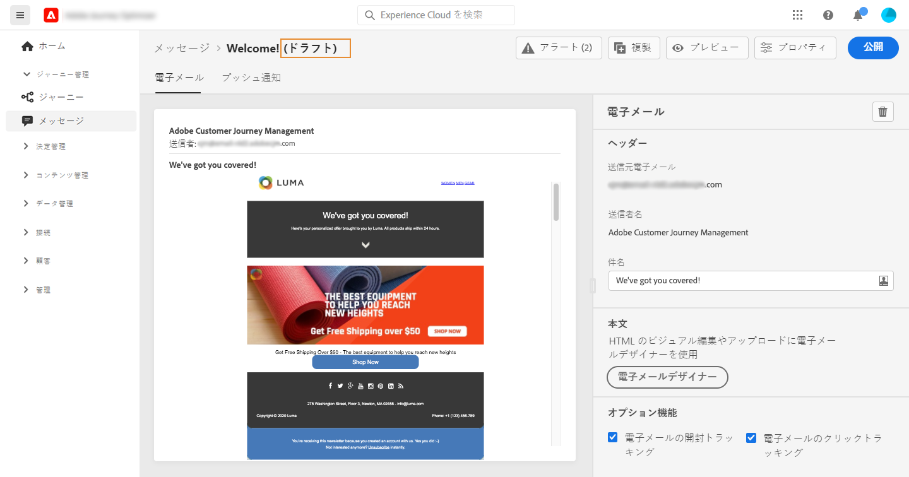

# メッセージの公開 {#publish-manage-messages}

## メッセージを公開する {#publish-message}

メッセージを作成したら、実行できるよう公開することができます。

>[!CAUTION]
>
>公開する前に、アラートを確認して解決します。[詳細情報](alerts.md)

メッセージが公開されると、**[!UICONTROL 公開中のアイテム]**&#x200B;ステータスでメッセージリストに追加されます。

これで、1 つ以上の[ジャーニー](../building-journeys/journey.md)によってトリガーされる準備が整いました。

>[!NOTE]
>
>公開されたメッセージ内で直接または間接的に参照されるオファー、フォールバックオファー、オファーコレクション、またはオファーの決定を更新する場合、再公開する必要なく、更新内容が対応するメッセージに自動的に反映されるようになりました。 [オファーの詳細を表示](../offers/get-started/starting-offer-decisioning.md)

## 読み取り専用メッセージの更新 {#modify-message}

公開後、メッセージは読み取り専用モードになります。そのメッセージの新しいドラフトを作成して、更新することはできます。

これにより、メッセージが使用されているジャーニー全体を再度公開しなくても、コンテンツを更新したり、問題を修正することができます。

>[!NOTE]
>
>公開済みバージョンが公開され、アクティブとなっていても、ドラフトバージョンは編集できます。

公開済みメッセージを更新するには：

1. メッセージリストからメッセージを選択して開きます。

1. 「**[!UICONTROL 変更]**」をクリックします。

   

1. 選択内容を確認します。メッセージのドラフトバージョンが作成されます。

   

1. 必要に応じて、コンテンツを編集するか、設定を変更します。
1. 「**[!UICONTROL 公開]**」をクリックします。このアクションにより、次回の実行に使用される新しいバージョンのメッセージが公開されます。

新しいバージョンが公開されるとすぐ、次回の API 呼び出し時に新しいメッセージ実行が生成されます。次回の受信プロファイルは、新しいバージョンを受け取ります。

<!--For batch messages, the audience/segment being processed in the previous execution will not be affected by the new version. Only the next incoming API call with an audience/segment will generate a new message execution with the new version. -->
