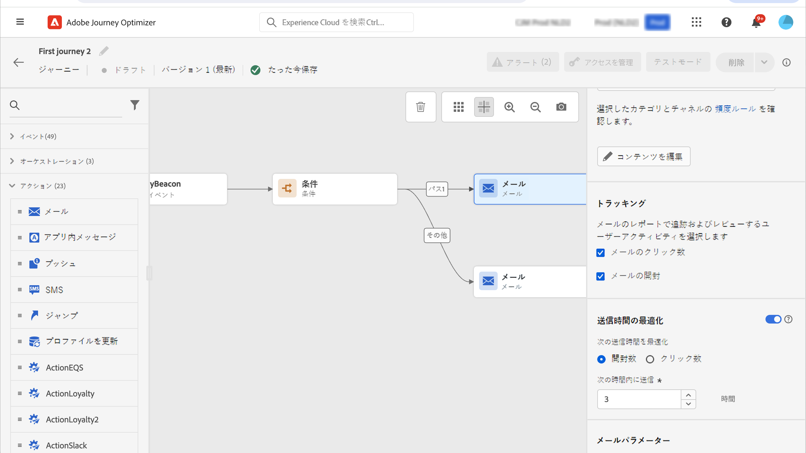

## 送信時間の最適化{#send-time-optimization}

>[!CONTEXTUALHELP]
>id="jo_bestsendtime_disabled"
>title="送信時間の最適化について"
>abstract="Adobe Journey Optimizer の送信時間最適化機能（アドビの AI サービスを利用）は、メールまたはプッシュメッセージの送信に最適な時間を予測して、過去の開封率とクリック率に基づいてエンゲージメントを最大化できます。"

Adobe Journey Optimizer の送信時間最適化機能（アドビの AI サービスを利用）は、メールまたはプッシュメッセージの送信に最適な時間を予測して、過去の開封率とクリック率に基づいてエンゲージメントを最大化できます。機械学習モデルを使用して、ユーザーごとにパーソナライズされた送信時間をスケジュールし、メッセージの開封率やクリック率を高めます。

送信時間最適化モデルは、Adobe Journey Optimizer のデータを取り込み、ユーザーレベルの開封率（メールとプッシュの場合）およびクリック率（メールの場合）を調べて、顧客がメッセージングに関与する可能性が最も高いタイミングを判断します。送信時間の最適化では、情報に基づいたレコメンデーションを行うために、1 か月以上のメッセージトラッキングデータが必要です。ユーザーごとに、次のスコアを使用して最適な時間が自動的に選択されます。

* エンゲージメントを最大化するための各曜日の最適な時間帯
* エンゲージメントを最大化するのに最適な曜日
* エンゲージメントを最大化するための最適な曜日の最適な時間

モデルは、スコアリングとトレーニングのどちらに注目しているかによって異なります。トレーニングは、最初は毎週、その後は四半期ごとに実施されます。スコアリングは、最初は毎週、その後は毎月行われます。

* トレーニング - スコアを付けるために使用するアルゴリズムの開発
* スコアリング - トレーニング済みモデルに基づく個々のプロファイルへのスコアの適用

この情報はユーザーのプロファイルと共に保存され、ジャーニーの実行時に参照されて、メッセージを送信するタイミングを Adobe Journey Optimizer に指示します。

>[!CAUTION]
>
>* この機能はバーストモードとは互換性がありません。

### 送信時間最適化の有効化{#activate-send-time-optimization}

>[!CONTEXTUALHELP]
>id="jo_bestsendtime_email"
>title="送信時間最適化の有効化"
>abstract="適切なラジオボタンを選択して、メールの開封数とクリックスルー数のどちらを最適化するかを選択します。また、「次のオプション内で送信」に値を入力して、システムで使用される送信時間を区切ることもできます。"

>[!CONTEXTUALHELP]
>id="jo_bestsendtime_push"
>title="送信時間最適化の有効化"
>abstract="プッシュメッセージではクリック数が適用されないため、デフォルトは「開封数」オプションになります。また、「次のオプション内で送信」に値を入力して、システムで使用される送信時間を区切ることもできます。"

メールまたはプッシュメッセージで送信時の最適化を有効にするには、 **送信時間の最適化** アクティビティのパラメーターから切り替えます。

メールメッセージの場合は、適切なラジオボタンを選択して、メールの開封数とクリックスルー数のどちらを最適化するかを選択します。プッシュメッセージではクリック数が適用されないため、デフォルトは「開封数」オプションになります。

また、「**次の時間内に送信**」オプションの値を入力することで、システムで使用される送信時間を区切ることもできます。値として「6 時間」を選択した場合、[!DNL Journey Optimizer] は各ユーザープロファイルを確認し、ジャーニーの実行時刻から 6 時間以内の最適な送信時刻を選択します。
