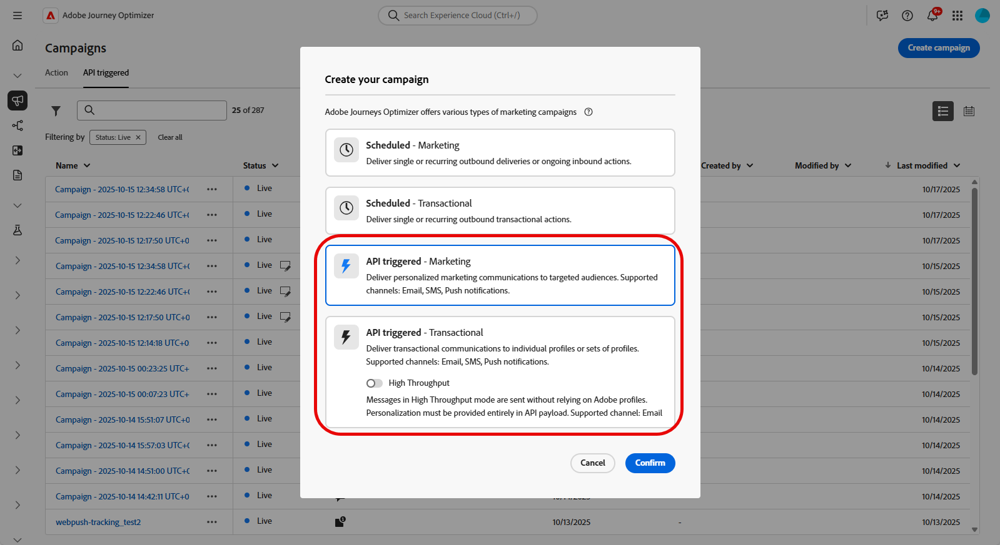

# ライブアクティビティの作成 {#create-mobile-live}

モバイル設定を指定し、Adobe Experience Platform Mobile SDK を実装したら、Journey Optimizer でライブアクティビティの作成を開始できます。

1. **[!UICONTROL キャンペーン]**&#x200B;メニューにアクセスし、「**[!UICONTROL キャンペーンを作成]**」をクリックします。

1. **API トリガー**&#x200B;キャンペーンタイプを選択します。

   * オーディエンスベースのキャンペーンには、「**API トリガーマーケティング**」を選択します

   * 個々のキャンペーンには、「**API トリガートランザクション**」を選択します。

   >[!IMPORTANT]
   >
   > **API トリガートランザクション**&#x200B;には、「**[!UICONTROL 高スループット]**」オプションを有効にしないでください。

   

1. 「**[!UICONTROL プロパティ]**」セクションで、キャンペーンの「**[!UICONTROL タイトル]**」と「**[!UICONTROL 説明]**」を編集します。

1. 「**[!UICONTROL アクション]**」セクションで、「**[!UICONTROL ライブアクティビティ]**」を選択し、新しい設定を選択または作成します。

   ライブアクティビティの設定について詳しくは、[このページ](mobile-live-configuration.md)を参照してください。

   

1. 「**[!UICONTROL 実験を作成]**」をクリックしてコンテンツ実験の設定を開始し、パフォーマンスを測定してターゲットオーディエンスに最適なオプションを特定するための処理を作成します。 [詳細情報](../content-management/content-experiment.md)

1. 「**[!UICONTROL オーディエンス]**」タブから、**[!UICONTROL ID タイプ]**&#x200B;を選択します [詳細情報](../audience/about-audiences.md)

   >[!NOTE]
   >
   >**API トリガーマーケティング** キャンペーンの場合、API ペイロードからAPNs channelID サブスクリプションを確認する前に、最初のセグメントとして機能する既存のオーディエンスを選択できます。

1. キャンペーンは、特定の日付に実行するか、繰り返し頻度で実行するように設計されています。 キャンペーンの&#x200B;**[!UICONTROL スケジュール]**&#x200B;を設定する方法については、[この節](../campaigns/create-campaign.md#schedule)を参照してください。

1. 設定が完了したら、「**[!UICONTROL レビューしてアクティブ化]**」をクリックし、「**[!UICONTROL アクティブ化]**」をクリックします。

1. キャンペーンがアクティブ化されたら、提供された&#x200B;**cURL リクエスト**&#x200B;をテンプレートとして使用して、ライブアクティビティの開始、更新、終了イベントをトリガーします。 実行前に、特定のデータでサンプルペイロードを更新します。

   また、ペイロードに含める&#x200B;**[!UICONTROL キャンペーン ID]** 識別子もコピーします。

   ➡️ OAuth トークンや API キーを含む認証要件について詳しくは、[API トリガーキャンペーンドキュメント](https://developer.adobe.com/journey-optimizer-apis/references/messaging)を参照してください。

   

   +++ 単一ユースケース向けのペイロードの例（API トリガーのトランザクションキャンペーン）

   このペイロードの例は、**API トリガーのトランザクション** キャンペーンのタイプを使用する個々のキャンペーン用です。 次のペイロード例のフィールドのほとんどは必須で、`requestId`、`dismissal-date`、`alert` のみがオプションです。

   ```json
   {
       "requestId": "your-request-id",
       "campaignId": "your-campaign-id",
       "recipients": [
   {
       "type": "aep",
       "userId": "testemail@gmail.com",
       "namespace": "email",
       "context": {
        "requestPayload": {
       "aps": {
       "content-available": 1,
       "timestamp": 1756984054,              // current epoch time
       "dismissal-date": 1756984084,         // optional – auto remove when event="end"
       "event": "update",                    // start | update | end
   
       // Fields from FoodDeliveryLiveActivityAttributes
       "content-state": {
         "orderStatus": "Delivered"
       },
   
       "attributes-type": "FoodDeliveryLiveActivityAttributes",
       "attributes": {
         "restaurantName": "Pizza",
         "liveActivityData": {
           "liveActivityID": "orderId1"       // customer reference ID
         }
       },
   
       "alert": {
         "title": "Order Delivered!",
         "body": "Your pizza has arrived."
       }
     }
   }
   }
   }
   ]
   }
   ```

   +++

   +++ ブロードキャスト用ペイロードのユースケースの例（API トリガーマーケティングキャンペーン）

   このペイロードの例は、**API トリガーマーケティング** キャンペーンのタイプを使用するオーディエンスベースのキャンペーン向けです。

   ```json
   {
       "requestId": "123400000",
       "campaignId": "d32e6f6c-56df-4a98-a2c0-6db6008f8f32",
       "audience": {
           "id": "508f9416-52d0-4898-ba47-08baaa22e9c7"
       },
       "context": {
           "requestPayload": {
               "aps": {
                   "input-push-channel": "V+8UslywEfAAAOq9SbTrLg==",  //apns-channel-id
                   "content-available": 1,
                   "timestamp": 1770808339,
                   "event": "update",   // start | update | end
   
                   // Fields from GameScoreLiveActivityAttributes
                   "content-state": {
                       "homeTeamScore": 33,
                       "awayTeamScore": 49,
                       "statusText": "Wingdom keeps scoring!"
                   },
                   "attributes-type": "GameScoreLiveActivityAttributes",
                   "attributes": {
                       "liveActivityData": {
                           "channelID": "V+8UslywEfAAAOq9SbTrLg=="   //apns-channel-id, must match the "input-push-channel" value
                       }
                   },
                   "alert": {
                       "title": "This is the title for game",
                       "body": "This is the body for body"
                   }
               }
           }
       }
   }
   ```

   +++

ライブアクティビティをデザインしたら、[ビルトインのレポート](../reports/campaign-global-report-cja-activity.md)を使用してライブアクティビティの影響の測定を追跡できます。

>[!TIP]
>
>ライブ アクティビティが期待どおりに表示されない、または更新されない場合は、ステップバイステップのデバッグガイダンスについては、[&#x200B; ライブ アクティビティのトラブルシューティング &#x200B;](troubleshoot-mobile-live.md)を参照してください。

## チュートリアルビデオ

iOS ライブアクティビティを Adobe Journey Optimizer と連携して設定し、iPhone のロック画面と Dynamic Island でリッチなリアルタイム更新を提供する方法について説明します。

>[!VIDEO](https://video.tv.adobe.com/v/3479864)
